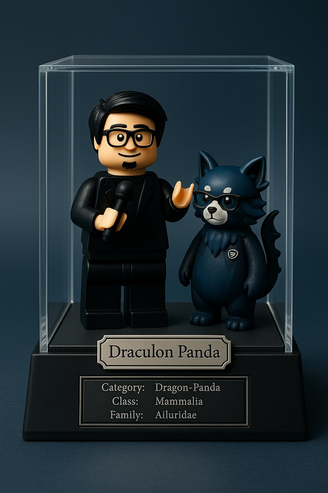
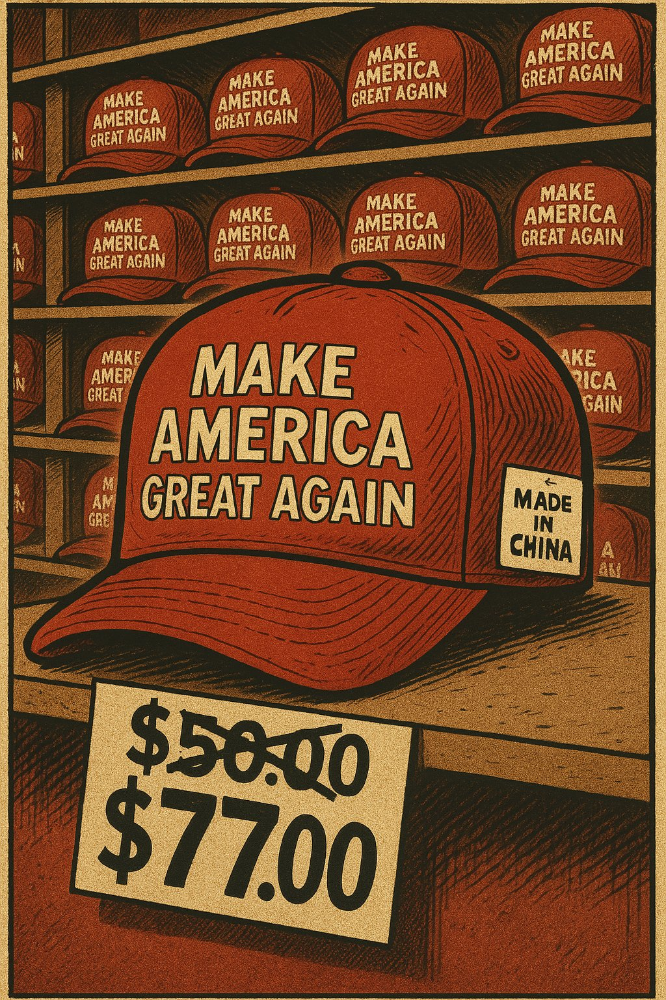
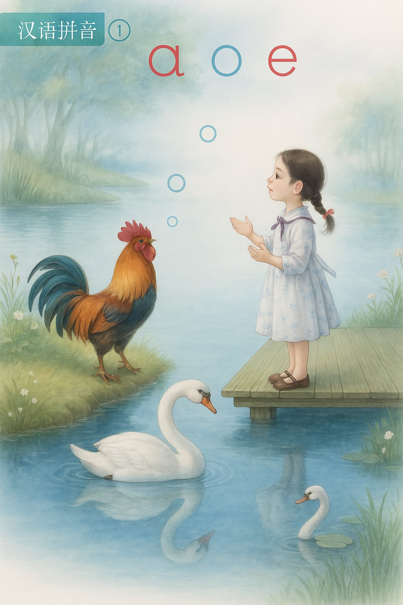
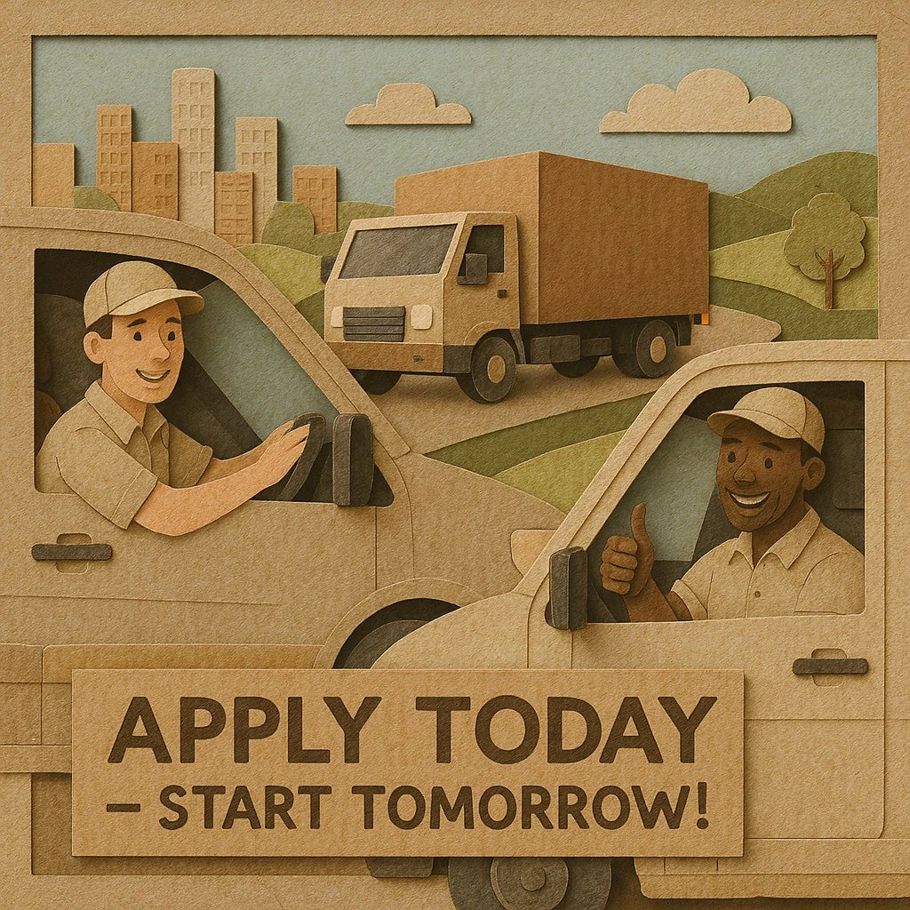
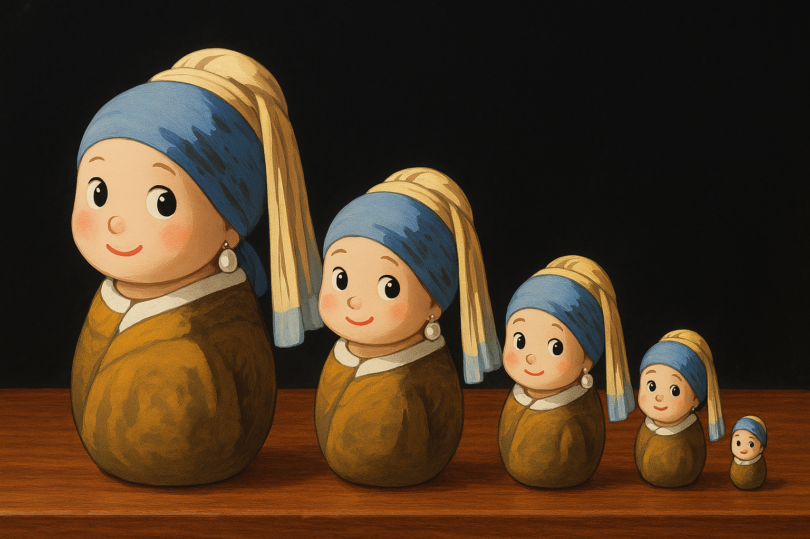
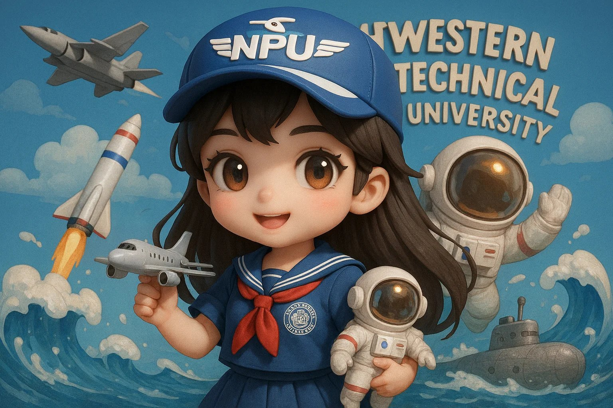

# Awesome GPT-4o Images ✨

[](README_en.md)
[](README.md)

🎉 欢迎来到 GPT‑4o 图片精选！

这里收集了 OpenAI 最新多模态模型 GPT‑4o 生成的精彩案例，展示其强大的文本‑图像理解与创作能力。

GPT‑4o 六大亮点
- 🧠 跨模态理解：同时解析文本、图像、音频，精准把握创作意图
- ✍️ 精准出图：支持复杂提示词，快速生成高质量图像
- 🎨 多样风格：吉卜力、厚涂、像素、3D 毛绒等任你选
- 🖼️ 真实构图：空间、透视、光影自然可信
- ✏️ 易于再编辑：替换背景、改细节，二次创作无压力
- ⚡️ 极速交互：响应更快，适合实时创意迭代

案例主要来源于 Twitter/X 🐦，希望这些案例能为您带来启发 💡，为你的灵感加速 🚀。


---

## 🛠️ 工具介绍 

以下是可以使用 GPT-4o 模型生成图片的应用：

- **💬 [ChatGPT](https://chatgpt.com)：** OpenAI官方出品，可使用 GPT-4o 生成高质量图片，支持多风格、多细节控制，适合创意表达与内容创作。

- **🎬 [Sora](https://sora.com)：** OpenAI官方出品，可通过 GPT-4o 生成逼真图像，支持图文结合、场景重建，适用于影视、动画等视觉创意场景。

在无法直接访问 ChatGPT / Sora 的情况下，为了探索和生成类似本仓库展示的图片效果，推荐免费尝试我们开发的[AnimeAI](https://animeai.online)。

## 💡 提示词技巧

1. [提示词高手们到底是怎么发现 GPT-4o 画图新玩法的？](https://baoyu.io/blog/gpt-4-image-generation-new-tricks) by [@dotey](https://x.com/dotey)
2. [Prompt Engineering (PDF)](https://s.baoyu.io/files/2025-01-18-pdf-1-TechAI-Goolge-whitepaper_Prompt%20Engineering_v4-af36dcc7a49bb7269a58b1c9b89a8ae1.pdf) by Google
3. [Prompt Engineering 简体中文翻译版](https://baoyu.io/blog/google-prompt-engineering-whitepaper) by [@dotey](https://x.com/dotey)

## 📖 案例目录

1.  [案例 1：Q版求婚场景 (by @balconychy)](#案例-1q版求婚场景-by-balconychy)
2.  [案例 2：立体相框 (by @dotey)](#案例-2立体相框-by-dotey)
3.  [案例 3：复古宣传海报 (by @dotey)](#案例-3复古宣传海报-by-dotey)
4.  [案例 4：Q 版中式婚礼图 (by @balconychy)](#案例-4q-版中式婚礼图-by-balconychy)
5.  [案例 5：吉卜力风格 (by AnimeAI)](#案例-5吉卜力风格-by-animeai)
6.  [案例 6：角色穿越传送门 (by @dotey)](#案例-6角色穿越传送门-by-dotey)
7.  [案例 7：个性化房间设计 (by @ZHO_ZHO_ZHO)](#案例-7个性化房间设计-by-zho_zho_zho)
8.  [案例 8：乐高收藏品 (by @ZHO_ZHO_ZHO)](#案例-8乐高收藏品-by-zho_zho_zho)
9.  [案例 9：气球名画 (by @ZHO_ZHO_ZHO)](#案例-9气球名画-by-zho_zho_zho)
10. [案例 10：讽刺漫画生成 (by @dotey)](#案例-10讽刺漫画生成-by-dotey)
11. [案例 11：PS2 游戏封面 (GTA x Shrek) (by @dotey)](#案例-11ps2-游戏封面-gta-x-shrek-by-dotey)
12. [案例 12：3D 情侣珠宝盒摆件 (by @dotey)](#案例-123d-情侣珠宝盒摆件-by-dotey)
13. [案例 13：3D Q版风格 (by @dotey)](#案例-133d-q版风格-by-dotey)
14. [案例 14：《海贼王》主题手办制作 (by @dotey)](#案例-14海贼王主题手办制作-by-dotey)
15. [案例 15：讽刺海报生成 (by @ZHO_ZHO_ZHO)](#案例-15讽刺海报生成-by-zho_zho_zho)
16. [案例 16：布丁老虎机 (by @ZHO_ZHO_ZHO)](#案例-16布丁老虎机-by-zho_zho_zho)
17. [案例 17：数码宝贝风格图 (by @ZHO_ZHO_ZHO)](#案例-17数码宝贝风格图-by-zho_zho_zho)
18. [案例 18：皮克斯3D风格 (by AnimeAI)](#案例-18皮克斯3d风格-by-animeai)
19. [案例 19：语文课本重绘 (by @balconychy)](#案例-19语文课本重绘-by-balconychy)
20. [案例 20：四格漫画 (相对论) (by @dotey)](#案例-20四格漫画-相对论-by-dotey)
21. [案例 21：简笔画表情包 (by @ZHO_ZHO_ZHO)](#案例-21简笔画表情包-by-zho_zho_zho)
22. [案例 22：小红书封面 (by @balconychy)](#案例-22小红书封面-by-balconychy)
23. [案例 23：《泰坦尼克号》模仿 (by @balconychy)](#案例-23泰坦尼克号模仿-by-balconychy)
24. [案例 24：Funko Pop 公仔制作 (by @dotey)](#案例-24funko-pop-公仔制作-by-dotey)
25. [案例 25：极简主义 3D 插画 (by @0xdlk)](#案例-25极简主义-3d-插画-by-0xdlk)
26. [案例 26：名画人物麦片广告 (by @ZHO_ZHO_ZHO)](#案例-26名画人物麦片广告-by-zho_zho_zho)
27. [案例 27：Q 版表情包制作 (by @dotey)](#案例-27q-版表情包制作-by-dotey)
28. [案例 28：扁平贴纸设计 (by @ZHO_ZHO_ZHO)](#案例-28扁平贴纸设计-by-zho_zho_zho)
29. [案例 29：名画人物 OOTD (by @ZHO_ZHO_ZHO)](#案例-29名画人物-ootd-by-zho_zho_zho)
30. [案例 30：35mm 胶片风格飞岛 (by @dotey)](#案例-3035mm-胶片风格飞岛-by-dotey)
31. [案例 31：动漫贴纸集合 (by @richardchang)](#案例-31动漫贴纸集合-by-richardchang)
32. [案例 32：纸艺剪贴风格招聘广告 (by @dotey)](#案例-32纸艺剪贴风格招聘广告-by-dotey)
33. [案例 33：全家福婚纱照 (by @balconychy)](#案例-33全家福婚纱照-by-balconychy)
34. [案例 34：手绘信息图卡片 (by @dotey)](#案例-34手绘信息图卡片-by-dotey)
35. [案例 35：毛茸茸南瓜灯 (by gizakdag)](#案例-35毛茸茸南瓜灯-by-gizakdag)
36. [案例 36：极简主义 3D 插画 (文字版) (by @dotey)](#案例-36极简主义-3d-插画-文字版-by-dotey)
37. [案例 37：社交媒体帖子涂鸦 (by @op7418)](#案例-37社交媒体帖子涂鸦-by-op7418)
38. [案例 38：手绘信息图卡片 (by @dotey)](#案例-38手绘信息图卡片-by-dotey)
39. [案例 39：卡通插画 (by @dotey)](#案例-39卡通插画-by-dotey)
40. [案例 40：日系双格漫画 (少女总统红温了) (by @hellokaton)](#案例-40日系双格漫画-少女总统红温了-by-hellokaton)
41. [案例 41：微型立体场景 (孙悟空三打白骨精) (by @dotey)](#案例-41微型立体场景-孙悟空三打白骨精-by-dotey)
42. [案例 42：3D Q版情侣水晶球 (by @balconychy)](#案例-423d-q版情侣水晶球-by-balconychy)
43. [案例 43：Q版可爱俄罗斯套娃 (戴珍珠耳环的少女) (by @ZHO_ZHO_ZHO)](#案例-43q版可爱俄罗斯套娃-戴珍珠耳环的少女-by-zho_zho_zho)
44. [案例 44：RPG 风格角色卡片制作 (by @berryxia_ai)](#案例-44rpg-风格角色卡片制作-by-berryxia_ai)
45. [案例 45：3D Q版大学拟人化形象 (by @dotey)](#案例-453d-q版大学拟人化形象-by-dotey)
46. [案例 46：快乐胶囊制作 (by @ZHO_ZHO_ZHO)](#案例-46快乐胶囊制作-by-zho_zho_zho)
47. [案例 47：键盘ESC 键帽微型立体模型 (by @egeberkina)](#案例-47键盘esc-键帽微型立体模型-by-egeberkina)
48. [案例 48：体素风格 3D 图标转换 (by @BrettFromDJ)](#案例-48体素风格-3d-图标转换-by-brettfromdj)
49. [案例 49：时尚杂志封面风格 (by @dotey)](#案例-49时尚杂志封面风格-by-dotey)
50. [案例 50：物理破坏效果卡片 (劳拉) (by @op7418)](#案例-50物理破坏效果卡片-劳拉-by-op7418)

---


## 案例 1：Q版求婚场景 (by [@balconychy](https://x.com/balconychy))

[原文链接](https://x.com/balconychy/status/1909417750587486469)


**提示词：**
```
将照片里的两个人转换成Q版 3D人物，场景换成求婚，背景换成淡雅五彩花瓣做的拱门，背景换成浪漫颜色，地上散落着玫瑰花瓣。除了人物采用Q版 3D人物风格，其他环境采用真实写实风格。
```
**需上传参考图片：** 一张情侣照片。


## 案例 2：立体相框 (by [@dotey](https://x.com/dotey))

[原文链接](https://x.com/dotey/status/1908238003169903060)


**提示词：**
```
将场景中的角色转化为3D Q版风格，放在一张拍立得照片上，相纸被一只手拿着，照片中的角色正从拍立得照片中走出，呈现出突破二维相片边框、进入二维现实空间的视觉效果。
```
**需上传参考图片：** 一张半身或者全身单人照片。


## 案例 3：复古宣传海报 (by [@dotey](https://x.com/dotey))

[原文链接](https://x.com/dotey/status/1905251524248248650)


**提示词：**
```
复古宣传海报风格，突出中文文字，背景为红黄放射状图案。画面中心位置有一位美丽的年轻女性，以精致复古风格绘制，面带微笑，气质优雅，具有亲和力。主题是GPT最新AI绘画服务的广告促销，强调‘惊爆价9.9/张’、‘适用各种场景、图像融合、局部重绘’、‘每张提交3次修改’、‘AI直出效果，无需修改’，底部醒目标注‘有意向点右下“我想要”’，右下角绘制一个手指点击按钮动作，左下角展示OpenAI标志。
```

## 案例 4：Q 版中式婚礼图 (by [@balconychy](https://x.com/balconychy))

[原文链接](https://x.com/balconychy/status/1909418699150237917)


**提示词：**
```
将照片里的两个人转换成Q版 3D人物，中式古装婚礼，大红颜色，背景“囍”字剪纸风格图案。 服饰要求：写实，男士身着长袍马褂，主体为红色，上面以金色绣龙纹图案，彰显尊贵大气 ，胸前系着大红花，寓意喜庆吉祥。女士所穿是秀禾服，同样以红色为基调，饰有精美的金色花纹与凤凰刺绣，展现出典雅华丽之感 ，头上搭配花朵发饰，增添柔美温婉气质。二者皆为中式婚礼中经典着装，蕴含着对新人婚姻美满的祝福。 头饰要求： 男士：中式状元帽，主体红色，饰有金色纹样，帽顶有精致金饰，尽显传统儒雅庄重。 女士：凤冠造型，以红色花朵为中心，搭配金色立体装饰与垂坠流苏，华丽富贵，古典韵味十足。
```
**需上传参考图片：** 一张情侣照片。


## 案例 5：吉卜力风格 (by [AnimeAI](https://animeai.online))

[原文链接](https://animeai.online/#demo-gallery)


**提示词：**
```
以吉卜力风格重绘这张照片
```
**需上传参考图片：** 一张人物或者其他照片。

*如果遇到违反内容政策的情况，提示词增加一句：如果背景里有不合适（敏感）的内容，可以进行修改或删除。*


## 案例 6：角色穿越传送门 (by [@dotey](https://x.com/dotey))

[原文链接](https://x.com/dotey/status/1908910838636765204)


**提示词：**
```
照片中的角色的 3D Q 版形象穿过传送门，牵着观众的手，在将观众拉向前时动态地回头一看。传送门外的背景是观众的现实世界，一个典型的程序员的书房，有书桌，显示器和笔记本电脑，传送门内是角色所处的3D Q 版世界，细节可以参考照片，整体呈蓝色调，和现实世界形成鲜明对比。传送门散发着神秘的蓝色和紫色色调，是两个世界之间的完美椭圆形框架处在画面中间。从第三人称视角拍摄的摄像机角度，显示观看者的手被拉入角色世界。3：2 的宽高比。
(需要上传一张半身或者全身清晰照片作为输入)
```

**需上传参考图片：** 一张半身或者全身单人照片。


## 案例 7：个性化房间设计 (by [@ZHO_ZHO_ZHO](https://x.com/ZHO_ZHO_ZHO))

[原文链接](https://x.com/ZHO_ZHO_ZHO/status/1910698005193515370)


**提示词：**
```
为我生成我的房间设计（床、书架、沙发、电脑桌和电脑、墙上挂着绘画、绿植，窗外是城市夜景。可爱 3d 风格，c4d 渲染，轴测图。
```

*注意：原文提示词是根据chatgpt的记忆内容为用户生成房间设计，此处稍作修改。请参考原文。*

## 案例 8：乐高收藏品 (by [@ZHO_ZHO_ZHO](https://x.com/ZHO_ZHO_ZHO))

[原文链接](https://x.com/ZHO_ZHO_ZHO/status/1910644499354968091)



**提示词：**
```
根据我上传的照片，生成一张纵向比例的照片，使用以下提示词：

经典乐高人偶风格，一个微缩场景 —— 一只动物站在我身旁。这只动物的配色与我相匹配。

请根据你对我的理解来创造这只动物（你可以选择任何你认为适合我的动物，不论是真实存在的，还是超现实的、幻想的，只要你觉得符合我的气质即可）。

整个场景设定在一个透明玻璃立方体内，布景极简。

微缩场景的底座是哑光黑色，配以银色装饰，风格简约且时尚。

底座上有一块优雅雕刻的标签牌，字体为精致的衬线体，上面写着该动物的名称。

底部设计中还巧妙融入了类似自然历史博物馆展示的生物学分类信息，以精细蚀刻的方式呈现。

整体构图像是一件高端收藏艺术品：精心打造、策展般呈现、灯光细致。

构图重在平衡。背景为渐变色，从深色到浅色过渡（颜色基于主色调进行选择）。
```

**需上传参考图片：** 一张半身或者全身单人照片。


## 案例 9：气球名画 (by [@ZHO_ZHO_ZHO](https://x.com/ZHO_ZHO_ZHO))

[原文链接](https://x.com/ZHO_ZHO_ZHO/status/1910976632141267237)


**提示词：**
```
将图片中的人物变成玩偶形状的氦气球
```
**需上传参考图片：** 一张半身或者全身单人照片。

## 案例 10：讽刺漫画生成 (by [@dotey](https://x.com/dotey))

[原文链接](https://x.com/dotey/status/1910514811756065159)



**提示词：**
```
一幅讽刺漫画风格的插画，采用复古美式漫画风格，背景是一个多层货架，货架上都是一样的红色棒球帽，帽子正面印有大字标语“MAKE AMERICA GREAT AGAIN”，帽侧贴着白色标签写着“MADE IN CHINA”，特写视角聚焦其中一顶红色棒球帽。画面下方有价格牌，原价“$50.00”被粗黑线X划掉，改为“$77.00”，色调为怀旧的土黄与暗红色调，阴影处理带有90年代复古印刷质感。整体构图风格夸张讽刺，具讽刺政治消费主义的意味。
```

## 案例 11：PS2 游戏封面 (GTA x Shrek) (by [@dotey](https://x.com/dotey))

[原文链接](https://x.com/dotey/status/1904978767090524372)


**提示词：**
```
Can you create a PS2 video game case of "Grand Theft Auto: Far Far Away" a GTA based in the Shrek Universe.
```


## 案例 12：3D 情侣珠宝盒摆件 (by [@dotey](https://x.com/dotey))

[原文链接](https://x.com/dotey/status/1909332895115714835)


**提示词：**
```
根据照片上的内容打造一款细致精美、萌趣可爱的3D渲染收藏摆件，装置在柔和粉彩色调、温馨浪漫的展示盒中。展示盒为浅奶油色搭配柔和的金色装饰，形似精致的便携珠宝盒。打开盒盖，呈现出一幕温暖浪漫的场景：两位Q版角色正甜蜜相望。盒顶雕刻着“FOREVER TOGETHER”（永远在一起）的字样，周围点缀着小巧精致的星星与爱心图案。
盒内站着照片上的女性，手中捧着一束小巧的白色花束。她的身旁是她的伴侣，照片上的男性。两人都拥有大而闪亮、充满表现力的眼睛，以及柔和、温暖的微笑，传递出浓浓的爱意和迷人的气质。
他们身后有一扇圆形窗户，透过窗户能看到阳光明媚的中国古典小镇天际线和轻柔飘浮的云朵。盒内以温暖的柔和光线进行照明，背景中漂浮着花瓣点缀气氛。整个展示盒和角色的色调优雅和谐，营造出一个奢华而梦幻的迷你纪念品场景。
尺寸：9:16
```

**需上传参考图片：** 一张情侣照片。


## 案例 13：3D Q版风格 (by [@dotey](https://x.com/dotey))

[原文链接](https://x.com/dotey/status/1908194518345678865)


**提示词：**
```
将场景中的角色转化为3D Q版风格，同时保持原本的场景布置和服装造型不变。
```
**需上传参考图片：** 一张照片。


## 案例 14：《海贼王》主题手办制作 (by [@dotey](https://x.com/dotey))

[原文链接](https://x.com/dotey/status/1909047547563213145)


**提示词：**
```
把照片中的人物变成《海贼王》（One Piece）动漫主题手办包装盒的风格，以等距视角（isometric）呈现。包装盒内展示的是基于照片人物的《海贼王》动漫画风设计的形象，旁边搭配有日常必备物品（手枪、手表、西装和皮鞋）同时，在包装盒旁边还应呈现该手办本体的实物效果，采用逼真的、具有真实感的渲染风格。
```

*注意：日常必备物品此处稍作修改。请参考原文。*

**需上传参考图片：** 一张半身或者全身照片。


## 案例 15：讽刺海报生成 (by [@ZHO_ZHO_ZHO](https://x.com/ZHO_ZHO_ZHO))

[原文链接](https://x.com/ZHO_ZHO_ZHO/status/1905287637084274742)


**提示词：**
```
为我生成讽刺海报：GPT 4o 狂卷，都别干图像AI了 还是送外卖吧
```

## 案例 16：布丁老虎机 (by [@ZHO_ZHO_ZHO](https://x.com/ZHO_ZHO_ZHO))

[原文链接](https://x.com/ZHO_ZHO_ZHO/status/1911107569898471818)


**提示词：**
```
将图标[🎰]变成美味可口布丁造型，Q弹质感，背景粉白渐变，整体甜美、轻盈、可爱
```

## 案例 17：数码宝贝风格图 (by [@ZHO_ZHO_ZHO](https://x.com/ZHO_ZHO_ZHO))

[原文链接](https://x.com/ZHO_ZHO_ZHO/status/1911001291280859559)


**提示词：**
```
为我生成一张数码宝贝风格的图片，并为我匹配一只数码宝贝
```
**需上传参考图片：** 一张单人照片。

## 案例 18：皮克斯3D风格 (by [AnimeAI](https://animeai.online))

[原文链接](https://animeai.online/#demo-gallery)


**提示词：**
```
以皮克斯 3D 风格重绘这张照片
```
**需上传参考图片：** 一张人物或者其他照片。


## 案例 19：语文课本重绘 (by [@balconychy](https://x.com/balconychy))

[原文链接](https://x.com/balconychy/status/1906982626365178361)




**提示词：**
```
重绘语文课本插画
```

**需上传参考图片：** 一张原课本插画。

## 案例 20：四格漫画 (相对论) (by [@dotey](https://x.com/dotey))

[原文链接](https://x.com/dotey/status/1904980568107819060)


**提示词：**
```
make a colorful page of manga describing the theory of relativity. add some humor
```

## 案例 21：简笔画表情包 (by [@ZHO_ZHO_ZHO](https://x.com/ZHO_ZHO_ZHO))

[原文链接](https://x.com/ZHO_ZHO_ZHO/status/1909907741948399873)


**提示词：**
```
(分为两步)
先把图片人物变成手绘简笔画风格
然后把简笔画按照吐舌头、微笑、皱眉、惊讶、思考、眨眼生成一系列表情包
```

**需上传参考图片：** 一张人物照片。


## 案例 22：小红书封面 (by [@balconychy](https://x.com/balconychy))

[原文链接](https://x.com/balconychy/status/1905507936526627078)


**提示词：**
```
画图：画一个小红书封面。
要求：
有足够的吸引力吸引用户点击；
字体醒目，选择有个性的字体；
文字大小按重要度分级，体现文案的逻辑结构；
标题是普通文字的至少2倍；
文字段落之间留白。
只对要强调的文字用醒目色吸引用户注意；
背景使用吸引眼球的图案（包括不限于纸张，记事本，微信聊天窗口，选择一种）
使用合适的图标或图片增加视觉层次，但要减少干扰。

文案：重磅！ChatGPT又变强了！
多任务处理更牛✨
编程能力更强💪
创造力爆表🎨
快来试试！

图像9:16比例
```


## 案例 23：《泰坦尼克号》模仿 (by [@balconychy](https://x.com/balconychy))

[原文链接](https://x.com/balconychy/status/1909916265067557299)


**提示词：**
```
将附图中的人物转换成可爱Q版3D造型
场景：在豪华游轮最顶尖的船头，船头是尖的。
男士带着女士站在泰坦尼克号船头，男士双手搂着女士的腰，女士双臂伸展穿着连衣裙，迎着风，脸上洋溢着自由与畅快。
此时天色呈现出黄昏的暖色调，大海在船下延展 。
除了人物用Q版3D造型以外，其他环境都是实物。
```
**需上传参考图片：** 一张情侣照片。


## 案例 24：Funko Pop 公仔制作 (by [@dotey](https://x.com/dotey))

[原文链接](https://x.com/dotey/status/1909047283485671924)


**提示词：**
```
把照片中的人物变成 Funko Pop 公仔包装盒的风格，以等距视角（isometric）呈现，并在包装盒上标注标题为“JAMES BOND”。包装盒内展示的是照片中人物形象，旁边搭配有人物的必备物品（手枪、手表、西装、其他）同时，在包装盒旁边还应呈现该公仔本体的实物效果，采用逼真的、具有真实感的渲染风格。
```

**需上传参考图片：** 一张半身或者全身清晰照片。


## 案例 25：极简主义 3D 插画 (by [@0xdlk](https://x.com/0xdlk))

[原文链接](https://x.com/0xdlk/status/1906843247432929642)


**提示词：**
```
Generate a toilet with the following JSON profile:
{
  "art_style_profile": {
    "style_name": "Minimalist 3D Illustration",
    "visual_elements": {
      "shape_language": "Rounded edges, smooth and soft forms with simplified geometry",
      "colors": {
        "primary_palette": ["Soft beige, light gray, warm orange"],
        "accent_colors": ["Warm orange for focal elements"],
        "shading": "Soft gradients with smooth transitions, avoiding harsh shadows or highlights"
      },
      "lighting": {
        "type": "Soft, diffused lighting",
        "source_direction": "Above and slightly to the right",
        "shadow_style": "Subtle and diffused, no sharp or high-contrast shadows"
      },
      "materials": {
        "surface_texture": "Matte, smooth surfaces with subtle shading",
        "reflectivity": "Low to none, avoiding glossiness"
      },
      "composition": {
        "object_presentation": "Single, central object displayed in isolation with ample negative space",
        "perspective": "Slightly angled, giving a three-dimensional feel without extreme depth",
        "background": "Solid, muted color that complements the object without distraction"
      },
      "typography": {
        "font_style": "Minimalistic, sans-serif",
        "text_placement": "Bottom-left corner with small, subtle text",
        "color": "Gray, low-contrast against the background"
      },
      "rendering_style": {
        "technique": "3D render with simplified, low-poly aesthetics",
        "detail_level": "Medium detail, focusing on form and color over texture or intricacy"
      }
    },
    "purpose": "To create clean, aesthetically pleasing visuals that emphasize simplicity, approachability, and modernity."
  }
}
```


## 案例 26：名画人物麦片广告 (by [@ZHO_ZHO_ZHO](https://x.com/ZHO_ZHO_ZHO))

[原文链接](https://x.com/ZHO_ZHO_ZHO/status/1909542765857587310)


**提示词：**
```
《大师麦片》：根据我上传的照片的人物特征判断，为他生成一个符合他特质的燕麦片搭配（比如蔬菜、水果、酸奶、粗粮等等）和包装设计，然后生成他作为麦片包装盒封面人物 加 相应麦片搭配的广告封面，人物要保持特征、可爱Q版3d、c4d渲染风格，麦片所放置的地方的风格也要符合设定，比如放在厨房、超市 极简主义的设计台上等等，先做好设定，再生成图像
```

**需上传参考图片：** [《戴珍珠耳环的少女》图片](./references/Meisje_met_de_parel.jpg)。


## 案例 27：Q 版表情包制作 (by [@dotey](https://x.com/dotey))

[原文链接](https://x.com/dotey/status/1909800530739679488)


**提示词：**
```
创作一套全新的 chibi sticker，共六个独特姿势，以用户形象为主角：
1. 双手比出剪刀手，俏皮地眨眼；
2. 泪眼汪汪、嘴唇微微颤动，呈现可爱哭泣的表情；
3. 张开双臂，做出热情的大大拥抱姿势；
4. 侧卧入睡，靠着迷你枕头，带着甜甜的微笑；
5. 自信满满地向前方伸手指，周围点缀闪亮特效；
6. 手势飞吻，周围飘散出爱心表情。
保留 chibi 美学风格：夸张有神的大眼睛、柔和的面部线条、活泼俏皮的短款黑色发型、配以大胆领口设计的白色服饰，背景使用充满活力的红色，并搭配星星或彩色纸屑元素进行装饰。周边适当留白。
Aspect ratio: 9:16
```
**需上传参考图片：** 一张清晰头像照片。


## 案例 28：扁平贴纸设计 (by [@ZHO_ZHO_ZHO](https://x.com/ZHO_ZHO_ZHO))

[原文链接](https://x.com/ZHO_ZHO_ZHO/status/1908044836953108490)


**提示词：**
```
把这张照片设计成一个极简扁平插画风格的Q版贴纸，厚白边，保留人物特征，风格要可爱一些，人物要超出圆形区域边框，圆形区域要为纯色不要3d感，透明背景
```

**需上传参考图片：** 一张清晰头像照片。


## 案例 29：名画人物 OOTD (by [@ZHO_ZHO_ZHO](https://x.com/ZHO_ZHO_ZHO))

[原文链接](https://x.com/ZHO_ZHO_ZHO/status/1909892294217781714)


**提示词：**
```
为图片人物生成不同职业风的OOTD，时尚穿搭和配饰，和人物色系一致的纯色背景，Q版 3d，c4d渲染，保持人脸特征，姿势都要保持一致，人物的比例腿很修长

构图：9:16
顶部文字：OOTD，左侧为人物ootd q版形象，右侧为穿搭的单件展示

先来第一个职业：时尚设计师
```
**需上传参考图片：** [《戴珍珠耳环的少女》图片](./references/Meisje_met_de_parel.jpg)。

## 案例 30：35mm 胶片风格飞岛 (by [@dotey](https://x.com/dotey))

[原文链接](https://x.com/dotey/status/1905020833451348283)


**提示词：**
```
35 mm photo of Moscow floating in the sky on a flying islands
```

## 案例 31：动漫贴纸集合 (by [@richardchang](https://x.com/richardchang))

[原文链接](https://x.com/richardchang/status/1909086122959139312)


**提示词：**
```
Naruto stickers
```

## 案例 32：纸艺剪贴风格招聘广告 (by [@dotey](https://x.com/dotey))

[原文链接](https://x.com/dotey/status/1905021792642564406)



**提示词：**
```
The image shows professional drivers of cars and trucks at work, impressive urban and rural speeds, a positive team environment and modern visuals of the fleet - all this advertises a vacancy for drivers with competitive pay, flexible working hours and a clear call to institutions: "Apply today - we will start tomorrow!"
```

## 案例 33：全家福婚纱照 (by [@balconychy](https://x.com/balconychy))

[原文链接](https://x.com/balconychy/status/1909426314643222595)


**提示词：**
```
将照片里的转换成Q版 3D人物，父母婚礼服饰，孩子是美丽的花童。 父母，西式婚礼服饰，父亲礼服，母亲婚纱。孩子手捧鲜花。 背景是五彩鲜花做的拱门。 除了人物是3D Q版，环境其他都是写实。 整体放在一个相框里。
```

**需上传参考图片：** 一张家庭照片。


## 案例 34：手绘信息图卡片 (by [@dotey](https://x.com/dotey))

[原文链接](https://x.com/dotey/status/1907903480678985784)


**提示词：**
```
创作一张手绘风格的信息图卡片，比例为9:16竖版。卡片主题鲜明，背景为带有纸质肌理的米色或米白色，整体设计体现质朴、亲切的手绘美感。

卡片上方以红黑相间、对比鲜明的大号毛笔草书字体突出标题，吸引视觉焦点。文字内容均采用中文草书，整体布局分为2至4个清晰的小节，每节以简短、精炼的中文短语表达核心要点。字体保持草书流畅的韵律感，既清晰可读又富有艺术气息。

卡片中点缀简单、有趣的手绘插画或图标，例如人物或象征符号，以增强视觉吸引力，引发读者思考与共鸣。
整体布局注意视觉平衡，预留足够的空白空间，确保画面简洁明了，易于阅读和理解。

<h1><span style="color:red">「认知」</span>决定上限
<span style="color:red">「圈子」</span>决定机会</h1>
- 你赚不到「认知」以外的钱，
- 也遇不到「圈子」以外的机会。
```

## 案例 35：毛茸茸南瓜灯 (by [gizakdag](https://x.com/gizakdag))

[原文链接](https://x.com/gizakdag/status/1911075302941622512)


**提示词：**
```
Transform a simple flat vector icon of [🎃] into a soft, 3D fluffy object. The shape is fully covered in fur, with hyperrealistic hair texture and soft shadows. The object is centered on a clean, light gray background and floats gently in space. The style is surreal, tactile, and modern, evoking a sense of comfort and playfulness. Studio lighting, high-resolution render.
```

## 案例 36：极简主义 3D 插画 (文字版) (by [@dotey](https://x.com/dotey))

[原文链接](https://x.com/dotey/status/1907131027253772399)


**提示词：**
```
画一个马桶：

## 艺术风格简介：极简主义3D插画（Minimalist 3D Illustration）

### 🎨 视觉元素（Visual Elements）

#### 🟢 造型语言（Shape Language）
- 圆润的边缘、平滑柔和的外形，采用简化几何造型。

#### 🎨 色彩（Colors）
- **主色调：** 柔和米色、浅灰色、暖橙色。
- **强调色：** 暖橙色用于焦点元素。
- **明暗处理：** 柔和渐变，平滑过渡，避免强烈的阴影和高光。

#### 💡 光照（Lighting）
- **类型：** 柔和、漫反射光照。
- **光源方向：** 上方稍偏右。
- **阴影风格：** 微妙且漫射，无锐利或高对比度的阴影。

#### 🧱 材质（Materials）
- **表面纹理：** 哑光、平滑的表面，带有微妙的明暗变化。
- **反射性：** 低或无，避免明显的光泽。

#### 🖼️ 构图（Composition）
- **对象呈现：** 单一、居中的物体，周围留出大量负空间。
- **视角：** 轻微倾斜视角，呈现适度的三维感，但无明显的景深效果。
- **背景：** 纯色、低饱和度，与主体协调且不干扰视线。

#### ✒️ 字体排版（Typography）
- **字体风格：** 极简、无衬线字体。
- **文字位置：** 左下角，尺寸小巧且不突出。
- **字体颜色：** 灰色，与背景形成低对比度。

#### 🖥️ 渲染风格（Rendering Style）
- **技术手法：** 3D渲染，采用简化的低多边形风格。
- **细节程度：** 中等细节，以形状和色彩为主，避免复杂纹理和细节。

### 🎯 风格目标（Purpose）
> 创建干净、美观的视觉效果，强调简洁、亲和和现代感。

```


## 案例 37：社交媒体帖子涂鸦 (by [@op7418](https://x.com/op7418))

[原文链接](https://x.com/op7418/status/1906208691877253536)


**提示词：**
```
生成图片，把它打印出来，然后用红墨水疯狂地加上手写中文批注、涂鸦、乱画，如果你想的话，还可以加点小剪贴画
```

**需上传参考图片：** 一张照片或者截图。

## 案例 38：手绘信息图卡片 (by [@dotey](https://x.com/dotey))

[原文链接](https://x.com/dotey/status/1907870919852179850)


**提示词：**
```
创作一张手绘风格的信息图卡片，比例为9:16竖版。卡片主题鲜明，背景为带有纸质肌理的米色或米白色，整体设计体现质朴、亲切的手绘美感。

卡片上方以红黑相间、对比鲜明的大号毛笔草书字体突出标题，吸引视觉焦点。文字内容均采用中文草书，整体布局分为2至4个清晰的小节，每节以简短、精炼的中文短语表达核心要点。字体保持草书流畅的韵律感，既清晰可读又富有艺术气息。周边适当留白。

卡片中点缀简单、有趣的手绘插画或图标，例如人物或象征符号，以增强视觉吸引力，引发读者思考与共鸣。整体布局注意视觉平衡，预留足够的空白空间，确保画面简洁明了，易于阅读和理解。
“做 IP 是长期复利
坚持每日更新，肯定会有结果，因为 99% 都坚持不了的！”
```

## 案例 39：卡通插画 (by [@dotey](https://x.com/dotey))

[原文链接](https://x.com/dotey/status/1905103477879267823)


**提示词：**
```
A cartoon-style character with a smiling computer monitor as its head, wearing gloves and boots, happily jumping through a glowing, blue, circular portal in a lush, fantasy forest landscape. The forest is detailed with large trees, mushrooms, flowers, a serene river, floating islands, and an atmospheric starry night sky with multiple moons. Bright, vibrant colors with soft lighting, fantasy illustration style.
```

## 案例 40：日系双格漫画 (少女总统红温了) (by [@hellokaton](https://x.com/hellokaton))

[原文链接](https://x.com/hellokaton/status/1910900979194646959)


**提示词：**
```
创建一张日系萌系双格漫画，上下排列，主题：少女总统的工作日常。

角色形象: 将上传的附件转换为日系萌系卡通女生形象的风格，保留原图所有细节，如服饰（西装）、发型（明亮的金黄色）、五官等。 

第一格: 
- 表情: 委屈巴巴，沮丧的表情，单手托腮 
- 文字框: “肿么办嘛！他不跟我通话！(；´д｀)” 
- 场景: 暖色调办公室，背后美国国旗，桌上放着一堆汉堡，一个复古红色转盘电话，人物在画面左边，电话在右边。  

第二格:  
- 表情: 咬牙切齿，暴怒，脸涨红 
- 动作: 猛拍桌子，汉堡震得跳起来 
- 文字泡: “哼！关税加倍！不理我是他们的损失！( `д´ )” - 场景: 和第一格相同，但一片狼藉。  

其他说明:  
- 文字采用简洁可爱的手写体，整体风格可爱而有趣。 
- 构图饱满生动，请保留足够空间用于文字显示，适当留白。 
- 图片比例 2:3。 
- 画面整体色彩鲜艳，突出卡通风格。

```

**需上传参考图片：** 需要上传一张人物照片作为参考。


## 案例 41：微型立体场景 (孙悟空三打白骨精) (by [@dotey](https://x.com/dotey))

[原文链接](https://x.com/dotey/status/1911609122547449886)


**提示词：**
```
微型立体场景呈现，运用移轴摄影的技法，呈现出Q版【孙悟空三打白骨精】场景
```

*注意：提示词中括号内的【孙悟空三打白骨精】可以替换为其他中文场景，如“孙悟空大闹天宫”、“哪吒闹海”、“武松打虎”、“黛玉葬花”、“孙悟空三打白骨精”、“关云长过五关斩六将”等。*


## 案例 42：3D Q版情侣水晶球 (by [@balconychy](https://x.com/balconychy))

[原文链接](https://x.com/balconychy/status/1909908568129655248)


**提示词：**
```
将附图中的人物转换成水晶球场景。 整体环境：水晶球放在窗户旁桌面上，背景模糊，暖色调。阳光透过球体，洒下点点金光，照亮了周围的黑暗。 水晶球内部：人物是可爱Q版3D造型，相互之间满眼的爱意。
```
**需上传参考图片：** 一张情侣照片 或 一张其他人物照片。

## 案例 43：Q版可爱俄罗斯套娃 (戴珍珠耳环的少女) (by [@ZHO_ZHO_ZHO](https://x.com/ZHO_ZHO_ZHO))

[原文链接](https://x.com/ZHO_ZHO_ZHO/status/1911669883315818497)



**提示词：**
```
把图片人物生成变成 Q 版可爱俄罗斯套娃🪆，大到小一共五个，放在精致的木桌上，横幅4:3比例
```
*注意：对原提示词的比例描述稍作修改。原始提示词见原文链接。*

**需上传参考图片：** 需要上传一张人物图片作为转换对象 (原文使用了[《戴珍珠耳环的少女》](./references/Meisje_met_de_parel.jpg))。


## 案例 44：RPG 风格角色卡片制作 (by [@berryxia_ai](https://x.com/berryxia_ai))

[原文链接](https://x.com/berryxia_ai/status/1911334046724165905)


**提示词：**
```
Create a digital character card in RPG collectible style.
The subject is a 【Programmer】, standing confidently with tools or symbols relevant to their job.
Render it in 3D cartoon style, soft lighting, vivid personality.
Include skill bars or stats like [Skill1 +x], [Skill2 +x, e.g., Creativity +10, UI/UX +8].
Add a title banner on top and a nameplate on the bottom.
Frame the card with clean edges like a real figure box.
Make the background fit the profession's theme.
Colors: warm highlights, profession-matching hues.
```

*注意：可替换【】括号内的职业为Designer、Doctor等等*

**需上传参考图片：** 可选。可根据职业或角色描述生成，或上传照片作为参考。


## 案例 45：3D Q版大学拟人化形象 (by [@dotey](https://x.com/dotey))

[原文链接](https://x.com/dotey/status/1911988003729203648)



**提示词：**
```
給【西北工业大学】画一个拟人化的3D Q版美少女形象，体现学校【航空航天航海三航】特色
```
*注意：可替换【】括号内的学校名称和特色描述以生成不同大学的拟人化形象。*


## 案例 46：快乐胶囊制作 (by [@ZHO_ZHO_ZHO](https://x.com/ZHO_ZHO_ZHO))

[原文链接](https://x.com/ZHO_ZHO_ZHO/status/1911724629460455896)


**提示词：**
```
标题（大字）：速效快乐胶囊

一颗上为星巴克绿下为透明的小药丸，上面印有星巴克logo，里面有很多咖啡豆

说明（小字）：请在悲伤难过时服用，一日三次，一次两粒

购买按钮 和 药丸颜色一致，下面价格：$9，请遵循医嘱酌情购买
```


## 案例 47：键盘ESC 键帽微型立体模型 (by [@egeberkina](https://x.com/egeberkina))

[原文链接](https://x.com/egeberkina/status/1911368319212408926)


**提示词：**

```
一个超写实的等距视角 3D 渲染图，展示了一个微型电脑工作室，它位于一个半透明的机械键盘键帽内，该键帽特别放置在一个真实的哑光表面机械键盘的 ESC 键上。键帽内部，一个小人穿着舒适的有纹理连帽衫，坐在现代人体工学椅子上，正在一个发光的超逼真电脑屏幕前工作。环境充满了逼真的微型科技配件：真实材质的台灯、带有反光的显示器、微小的扬声器格栅、缠绕的电线和陶瓷杯子。场景底部由泥土、岩石和苔藓构成，具有照片级的纹理和瑕疵。键帽内部的光线模仿自然的清晨阳光，投下柔和的阴影和温暖的色调，而外部则有来自周围键盘的冷色调环境反射。单词“ESC”以微弱的磨砂玻璃效果巧妙地蚀刻在半透明键帽的顶部——根据角度仅勉强可见。周围的键盘按键如 F1、Q、Shift 和 CTRL 清晰、有纹理，并具有照片级的逼真光照。拍摄效果如同使用高端手机相机，具有浅景深、完美的白平衡和电影般的细节。
```

*注意：中文版本提示词由英文版本翻译而来，原提示词请查看英文版本*


## 案例 48：体素风格 3D 图标转换 (by [@BrettFromDJ](https://x.com/BrettFromDJ))

[原文链接1](https://x.com/BrettFromDJ/status/1910387413404234076)
[原文链接2](https://x.com/ZHO_ZHO_ZHO/status/1910671581962985788)


**提示词：**
```
三个步骤
1. 上传参考图
2. 上传要转换的照片
3. 提示词：将图片/描述/emoji转换为参考图一样的体素 3D 图标，Octane 渲染，8k
```

*注意：中文提示词 by [@ZHO_ZHO_ZHO](https://x.com/ZHO_ZHO_ZHO)*

**需上传参考图片：** 需要上传两张图片：一张包含期望体素风格图标的参考图（如推文作者提供），以及一张要转换的原始图标。


## 案例 49：时尚杂志封面风格 (by [@dotey](https://x.com/dotey))

[原文链接](https://x.com/dotey/status/1912536019905233194)


**提示词：**
```
一位美丽的女子身穿粉色旗袍，头戴精致的花饰，秀发中点缀着色彩缤纷的花朵，颈间装饰着优雅的白色蕾丝领子。她的一只手轻托着几只大型蝴蝶。整体拍摄风格呈现高清细节质感，类似时尚杂志封面设计，照片上方中央位置标有文字「FASHION DESIGN」。画面背景采用简约的纯浅灰色，以突出人物主体。
```


## 案例 50：物理破坏效果卡片 (劳拉) (by [@op7418](https://x.com/op7418))

[原文链接1](https://x.com/op7418/status/1912782048160542886)
[原文链接2](https://x.com/hc_dsn/status/1912367201476309396)


**提示词：**
```
一幅超写实、电影感的插画，描绘了劳拉·克劳馥动态地撞穿一张“考古探险”集换卡牌的边框。她正处于跳跃中或用绳索摆荡，穿着标志性的冒险装备，可能正在使用双枪射击，枪口的火焰帮助将卡牌古老的石雕边框震碎，在破口周围制造出可见的维度破裂效果，如能量裂纹和空间扭曲，使灰尘和碎片四散飞溅。她的身体充满活力地向前冲出，带有明显的运动深度，突破了卡牌的平面，卡牌内部（背景）描绘着茂密的丛林遗迹或布满陷阱的古墓内部。卡牌的碎屑与 crumbling 的石头、飞舞的藤蔓、古钱币碎片和用过的弹壳混合在一起。“考古探险”的标题和“劳拉·克劳馥”的名字（带有一个风格化的文物图标）在卡牌剩余的、布满裂纹和风化痕迹的部分上可见。充满冒险感的、动态的灯光突出了她的运动能力和危险的环境。
```
*注意：原推文提到核心词是 dimensional break effects 和 motion depth。*

---

## 🙏 致谢

本案例集的内容很大程度上依赖于 AI 社区在 Twitter/X 上分享的创意提示词和精彩视觉效果。我们向所有案例的贡献者表示诚挚的感谢。😊

特别感谢以下用户分享了他们鼓舞人心的作品 ✨：

*   [-Zho- (@ZHO_ZHO_ZHO)](https://x.com/ZHO_ZHO_ZHO)
*   [Gizem Akdag (@gizakdag)](https://x.com/gizakdag)
*   [宝玉 (@dotey)](https://x.com/dotey)
*   [balconychy(贝壳里奇) (@balconychy)](https://x.com/balconychy)
*   [Daniel (@0xdlk)](https://x.com/0xdlk)
*   [RichChat (@richardchang)](https://x.com/richardchang)
*   [歸藏(guizang.ai) (@op7418)](https://x.com/op7418)
*   [katon (@hellokaton)](https://x.com/hellokaton)
*   [Berryxia.AI](https://x.com/berryxia_ai)
*   [Ege (@egeberkina)](https://x.com/egeberkina)
*   [Brett (@BrettFromDJ)](https://x.com/BrettFromDJ)
*   以及其他可能通过转推或间接分享而被收录其提示词的创作者们。

如果您的作品被收录在此，而您希望更改署名或将其移除，请随时与我们联系。✉️