<a id="readme-top"></a>
# Awesome GPT-4o Images ✨

[](LICENSE)
[](README_en.md)
[](README.md)
<a href="https://github.com/jamez-bondos/awesome-gpt4o-images/stargazers">
  
</a>

🎉 Welcome to the curated collection of images generated by GPT-4o!

This is a curated collection of images and prompts generated by GPT-4o and gpt-image-1. Created with the help of ChatGPT and Sora, it highlights OpenAI’s cutting-edge capabilities in AI image generation and continues to expand the creative possibilities of AI.

Most examples come from Twitter/X 🐦 and Sora 🎬. May they spark ideas 💡 and turbo‑charge your creativity 🚀.

<strong>Additionally, check out the brilliant examples below, carefully curated and translated from official OpenAI materials by this project, showcasing the power of <code>gpt-image-1</code>! 👇</strong>

-   Chinese Version: [OpenAI gpt-image-1: 40 Curated Prompt & Image Examples (Chinese)](./gpt-image-1/gpt-image-1.md)
-   English Version: [OpenAI gpt-image-1: 40 Curated Prompt & Image Examples](./gpt-image-1/gpt-image-1-en.md)

<strong>→ 喜欢就点 Star 支持！ / Smash that ⭐ if you like it!</strong>

---

<a id="table-of-contents"></a>
## Contents

- [🎨 What is GPT‑4o](#gpt4o-intro)
- [📖 Cases Directory](#cases-toc)
- [🛠️ Tools Introduction](#tools-intro)
- [💡 Prompting Tips](#prompting-tips)
- [🤝 How to Contribute](#how-to-contribute)
- [🙏 Acknowledgements](#acknowledgements)
- [🌟 Star History](#star-history)


---

<a id="gpt4o-intro"></a>
## 🎨 What is GPT‑4o

GPT‑4o is a multimodal model that not only turns text prompts into high‑quality images but also offers image‑to‑image editing—enabling targeted retouching, style transfer, and multi‑image blending.

- 🧠 Multimodal comprehension: Simultaneously parses text and images to capture creative intent with precision
- ✍️ Accurate rendering: Handles complex prompts and rapidly produces high‑quality images
- 🎨 Diverse styles: Ghibli, painterly, pixel art, 3D plush, and more—pick your favorite
- 🖼️ Realistic composition: Spatial depth, perspective, and lighting that feel authentic
- ✏️ Easy post‑editing: Swap backgrounds, tweak details—seamless for second‑round creation
- ⚡️ Lightning‑fast interaction: Shorter response times for real‑time ideation and iteration


---

<a id="cases-toc"></a>
## 📖 Cases Directory

*   [Case 100: Creative Ad with Real Object and Hand-Drawn Doodle (by @azed_ai)](#cases-100)
*   [Case 99: Black and White Portrait Art (by @ZHO_ZHO_ZHO)](#cases-99)
*   [Case 98: Blurred Silhouette Behind Frosted Glass (by @umesh_ai)](#cases-98)
*   [Case 97: Cute and Cozy Knitted Doll (by @ZHO_ZHO_ZHO)](#cases-97)
*   [Case 96: Custom Anime Figure (by @dotey)](#cases-96)
*   [Case 95: Bobblehead Generator from Selfie (by @thisdudelikesAI)](#cases-95)
*   [Case 94: Three Animals Selfie at Landmark (by @berryxia_ai)](#cases-94)
*   [Case 93: Glass Retexturing (by @egeberkina)](#cases-93)
*   [Case 92: Perspective 3D Pop-Out Effect (by @ZHO_ZHO_ZHO)](#cases-92)
*   [Case 91: Google Maps to Ancient Treasure Map (by @umesh_ai)](#cases-91)
*   [Case 90: Branded Mechanical Keycaps (by @egeberkina)](#cases-90)
*   [Case 89: Chrome Emoji Pin (by @egeberkina)](#cases-89)
*   [Case 88: Children's Coloring Page Illustration (with Color Reference) (by @dotey)](#cases-88)
*   [Case 87: Integrating Word Meaning into Letters (by @dotey)](#cases-87)
*   [Case 86: Double Exposure (by rezzycheck (Sora))](#cases-86)
*   [Case 85: Surreal Interaction Scene (by @umesh_ai)](#cases-85)
*   [Case 84: Animal Silicone Wrist Rest (by @ZHO_ZHO_ZHO)](#cases-84)
*   [Case 83: Glowing Lines Anatomy Diagram (by @umesh_ai)](#cases-83)
*   [Case 82: Signature City Weather Forecast (by @dotey)](#cases-82)
*   [Case 81: 3D Translucent Glass Transformation (by @azed_ai)](#cases-81)
*   [Case 80: Code Style Business Card (by @umesh_ai)](#cases-80)
*   [Case 79: Lego Cityscape (Shanghai Bund) (by @dotey)](#cases-79)
*   [Case 78: Glass Retexturing (by @egeberkina)](#cases-78)
*   [Case 77: Story Scene in Crystal Ball (by @dotey)](#cases-77)
*   [Case 76: Nostalgic Anime Film Poster (by photis (Sora))](#cases-76)
*   [Case 75: Social Media Frame Integration (by @dotey)](#cases-75)
*   [Case 74: Creative Logo Shaped Bookshelf (by @umesh_ai)](#cases-74)
*   [Case 73: Cute Chibi Keychain (by @azed_ai)](#cases-73)
*   [Case 72: Gold Pendant Necklace (by @azed_ai)](#cases-72)
*   [Case 71: Miniature Cyberpunk Tilt-Shift Landscape (by terry623)](#cases-71)
*   [Case 70: Original Pokemon Creation (by @Anima_Labs)](#cases-70)
*   [Case 69: Silhouette Art (by @umesh_ai)](#cases-69)
*   [Case 68: Futuristic Logo Trading Card (by @hewarsaber)](#cases-68)
*   [Case 67: Ultra-realistic 3D Game (by @ZHO_ZHO_ZHO)](#cases-67)
*   [Case 66: Creative Silk Universe (by @ZHO_ZHO_ZHO)](#cases-66)
*   [Case 65: Surreal Underwater Scene Popsicle (by @madpencil_)](#cases-65)
*   [Case 64: Steampunk Mechanical Fish (by @f-is-h)](#cases-64)
*   [Case 63: Emoji Cream Popsicle (by @ZHO_ZHO_ZHO)](#cases-63)
*   [Case 62: Kawaii Enamel Pin (by @gnrlyxyz)](#cases-62)
*   [Case 61: Fake Tweet Screenshot (Einstein) (by @egeberkina)](#cases-61)
*   [Case 60: Emoji Tufted Rug (by @gizakdag)](#cases-60)
*   [Case 59: Colorful Vector Art Poster (by @michaelrabone)](#cases-59)
*   [Case 58: Cloud Art (by @umesh_ai)](#cases-58)
*   [Case 57: 8-Bit Pixel Icon (by @egeberkina)](#cases-57)
*   [Case 56: Miniature 3D Building (by @dotey)](#cases-56)
*   [Case 55: Cute Plant Planter (by @azed_ai)](#cases-55)
*   [Case 54: Extremely Ordinary iPhone Selfie (by @jiamimaodashu)](#cases-54)
*   [Case 53: Emoji Inflatable Cushion (by @gizakdag)](#cases-53)
*   [Case 52: Paper Craft Style Emoji Icon (by @egeberkina)](#cases-52)
*   [Case 51: Passport Entry Stamp (by @M_w14_)](#cases-51)
*   [Case 50: Physical Destruction Effect Card (Lara Croft) (by @op7418)](#cases-50)
*   [Case 49: Fashion Magazine Cover Style (by @dotey)](#cases-49)
*   [Case 48: Voxel Style 3D Icon Conversion (by @BrettFromDJ)](#cases-48)
*   [Case 47: ESC Keycap Miniature Diorama (by @egeberkina)](#cases-47)
*   [Case 46: Happy Capsule Creation (by @ZHO_ZHO_ZHO)](#cases-46)
*   [Case 45: 3D Chibi-style University Anthropomorphic Mascot (by @dotey)](#cases-45)
*   [Case 44: RPG-Style Character Card Creation (by @berryxia_ai)](#cases-44)
*   [Case 43: Cute Chibi Matryoshka Dolls (Girl with a Pearl Earring) (by @ZHO_ZHO_ZHO)](#cases-43)
*   [Case 42: 3D Q-version Couple Snow Globe (by @balconychy)](#cases-42)
*   [Case 41: Miniature Three-dimensional Scene Presentation (by @dotey)](#cases-41)
*   [Case 40: Japanese-style Two-Panel Manga (Angry Girl President) (by @hellokaton)](#cases-40)
*   [Case 39: Fantasy Cartoon Illustration (by @dotey)](#cases-39)
*   [Case 38: Hand-drawn Infographic Card (by @dotey)](#cases-38)
*   [Case 37: Pastel Power 3D ADS (by @aziz4ai)](#cases-37)
*   [Case 36: Minimalist 3D Illustration (Markdown Format) (by @dotey)](#cases-36)
*   [Case 35: Fluffy Jack-o'-lantern (by gizakdag)](#cases-35)
*   [Case 34: Hand-drawn Infographic Card (Cognition) (by @dotey)](#cases-34)
*   [Case 33: Family Wedding Photo (Q-version) (by @balconychy)](#cases-33)
*   [Case 32: 3D Papercraft Pop-up Book (by @dotey)](#cases-32)
*   [Case 31: Anime Sticker Collection (by @richardchang)](#cases-31)
*   [Case 30: 35mm Film Style Flying Island (by @dotey)](#cases-30)
*   [Case 29: Famous Painting Character OOTD (by @ZHO_ZHO_ZHO)](#cases-29)
*   [Case 28: Flat Sticker Design (by @ZHO_ZHO_ZHO)](#cases-28)
*   [Case 27: Q-version Emoji Sticker Pack Creation (by @dotey)](#cases-27)
*   [Case 26: Famous Painting Character Cereal Ad (by @ZHO_ZHO_ZHO)](#cases-26)
*   [Case 25: Minimalist 3D Illustration (by @0xdlk)](#cases-25)
*   [Case 24: Funko Pop Figure Creation (by @dotey)](#cases-24)
*   [Case 23: "Titanic" Pose Parody (by @balconychy)](#cases-23)
*   [Case 22: Xiaohongshu Cover Image (by @balconychy)](#cases-22)
*   [Case 21: Chibi Character Sticker Pack (by @leon_yuan2001)](#cases-21)
*   [Case 20: Action Figure and Real Person in the Same Frame (by @dotey)](#cases-20)
*   [Case 19: Country Diorama in a Toy Box (by @TheRelianceAI)](#cases-19)
*   [Case 18: Pixar 3D Style (by AnimeAI)](#cases-18)
*   [Case 17: Retro CRT Computer Boot Screen (by @Gdgtify)](#cases-17)
*   [Case 16: Anime-style Badge (by @Alittlefatwhale)](#cases-16)
*   [Case 15: Satirical Poster Generation (by @ZHO_ZHO_ZHO)](#cases-15)
*   [Case 14: One Piece Themed Figure Creation (by @dotey)](#cases-14)
*   [Case 13: Photo to 3D Q-version Style (by @dotey)](#cases-13)
*   [Case 12: 3D Couple Jewelry Box Figurine (by @dotey)](#cases-12)
*   [Case 11: PS2 Game Cover (GTA x Shrek) (by @dotey)](#cases-11)
*   [Case 10: Satirical Cartoon Generation (by @dotey)](#cases-10)
*   [Case 9: Minimalist Futurist Poster (by @ZHO_ZHO_ZHO)](#cases-9)
*   [Case 8: Lego Collectible Figure (by @ZHO_ZHO_ZHO)](#cases-8)
*   [Case 7: Personalized Room Design (by @ZHO_ZHO_ZHO)](#cases-7)
*   [Case 6: Character Stepping Through Portal (by @dotey)](#cases-6)
*   [Case 5: Ghibli Style (by AnimeAI)](#cases-5)
*   [Case 4: 3D Chibi Chinese Wedding Scene (by @balconychy)](#cases-4)
*   [Case 3: Retro Style Promotional Poster (by @dotey)](#cases-3)
*   [Case 2: 3D Polaroid Breakout Effect (by @dotey)](#cases-2)
*   [Case 1: 3D Chibi Proposal Scene (by @balconychy)](#cases-1)

---

<a id="cases"></a>
## 🧩 Case

<a id="cases-100"></a>
### Case 100: Creative Ad with Real Object and Hand-Drawn Doodle (by [@azed_ai](https://x.com/azed_ai))

[Source Link](https://x.com/azed_ai/status/1923016036120658122)

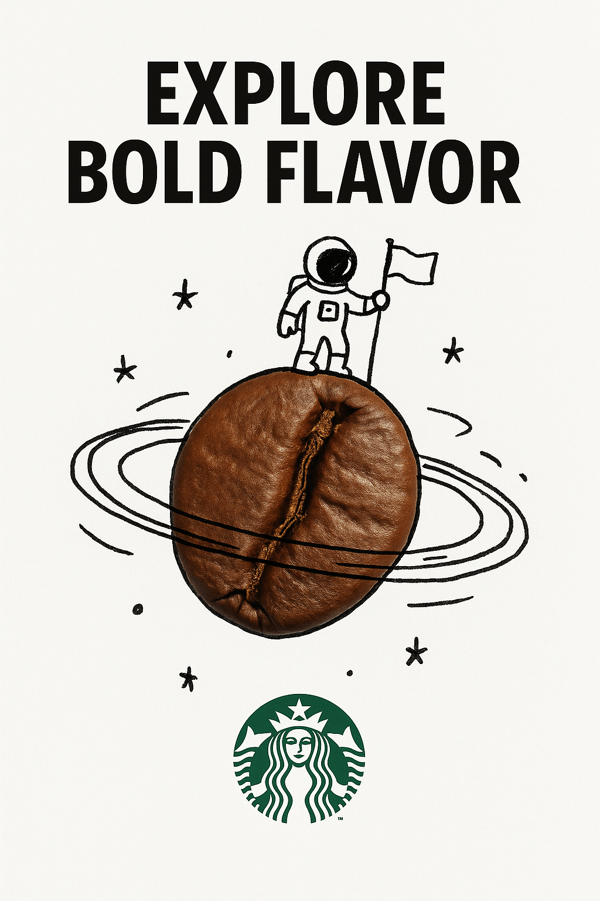<br>
<sub>Image © 2025 <a href="https://github.com/jamez-bondos">@jamez-bondos</a>, <a href="https://creativecommons.org/licenses/by/4.0/">CC BY 4.0</a> • Prompt by <a href="https://x.com/azed_ai">@azed_ai</a></sub>

**Prompt**

```
A minimalist and creative advertisement set on a clean white background.
A real [Real Object] is integrated into a hand-drawn black ink doodle, using loose, playful lines. The [Doodle Concept] interacts with the object in a clever, imaginative way. Include bold black [Ad Copy] text at the top or center. Place the [Brand Logo] clearly at the bottom. The visual should be clean, fun, high-contrast, and conceptually smart.
```

*Note: Replace [Real Object], [Doodle Concept], [Ad Copy], and [Brand Logo] in the prompt with specific details.
For example:
[Real Object]: coffee bean
[Doodle Concept]: The giant coffee bean becomes a space planet, with a small astronaut planting a flag on its surface
[Ad Copy]: "Explore Bold Flavor"
[Brand Logo]: Starbucks logo*


---

[⬆️ Back to Cases Directory](#cases-toc)

<a id="cases-99"></a>
### Case 99: Black and White Portrait Art (by [@ZHO_ZHO_ZHO](https://x.com/ZHO_ZHO_ZHO))

[Source Link](https://x.com/ZHO_ZHO_ZHO/status/1922150692145283299)

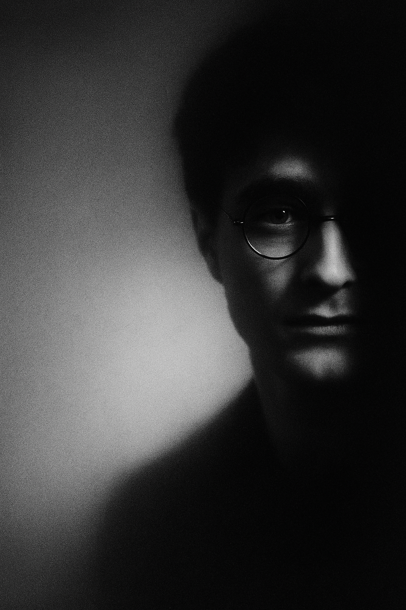<br>
<sub>Image © 2025 <a href="https://github.com/jamez-bondos">@jamez-bondos</a>, <a href="https://creativecommons.org/licenses/by/4.0/">CC BY 4.0</a> • Prompt by <a href="https://x.com/ZHO_ZHO_ZHO">@ZHO_ZHO_ZHO</a></sub>

**Prompt**

```
A high-resolution black and white portrait artwork, in an editorial and fine art photography style. The background features a soft gradient, transitioning from mid-gray to almost pure white, creating a sense of depth and tranquility. Fine film grain adds a tactile, analog-like softness to the image, reminiscent of classic black and white photography.

On the right side of the frame, a blurred yet striking face of Harry Potter subtly emerges from the shadows, not in a traditional pose, but as if caught in a moment of thought or breath. Only a part of his face is visible: perhaps an eye, a cheekbone, the contour of his lips, evoking a sense of mystery, intimacy, and elegance. His features are delicate yet profound, exuding a melancholic and poetic beauty without being overly dramatic.

A gentle, directional light, softly diffused, caresses the curve of his cheek or glints in his eye—this is the emotional core of the image. The rest of the composition is dominated by ample negative space, intentionally kept simple, allowing the image to breathe. There are no texts, no logos in the image—only an interplay of light, shadow, and emotion.

The overall atmosphere is abstract yet deeply human, like a fleeting glance or a half-remembered dream: intimate, timeless, and poignantly beautiful.
```


---

[⬆️ Back to Cases Directory](#cases-toc)

<a id="cases-98"></a>
### Case 98: Blurred Silhouette Behind Frosted Glass (by [@umesh_ai](https://x.com/umesh_ai))

[Source Link](https://x.com/umesh_ai/status/1921487841634156999)

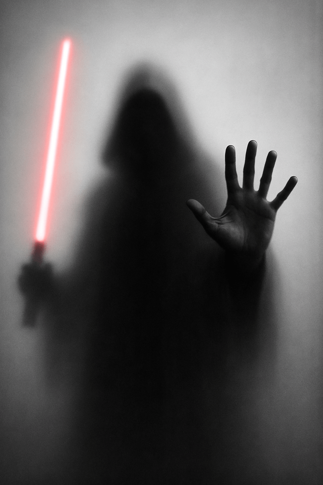<br>
<sub>Image © 2025 <a href="https://github.com/jamez-bondos">@jamez-bondos</a>, <a href="https://creativecommons.org/licenses/by/4.0/">CC BY 4.0</a> • Prompt by <a href="https://x.com/umesh_ai">@umesh_ai</a></sub>

**Prompt**

```
A black and white photograph shows the blurred silhouette of a [SUBJECT] behind a frosted or translucent surface. The [PART] is sharply defined and pressed against the surface, creating a stark contrast with the rest of the hazy, indistinct figure. The background is a soft gradient of gray tones, enhancing the mysterious and artistic atmosphere.
```

*Note: Replace [SUBJECT] and [PART] with vivid, visually striking details that emphasize the “blurred subject + sharply defined part” contrast.
For example, set [SUBJECT] to “a Sith Lord wielding a red lightsaber in one hand” and [PART] to “the other hand channeling the dark side of the Force.”*


---

[⬆️ Back to Cases Directory](#cases-toc)

<a id="cases-97"></a>
### Case 97: Cute and Cozy Knitted Doll (by [@ZHO_ZHO_ZHO](https://x.com/ZHO_ZHO_ZHO))

[Source Link](https://x.com/ZHO_ZHO_ZHO/status/1921148024861938077)

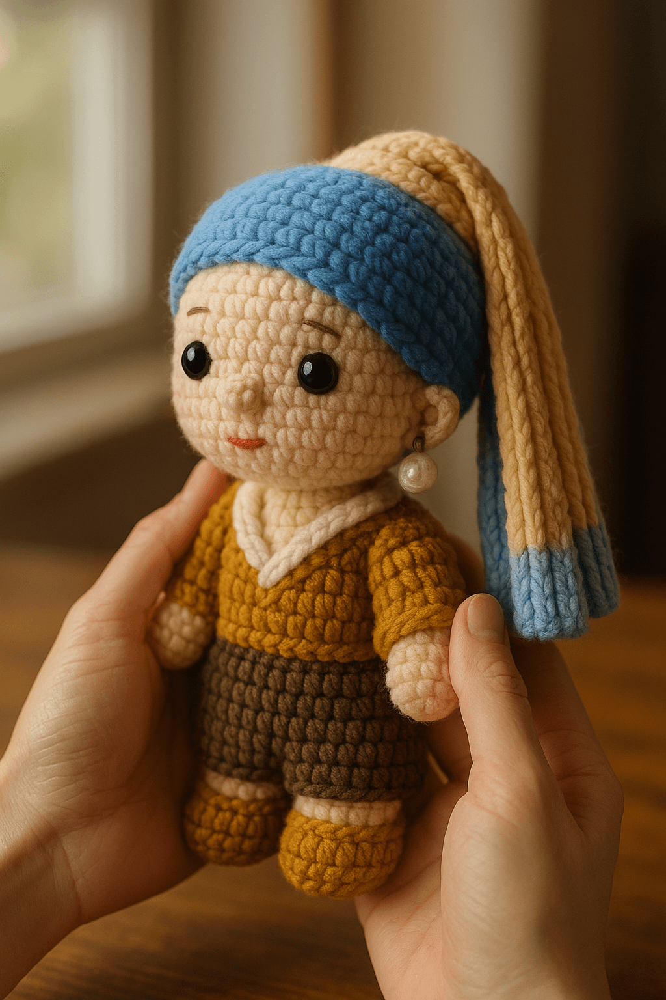<br>
<sub>Image © 2025 <a href="https://github.com/jamez-bondos">@jamez-bondos</a>, <a href="https://creativecommons.org/licenses/by/4.0/">CC BY 4.0</a> • Prompt by <a href="https://x.com/ZHO_ZHO_ZHO">@ZHO_ZHO_ZHO</a></sub>

**Prompt**

```
A close-up, professionally composed photograph showcasing a hand-crocheted yarn doll gently cradled by two hands. The doll has a rounded shape, featuring the cute chibi image of the [upload image] character, with vivid contrasting colors and rich details. The hands holding the doll are natural and gentle, with clearly visible finger postures, and natural skin texture and light/shadow transitions, conveying a warm and realistic touch. The background is slightly blurred, depicting an indoor environment with a warm wooden tabletop and natural light streaming in from a window, creating a comfortable and intimate atmosphere. The overall image conveys a sense of exquisite craftsmanship and cherished warmth.
```


**Reference Image Required:** Upload a photo as a reference to generate its cute chibi knitted doll image.


---

[⬆️ Back to Cases Directory](#cases-toc)

<a id="cases-96"></a>
### Case 96: Custom Anime Figure (by [@dotey](https://x.com/dotey))

[Source Link](https://x.com/dotey/status/1920851135516082246)

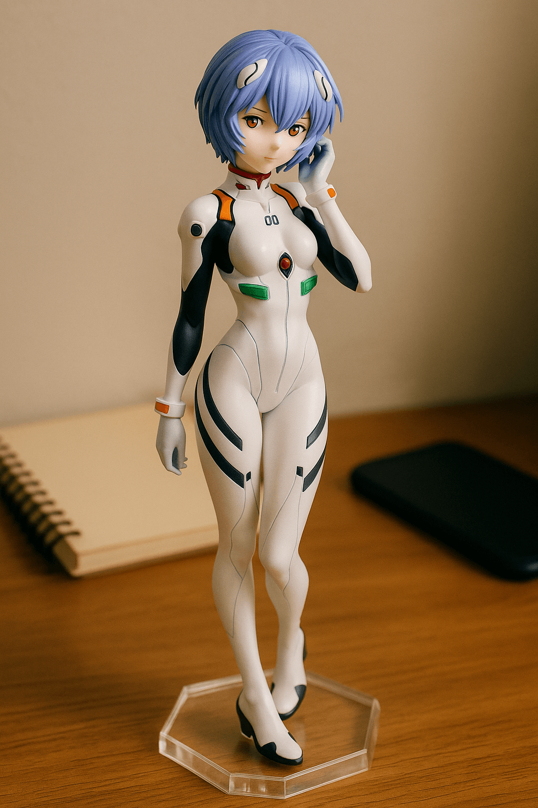<br>
<sub>Image © 2025 <a href="https://github.com/jamez-bondos">@jamez-bondos</a>, <a href="https://creativecommons.org/licenses/by/4.0/">CC BY 4.0</a> • Prompt by <a href="https://x.com/dotey">@dotey</a></sub>

**Prompt**

```
Generate an anime-style figure photo placed on a desktop, presented from a casual, everyday snapshot perspective as if taken with a mobile phone. The figure model is based on the attached character photo, accurately reproducing the full body posture, facial expression, and clothing style of the person in the photo, ensuring the entire figure is fully rendered. The overall design is exquisite and detailed, with hair and clothing featuring natural, soft gradient colors and fine textures. The style leans towards Japanese anime, rich in detail, with realistic textures and a beautiful appearance.
```


**Reference Image Required:** Please upload a photo showing the person's full body posture, facial expression, and clothing style to be used as the basis for the figure model.


---

[⬆️ Back to Cases Directory](#cases-toc)

<a id="cases-95"></a>
### Case 95: Bobblehead Generator from Selfie (by [@thisdudelikesAI](https://x.com/thisdudelikesAI))

[Source Link](https://x.com/thisdudelikesAI/status/1920433372243136730)

<br>
<sub>Image © 2025 <a href="https://github.com/jamez-bondos">@jamez-bondos</a>, <a href="https://creativecommons.org/licenses/by/4.0/">CC BY 4.0</a> • Prompt by <a href="https://x.com/thisdudelikesAI">@thisdudelikesAI</a></sub>

**Prompt**

```
Turn this photo into a bobblehead: enlarge the head slightly, keep the face accurate and cartoonify the body. [Place it on a bookshelf].
```

*Note: Please replace [Place it on a bookshelf] in the prompt with your desired specific scene or background, for example "Place it on a bookshelf" or "Place it on an office desk", or "Place it on a neutral background" or "Generate with a transparent background".*

**Reference Image Required:** A selfie needs to be uploaded as the basis for generating the bobblehead.


---

[⬆️ Back to Cases Directory](#cases-toc)

<a id="cases-94"></a>
### Case 94: Three Animals Selfie at Landmark (by [@berryxia_ai](https://x.com/berryxia_ai))

[Source Link](https://x.com/berryxia_ai/status/1920795648946782583)

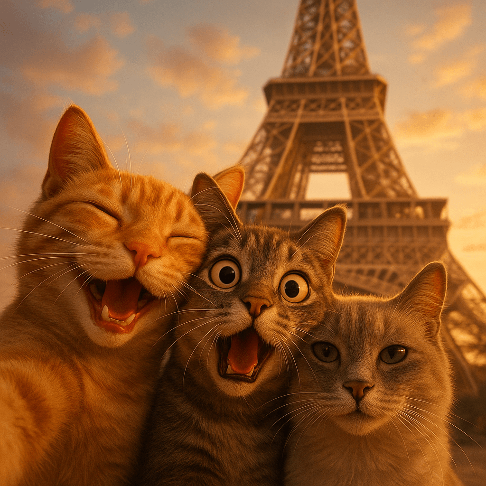<br>
<sub>Image © 2025 <a href="https://github.com/jamez-bondos">@jamez-bondos</a>, <a href="https://creativecommons.org/licenses/by/4.0/">CC BY 4.0</a> • Prompt by <a href="https://x.com/berryxia_ai">@berryxia_ai</a></sub>

**Prompt**

```
A close-up selfie of three [animal type] with different expressions in front of the iconic [landmark], taken at golden hour with cinematic lighting. The animals are positioned close to the camera with their heads touching, mimicking a selfie pose, showing joyful, surprised, and calm expressions. The background features the full architectural detail of [landmark], softly illuminated, with a warm ambient atmosphere. Shot in a photographic, realistic cartoon style, high detail, 1:1 aspect ratio.
```

*Note: Replace [animal type] and [landmark] in the prompt with specific descriptions.*


---

[⬆️ Back to Cases Directory](#cases-toc)

<a id="cases-93"></a>
### Case 93: Glass Retexturing (by [@egeberkina](https://x.com/egeberkina))

[Source Link](https://x.com/egeberkina/status/1920448389960909085)

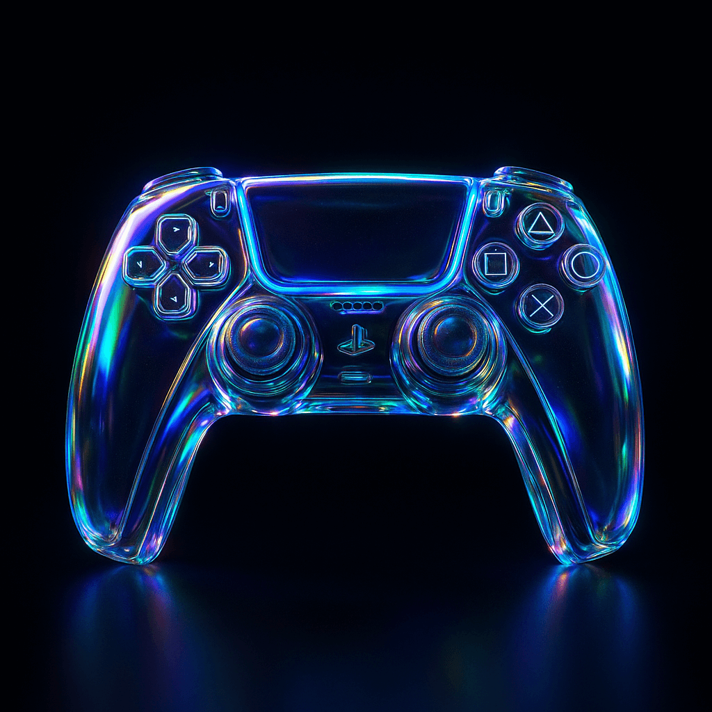<br>
<sub>Image © 2025 <a href="https://github.com/jamez-bondos">@jamez-bondos</a>, <a href="https://creativecommons.org/licenses/by/4.0/">CC BY 4.0</a> • Prompt by <a href="https://x.com/egeberkina">@egeberkina</a></sub>

**Prompt**

```
retexture the image attached based on the JSON aesthetic below
{
  "style": "photorealistic 3D render",
  "material": "glass with transparent and iridescent effects",
  "surface_texture": "smooth, polished with subtle reflections and refractive effects",
  "lighting": {
    "type": "studio HDRI",
    "intensity": "high",
    "direction": "angled top-left key light and ambient fill",
    "accent_colors": ["blue", "green", "purple"],
    "reflections": true,
    "refractions": true,
    "dispersion_effects": true,
    "bloom": true
  },
  "color_scheme": {
    "primary": "transparent with iridescent blue, green, and purple hues",
    "secondary": "crystal-clear with subtle chromatic shifts",
    "highlights": "soft, glowing accents reflecting rainbow-like effects",
    "rim_light": "soft reflective light around edges"
  },
  "background": {
    "color": "black",
    "vignette": true,
    "texture": "none"
  },
  "post_processing": {
    "chromatic_aberration": true,
    "glow": true,
    "high_contrast": true,
    "sharp_details": true
  }
}
```

*Note: Please use GPT-4o to generate images with this prompt; using Sora may not produce the correct style.*

**Reference Image Required:** An image needs to be uploaded as the base for retexturing.


---

[⬆️ Back to Cases Directory](#cases-toc)

<a id="cases-92"></a>
### Case 92: Perspective 3D Pop-Out Effect (by [@ZHO_ZHO_ZHO](https://x.com/ZHO_ZHO_ZHO))

[Source Link](https://x.com/ZHO_ZHO_ZHO/status/1920355982703509588)

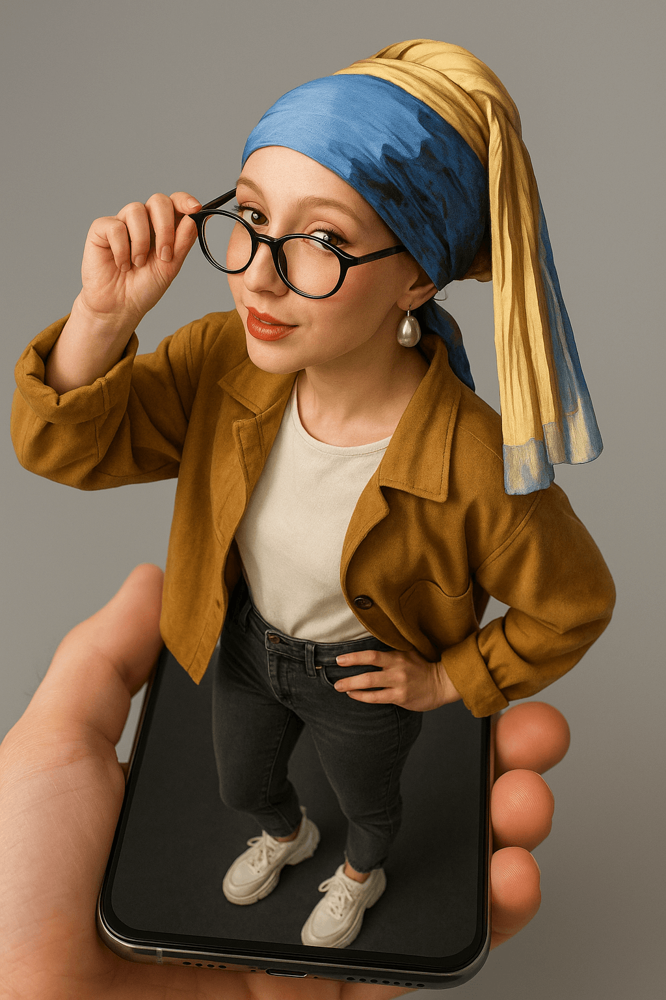<br>
<sub>Image © 2025 <a href="https://github.com/jamez-bondos">@jamez-bondos</a>, <a href="https://creativecommons.org/licenses/by/4.0/">CC BY 4.0</a> • Prompt by <a href="https://x.com/ZHO_ZHO_ZHO">@ZHO_ZHO_ZHO</a></sub>

**Prompt**

```
Hyperrealistic, top-down bird's-eye view shot, a beautiful Instagram model [Anne Hathaway / see reference image], with exquisite and beautiful makeup and fashionable styling, standing on the screen of a smartphone held up by someone. The image creates a strong perspective illusion. Emphasize the 3D effect of the girl standing out from the phone. She wears black-rimmed glasses, high-street fashion, and strikes a cute, playful pose. The phone screen is treated as a dark floor, like a small stage. The scene uses strong forced perspective to show the proportional difference between the hand, the phone, and the girl. The background is clean gray, using soft indoor light, shallow depth of field, and the overall style is surrealistic photorealistic compositing. Very strong perspective.
```

*Note: You can replace [Anne Hathaway] in the prompt with other character names. Or use a photo of a person as a reference image.*

**Reference Image Required:** You can use a photo of a person as a reference image. This example image uses ["Girl with a Pearl Earring"](https://commons.wikimedia.org/w/index.php?curid=55017931) as a reference image.


---

[⬆️ Back to Cases Directory](#cases-toc)

<a id="cases-91"></a>
### Case 91: Google Maps to Ancient Treasure Map (by [@umesh_ai](https://x.com/umesh_ai))

[Source Link](https://x.com/umesh_ai/status/1919701229363466328)

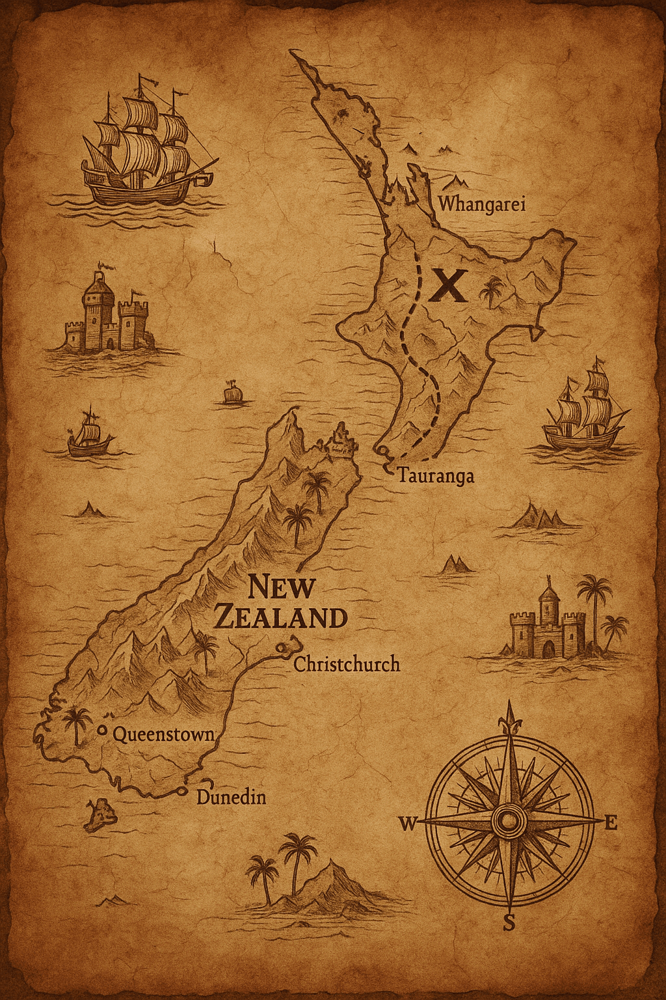<br>
<sub>Image © 2025 <a href="https://github.com/jamez-bondos">@jamez-bondos</a>, <a href="https://creativecommons.org/licenses/by/4.0/">CC BY 4.0</a> • Prompt by <a href="https://x.com/umesh_ai">@umesh_ai</a></sub>

**Prompt**

```
Transform the image to an ancient treasure map drawn on aged parchment. The map includes detailed elements like sailing ships on the ocean, old ports or castles on the coastline, a dotted path leading to a large 'X' marking the treasure spot, mountains, palm trees, and a decorative compass rose. The overall style is reminiscent of old pirate adventure films.
```


**Reference Image Required:** A Google Maps screenshot or other map image needs to be uploaded as the basis for the transformation.


---

[⬆️ Back to Cases Directory](#cases-toc)

<a id="cases-90"></a>
### Case 90: Branded Mechanical Keycaps (by [@egeberkina](https://x.com/egeberkina))

[Source Link](https://x.com/egeberkina/status/1918291652210311278)

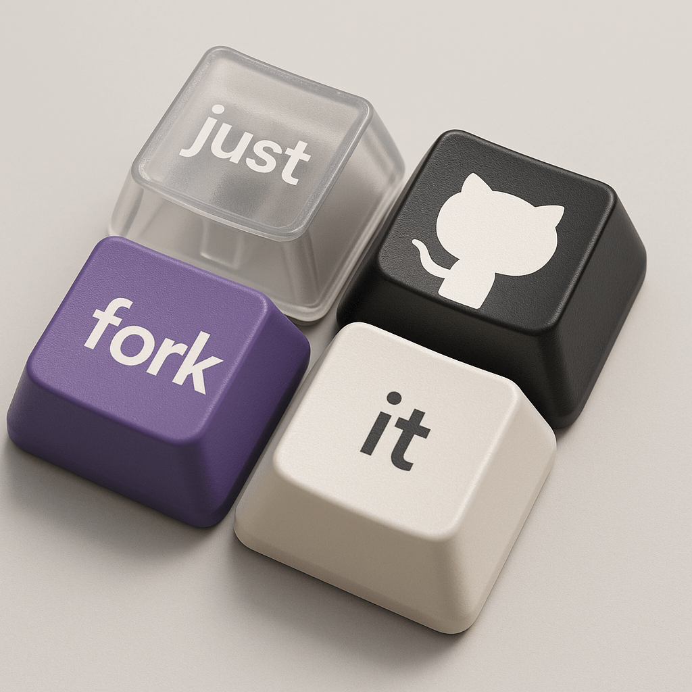<br>
<sub>Image © 2025 <a href="https://github.com/jamez-bondos">@jamez-bondos</a>, <a href="https://creativecommons.org/licenses/by/4.0/">CC BY 4.0</a> • Prompt by <a href="https://x.com/egeberkina">@egeberkina</a></sub>

**Prompt**

```
ultra-realistic 3D render of four mechanical keyboard keycaps in a tight 2x2 grid, all keys touching. View from an isometric angle. One key is transparent with the word “{just}” printed in {white}. The other three colors are: {black, purple, and white}. One key features the {Github} logo. The other two say "{fork}" and "{it}". Realistic plastic texture, rounded sculpted keycaps, soft shadows, clean light-gray background.
```

*Note: Replace brand name, slogan, keycap colors*


---

[⬆️ Back to Cases Directory](#cases-toc)

<a id="cases-89"></a>
### Case 89: Chrome Emoji Pin (by [@egeberkina](https://x.com/egeberkina))

[Source Link](https://x.com/egeberkina/status/1919398870867440124)

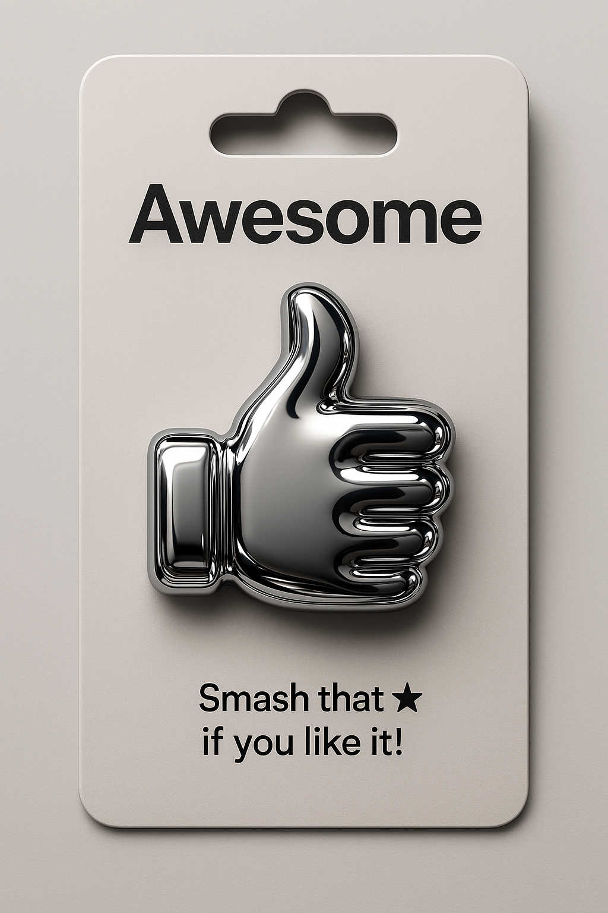<br>
<sub>Image © 2025 <a href="https://github.com/jamez-bondos">@jamez-bondos</a>, <a href="https://creativecommons.org/licenses/by/4.0/">CC BY 4.0</a> • Prompt by <a href="https://x.com/egeberkina">@egeberkina</a></sub>

**Prompt**

```
highly detailed 3D render of a single metallic {👍} emoji pin attached to a vertical product card, ultra-glossy chrome finish, smooth rounded 3D icon, stylized futuristic design, soft reflections, clean shadows, paper card has a die-cut euro hole at the top center, bold title “{Awesome}” above the pin, fun tagline “{Smash that ⭐ if you like it!}” below, soft gray background, soft studio lighting, minimal aesthetic
```

*Note: Replace {👍} emoji with your emoji icon; Replace title and tagline.*


---

[⬆️ Back to Cases Directory](#cases-toc)

<a id="cases-88"></a>
### Case 88: Children's Coloring Page Illustration (with Color Reference) (by [@dotey](https://x.com/dotey))

[Source Link](https://x.com/dotey/status/1919522110395080838)

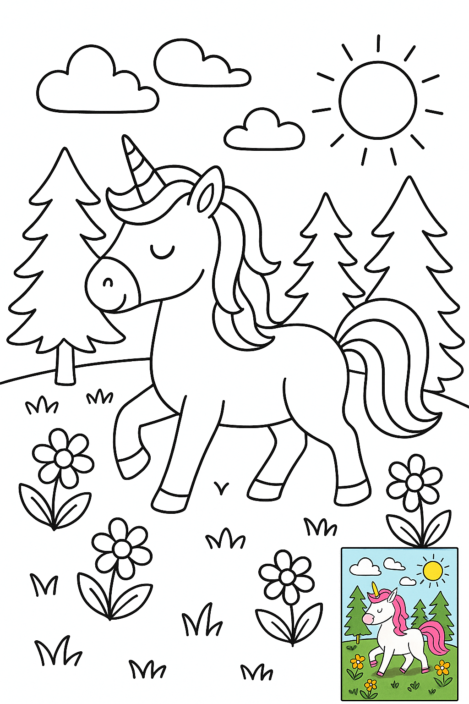<br>
<sub>Image © 2025 <a href="https://github.com/jamez-bondos">@jamez-bondos</a>, <a href="https://creativecommons.org/licenses/by/4.0/">CC BY 4.0</a> • Prompt by <a href="https://x.com/dotey">@dotey</a></sub>

**Prompt**

```
A black and white line drawing coloring illustration, suitable for direct printing on standard size (8.5x11 inch) paper, without paper borders. The overall illustration style is fresh and simple, using clear and smooth black outline lines, without shadows, grayscale, or color filling, with a pure white background for easy coloring.
[At the same time, for the convenience of users who are not good at coloring, please generate a complete colored version in the lower right corner as a small image for reference]
Suitable for: [6-9 year old children]
Scene description:
[A unicorn is walking on the grass in the forest, with bright sunshine, blue sky and white clouds]
```

*Note: The content within the brackets [] in the prompt can be replaced, such as the target audience and scene description.*


---

[⬆️ Back to Cases Directory](#cases-toc)

<a id="cases-87"></a>
### Case 87: Integrating Word Meaning into Letters (by [@dotey](https://x.com/dotey))

[Source Link](https://x.com/dotey/status/1918529055340576812)

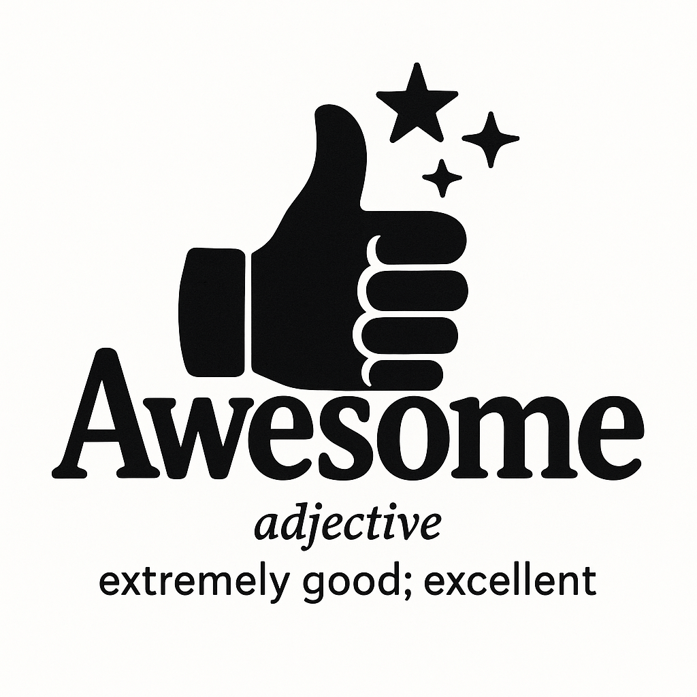<br>
<sub>Image © 2025 <a href="https://github.com/jamez-bondos">@jamez-bondos</a>, <a href="https://creativecommons.org/licenses/by/4.0/">CC BY 4.0</a> • Prompt by <a href="https://x.com/dotey">@dotey</a></sub>

**Prompt**

```
Integrate the meaning of the word into the letters, cleverly blending graphics and letters.
Word: {beautify}
Add a brief explanation of the word below.
```

*Note: Replace the word { beautify } with the word you want to integrate*


---

[⬆️ Back to Cases Directory](#cases-toc)

<a id="cases-86"></a>
### Case 86: Double Exposure (by [rezzycheck (Sora)](https://sora.com/explore?user=rezzycheck))

[Source Link](https://sora.com/g/gen_01jtc9btfzef080z31v8w9rtbw)

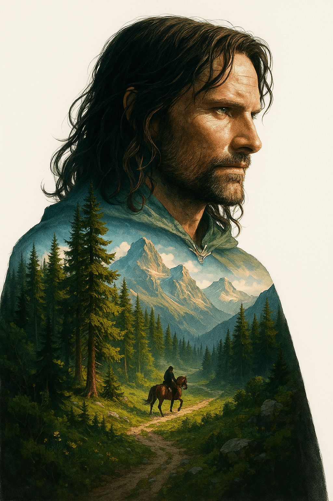<br>
<sub>Image © 2025 <a href="https://github.com/jamez-bondos">@jamez-bondos</a>, <a href="https://creativecommons.org/licenses/by/4.0/">CC BY 4.0</a> • Prompt by <a href="https://sora.com/explore?user=rezzycheck">rezzycheck (Sora)</a></sub>

**Prompt**

```
Double exposure, Midjourney style, merging, blending, overlay double exposure image, Double Exposure style, An exceptional masterpiece by Yukisakura revealing a fantastic double exposure composition of Aragorn son of Arathorn's silhouette harmoniously intertwined with the visually striking, rugged landscapes of Middle Earth during a lively spring season. Sun-bathed pine forests, mountain peaks, and a lone horse cutting through the trail echo outward through the fabric of his figure, adding layers of narrative and solitude. Beautiful tension builds as the stark monochrome background maintains razor-sharp contrast, drawing all focus to the richly layered double exposure. Characterized by its vibrant full-color scheme within Aragorn's silhouette and crisp, deliberate lines that trace every contour with emotional precision. (Detailed:1.45). (Detailed background:1.4).
```


---

[⬆️ Back to Cases Directory](#cases-toc)

<a id="cases-85"></a>
### Case 85: Surreal Interaction Scene (by [@umesh_ai](https://x.com/umesh_ai))

[Source Link](https://x.com/umesh_ai/status/1917444534239191544)

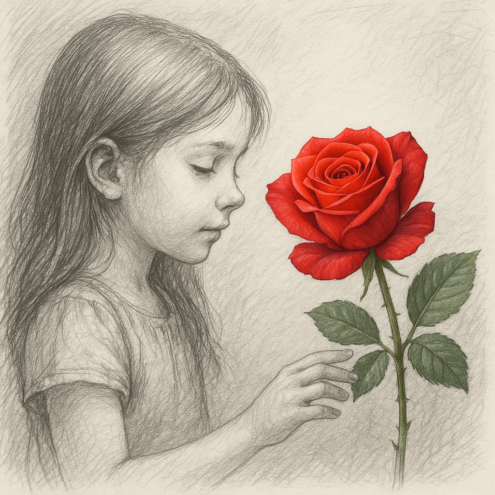<br>
<sub>Image © 2025 <a href="https://github.com/jamez-bondos">@jamez-bondos</a>, <a href="https://creativecommons.org/licenses/by/4.0/">CC BY 4.0</a> • Prompt by <a href="https://x.com/umesh_ai">@umesh_ai</a></sub>

**Prompt**

```
A pencil sketch of [Subject 1] interacting with [Subject 2], where [Subject 2] is rendered as a realistic, full-color object, creating a surreal contrast against the hand-drawn style of [Subject 1] and the background
```

*Note: Replace [Subject 1] and [Subject 2] in the prompt with specific subject descriptions, such as "a hand" and "a rose".*


---

[⬆️ Back to Cases Directory](#cases-toc)

<a id="cases-84"></a>
### Case 84: Animal Silicone Wrist Rest (by [@ZHO_ZHO_ZHO](https://x.com/ZHO_ZHO_ZHO))

[Source Link](https://x.com/ZHO_ZHO_ZHO/status/1918525296577327574)

<br>
<sub>Image © 2025 <a href="https://github.com/jamez-bondos">@jamez-bondos</a>, <a href="https://creativecommons.org/licenses/by/4.0/">CC BY 4.0</a> • Prompt by <a href="https://x.com/ZHO_ZHO_ZHO">@ZHO_ZHO_ZHO</a></sub>

**Prompt**

```
Create an image of a cute chibi-style silicone wrist rest based on the {🐼} emoji. The wrist rest is made of soft, food-grade silicone with a skin-friendly matte surface. The interior is filled with slow-rebound foam. Designed in a personified cartoon style, the expression is lively, with both arms stretched out as if hugging the user’s wrist while lying on a desk. The overall shape is round, soft, and adorable, featuring the classic {🐼} color scheme. The design is comforting and cute, suitable for office use. The background is a solid white color with soft lighting. Rendered in a product photography style, the angle is either front-facing or at a 45-degree top-down view, showcasing high-definition details and emphasizing the silicone texture and comfort functionality.
```

*Note: Replace the {🐼} emoji in the prompt with other animal emojis.*


---

[⬆️ Back to Cases Directory](#cases-toc)

<a id="cases-83"></a>
### Case 83: Glowing Lines Anatomy Diagram (by [@umesh_ai](https://x.com/umesh_ai))

[Source Link](https://x.com/umesh_ai/status/1914644426334314545)

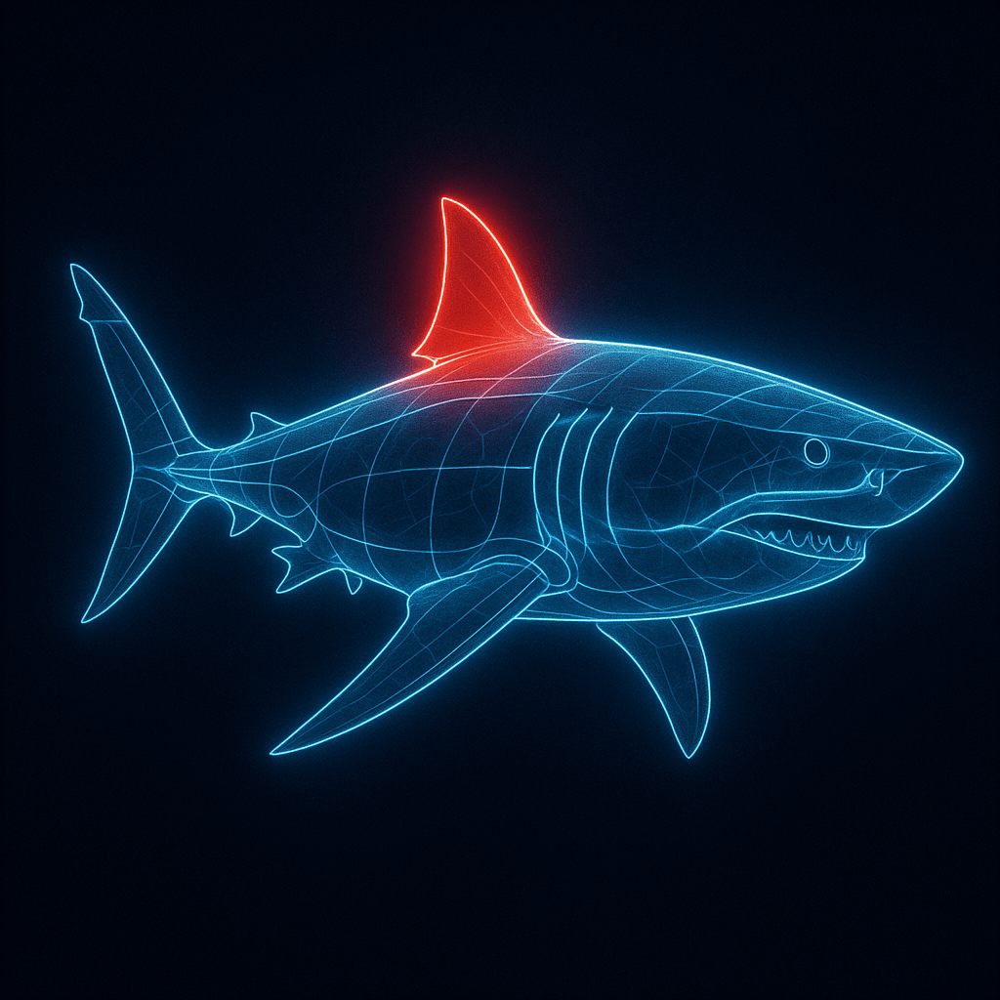<br>
<sub>Image © 2025 <a href="https://github.com/jamez-bondos">@jamez-bondos</a>, <a href="https://creativecommons.org/licenses/by/4.0/">CC BY 4.0</a> • Prompt by <a href="https://x.com/umesh_ai">@umesh_ai</a></sub>

**Prompt**

```
A digital illustration of a [SUBJECT], portrayed with a network of glowing clean pristine blue lines outlining its anatomy. The image is set against a dark background, highlighting the [SUBJECT] form and features. A specific area such as [PART] is emphasized with a red glow to indicate a point of interest or significance. The style is both educational and visually captivating, designed to resemble an advanced imaging technique
```

*Note: Replace `[SUBJECT]` and `[PART]` in the prompt.*


---

[⬆️ Back to Cases Directory](#cases-toc)

<a id="cases-82"></a>
### Case 82: Signature City Weather Forecast (by [@dotey](https://x.com/dotey))

[Source Link](https://x.com/dotey/status/1917988595228438771)

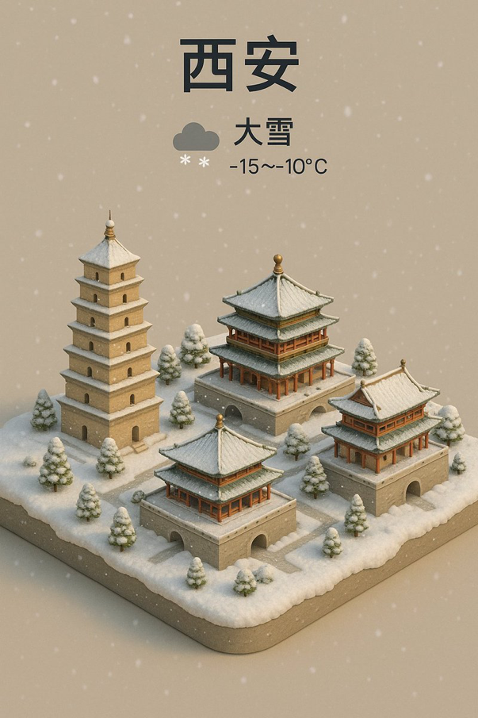<br>
<sub>Image © 2025 <a href="https://github.com/jamez-bondos">@jamez-bondos</a>, <a href="https://creativecommons.org/licenses/by/4.0/">CC BY 4.0</a> • Prompt by <a href="https://x.com/dotey">@dotey</a></sub>

**Prompt**

```
Show a clear 45-degree bird’s-eye view of an isometric miniature city scene featuring Shanghai’s iconic buildings, such as the Oriental Pearl Tower and the Bund. The weather effect—cloudy—blends softly into the city, interacting gently with the architecture. Use physically based rendering (PBR) and realistic lighting. Solid color background, crisp and clean. Centered composition to highlight the precision and detail of the 3D model. Display “Shanghai Cloudy 20°C” and a cloudy weather icon at the top of the image.
```

*Note: The city, weather, temperature, and building names can be replaced with the content in []. Generated with sora.*


**Submitter:** [luoshui-coder](https://github.com/luoshui-coder)

---

[⬆️ Back to Cases Directory](#cases-toc)

<a id="cases-81"></a>
### Case 81: 3D Translucent Glass Transformation (by [@azed_ai](https://x.com/azed_ai))

[Source Link](https://x.com/azed_ai/status/1917948899098243407)

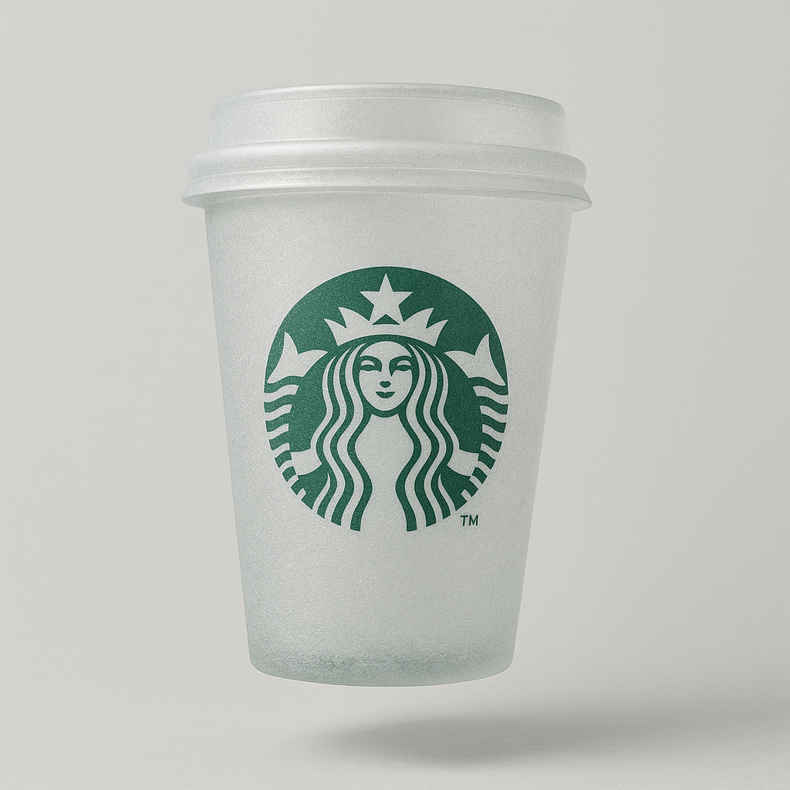<br>
<sub>Image © 2025 <a href="https://github.com/jamez-bondos">@jamez-bondos</a>, <a href="https://creativecommons.org/licenses/by/4.0/">CC BY 4.0</a> • Prompt by <a href="https://x.com/azed_ai">@azed_ai</a></sub>

**Prompt**

```
A soft, 3D translucent glass of the attached image with a frosty matte finish and detailed texture, original colors, centered on a light gray background, floats gently in space, soft shadows, natural lighting
```


**Reference Image Required:** Need to upload a reference image of a physical object

**Submitter:** [luoshui-coder](https://github.com/luoshui-coder)

---

[⬆️ Back to Cases Directory](#cases-toc)

<a id="cases-80"></a>
### Case 80: Code Style Business Card (by [@umesh_ai](https://x.com/umesh_ai))

[Source Link1](https://x.com/umesh_ai/status/1915696926596415492) | [Source Link2](https://x.com/fr0gger_/status/1916743281339498760) | [Source Link3](https://x.com/dotey/status/1917412535130563006)

<br>
<sub>Image © 2025 <a href="https://github.com/jamez-bondos">@jamez-bondos</a>, <a href="https://creativecommons.org/licenses/by/4.0/">CC BY 4.0</a> • Prompt by <a href="https://x.com/umesh_ai">@umesh_ai</a></sub>

**Prompt**

```
A close-up shot of a hand holding a business card designed to look like a JSON file opened in VS Code. The card shows code formatted in realistic syntax-highlighted JSON code. The window includes typical toolbar icons and a title bar labeled Business Card.json, styled exactly like the interface of VS Code. Background is slightly blurred, keeping the focus on the card.
The card displays the following code formatted in JSON:
{
  "name": "Jamez Bondos",
  "title": "Your Title",
  "email": "your@email.com",
  "link": "yourwebsite"
}
```

*Note: Replace the values of name, title, email, and link in the final JSON code. The prompt is a simplified version derived from the original source link.*


**Submitter:** [Kong-F](https://github.com/Kong-F)

---

[⬆️ Back to Cases Directory](#cases-toc)

<a id="cases-79"></a>
### Case 79: Lego Cityscape (Shanghai Bund) (by [@dotey](https://x.com/dotey))

[Source Link](https://x.com/dotey/status/1917713810346872902)

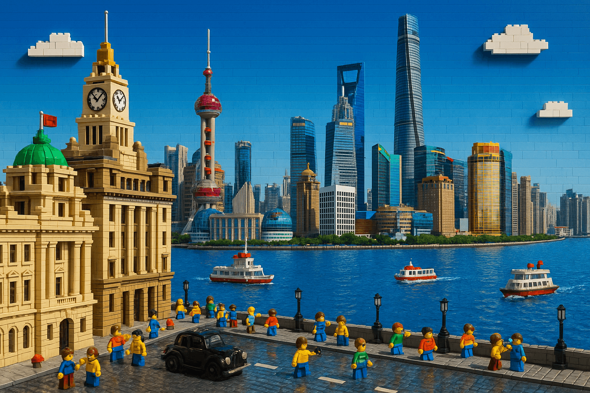<br>
<sub>Image © 2025 <a href="https://github.com/jamez-bondos">@jamez-bondos</a>, <a href="https://creativecommons.org/licenses/by/4.0/">CC BY 4.0</a> • Prompt by <a href="https://x.com/dotey">@dotey</a></sub>

**Prompt**

```
Create a highly detailed and vividly colored LEGO-style scene of the Shanghai Bund. The foreground features the iconic historical buildings of the Bund, meticulously recreated with LEGO bricks in Western and neoclassical architectural styles — including clock towers, domes, and colonnades. LEGO minifigures are seen strolling along the riverfront, taking photos, and sightseeing, with classic LEGO-style cars parked along the street.
In the background lies the spectacular Huangpu River, assembled with translucent blue LEGO bricks. On the water, LEGO ferries and tour boats sail along. Across the river stands the skyline of Lujiazui in Pudong, including the Oriental Pearl Tower, Shanghai Tower, Jin Mao Tower, and Shanghai World Financial Center — all rendered as vibrant, lifelike LEGO skyscrapers.
The sky is LEGO’s signature bright blue, adorned with a few white LEGO brick clouds, creating a visual full of energy and modernity.
```

*Note: You can ask AI to generate similar prompts for other cityscapes based on this example. Original image generated by Sora.*


---

[⬆️ Back to Cases Directory](#cases-toc)

<a id="cases-78"></a>
### Case 78: Glass Retexturing (by [@egeberkina](https://x.com/egeberkina))

[Source Link](https://x.com/egeberkina/status/1917631056980721743)

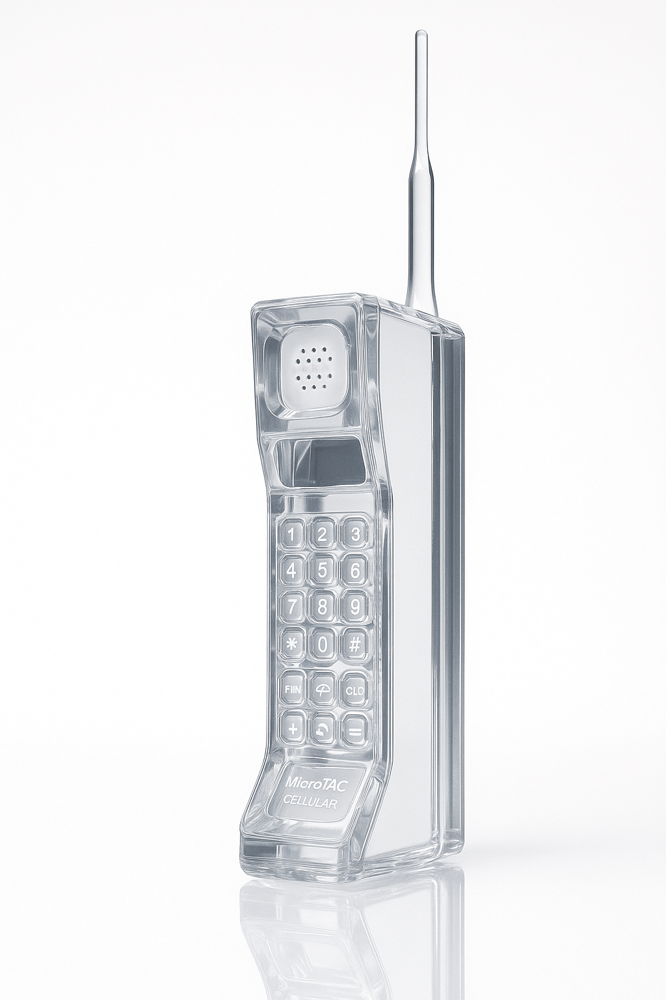<br>
<sub>Image © 2025 <a href="https://github.com/jamez-bondos">@jamez-bondos</a>, <a href="https://creativecommons.org/licenses/by/4.0/">CC BY 4.0</a> • Prompt by <a href="https://x.com/egeberkina">@egeberkina</a></sub>

**Prompt**

```
retexture the image attached based on the json below:

{
  "style": "photorealistic",
  "material": "glass",
  "background": "plain white",
  "object_position": "centered",
  "lighting": "soft, diffused studio lighting",
  "camera_angle": "eye-level, straight-on",
  "resolution": "high",
  "aspect_ratio": "2:3",
  "details": {
    "reflections": true,
    "shadows": false,
    "transparency": true
  }
}
```

*Note: This prompt uses a JSON structure to precisely control the output style.*

**Reference Image Required:** Yes, needs an image of the object to be retextured.


---

[⬆️ Back to Cases Directory](#cases-toc)

<a id="cases-77"></a>
### Case 77: Story Scene in Crystal Ball (by [@dotey](https://x.com/dotey))

[Source Link](https://x.com/dotey/status/1916530529324699858)

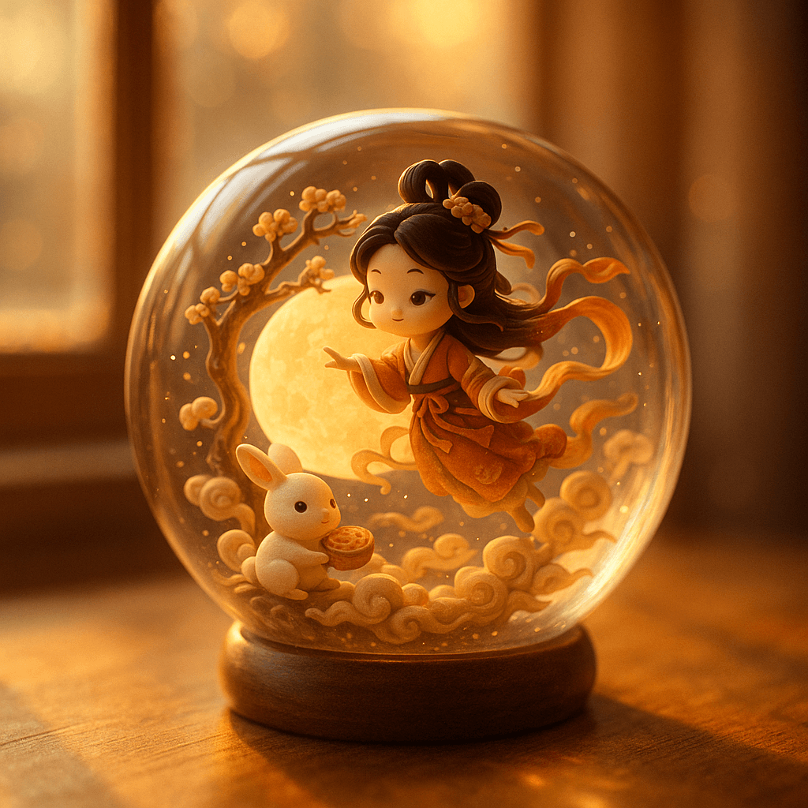<br>
<sub>Image © 2025 <a href="https://github.com/jamez-bondos">@jamez-bondos</a>, <a href="https://creativecommons.org/licenses/by/4.0/">CC BY 4.0</a> • Prompt by <a href="https://x.com/dotey">@dotey</a></sub>

**Prompt**

```
A delicate crystal ball rests quietly on a warm, softly lit tabletop by the window. The background is blurred and hazy, with warm-toned sunlight gently passing through the crystal ball, refracting specks of golden light that softly illuminate the dim surroundings.
Inside the crystal ball, a miniature three-dimensional world themed around {Chang’e Flying to the Moon} is naturally displayed — a finely detailed, dreamlike 3D scene. All characters and objects are rendered in adorable chibi style, exquisitely crafted and visually charming, with vivid emotional interactions between them.
The overall atmosphere is rich with East Asian fantasy elements, full of intricate details and a surreal magical realism texture. The entire scene feels poetic and dreamy, luxurious yet elegant, radiating a gentle, comforting glow — as if imbued with life through the warm play of light and shadow.
```

*Note: Replace the text within the square brackets {} in the prompt with a description of a story scene (idioms, stories, short tales all work).*


---

[⬆️ Back to Cases Directory](#cases-toc)

<a id="cases-76"></a>
### Case 76: Nostalgic Anime Film Poster (by [photis (Sora)](https://sora.com/explore?user=user-sydD5ZkXZsDaL0BriQa010dQ))

[Source Link](https://sora.com/g/gen_01jsfxrdpjfpebnyed8yaz42nf)

<br>
<sub>Image © 2025 <a href="https://github.com/jamez-bondos">@jamez-bondos</a>, <a href="https://creativecommons.org/licenses/by/4.0/">CC BY 4.0</a> • Prompt by <a href="https://sora.com/explore?user=user-sydD5ZkXZsDaL0BriQa010dQ">photis (Sora)</a></sub>

**Prompt**

```
{The Lord of the Rings} anime film poster, the anime is in the style of High School DXD. Visible even folds are seen across the poster as it’s been folded over time, and due to some creases over damaging the poster has caused some physical damage scuffing along the creases and the color has partially faded. Indiscriminate flaps and folds and scratches all around simply from moving back and forth causing subtle yet incremental damage with the ever expanding of entropy we cannot escape, but the loving memories in our hearts will forever be whole. Making the objects we collect along the way priceless is the essence you feel when looking at this nostalgic poster.
```

*Note: You can replace the movie title "{The Lord of the Rings}" in the prompt with others. Be aware that some movie titles may trigger content moderation. The referenced anime style can also be modified.*


---

[⬆️ Back to Cases Directory](#cases-toc)

<a id="cases-75"></a>
### Case 75: Social Media Frame Integration (by [@dotey](https://x.com/dotey))

[Source Link](https://x.com/dotey/status/1917042797506662560)

<br>
<sub>Image © 2025 <a href="https://github.com/jamez-bondos">@jamez-bondos</a>, <a href="https://creativecommons.org/licenses/by/4.0/">CC BY 4.0</a> • Prompt by <a href="https://x.com/dotey">@dotey</a></sub>

**Prompt**

```
Create a stylized 3D chibi character based on the attached photo, accurately preserving the subject’s facial features and clothing details. The character is making a finger heart with the left hand (with a red heart element above the fingers) and playfully sitting on the edge of a giant Instagram frame, with both legs hanging outside the frame. The top of the frame displays the username “Beauty,” and various social media icons (like, comment, share) float around the scene.
```

*Note: The username "Beauty" and icons in the prompt can be replaced. Original image generated by Sora.*

**Reference Image Required:** Yes, needs an image to be uploaded as reference.


---

[⬆️ Back to Cases Directory](#cases-toc)

<a id="cases-74"></a>
### Case 74: Creative Logo Shaped Bookshelf (by [@umesh_ai](https://x.com/umesh_ai))

[Source Link](https://x.com/umesh_ai/status/1916517976414495161)

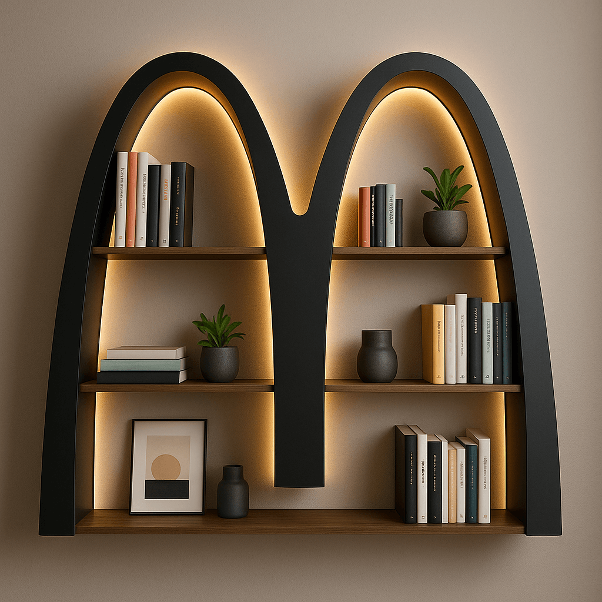<br>
<sub>Image © 2025 <a href="https://github.com/jamez-bondos">@jamez-bondos</a>, <a href="https://creativecommons.org/licenses/by/4.0/">CC BY 4.0</a> • Prompt by <a href="https://x.com/umesh_ai">@umesh_ai</a></sub>

**Prompt**

```
Create a photograph of a modern bookshelf inspired by the shape of [LOGO]. The bookshelf features flowing, interconnected curves forming multiple sections of varying sizes. It is made of sleek matte black metal with wooden shelves inside the loops. Soft, warm LED lighting outlines the inner curves. The bookshelf is mounted on a neutral-toned wall and holds a mix of colorful books, small plants, and minimalistic art pieces. The overall vibe is creative, elegant, and slightly futuristic
```

*Note: Replace the `[LOGO]` placeholder in the prompt with a specific brand logo description (e.g., "Apple logo", "McDonald's logo").*


---

[⬆️ Back to Cases Directory](#cases-toc)

<a id="cases-73"></a>
### Case 73: Cute Chibi Keychain (by [@azed_ai](https://x.com/azed_ai))

[Source Link](https://x.com/azed_ai/status/1916521742052503804)

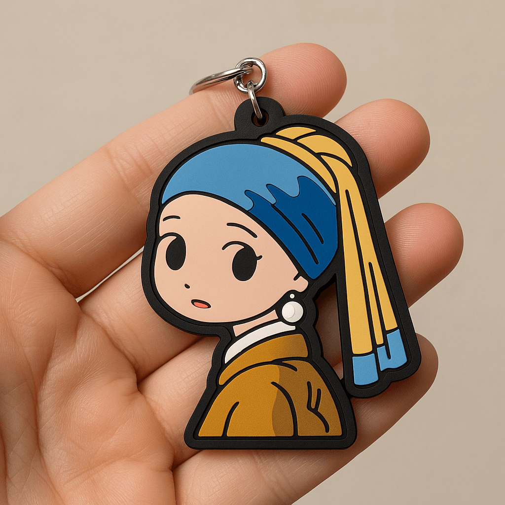<br>
<sub>Image © 2025 <a href="https://github.com/jamez-bondos">@jamez-bondos</a>, <a href="https://creativecommons.org/licenses/by/4.0/">CC BY 4.0</a> • Prompt by <a href="https://x.com/azed_ai">@azed_ai</a></sub>

**Prompt**

```
A close-up photo of a cute, colorful keychain held by person's hand. The keychain features a chibi-style of the [attached image ]. The keychain is made of soft rubber with bold black outlines and attached to a small silver keyring, neutral background
```

*Note: The `[attached image]` part of the prompt needs to be used in conjunction with an uploaded image.*

**Reference Image Required:** A photo of a person or object as the subject for the keychain design.

**Submitter:** [Kong-F](https://github.com/Kong-F)

---

[⬆️ Back to Cases Directory](#cases-toc)

<a id="cases-72"></a>
### Case 72: Gold Pendant Necklace (by [@azed_ai](https://x.com/azed_ai))

[Source Link](https://x.com/azed_ai/status/1915770501705925106)

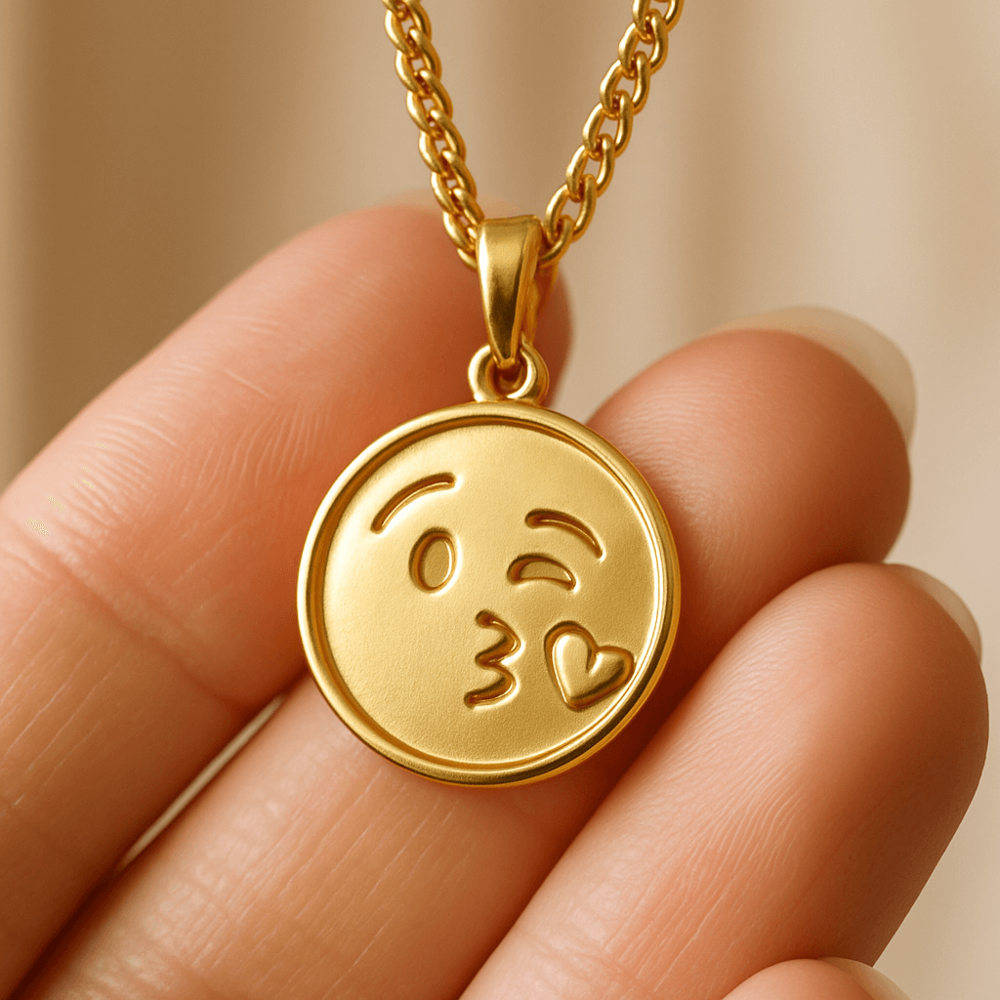<br>
<sub>Image © 2025 <a href="https://github.com/jamez-bondos">@jamez-bondos</a>, <a href="https://creativecommons.org/licenses/by/4.0/">CC BY 4.0</a> • Prompt by <a href="https://x.com/azed_ai">@azed_ai</a></sub>

**Prompt**

```
A photorealistic close-up of a gold pendant necklace held by female hand. The pendant features a bas-relief engraving of [image /emoji]. The pendant hangs from a polished gold chain. The background is softly blurred with neutral beige tones, and natural lighting, realistic skin tones, Product photography, 16:9 aspect ratio.
```

*Note: Replace `[image /emoji]` in the prompt with a specific image description or an emoji.*

**Reference Image Required:** (Optional) An image can be uploaded to be used as the bas-relief pattern.


---

[⬆️ Back to Cases Directory](#cases-toc)

<a id="cases-71"></a>
### Case 71: Miniature Cyberpunk Tilt-Shift Landscape (by [terry623](https://github.com/terry623))


<br>
<sub>Image © 2025 <a href="https://github.com/terry623">terry623</a>, <a href="https://creativecommons.org/licenses/by/4.0/">CC BY 4.0</a> • Prompt by <a href="https://github.com/terry623">terry623</a></sub>

**Prompt**

```
A highly detailed miniature [Cyberpunk] landscape viewed from above, using a tilt-shift lens effect. The scene is filled with toy-like elements, all rendered in high-resolution CG. Dramatic lighting creates a cinematic atmosphere, with vivid colors and strong contrast, emphasizing depth of field and a realistic micro-perspective, making the viewer feel as if overlooking a toy world. The image contains many visual jokes and details worth repeated viewing.
```

*Note: You can replace [Cyberpunk] in the prompt with other styles or scenes, such as "Futuristic City", "Steampunk", "Medieval Village", etc.*


**Submitter:** [terry623](https://github.com/terry623)

---

[⬆️ Back to Cases Directory](#cases-toc)

<a id="cases-70"></a>
### Case 70: Original Pokemon Creation (by [@Anima_Labs](https://x.com/Anima_Labs))

[Source Link](https://x.com/Anima_Labs/status/1915044265895379166)

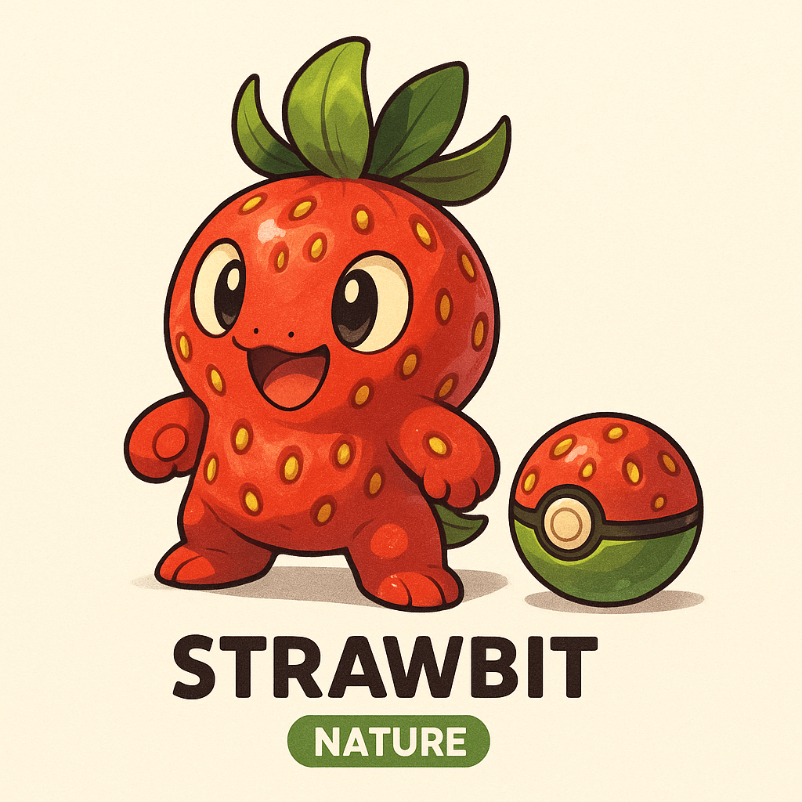<br>
<sub>Image © 2025 <a href="https://github.com/jamez-bondos">@jamez-bondos</a>, <a href="https://creativecommons.org/licenses/by/4.0/">CC BY 4.0</a> • Prompt by <a href="https://x.com/Anima_Labs">@Anima_Labs</a></sub>

**Prompt**

```
Create an original creature inspired by this object (photo provided). The creature should look like it belongs in a fantasy monster-catching universe, with a cute or cool design influenced by retro Japanese RPG monster art. The image must include:
– A full-body view of the creature, inspired by the shape, materials or purpose of the object.
– A small orb or capsule (similar an a pokeball) at its feet, designed with patterns and colors matching the object’s look — not a standard Pokéball, but a custom design.
– An invented name for the creature, displayed next to or below it. – Its elemental type (e.g., Fire, Water, Metal, Nature, Electric…), based on the object’s core properties. The illustration should look like it comes from a fantasy creature encyclopedia, with clean lines, soft shadows, and an expressive, character-driven design.
```

*Note: If the prompt doesn't work the first time, try a new conversation or ask him to work around the problem.*

**Reference Image Required:** Needs a photo of an object, food, etc., as inspiration.


---

[⬆️ Back to Cases Directory](#cases-toc)

<a id="cases-69"></a>
### Case 69: Silhouette Art (by [@umesh_ai](https://x.com/umesh_ai))

[Source Link](https://x.com/umesh_ai/status/1915417277953962048)

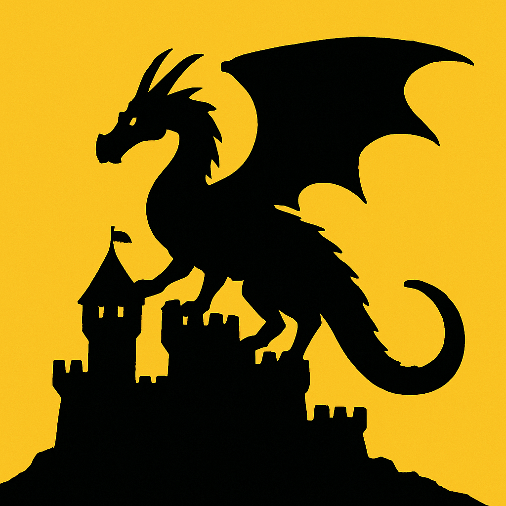<br>
<sub>Image © 2025 <a href="https://github.com/jamez-bondos">@jamez-bondos</a>, <a href="https://creativecommons.org/licenses/by/4.0/">CC BY 4.0</a> • Prompt by <a href="https://x.com/umesh_ai">@umesh_ai</a></sub>

**Prompt**

```
The silhouette of a basic outline of a [PROMPT]. The background is bright yellow, and the silhouette is solid black.
```

*Note: Replace `[PROMPT]` with the specific subject, e.g., "dragon on a castle", "woman's profile", etc.*


---

[⬆️ Back to Cases Directory](#cases-toc)

<a id="cases-68"></a>
### Case 68: Futuristic Logo Trading Card (by [@hewarsaber](https://x.com/hewarsaber))

[Source Link](https://x.com/hewarsaber/status/1912933875166171515)

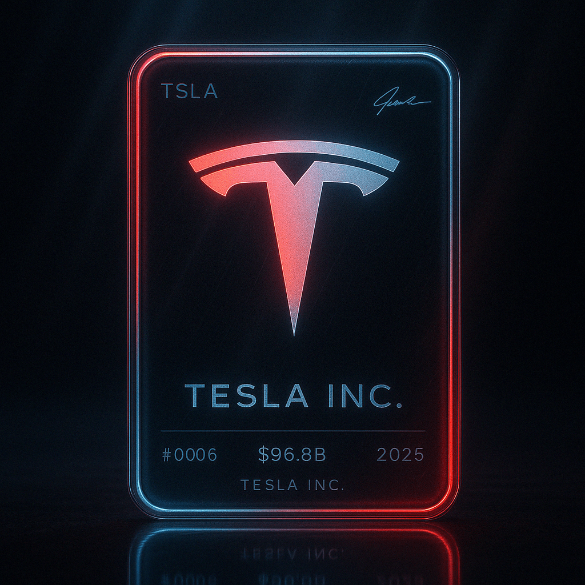<br>
<sub>Image © 2025 <a href="https://github.com/jamez-bondos">@jamez-bondos</a>, <a href="https://creativecommons.org/licenses/by/4.0/">CC BY 4.0</a> • Prompt by <a href="https://x.com/hewarsaber">@hewarsaber</a></sub>

**Prompt**

```
{
    "prompt": "A futuristic trading card with a dark, moody neon aesthetic and soft sci-fi lighting. The card features a semi-transparent, rounded rectangle with slightly muted glowing edges, appearing as if made of holographic glass. At the center is a large glowing logo of {{logo}}, with no additional text or label, illuminated with a smooth gradient of {{colors}}, but not overly bright. The reflections on the card surface should be subtle, with a slight glossy finish catching ambient light. The background is a dark carbon fiber texture or deep gradient with soft ambient glows bleeding into the edges. Add subtle light rays streaming down diagonally from the top, giving the scene a soft cinematic glow. Apply light motion blur to the edges and reflections to give the scene a sense of depth and energy, as if it's part of a high-end tech animation still. Below the card, include realistic floor reflections that mirror the neon edges and logo—slightly diffused for a grounded, futuristic look. Text elements are minimal and softly lit: top-left shows '{{ticker}}', top-right has a stylized signature, and the bottom displays '{{company_name}}' with a serial number '{{card_number}}', a revenue badge reading '{{revenue}}', and the year '{{year}}'. Typography should have a faint glow with slight blurring, and all elements should feel premium, elegant, and softly illuminated—like a high-end cyberpunk collectible card.",
    "style": {
        "lighting": "Neon glow, soft reflections",
        "font": "Modern sans-serif, clean and minimal",
        "layout": "Centered, structured like a digital collectible card",
        "materials": "Glass, holographic plastic, glowing metal edges"
    },
    "parameters": {
        "logo": "Tesla logo",
        "ticker": "TSLA",
        "company_name": "Tesla Inc.",
        "card_number": "#0006",
        "revenue": "$96.8B",
        "year": "2025",
        "colors": [
            "red",
            "white",
            "dark gray"
        ]
    },
    "medium": "3D render, high-resolution digital art",
    "size": "1080px by 1080px"
}
```

*Note: The prompt uses a JSON-like structure to describe card elements. Modify values in the `parameters` object (like logo, ticker, company_name, colors, etc.) to customize the card. For custom logos, specify in `parameters.logo` (e.g., "Framer logo (attached image)") and upload the image.*

**Reference Image Required:** (Optional) Upload a custom logo image.


---

[⬆️ Back to Cases Directory](#cases-toc)

<a id="cases-67"></a>
### Case 67: Ultra-realistic 3D Game (by [@ZHO_ZHO_ZHO](https://x.com/ZHO_ZHO_ZHO))

[Source Link](https://x.com/ZHO_ZHO_ZHO/status/1913648013144137840)

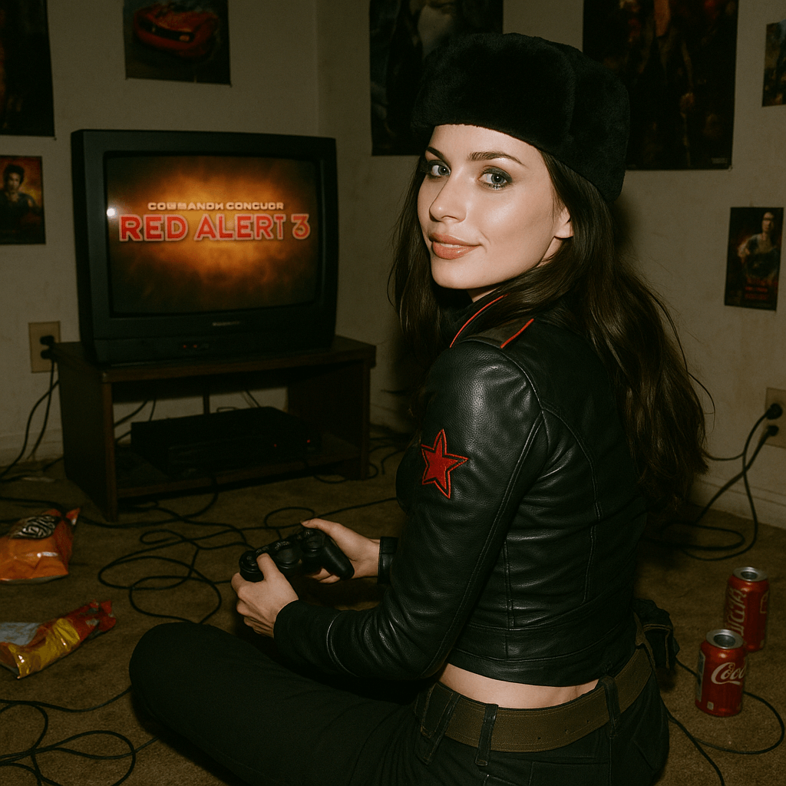<br>
<sub>Image © 2025 <a href="https://github.com/jamez-bondos">@jamez-bondos</a>, <a href="https://creativecommons.org/licenses/by/4.0/">CC BY 4.0</a> • Prompt by <a href="https://x.com/ZHO_ZHO_ZHO">@ZHO_ZHO_ZHO</a></sub>

**Prompt**

```
Ultra-realistic 3D rendered image that replicates the character design of Natasha from Command & Conquer: Red Alert 3 in 2008, following the original model exactly. The scene is set in a dim and cluttered bedroom from the year 2008. The character is sitting on the carpet, facing an old-fashioned television that is playing Command & Conquer: Red Alert 3 and a game console controller.
The entire room is filled with a nostalgic atmosphere of the year 2008: snack packaging bags, soda cans, posters, and tangled wires are everywhere. Natasha Volkova is captured in the moment of turning her head, looking back at the camera over her shoulder. There is an innocent smile on her iconic ethereally beautiful face. Her upper body is slightly twisted, with a natural dynamic, as if she is reacting to being startled by the flash.
The flash slightly overexposes her face and clothes, making her silhouette stand out more prominently in the dimly lit room. The whole photo appears raw and natural. The strong contrast between light and dark casts deep shadows behind her. The image is full of tactile feel, with a simulated texture that resembles an authentic film snapshot from 2008.
```


**Submitter:** [wowmarcomei](https://github.com/wowmarcomei)

---

[⬆️ Back to Cases Directory](#cases-toc)

<a id="cases-66"></a>
### Case 66: Creative Silk Universe (by [@ZHO_ZHO_ZHO](https://x.com/ZHO_ZHO_ZHO))

[Source Link](https://x.com/ZHO_ZHO_ZHO/status/1914864217867608175)

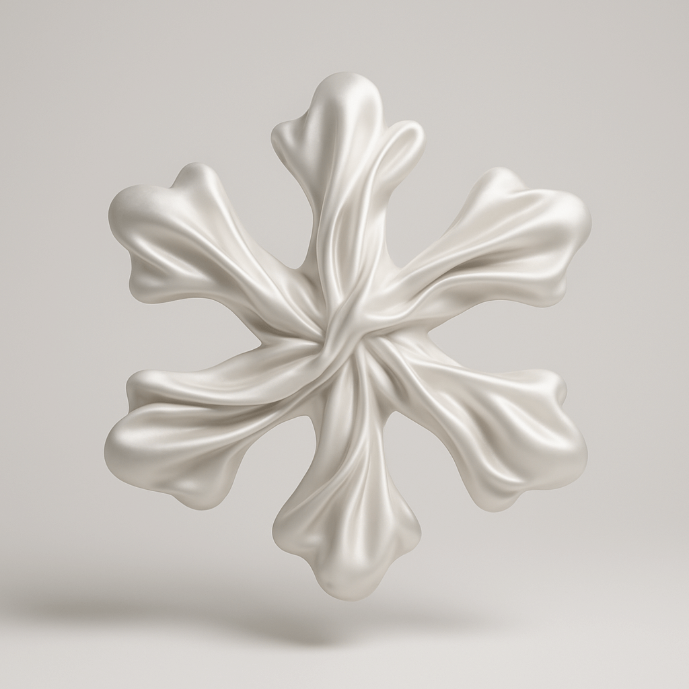<br>
<sub>Image © 2025 <a href="https://github.com/jamez-bondos">@jamez-bondos</a>, <a href="https://creativecommons.org/licenses/by/4.0/">CC BY 4.0</a> • Prompt by <a href="https://x.com/ZHO_ZHO_ZHO">@ZHO_ZHO_ZHO</a></sub>

**Prompt**

```
Transform the {❄️} into a soft 3D object with a silk texture. The entire surface of the object is wrapped in smooth and flowing silk fabric, featuring surreal wrinkle details, soft highlights, and shadows. The object gently floats in the center of a clean light gray background, creating a light and elegant atmosphere. The overall style is surreal, tactile, and modern, conveying a sense of comfort and refined playfulness. Studio lighting, high-resolution rendering.
```

*Note: You can replace the {❄️} in the prompt words with your target value*


**Submitter:** [wowmarcomei](https://github.com/wowmarcomei)

---

[⬆️ Back to Cases Directory](#cases-toc)

<a id="cases-65"></a>
### Case 65: Surreal Underwater Scene Popsicle (by [@madpencil_](https://x.com/madpencil_))

[Source Link](https://x.com/madpencil_/status/1920037538372128998)

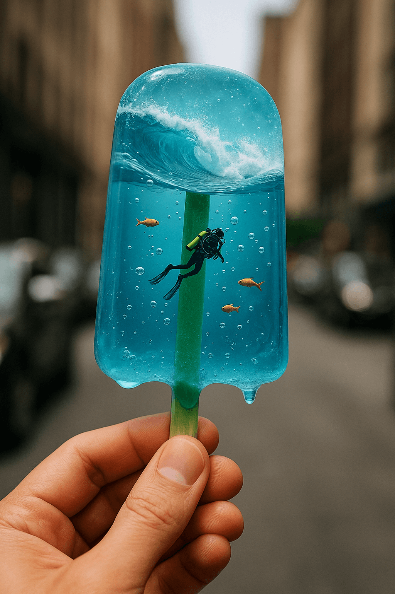<br>
<sub>Image © 2025 <a href="https://github.com/jamez-bondos">@jamez-bondos</a>, <a href="https://creativecommons.org/licenses/by/4.0/">CC BY 4.0</a> • Prompt by <a href="https://x.com/madpencil_">@madpencil_</a></sub>

**Prompt**

```
Tilt POV shot of a hand holding a surreal popsicle with a transparent blue exterior, revealing an underwater scene inside: a tiny scuba diver with tiny fish floating with bubbles, ocean waves crashing, and a green popsicle stick running through the center. The popsicle is melting slightly, with a wooden stick at the bottom, hand is holding it by the wooden stick, soft focus new york street background, premium product photography
```


---

[⬆️ Back to Cases Directory](#cases-toc)

<a id="cases-64"></a>
### Case 64: Steampunk Mechanical Fish (by [@f-is-h](https://github.com/f-is-h))

[Source Link](https://github.com/f-is-h/f-is-h/blob/main/images/streampank-fish-4.png)

<br>
<sub>Image © 2025 <a href="https://github.com/f-is-h">@f-is-h</a>, <a href="https://creativecommons.org/licenses/by/4.0/">CC BY 4.0</a> • Prompt by <a href="https://github.com/f-is-h">@f-is-h</a></sub>

**Prompt**

```
A steampunk-style mechanical fish with a brass body and clearly visible gear mechanisms when in motion.
Its mechanical teeth can be slightly seen, neatly arranged and closed, with both upper and lower teeth visible. Each tooth is triangular in shape and made of diamond material.
The tail fin has a metal wire mesh structure, while other fins are made of semi-transparent amber-colored glass with some subtle bubbles inside.
The eyes are multi-faceted rubies, with clearly visible reflective shine.
The fish has "f-is-h" text clearly visible on its body, with all lowercase letters and careful attention to the hyphen placement.
The image is square, showing the entire fish in the center of the frame, with its head pointing to the right. There is adequate white space around the fish, with more space on the left and right sides. The background has subtle steampunk-style gear patterns.
The entire fish looks very cool. This is a high-definition image with extremely rich details and unique texture and aesthetics. The image should not be too dark.
```

*Note: This image showcases an excellent combination of steampunk style and metallic textures, presenting intricate mechanical details and a retro-futuristic aesthetic.*


**Submitter:** [f-is-h](https://github.com/f-is-h)

---

[⬆️ Back to Cases Directory](#cases-toc)

<a id="cases-63"></a>
### Case 63: Emoji Cream Popsicle (by [@ZHO_ZHO_ZHO](https://x.com/ZHO_ZHO_ZHO))

[Source Link](https://x.com/ZHO_ZHO_ZHO/status/1914574278911000967)

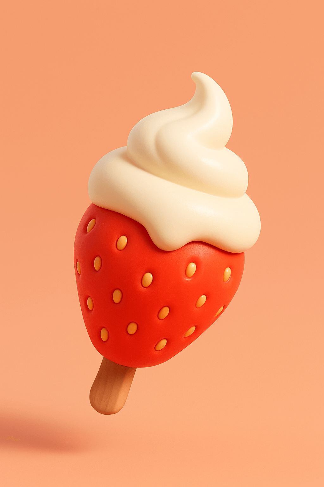<br>
<sub>Image © 2025 <a href="https://github.com/jamez-bondos">@jamez-bondos</a>, <a href="https://creativecommons.org/licenses/by/4.0/">CC BY 4.0</a> • Prompt by <a href="https://x.com/ZHO_ZHO_ZHO">@ZHO_ZHO_ZHO</a></sub>

**Prompt**

```
Generate an image: Transform the [🍓] into a creamy ice cream bar, with cream flowing in curved swirls on top, making it look delicious and tempting. The ice cream is floating at a 45-degree angle in mid-air, rendered in a cute chibi-style 3D aesthetic, set against a solid color background with a unified color palette.
```

*Note: The 【🍓】 emoji in the prompt can be replaced with other emojis.*


---

[⬆️ Back to Cases Directory](#cases-toc)

<a id="cases-62"></a>
### Case 62: Kawaii Enamel Pin (by [@gnrlyxyz](https://x.com/gnrlyxyz))

[Source Link](https://x.com/gnrlyxyz/status/1914303110853583302)

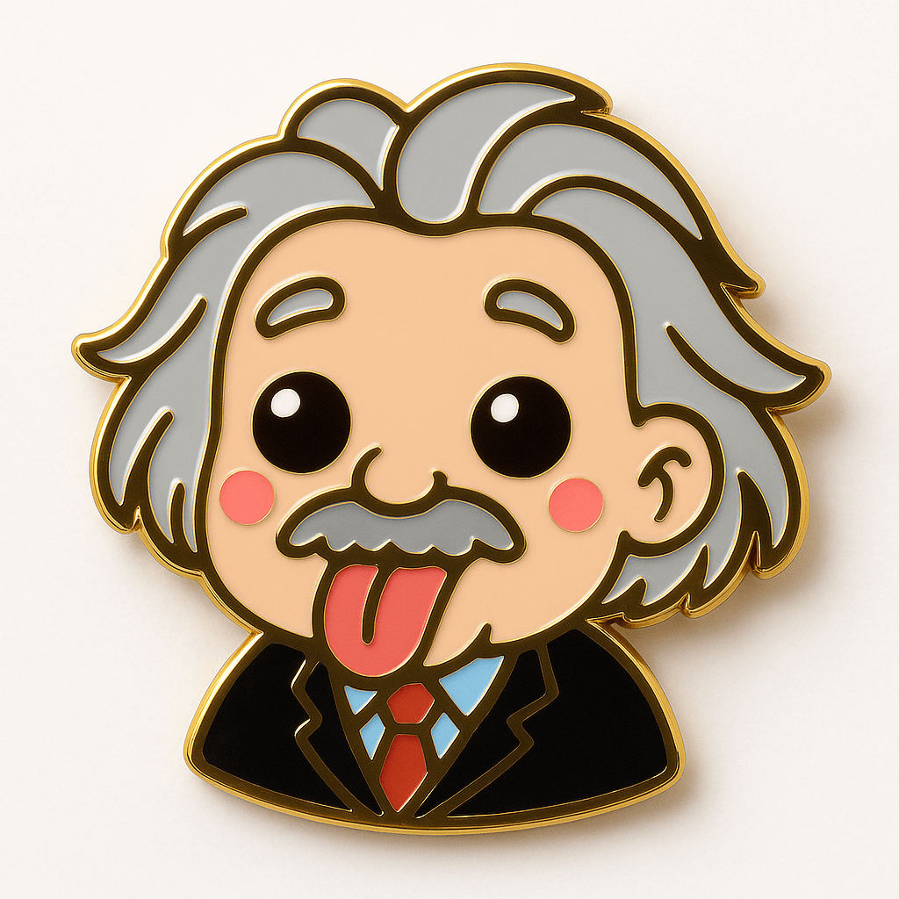<br>
<sub>Image © 2025 <a href="https://github.com/jamez-bondos">@jamez-bondos</a>, <a href="https://creativecommons.org/licenses/by/4.0/">CC BY 4.0</a> • Prompt by <a href="https://x.com/gnrlyxyz">@gnrlyxyz</a></sub>

**Prompt**

```
Turn the subject in the attached image into a kawaii enamel pin. Use glossy metal outlines and vibrant enamel fill. No extra added features. Square mockup format. White background.
```


**Reference Image Required:** Needs a photo of a person or object as the subject for transformation.

**Submitter:** [StevenSong-sTs](https://github.com/StevenSong-sTs)

---

[⬆️ Back to Cases Directory](#cases-toc)

<a id="cases-61"></a>
### Case 61: Fake Tweet Screenshot (Einstein) (by [@egeberkina](https://x.com/egeberkina))

[Source Link](https://x.com/egeberkina/status/1914299716394778713)

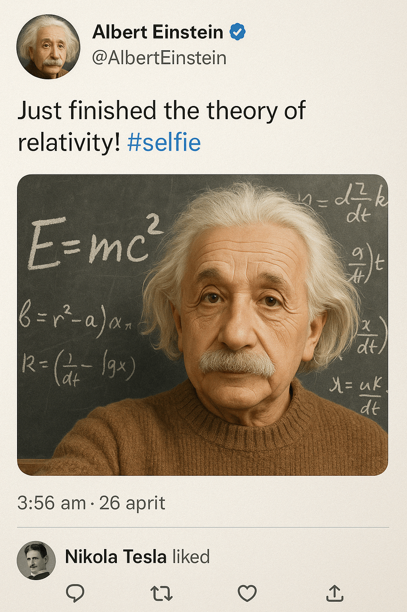<br>
<sub>Image © 2025 <a href="https://github.com/jamez-bondos">@jamez-bondos</a>, <a href="https://creativecommons.org/licenses/by/4.0/">CC BY 4.0</a> • Prompt by <a href="https://x.com/egeberkina">@egeberkina</a></sub>

**Prompt**

```
a hyper realistic twitter post by Albert Einstein right after finishing the theory of relativity. include a selfie where you can clearly see scribbled equations and a chalkboard in the background. have it visible that the post was liked by Nikola Tesla
```


---

[⬆️ Back to Cases Directory](#cases-toc)

<a id="cases-60"></a>
### Case 60: Emoji Tufted Rug (by [@gizakdag](https://x.com/gizakdag))

[Source Link](https://x.com/gizakdag/status/1913925062568144924)

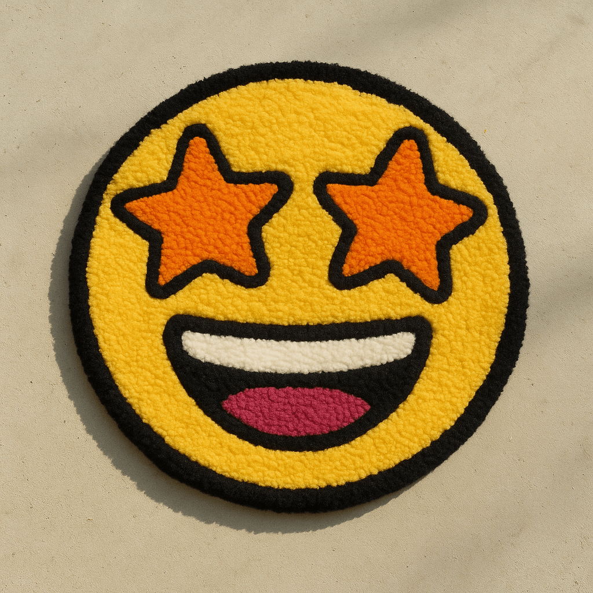<br>
<sub>Image © 2025 <a href="https://github.com/jamez-bondos">@jamez-bondos</a>, <a href="https://creativecommons.org/licenses/by/4.0/">CC BY 4.0</a> • Prompt by <a href="https://x.com/gizakdag">@gizakdag</a></sub>

**Prompt**

```
Create an image of a colorful, hand-tufted rug in the shape of 🦖 emoji, placed on a simple floor background. The rug has a bold, playful design with soft, fluffy texture and thick yarn details. Shot from above, in natural daylight, with a slightly quirky, DIY aesthetic. Vibrant colors, cartoonish outlines, and tactile, cozy material—similar to handmade tufted art rugs.
```

*Note: The 🦖 emoji in the prompt can be replaced with other emojis.*


---

[⬆️ Back to Cases Directory](#cases-toc)

<a id="cases-59"></a>
### Case 59: Colorful Vector Art Poster (by [@michaelrabone](https://x.com/michaelrabone))

[Source Link](https://x.com/michaelrabone/status/1913865394139316291)

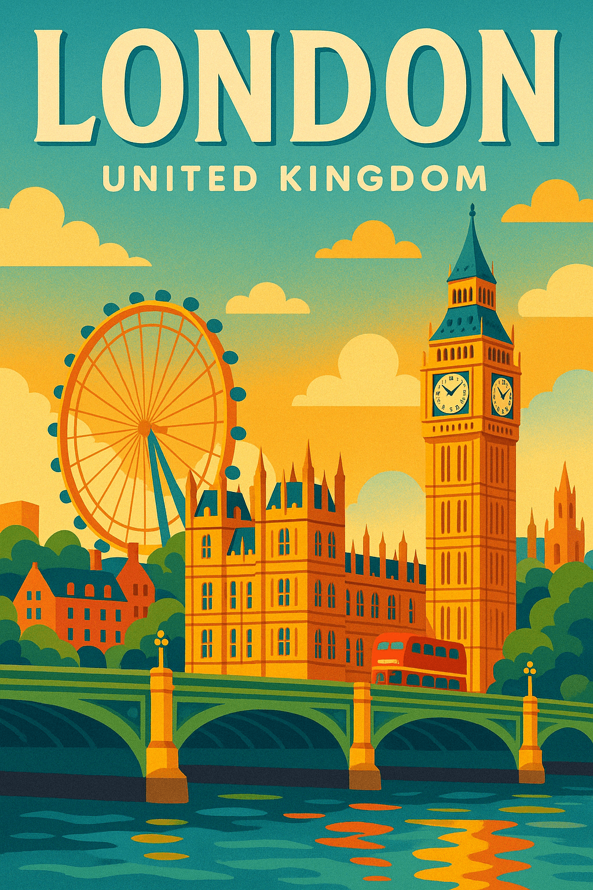<br>
<sub>Image © 2025 <a href="https://github.com/jamez-bondos">@jamez-bondos</a>, <a href="https://creativecommons.org/licenses/by/4.0/">CC BY 4.0</a> • Prompt by <a href="https://x.com/michaelrabone">@michaelrabone</a></sub>

**Prompt**

```
Barcelona Spain colourful summer vector art poster with big "BARCELONA" title at the top and smaller "SPAIN" title under
```

*Note: Replace the city and country names in the prompt (e.g., replace "Barcelona Spain" and the titles with "London United Kingdom" to generate the example image). This style prompt also works for food, movies, music, etc.*


---

[⬆️ Back to Cases Directory](#cases-toc)

<a id="cases-58"></a>
### Case 58: Cloud Art (by [@umesh_ai](https://x.com/umesh_ai))

[Source Link](https://x.com/umesh_ai/status/1913628737872027805)

<br>
<sub>Image © 2025 <a href="https://github.com/jamez-bondos">@jamez-bondos</a>, <a href="https://creativecommons.org/licenses/by/4.0/">CC BY 4.0</a> • Prompt by <a href="https://x.com/umesh_ai">@umesh_ai</a></sub>

**Prompt**

```
Generate image: A photograph captures a daytime scene with a [SUBJECT/OBJECT] formed by scattered clouds in the sky, positioned above a [LOCATION]
```

*Note: The `[SUBJECT/OBJECT]` (shape formed by clouds) and `[LOCATION]` placeholders in the prompt can be replaced. The example image uses 'chinese dragon' as the subject and 'The Great Wall' as the location.*


---

[⬆️ Back to Cases Directory](#cases-toc)

<a id="cases-57"></a>
### Case 57: 8-Bit Pixel Icon (by [@egeberkina](https://x.com/egeberkina))

[Source Link](https://x.com/egeberkina/status/1913654508330058064)

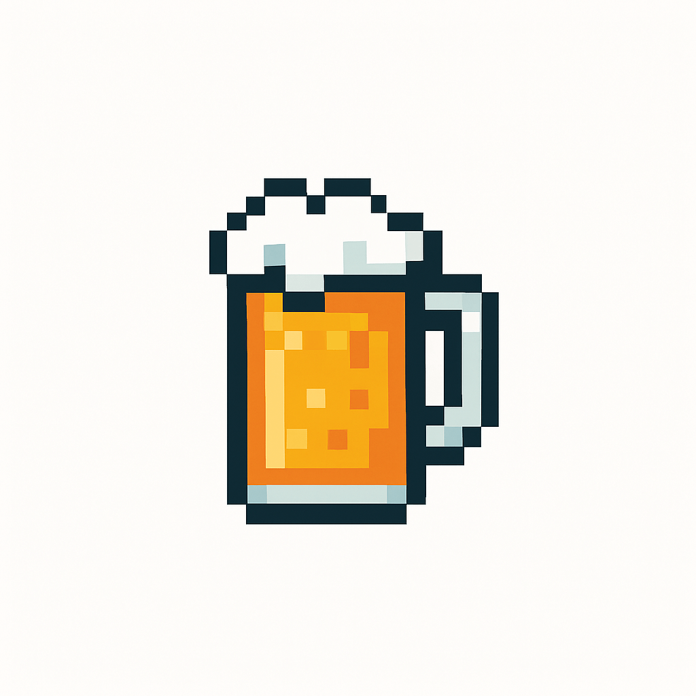<br>
<sub>Image © 2025 <a href="https://github.com/jamez-bondos">@jamez-bondos</a>, <a href="https://creativecommons.org/licenses/by/4.0/">CC BY 4.0</a> • Prompt by <a href="https://x.com/egeberkina">@egeberkina</a></sub>

**Prompt**

```
Create a minimalist 8-bit pixel logo of [🍔], centered on a pure white background. Use a limited retro color palette with pixelated detailing, sharp edges, and clean blocky forms. The logo should be simple, iconic, and clearly recognizable in pixel art style — inspired by classic arcade game aesthetics.
```

*Note: The `[🍔]` emoji in the prompt can be replaced with other emojis or subjects.*


---

[⬆️ Back to Cases Directory](#cases-toc)

<a id="cases-56"></a>
### Case 56: Miniature 3D Building (by [@dotey](https://x.com/dotey))

[Source Link](https://x.com/dotey/status/1913759515700285569)

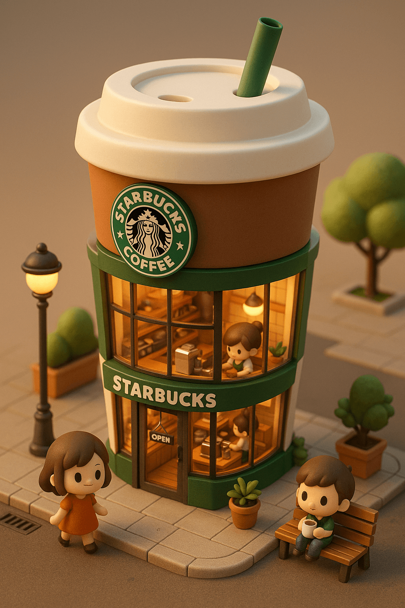<br>
<sub>Image © 2025 <a href="https://github.com/jamez-bondos">@jamez-bondos</a>, <a href="https://creativecommons.org/licenses/by/4.0/">CC BY 4.0</a> • Prompt by <a href="https://x.com/dotey">@dotey</a></sub>

**Prompt**

```
3D chibi-style miniature design of a whimsical Starbucks café, shaped like an oversized takeaway coffee cup complete with a lid and straw. The building has two floors, with large glass windows that clearly reveal a cozy and refined interior: wooden furniture, warm lighting, and busy baristas at work. On the street, cute little figurines are strolling or sitting, surrounded by benches, street lamps, and potted plants, creating a charming corner of the city. The overall aesthetic follows a detailed and realistic miniature cityscape style, with soft lighting that evokes a relaxing afternoon atmosphere.
```

*Note: You can ask the AI to generate similar prompts for other buildings by referencing the prompt above. For example: "Referencing the prompt above, write a similar prompt for [Dunkin' Donuts], shaped like a [donut]".*


---

[⬆️ Back to Cases Directory](#cases-toc)

<a id="cases-55"></a>
### Case 55: Cute Plant Planter (by [@azed_ai](https://x.com/azed_ai))

[Source Link](https://x.com/azed_ai/status/1923739813414568075)

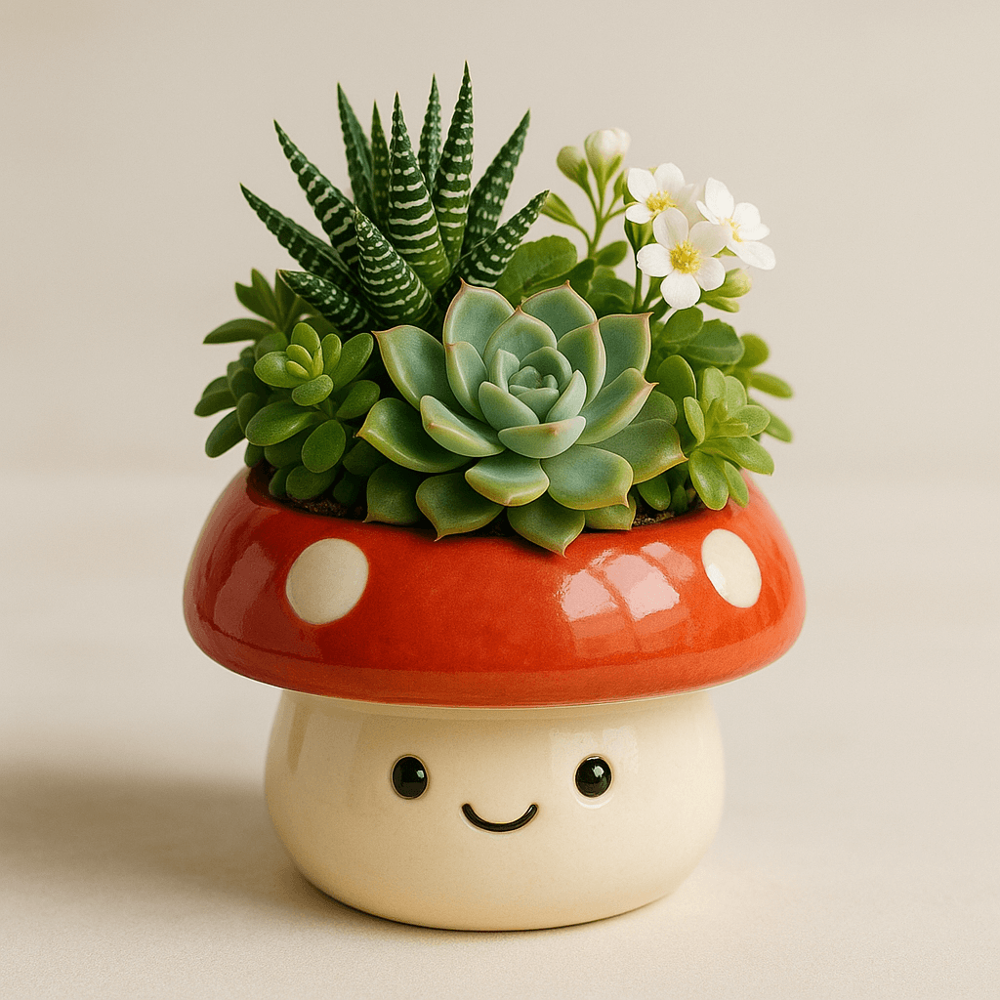<br>
<sub>Image © 2025 <a href="https://github.com/jamez-bondos">@jamez-bondos</a>, <a href="https://creativecommons.org/licenses/by/4.0/">CC BY 4.0</a> • Prompt by <a href="https://x.com/azed_ai">@azed_ai</a></sub>

**Prompt**

```
A high-quality photo of a cute ceramic [object/animal]-shaped planter with a glossy finish, filled with a variety of vibrant succulents and greenery including a spiky Haworthia, a rosette-shaped Echeveria, and delicate white flowers. The planter has a friendly face and sits on a soft, neutral background with diffused natural lighting, showcasing fine textures and color contrast in a clean, minimalistic composition
```

*Note: Replace [object/animal] in the prompt with a specific object, animal name, or emoji.*


---

[⬆️ Back to Cases Directory](#cases-toc)

<a id="cases-54"></a>
### Case 54: Extremely Ordinary iPhone Selfie (by [@jiamimaodashu](https://x.com/jiamimaodashu))

[Source Link](https://x.com/jiamimaodashu/status/1912653073190879410)

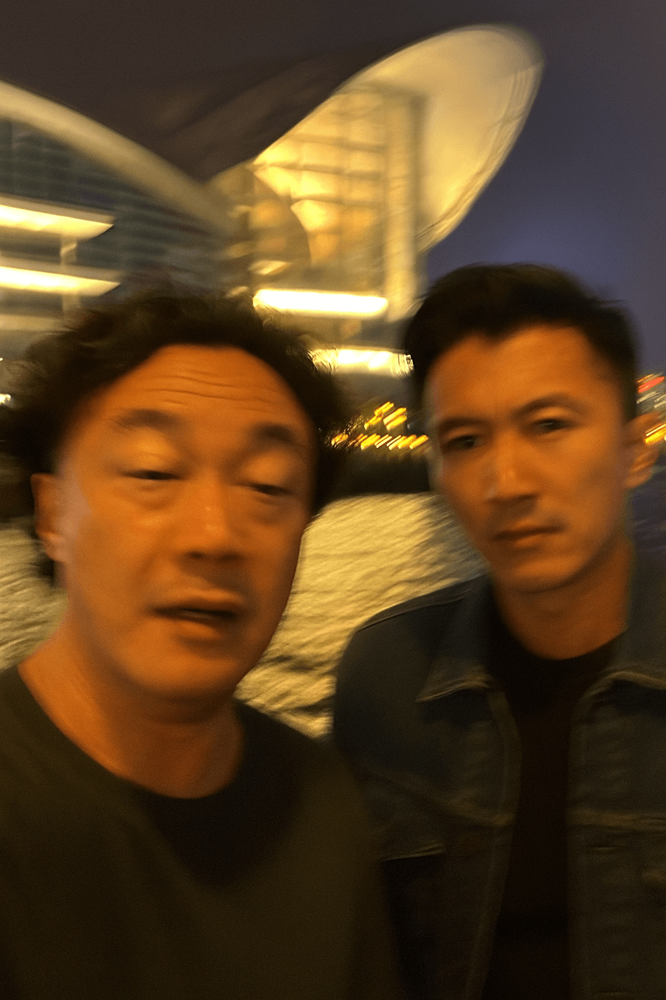<br>
<sub>Image © 2025 <a href="https://github.com/jamez-bondos">@jamez-bondos</a>, <a href="https://creativecommons.org/licenses/by/4.0/">CC BY 4.0</a> • Prompt by <a href="https://x.com/jiamimaodashu">@jiamimaodashu</a></sub>

**Prompt**

```
Please draw an extremely ordinary and unremarkable iPhone selfie, with no clear subject or sense of composition — just like a random snapshot taken casually. The photo should include slight motion blur, with uneven lighting caused by sunlight or indoor lights resulting in mild overexposure. The angle is awkward, the composition is messy, and the overall aesthetic is deliberately plain — as if it was accidentally taken while pulling the phone out of a pocket.
The subjects are Eason Chan and Nicholas Tse, taken at night, next to the Hong Kong Convention and Exhibition Centre, by Victoria Harbour in Hong Kong.
```

*Note: This prompt aims to generate a photo that looks very casual, even slightly like an accidental snapshot.*


---

[⬆️ Back to Cases Directory](#cases-toc)

<a id="cases-53"></a>
### Case 53: Emoji Inflatable Cushion (by [@gizakdag](https://x.com/gizakdag))

[Source Link](https://x.com/gizakdag/status/1912858535643197927)

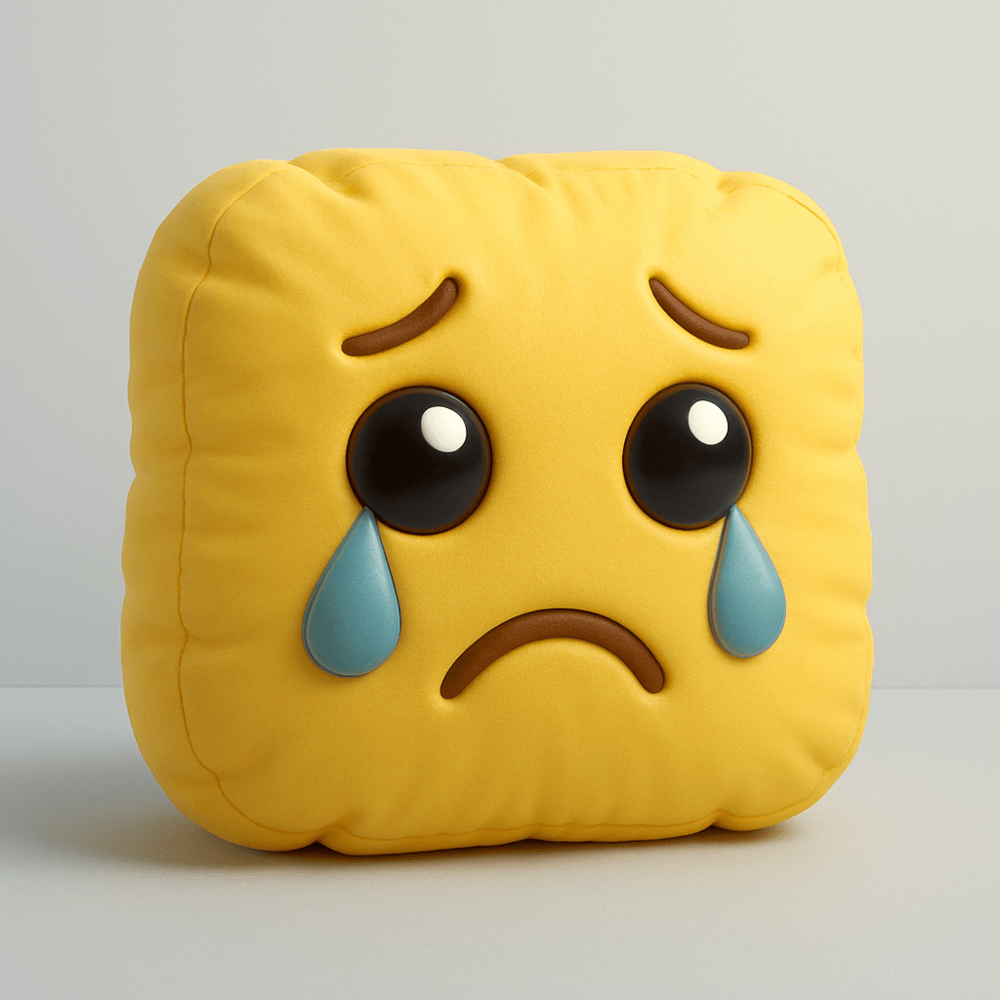<br>
<sub>Image © 2025 <a href="https://github.com/jamez-bondos">@jamez-bondos</a>, <a href="https://creativecommons.org/licenses/by/4.0/">CC BY 4.0</a> • Prompt by <a href="https://x.com/gizakdag">@gizakdag</a></sub>

**Prompt**

```
Create a high-resolution 3D render of [🥹] designed as an inflatable, puffy object. The shape should appear soft, rounded, and air-filled — like a plush balloon or blow-up toy. Use a smooth, matte texture with subtle fabric creases and stitching to emphasize the inflatable look. The form should be slightly irregular and squishy, with gentle shadows and soft lighting that highlight volume and realism. Place it on a clean, minimal background (light gray or pale blue), and maintain a playful, sculptural aesthetic.
```

*Note: The [🥹] emoji in the prompt can be replaced with other emojis.*


---

[⬆️ Back to Cases Directory](#cases-toc)

<a id="cases-52"></a>
### Case 52: Paper Craft Style Emoji Icon (by [@egeberkina](https://x.com/egeberkina))

[Source Link](https://x.com/egeberkina/status/1912521263085482464)

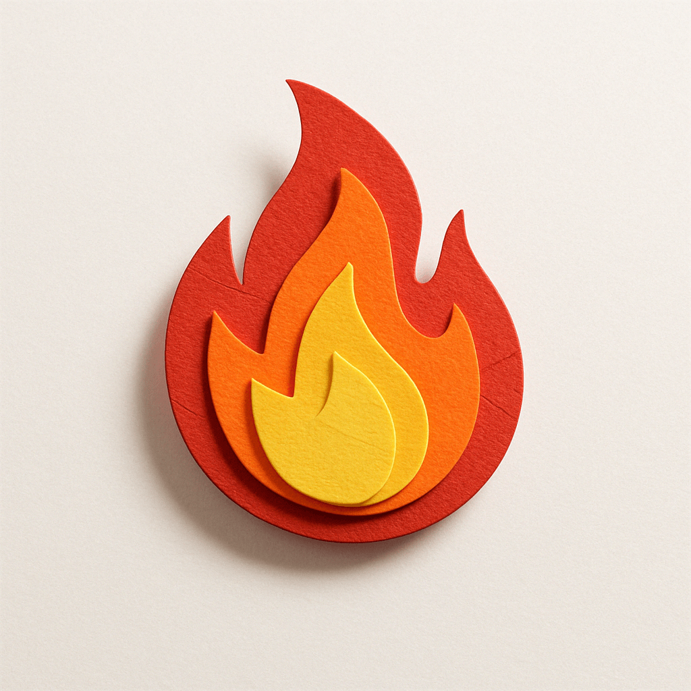<br>
<sub>Image © 2025 <a href="https://github.com/jamez-bondos">@jamez-bondos</a>, <a href="https://creativecommons.org/licenses/by/4.0/">CC BY 4.0</a> • Prompt by <a href="https://x.com/egeberkina">@egeberkina</a></sub>

**Prompt**

```
A paper craft-style "🔥" floating on a pure white background. The emoji is handcrafted from colorful cut paper with visible textures, creases, and layered shapes. It casts a soft drop shadow beneath, giving a sense of lightness and depth. The design is minimal, playful, and clean — centered in the frame with lots of negative space. Use soft studio lighting to highlight the paper texture and edges.
```

*Note: The "🔥" emoji in the prompt can be replaced with other emojis.*


---

[⬆️ Back to Cases Directory](#cases-toc)

<a id="cases-51"></a>
### Case 51: Passport Entry Stamp (by [@M_w14_](https://x.com/M_w14_))

[Source Link1](https://x.com/M_w14_/status/1912146666410459618) | [Source Link2](https://x.com/ZHO_ZHO_ZHO/status/1912188562944250035)

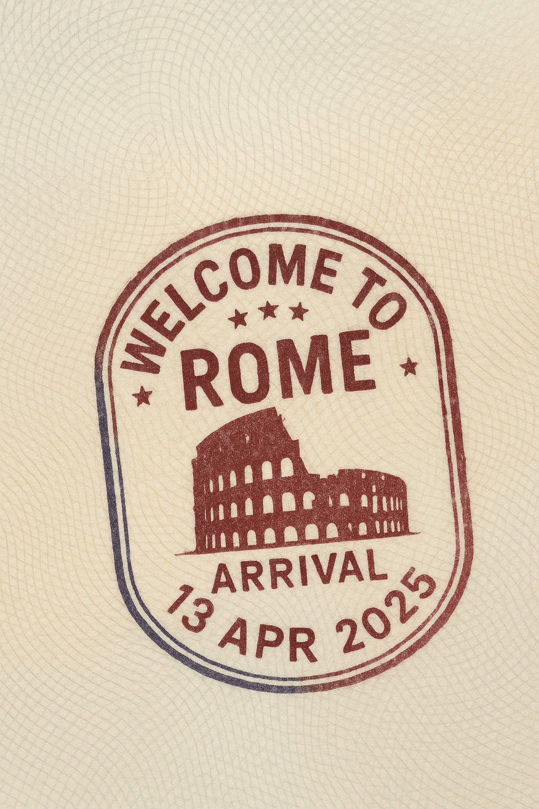<br>
<sub>Image © 2025 <a href="https://github.com/jamez-bondos">@jamez-bondos</a>, <a href="https://creativecommons.org/licenses/by/4.0/">CC BY 4.0</a> • Prompt by <a href="https://x.com/M_w14_">@M_w14_</a></sub>

**Prompt**

```
Create a realistic passport page with an entry stamp for [{City}, {Country}]. The stamp should say "Welcome to {City}" in bold English, designed in a round or oval shape with decorative borders. Include the word "ARRIVAL" and a fictional date like "15 APR 2025" Incorporate a subtle silhouette of {Main Landmark} as a background detail within the stamp. Use deep blue or red ink with light smudges for added realism. The stamp should appear slightly angled, as if hand-pressed. The passport page should show visible paper texture and security patterns.
```

*Note: You can replace the city, country, landmark, and date placeholders. The example image uses "Rome", "Italy", "Colosseum", and "13 APR 2025" (date differs slightly from the base prompt structure). Prompt by [@M_w14_](https://x.com/M_w14_)*


---

[⬆️ Back to Cases Directory](#cases-toc)

<a id="cases-50"></a>
### Case 50: Physical Destruction Effect Card (Lara Croft) (by [@op7418](https://x.com/op7418))

[Source Link1](https://x.com/op7418/status/1912782048160542886) | [Source Link2](https://x.com/hc_dsn/status/1912367201476309396)

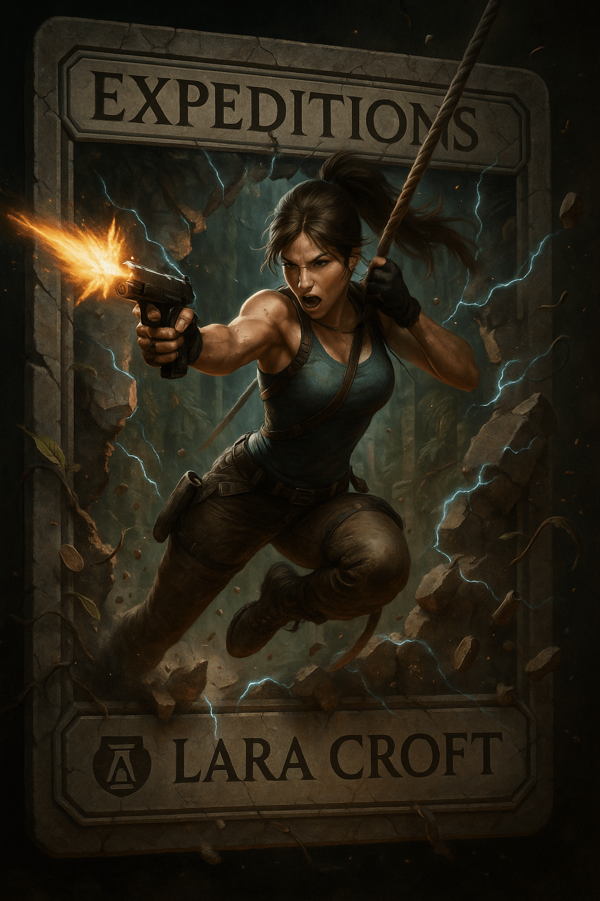<br>
<sub>Image © 2025 <a href="https://github.com/jamez-bondos">@jamez-bondos</a>, <a href="https://creativecommons.org/licenses/by/4.0/">CC BY 4.0</a> • Prompt by <a href="https://x.com/op7418">@op7418</a></sub>

**Prompt**

```
An ultra-photorealistic, cinematic-style illustration depicting Lara Croft dynamically bursting through the frame of an “Archaeological Adventure” trading card. She is caught mid-jump or swinging on a rope, wearing her iconic adventurer outfit and possibly firing dual pistols. The muzzle flashes help shatter the card’s ancient stone-carved border, creating a visible dimensional rupture with energy cracks and spatial distortions, scattering dust and debris outward.

Her body lunges forward with powerful momentum, breaking through the card’s flat plane, emphasizing strong motion depth. Inside the card (the background) is a depiction of dense jungle ruins or a trap-filled ancient tomb. The shattered card fragments mix with crumbling stone, flying vines, broken ancient coins, and spent shell casings.

The title “Archaeological Adventure” and the name “Lara Croft” (accompanied by a stylized artifact icon) remain visible on the remaining cracked and weathered parts of the card. The scene is lit with adventurous, dynamic lighting that emphasizes her agility and the perilous environment.
```

*Note: The original tweet mentioned key terms are "dimensional break effects" and "motion depth". The prompt above is a reconstruction based on the description.*


---

[⬆️ Back to Cases Directory](#cases-toc)

<a id="cases-49"></a>
### Case 49: Fashion Magazine Cover Style (by [@dotey](https://x.com/dotey))

[Source Link](https://x.com/dotey/status/1912536019905233194)

<br>
<sub>Image © 2025 <a href="https://github.com/jamez-bondos">@jamez-bondos</a>, <a href="https://creativecommons.org/licenses/by/4.0/">CC BY 4.0</a> • Prompt by <a href="https://x.com/dotey">@dotey</a></sub>

**Prompt**

```
A beautiful woman wearing a pink qipao, adorned with delicate floral accessories on her head and colorful blossoms woven into her hair. Around her neck is an elegant white lace collar. One of her hands gently holds several large butterflies. The overall photography style features high-definition detail and texture, resembling a fashion magazine cover. The word “FASHION DESIGN” is placed at the top center of the image. The background is a minimalist light gray, designed to highlight the subject.
```


---

[⬆️ Back to Cases Directory](#cases-toc)

<a id="cases-48"></a>
### Case 48: Voxel Style 3D Icon Conversion (by [@BrettFromDJ](https://x.com/BrettFromDJ))

[Source Link1](https://x.com/BrettFromDJ/status/1910387413404234076) | [Source Link2](https://x.com/ZHO_ZHO_ZHO/status/1910671581962985788)

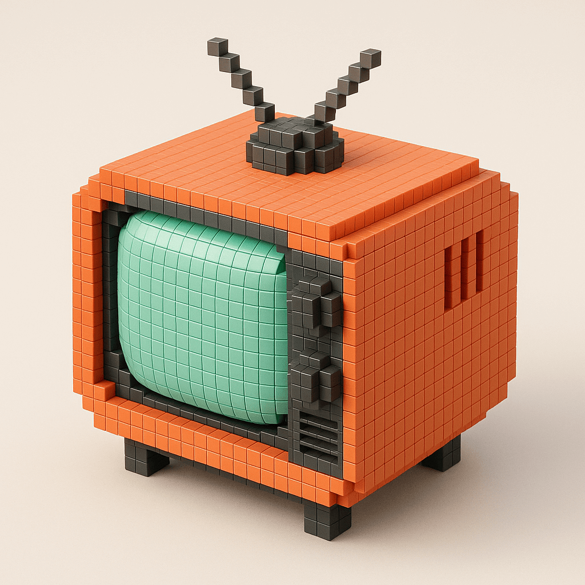<br>
<sub>Image © 2025 <a href="https://github.com/jamez-bondos">@jamez-bondos</a>, <a href="https://creativecommons.org/licenses/by/4.0/">CC BY 4.0</a> • Prompt by <a href="https://x.com/BrettFromDJ">@BrettFromDJ</a></sub>

**Prompt**

```
Take the icon on the right and transform it into a voxel 3d icon like the icons in the left image. Octane render. 8k.
```

*Note: The tweet author provides a reference image for best results, recommend downloading and using it. When uploading, upload the reference image first, then the icon to be converted.*

**Reference Image Required:** The reference image for voxel style icons is obtained from the original link 1; and an original icon to be transformed.


---

[⬆️ Back to Cases Directory](#cases-toc)

<a id="cases-47"></a>
### Case 47: ESC Keycap Miniature Diorama (by [@egeberkina](https://x.com/egeberkina))

[Source Link](https://x.com/egeberkina/status/1911368319212408926)

<br>
<sub>Image © 2025 <a href="https://github.com/jamez-bondos">@jamez-bondos</a>, <a href="https://creativecommons.org/licenses/by/4.0/">CC BY 4.0</a> • Prompt by <a href="https://x.com/egeberkina">@egeberkina</a></sub>

**Prompt**

```
A hyper-realistic isometric 3D render of a miniature computer setup inside a translucent mechanical keyboard keycap, specifically placed on the ESC key of a real matte-finished mechanical keyboard. Inside the keycap, a tiny figure sits in a modern ergonomic chair, wearing a cozy textured hoodie, working at a glowing ultra-realistic computer screen. The environment is packed with lifelike miniature tech accessories: real-material desk lamps, monitors with reflections, tiny speaker grills, tangled cables, and ceramic mugs. The base of the scene is made of soil, rocks, and moss, with photorealistic textures and imperfections. The lighting inside the cap mimics natural morning sun, casting soft shadows and warm tones, while the outside has cold ambient reflections from the surrounding keyboard. The word “ESC” is subtly etched onto the top of the translucent keycap with a faint frosted glass effect — just barely visible depending on the angle. The surrounding keyboard keys like F1, Q, Shift, and CTRL are crisp, textured, and photorealistically lit. Shot as if taken with a high-end mobile phone camera, with shallow depth of field, perfect white balance, and cinematic detail.
```


---

[⬆️ Back to Cases Directory](#cases-toc)

<a id="cases-46"></a>
### Case 46: Happy Capsule Creation (by [@ZHO_ZHO_ZHO](https://x.com/ZHO_ZHO_ZHO))

[Source Link](https://x.com/ZHO_ZHO_ZHO/status/1911724629460455896)

<br>
<sub>Image © 2025 <a href="https://github.com/jamez-bondos">@jamez-bondos</a>, <a href="https://creativecommons.org/licenses/by/4.0/">CC BY 4.0</a> • Prompt by <a href="https://x.com/ZHO_ZHO_ZHO">@ZHO_ZHO_ZHO</a></sub>

**Prompt**

```
Title (large text): Fast-Acting Happiness Capsule
A capsule pill with a green top in Starbucks green and a transparent bottom, printed with the Starbucks logo. Inside the capsule are numerous coffee beans.
Description (small text): Take when feeling sad or down. Three times a day, two capsules per dose.
Buy button: Same color as the capsule.
Below the button, display the price: $9.
Please follow medical advice and purchase as needed.
```


---

[⬆️ Back to Cases Directory](#cases-toc)

<a id="cases-45"></a>
### Case 45: 3D Chibi-style University Anthropomorphic Mascot (by [@dotey](https://x.com/dotey))

[Source Link](https://x.com/dotey/status/1911988003729203648)

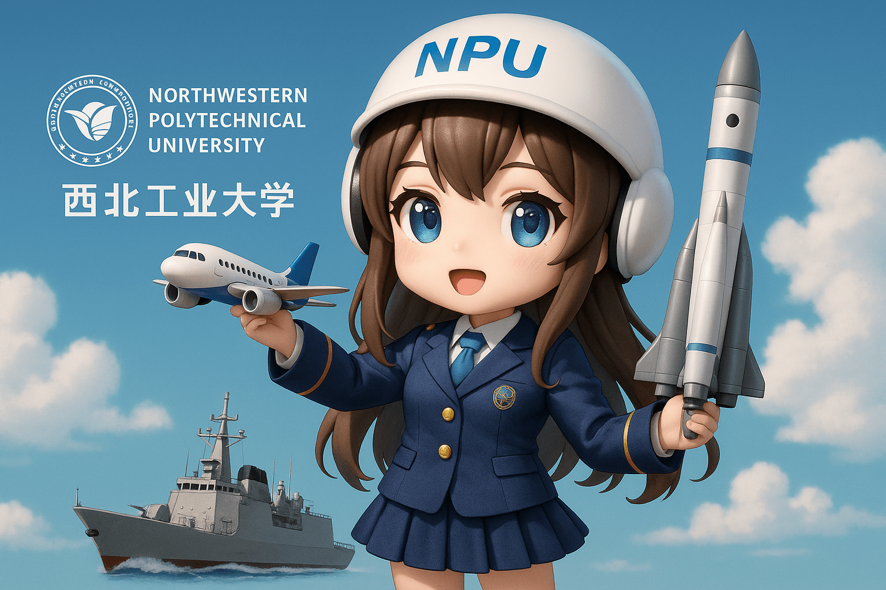<br>
<sub>Image © 2025 <a href="https://github.com/jamez-bondos">@jamez-bondos</a>, <a href="https://creativecommons.org/licenses/by/4.0/">CC BY 4.0</a> • Prompt by <a href="https://x.com/dotey">@dotey</a></sub>

**Prompt**

```
Create a personified 3D chibi-style anime girl character representing {Northwestern Polytechnical University}, embodying the school’s distinctive strengths in {aeronautics, astronautics, and marine engineering}.
```

*Note: Replace the university name {Northwestern Polytechnical University} and characteristic description {Aeronautics, Astronautics, and Marine Technology - "Three Ais"} within the square brackets to generate anthropomorphic mascots for different universities.*


---

[⬆️ Back to Cases Directory](#cases-toc)

<a id="cases-44"></a>
### Case 44: RPG-Style Character Card Creation (by [@berryxia_ai](https://x.com/berryxia_ai))

[Source Link](https://x.com/berryxia_ai/status/1911334046724165905)

<br>
<sub>Image © 2025 <a href="https://github.com/jamez-bondos">@jamez-bondos</a>, <a href="https://creativecommons.org/licenses/by/4.0/">CC BY 4.0</a> • Prompt by <a href="https://x.com/berryxia_ai">@berryxia_ai</a></sub>

**Prompt**

```
Create a digital character card in RPG collectible style.
The subject is a {Programmer}, standing confidently with tools or symbols relevant to their job.
Render it in 3D cartoon style, soft lighting, vivid personality.
Include skill bars or stats like [Skill1 +x], [Skill2 +x, e.g., Creativity +10, UI/UX +8].
Add a title banner on top and a nameplate on the bottom.
Frame the card with clean edges like a real figure box.
Make the background fit the profession's theme.
Colors: warm highlights, profession-matching hues.
```

*Note: Replace the {Programmer} placeholder in the prompt with specifics like "Designer", "Doctor", etc.*

**Reference Image Required:** Optional. Can be generated based on profession/role description or use an uploaded photo as reference.


---

[⬆️ Back to Cases Directory](#cases-toc)

<a id="cases-43"></a>
### Case 43: Cute Chibi Matryoshka Dolls (Girl with a Pearl Earring) (by [@ZHO_ZHO_ZHO](https://x.com/ZHO_ZHO_ZHO))

[Source Link](https://x.com/ZHO_ZHO_ZHO/status/1911669883315818497)

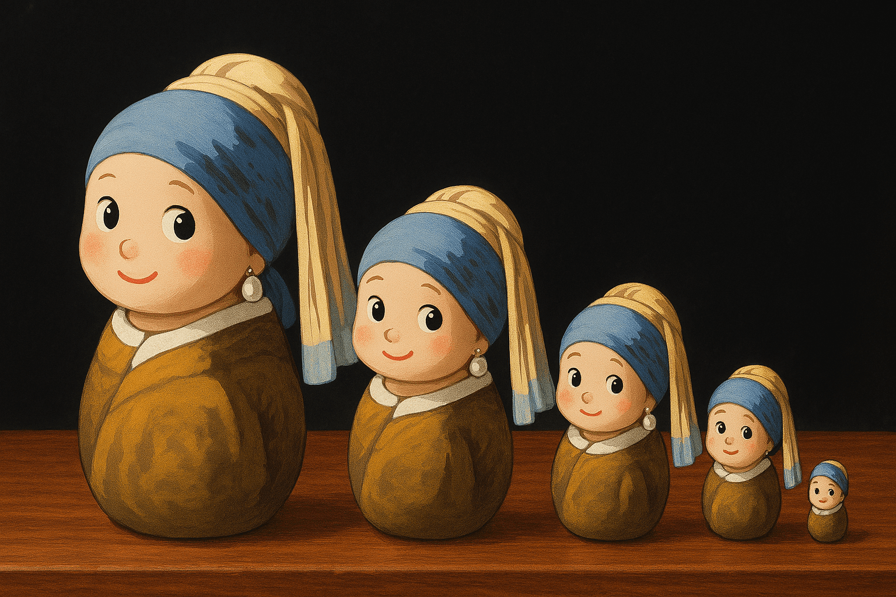<br>
<sub>Image © 2025 <a href="https://github.com/jamez-bondos">@jamez-bondos</a>, <a href="https://creativecommons.org/licenses/by/4.0/">CC BY 4.0</a> • Prompt by <a href="https://x.com/ZHO_ZHO_ZHO">@ZHO_ZHO_ZHO</a></sub>

**Prompt**

```
Transform the person in the image into a set of cute chibi-style Russian nesting dolls (🪆), with a total of five dolls arranged from largest to smallest. Place them on an elegant wooden table. Horizontal aspect ratio: 3:2.
```


**Reference Image Required:** Requires uploading a person's image as the subject for transformation (The original post used ['Girl with a Pearl Earring'](https://commons.wikimedia.org/w/index.php?curid=55017931)).


---

[⬆️ Back to Cases Directory](#cases-toc)

<a id="cases-42"></a>
### Case 42: 3D Q-version Couple Snow Globe (by [@balconychy](https://x.com/balconychy))

[Source Link](https://x.com/balconychy/status/1909908568129655248)

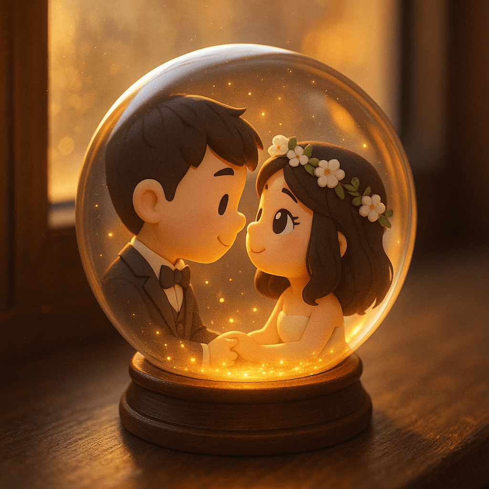<br>
<sub>Image © 2025 <a href="https://github.com/jamez-bondos">@jamez-bondos</a>, <a href="https://creativecommons.org/licenses/by/4.0/">CC BY 4.0</a> • Prompt by <a href="https://x.com/balconychy">@balconychy</a></sub>

**Prompt**

```
Transform the person in the attached image into a snow globe scene.
Overall environment: The snow globe is placed on a tabletop by the window, with a blurred, warm-toned background. Sunlight passes through the globe, casting golden sparkles that gently illuminate the surrounding darkness.
Inside the globe: The characters are in a cute chibi-style 3D design, gazing at each other with eyes full of love.
```


**Reference Image Required:** A photo of a couple or another person.


---

[⬆️ Back to Cases Directory](#cases-toc)

<a id="cases-41"></a>
### Case 41: Miniature Three-dimensional Scene Presentation (by [@dotey](https://x.com/dotey))

[Source Link](https://x.com/dotey/status/1911609122547449886)

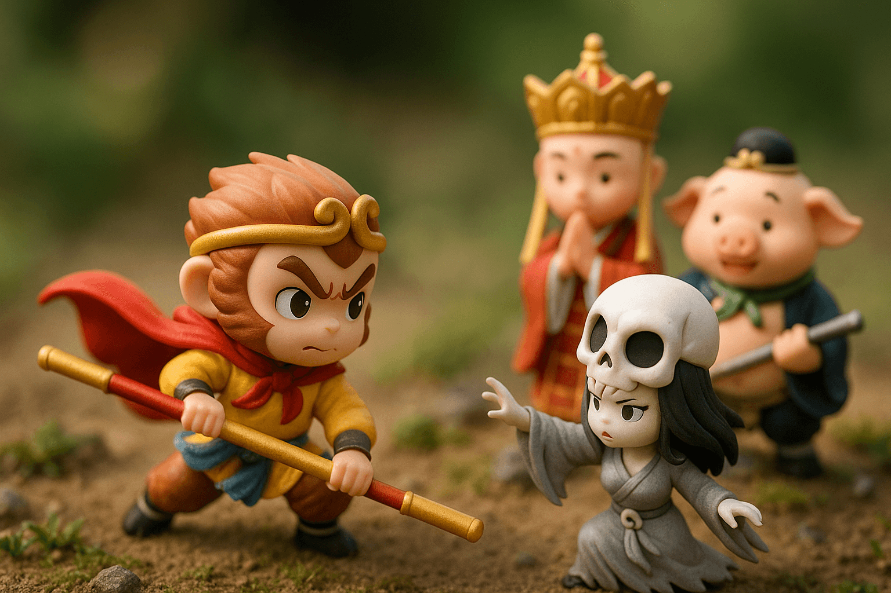<br>
<sub>Image © 2025 <a href="https://github.com/jamez-bondos">@jamez-bondos</a>, <a href="https://creativecommons.org/licenses/by/4.0/">CC BY 4.0</a> • Prompt by <a href="https://x.com/dotey">@dotey</a></sub>

**Prompt**

```
Miniature three-dimensional scene presentation using tilt-shift photography techniques, depicting a chibi-style version of the scene {Sun Wukong’s Three Battles with the White Bone Demon}
```

*Note: The content in brackets can be replaced with Western scenes such as “Hercules Slaying the Hydra” or “King Arthur Pulls the Sword from the Stone.”*


---

[⬆️ Back to Cases Directory](#cases-toc)

<a id="cases-40"></a>
### Case 40: Japanese-style Two-Panel Manga (Angry Girl President) (by [@hellokaton](https://x.com/hellokaton))

[Source Link](https://x.com/hellokaton/status/1910900979194646959)

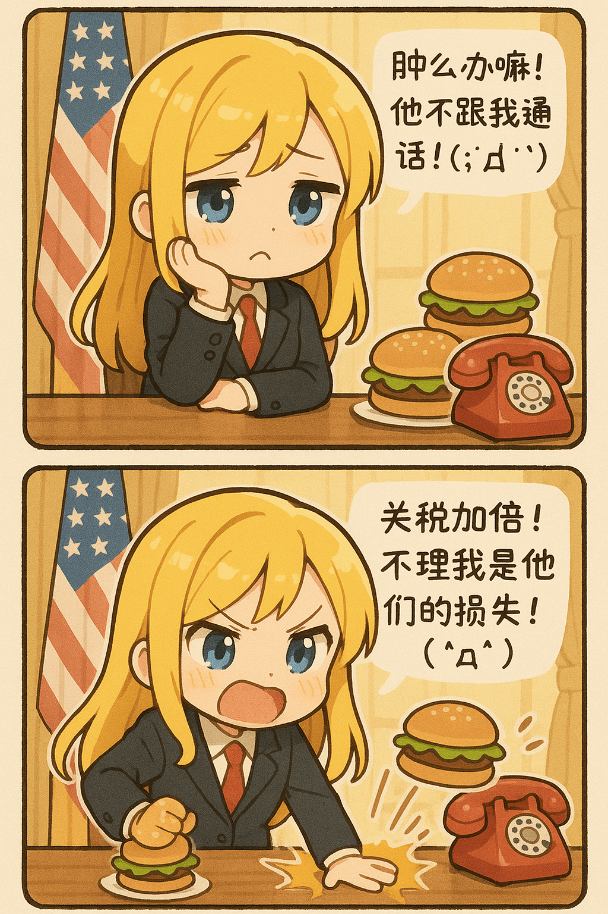<br>
<sub>Image © 2025 <a href="https://github.com/jamez-bondos">@jamez-bondos</a>, <a href="https://creativecommons.org/licenses/by/4.0/">CC BY 4.0</a> • Prompt by <a href="https://x.com/hellokaton">@hellokaton</a></sub>

**Prompt**

```
Create a two-panel vertical manga in a cute Japanese anime style, theme: “The Daily Work Life of a Girl President.”

Character Design:
Transform the person in the uploaded image into a cute, moe-style anime girl while preserving all key details from the photo — including the outfit (a suit), hairstyle (bright golden-yellow), and facial features.

Panel 1:
- Expression: Pouting, disappointed, resting her cheek on one hand
- Text box: “What do I dooo?! He won’t take my call! (；´д｀)”
- Scene: Warm-toned office, with the U.S. flag in the background. On the desk: a pile of hamburgers and a vintage red rotary phone. The character is on the left side of the frame, the phone on the right.

Panel 2:
- Expression: Furious, face red with anger, gritting teeth
- Action: Slams the desk hard, making the hamburgers jump
- Speech bubble: “Hmph! Double the tariffs! Ignoring me is their loss! ( `д´ )”
- Scene: Same office, now a complete mess

Additional Notes:
- Use a cute, casual handwritten font for all text
- Keep the composition full and expressive, with adequate space for dialogue and intentional white space
- Aspect ratio: 2:3
- The overall visual tone should be colorful and energetic, with a distinctly cartoony style
```


**Reference Image Required:** A photo of a person is needed for reference.


---

[⬆️ Back to Cases Directory](#cases-toc)

<a id="cases-39"></a>
### Case 39: Fantasy Cartoon Illustration (by [@dotey](https://x.com/dotey))

[Source Link](https://x.com/dotey/status/1905103477879267823)

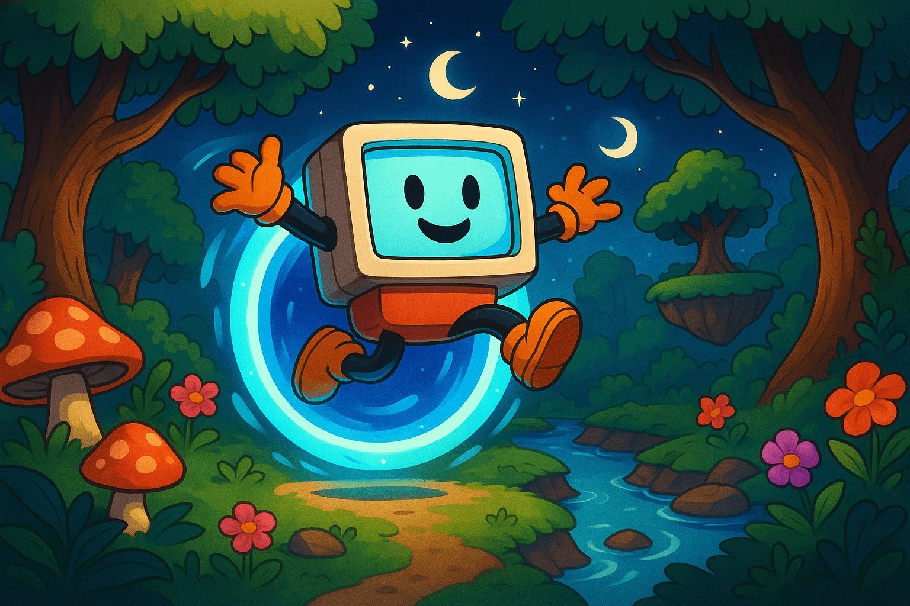<br>
<sub>Image © 2025 <a href="https://github.com/jamez-bondos">@jamez-bondos</a>, <a href="https://creativecommons.org/licenses/by/4.0/">CC BY 4.0</a> • Prompt by <a href="https://x.com/dotey">@dotey</a></sub>

**Prompt**

```
A cartoon-style character with a smiling computer monitor as its head, wearing gloves and boots, happily jumping through a glowing, blue, circular portal in a lush, fantasy forest landscape. The forest is detailed with large trees, mushrooms, flowers, a serene river, floating islands, and an atmospheric starry night sky with multiple moons. Bright, vibrant colors with soft lighting, fantasy illustration style.
```


---

[⬆️ Back to Cases Directory](#cases-toc)

<a id="cases-38"></a>
### Case 38: Hand-drawn Infographic Card (by [@dotey](https://x.com/dotey))

[Source Link](https://x.com/dotey/status/1907870919852179850)

<br>
<sub>Image © 2025 <a href="https://github.com/jamez-bondos">@jamez-bondos</a>, <a href="https://creativecommons.org/licenses/by/4.0/">CC BY 4.0</a> • Prompt by <a href="https://x.com/dotey">@dotey</a></sub>

**Prompt**

```
Create a hand-drawn style infographic card in a 9:16 vertical format. The card should have a clear theme, with a beige or off-white paper-textured background. The overall design should reflect a simple, warm, and handmade aesthetic.

At the top of the card, use large, eye-catching brush-style Chinese cursive calligraphy in red and black for the title, creating strong visual contrast. All text should be in Chinese cursive script. The layout should be divided into 2 to 4 clear sections, each conveying a core idea through concise and refined Chinese phrases. The calligraphy should maintain a fluid, rhythmic style that is both legible and artistically expressive. Leave appropriate blank space around the text.

The card should be accented with simple and fun hand-drawn illustrations or icons — such as figures or symbolic elements — to enhance visual appeal and spark thought or emotional resonance. The overall layout should emphasize visual balance and include ample whitespace, ensuring the design is clean, clear, and easy to read.

“Building a personal brand (IP) is long-term compounding.
Keep updating daily, and results will come — because 99% of people can’t keep it up!”
```


---

[⬆️ Back to Cases Directory](#cases-toc)

<a id="cases-37"></a>
### Case 37: Pastel Power 3D ADS (by [@aziz4ai](https://x.com/aziz4ai))

[Source Link](https://x.com/aziz4ai/status/1925301120252924356)

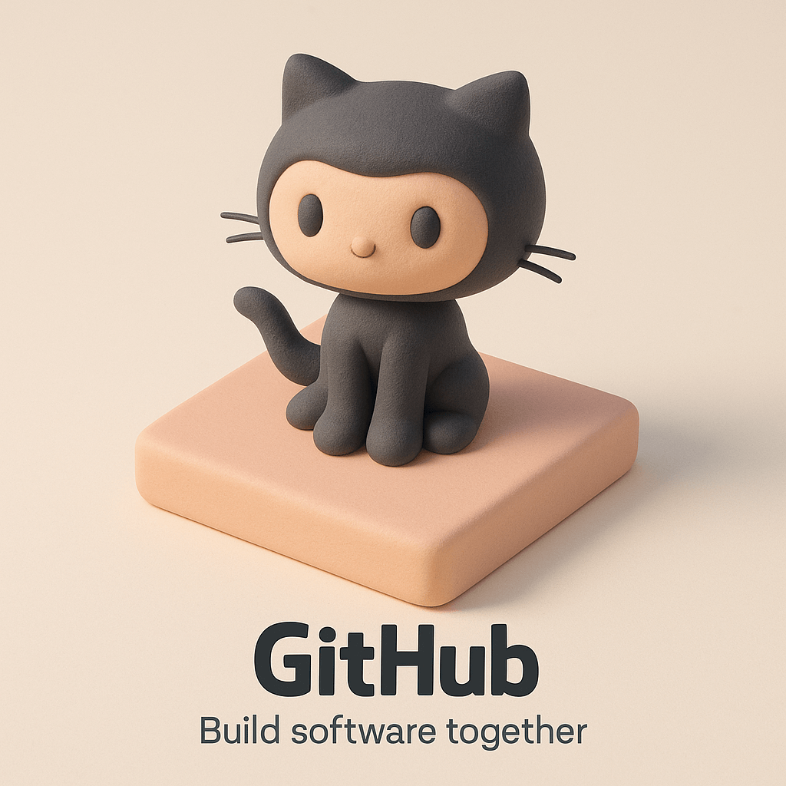<br>
<sub>Image © 2025 <a href="https://github.com/jamez-bondos">@jamez-bondos</a>, <a href="https://creativecommons.org/licenses/by/4.0/">CC BY 4.0</a> • Prompt by <a href="https://x.com/op7418">@op7418</a></sub>

**Prompt**

```
a soft 3D cartoon-style sculpture of [brand product], made of smooth clay-like textures and vibrant pastel colors, placed in a minimalist isometric scene that complements the product’s nature, clean composition, gentle lighting, subtle shadows, with the product’s logo and a 3-word slogan displayed clearly below
```

*Note: Replace [brand product] in the prompt with a specific product description.*


---

[⬆️ Back to Cases Directory](#cases-toc)

<a id="cases-36"></a>
### Case 36: Minimalist 3D Illustration (Markdown Format) (by [@dotey](https://x.com/dotey))

[Source Link](https://x.com/dotey/status/1907131027253772399)

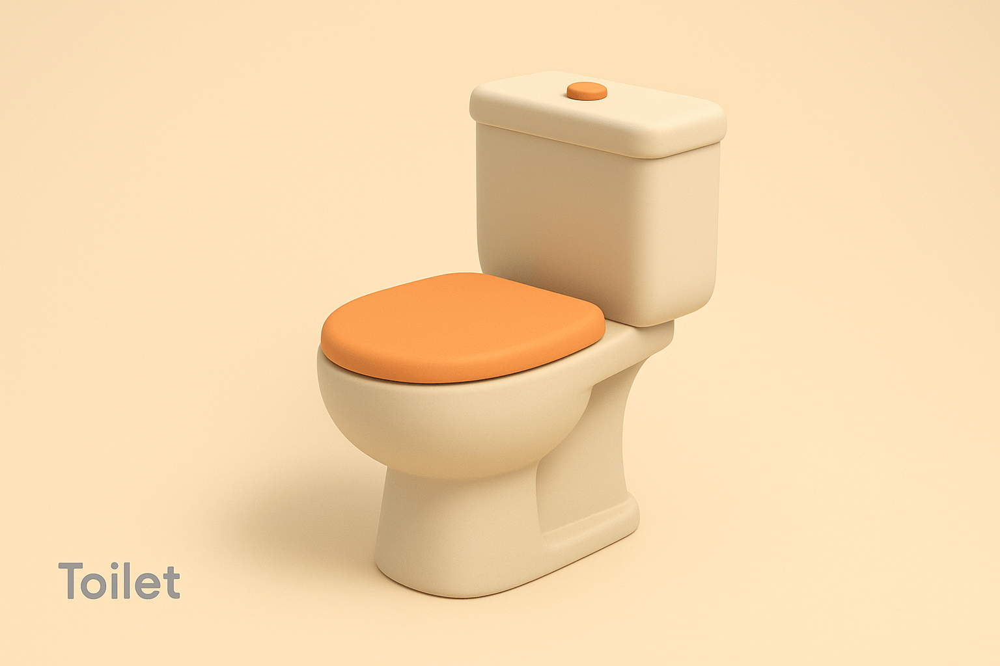<br>
<sub>Image © 2025 <a href="https://github.com/jamez-bondos">@jamez-bondos</a>, <a href="https://creativecommons.org/licenses/by/4.0/">CC BY 4.0</a> • Prompt by <a href="https://x.com/dotey">@dotey</a></sub>

**Prompt**

```
Draw a Toilet

## 🎨 Art Style: Minimalist 3D Illustration

### 🟢 Shape Language
- Rounded edges and smooth, soft forms using simplified geometric shapes.

### 🎨 Colors
- **Primary palette:** soft beige, light gray, warm orange.  
- **Accent color:** warm orange for focal elements.  
- **Shading:** gentle gradients and smooth transitions, avoiding harsh shadows and highlights.

### 💡 Lighting
- **Type:** soft, diffuse lighting.  
- **Light source direction:** from above, slightly to the right.  
- **Shadow style:** subtle and diffused, without sharp or high-contrast shadows.

### 🧱 Materials
- **Surface texture:** matte and smooth with subtle light variation.  
- **Reflectivity:** low to none, avoiding noticeable gloss.

### 🖼️ Composition
- **Object presentation:** a single, centered object with generous negative space around it.  
- **Perspective:** slight tilt to suggest depth, but no strong depth-of-field effects.  
- **Background:** flat color, low saturation, harmonious with the subject and non-distracting.

### ✒️ Typography
- **Font style:** minimalist sans-serif.  
- **Text placement:** bottom left corner, small and unobtrusive.  
- **Font color:** gray, low contrast with the background.

### 🖥️ Rendering Style
- **Technique:** 3D rendering in a simplified low-poly style.  
- **Detail level:** medium — focus on shape and color, avoiding complex textures or fine details.

## 🎯 Style Goal
> Create a clean and aesthetically pleasing visual that emphasizes simplicity, approachability, and modernity.
```


---

[⬆️ Back to Cases Directory](#cases-toc)

<a id="cases-35"></a>
### Case 35: Fluffy Jack-o'-lantern (by [gizakdag](https://x.com/gizakdag))

[Source Link1](https://x.com/gizakdag/status/1911075302941622512) | [Source Link2](https://x.com/dotey/status/1912276883196039520)

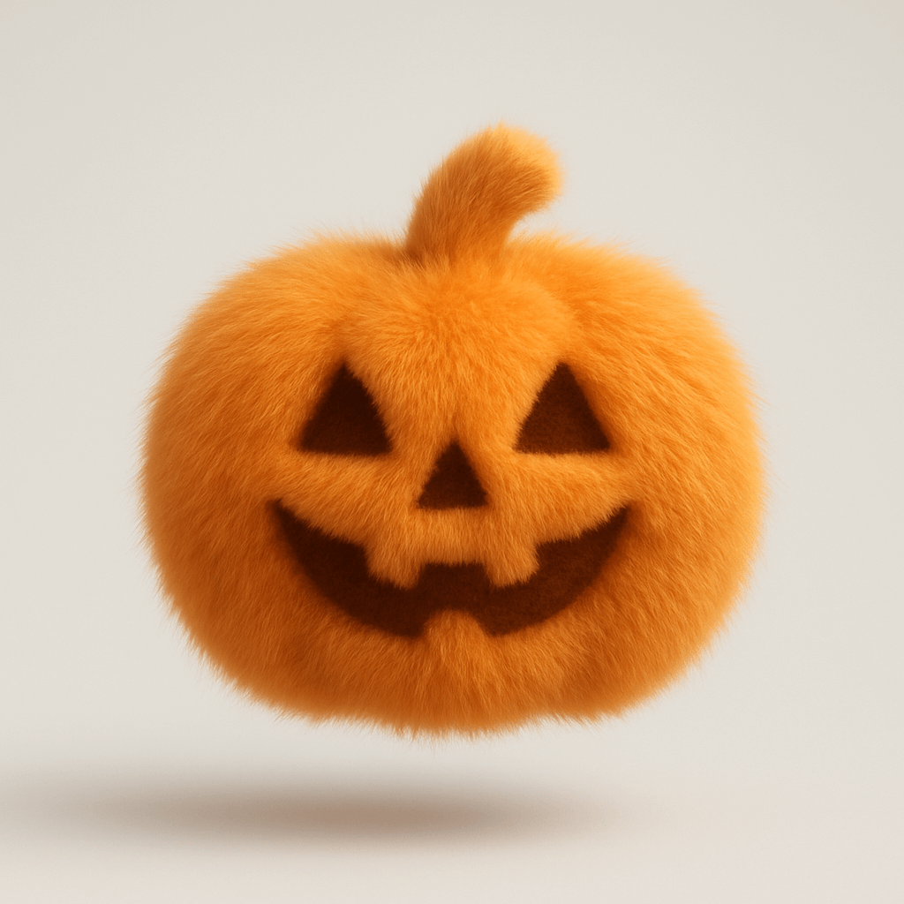<br>
<sub>Image © 2025 <a href="https://github.com/jamez-bondos">@jamez-bondos</a>, <a href="https://creativecommons.org/licenses/by/4.0/">CC BY 4.0</a> • Prompt by <a href="https://x.com/gizakdag">gizakdag</a></sub>

**Prompt**

```
Transform a simple flat vector icon of [🎃] into a soft, 3D fluffy object. The shape is fully covered in fur, with hyperrealistic hair texture and soft shadows. The object is centered on a clean, light gray background and floats gently in space. The style is surreal, tactile, and modern, evoking a sense of comfort and playfulness. Studio lighting, high-resolution render.
```


---

[⬆️ Back to Cases Directory](#cases-toc)

<a id="cases-34"></a>
### Case 34: Hand-drawn Infographic Card (Cognition) (by [@dotey](https://x.com/dotey))

[Source Link](https://x.com/dotey/status/1907903480678985784)

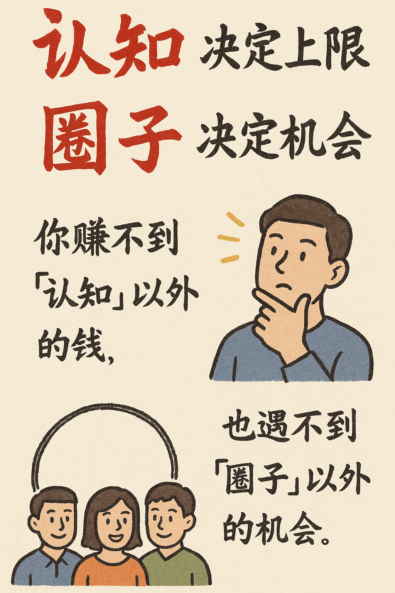<br>
<sub>Image © 2025 <a href="https://github.com/jamez-bondos">@jamez-bondos</a>, <a href="https://creativecommons.org/licenses/by/4.0/">CC BY 4.0</a> • Prompt by <a href="https://x.com/dotey">@dotey</a></sub>

**Prompt**

```
Create a hand-drawn style infographic card in vertical 9:16 ratio. The card should have a clear theme, with a beige or off-white paper-textured background. The overall design should convey a rustic, friendly, and handmade aesthetic.

At the top of the card, feature a bold, eye-catching title in large Chinese cursive brush calligraphy using contrasting red and black colors. All text content should be in Chinese cursive script, and the layout should be divided into 2 to 4 clear sections. Each section expresses a core idea with brief and concise Chinese phrases. The cursive font should retain a smooth, rhythmic flow, remaining legible while carrying artistic appeal.

The card should include simple, playful hand-drawn illustrations or icons, such as figures or symbolic elements, to enhance visual interest and spark reader reflection or emotional resonance.

The overall layout should maintain visual balance, with ample white space reserved to ensure clarity, simplicity, and ease of reading and understanding.
<h1><span style="color:red">“Cognition”</span> defines your ceiling  
<span style="color:red">“Circle”</span> defines your opportunities</h1>  
– You can’t earn money beyond your level of cognition,  
– Nor encounter opportunities beyond your social circle.
```


---

[⬆️ Back to Cases Directory](#cases-toc)

<a id="cases-33"></a>
### Case 33: Family Wedding Photo (Q-version) (by [@balconychy](https://x.com/balconychy))

[Source Link](https://x.com/balconychy/status/1909426314643222595)

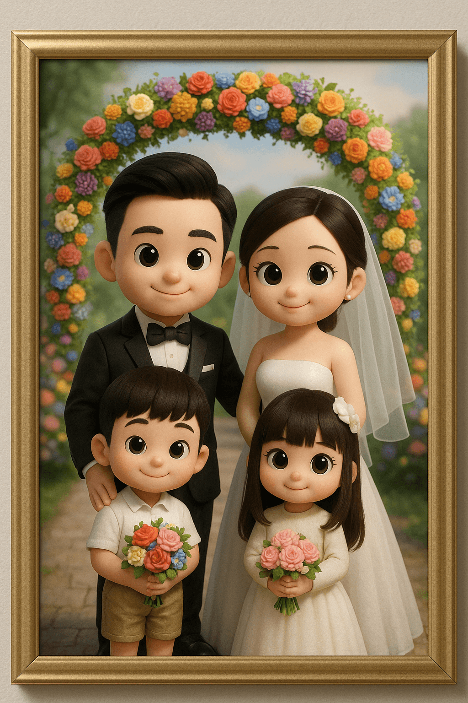<br>
<sub>Image © 2025 <a href="https://github.com/jamez-bondos">@jamez-bondos</a>, <a href="https://creativecommons.org/licenses/by/4.0/">CC BY 4.0</a> • Prompt by <a href="https://x.com/balconychy">@balconychy</a></sub>

**Prompt**

```
Transform the people in the photo into chibi-style 3D characters. The parents are dressed in Western wedding attire — the father in a formal suit, the mother in a wedding gown. The child is a beautiful flower girl holding a bouquet.

The background features a colorful floral arch.
The characters are in 3D chibi style, while the environment is photorealistic.
The entire scene is placed inside a photo frame.
```


**Reference Image Required:** A family photo.


---

[⬆️ Back to Cases Directory](#cases-toc)

<a id="cases-32"></a>
### Case 32: 3D Papercraft Pop-up Book (by [@dotey](https://x.com/dotey))

[Source Link](https://x.com/dotey/status/1923264349050675329)

<br>
<sub>Image © 2025 <a href="https://github.com/jamez-bondos">@jamez-bondos</a>, <a href="https://creativecommons.org/licenses/by/4.0/">CC BY 4.0</a> • Prompt by <a href="https://x.com/dotey">@dotey</a></sub>

**Prompt**

```
Multi-layered foldable paper sculpture pop-up book, placed on a desk, with a clean background highlighting the main subject. The book presents a 3D flip-book style, with a 2:3 vertical aspect ratio. The open pages display the scene of [Nezha Demon Child version battling Ao Bing]. All elements are finely foldable and assembled, showcasing a realistic and delicate texture of folded paper. The composition uniformly adopts a frontal perspective, with an overall dreamy and beautiful visual style, vibrant and gorgeous colors, full of a fantastical and lively story atmosphere.
```

*Note: Please modify the scene description within the square brackets 【】 as appropriate, and you can also add more details.*


---

[⬆️ Back to Cases Directory](#cases-toc)

<a id="cases-31"></a>
### Case 31: Anime Sticker Collection (by [@richardchang](https://x.com/richardchang))

[Source Link](https://x.com/richardchang/status/1909086122959139312)

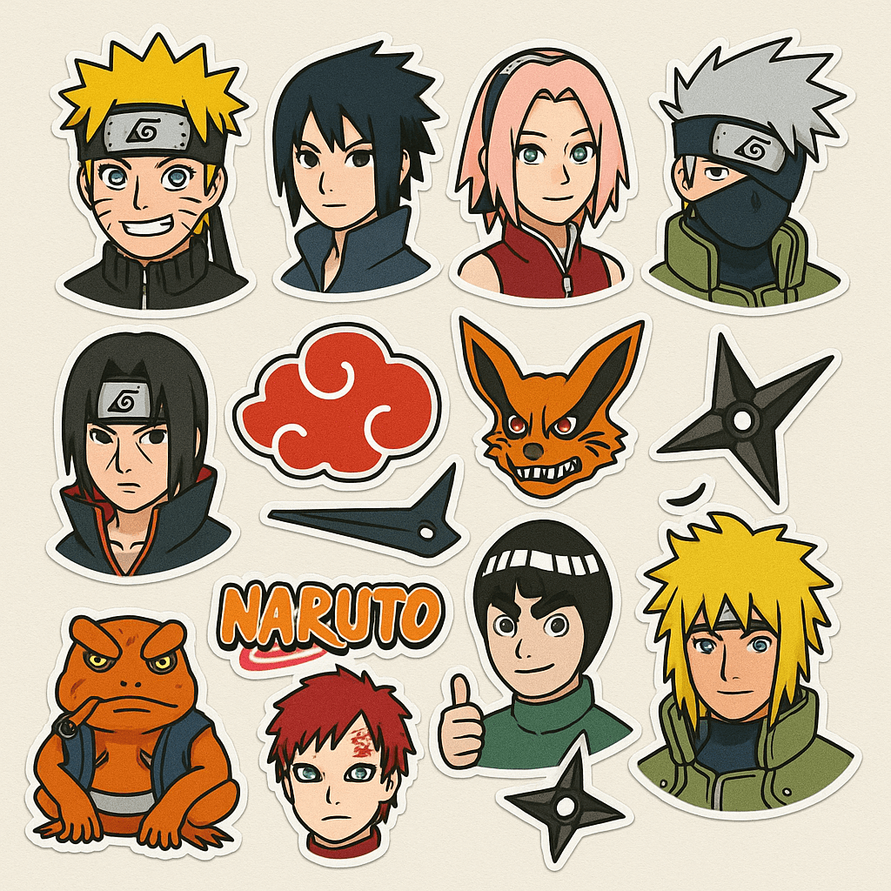<br>
<sub>Image © 2025 <a href="https://github.com/jamez-bondos">@jamez-bondos</a>, <a href="https://creativecommons.org/licenses/by/4.0/">CC BY 4.0</a> • Prompt by <a href="https://x.com/richardchang">@richardchang</a></sub>

**Prompt**

```
Naruto stickers
```


---

[⬆️ Back to Cases Directory](#cases-toc)

<a id="cases-30"></a>
### Case 30: 35mm Film Style Flying Island (by [@dotey](https://x.com/dotey))

[Source Link](https://x.com/dotey/status/1905020833451348283)

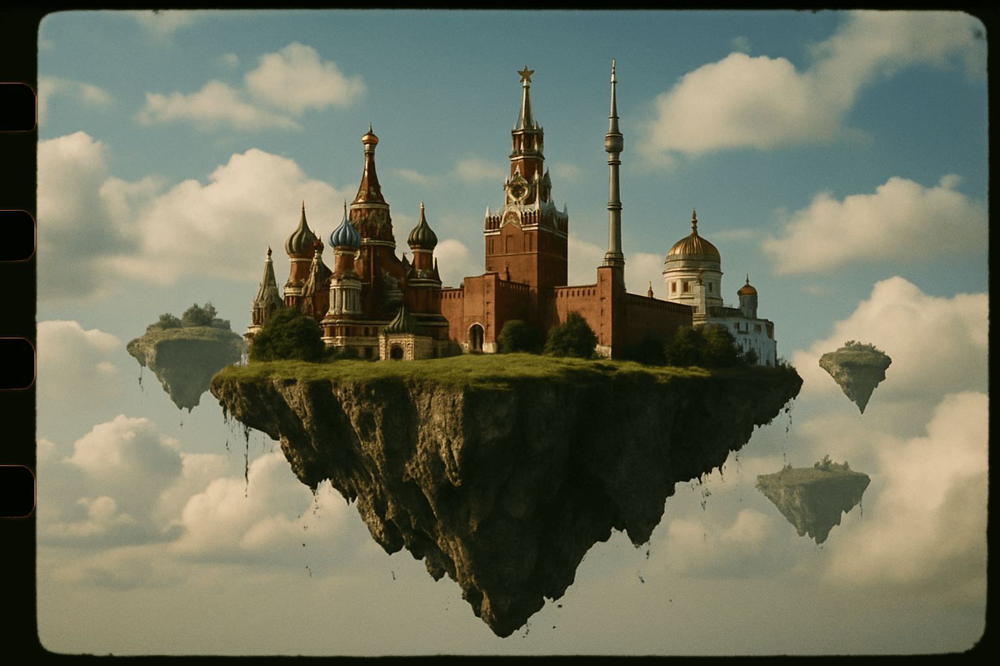<br>
<sub>Image © 2025 <a href="https://github.com/jamez-bondos">@jamez-bondos</a>, <a href="https://creativecommons.org/licenses/by/4.0/">CC BY 4.0</a> • Prompt by <a href="https://x.com/dotey">@dotey</a></sub>

**Prompt**

```
35 mm photo of Moscow floating in the sky on a flying islands.
```


---

[⬆️ Back to Cases Directory](#cases-toc)

<a id="cases-29"></a>
### Case 29: Famous Painting Character OOTD (by [@ZHO_ZHO_ZHO](https://x.com/ZHO_ZHO_ZHO))

[Source Link](https://x.com/ZHO_ZHO_ZHO/status/1909892294217781714)

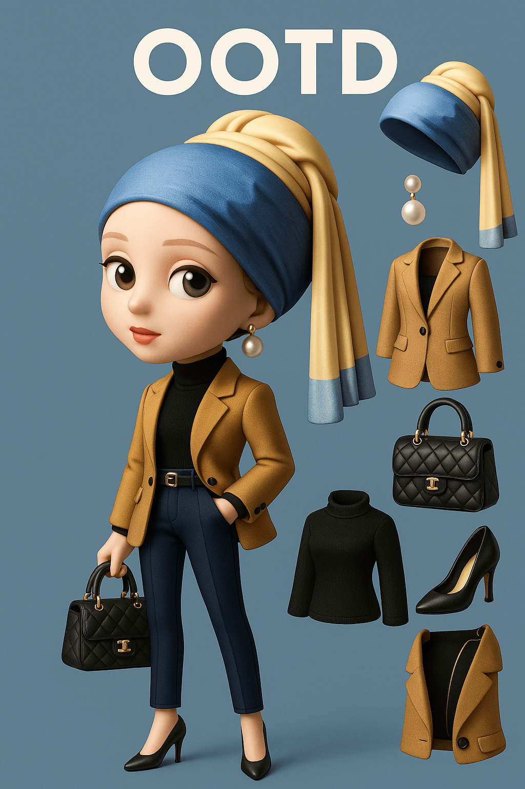<br>
<sub>Image © 2025 <a href="https://github.com/jamez-bondos">@jamez-bondos</a>, <a href="https://creativecommons.org/licenses/by/4.0/">CC BY 4.0</a> • Prompt by <a href="https://x.com/ZHO_ZHO_ZHO">@ZHO_ZHO_ZHO</a></sub>

**Prompt**

```
Generate a Q-style 3D C4D-rendered character based on the person in the photo, dressed in a fashion-forward “outfit of the day” (OOTD) inspired by a specific profession.
Profession: Fashion Designer
– Keep the original facial features and character pose
– Stylize the character with a cute, long-legged chibi proportion
– Outfit and accessories should reflect the profession, including trendy designer wear, glasses, sketchbook or tablet, and stylish shoes
– Match the outfit with fashion accessories to complete the look
– Use a solid background color that complements the character’s overall color palette (no gradients or textures)

Composition: Aspect ratio: 9:16
Top text: “OOTD”
Left side: the full-body chibi character wearing the complete outfit
Right side: individual clothing items and accessories laid out separately, as if in a style breakdown
```


**Reference Image Required:** [Image of 'Girl with a Pearl Earring'](https://commons.wikimedia.org/w/index.php?curid=55017931).


---

[⬆️ Back to Cases Directory](#cases-toc)

<a id="cases-28"></a>
### Case 28: Flat Sticker Design (by [@ZHO_ZHO_ZHO](https://x.com/ZHO_ZHO_ZHO))

[Source Link](https://x.com/ZHO_ZHO_ZHO/status/1908044836953108490)

<br>
<sub>Image © 2025 <a href="https://github.com/jamez-bondos">@jamez-bondos</a>, <a href="https://creativecommons.org/licenses/by/4.0/">CC BY 4.0</a> • Prompt by <a href="https://x.com/ZHO_ZHO_ZHO">@ZHO_ZHO_ZHO</a></sub>

**Prompt**

```
Turn this photo into a chibi-style sticker illustration in a minimalist flat design.
– Keep the character’s recognizable features
– Use a cute, simplified aesthetic
– The sticker should have a thick white border
– The character should break out of the circular frame, adding a playful touch
– The circular base should be a solid flat color (no 3D or gradients)
– Background should be transparent
The overall style should be clean, modern, and visually appealing for use as a fun Q-version sticker.
```


**Reference Image Required:** A clear profile photo.


---

[⬆️ Back to Cases Directory](#cases-toc)

<a id="cases-27"></a>
### Case 27: Q-version Emoji Sticker Pack Creation (by [@dotey](https://x.com/dotey))

[Source Link](https://x.com/dotey/status/1909800530739679488)

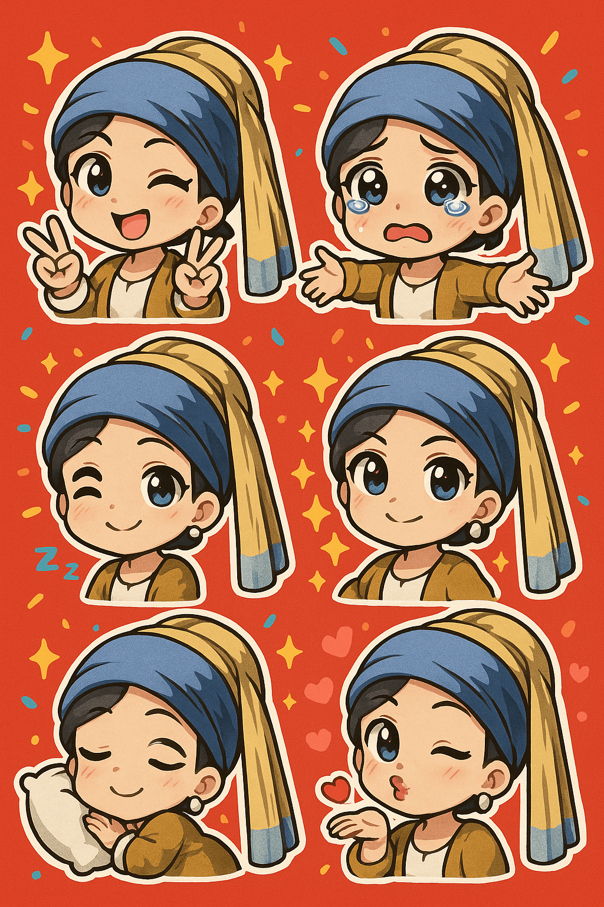<br>
<sub>Image © 2025 <a href="https://github.com/jamez-bondos">@jamez-bondos</a>, <a href="https://creativecommons.org/licenses/by/4.0/">CC BY 4.0</a> • Prompt by <a href="https://x.com/dotey">@dotey</a></sub>

**Prompt**

```
Create a brand-new set of chibi-style stickers featuring the user as the main character, with six unique poses:
  1.	Making a playful peace sign with both hands and winking.
  2.	Tearful eyes and slightly trembling lips, showing a cute crying expression.
  3.	Arms wide open in a warm, enthusiastic hug pose.
  4.	Lying on their side asleep, resting on a tiny pillow with a sweet smile.
  5.	Pointing forward with confidence, surrounded by shining visual effects.
  6.	Blowing a kiss, with heart symbols floating around.
Maintain the chibi aesthetic:
– Exaggerated, expressive big eyes
– Soft facial lines
– Playful, short black hairstyle
– A white outfit with a bold neckline design
Background: Vibrant red with star or colorful confetti elements for decoration. Leave some clean white space around each sticker.
Aspect ratio: 9:16
```


**Reference Image Required:** A clear profile photo.


---

[⬆️ Back to Cases Directory](#cases-toc)

<a id="cases-26"></a>
### Case 26: Famous Painting Character Cereal Ad (by [@ZHO_ZHO_ZHO](https://x.com/ZHO_ZHO_ZHO))

[Source Link](https://x.com/ZHO_ZHO_ZHO/status/1909542765857587310)

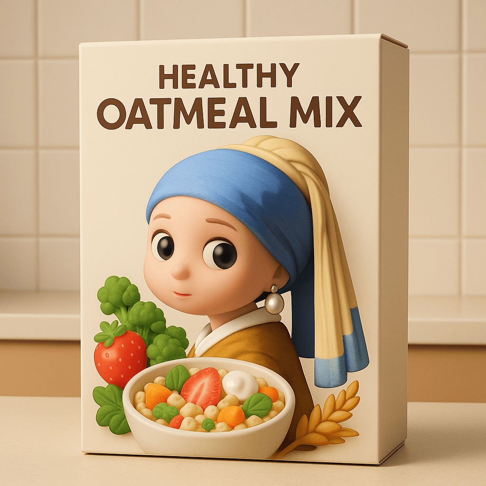<br>
<sub>Image © 2025 <a href="https://github.com/jamez-bondos">@jamez-bondos</a>, <a href="https://creativecommons.org/licenses/by/4.0/">CC BY 4.0</a> • Prompt by <a href="https://x.com/ZHO_ZHO_ZHO">@ZHO_ZHO_ZHO</a></sub>

**Prompt**

```
“Master Oats”: Based on the visual features of the person in the uploaded photo, generate a custom oatmeal mix that reflects their personality traits — for example, using vegetables, fruits, yogurt, whole grains, etc.

Design a unique cereal box and package aesthetic that aligns with this tailored mix.

Then, create an advertising cover featuring the person as the mascot on the cereal box. The character should retain their recognizable features but be transformed into a cute chibi-style 3D figure with a C4D-quality rendering.

The oatmeal and packaging should be presented in a setting that matches the mood — such as a minimalist kitchen, a sleek supermarket display, or a clean design counter.

The process includes:
– Character analysis and oat mix pairing
– Cereal box concept and design
– Display environment selection
– Final image with mascot figure, packaging, and styled scene composition

All visuals should be balanced, modern, and appealing, reflecting a premium and fun oat brand identity.
```


**Reference Image Required:** [Image of 'Girl with a Pearl Earring'](https://commons.wikimedia.org/w/index.php?curid=55017931).


---

[⬆️ Back to Cases Directory](#cases-toc)

<a id="cases-25"></a>
### Case 25: Minimalist 3D Illustration (by [@0xdlk](https://x.com/0xdlk))

[Source Link](https://x.com/0xdlk/status/1906843247432929642)

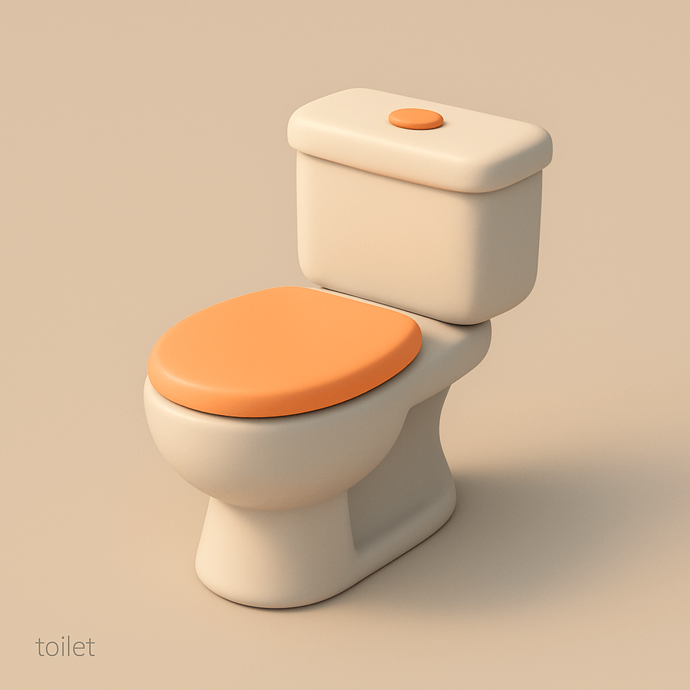<br>
<sub>Image © 2025 <a href="https://github.com/jamez-bondos">@jamez-bondos</a>, <a href="https://creativecommons.org/licenses/by/4.0/">CC BY 4.0</a> • Prompt by <a href="https://x.com/0xdlk">@0xdlk</a></sub>

**Prompt**

```
Generate a toilet with the following JSON profile:
{
  "art_style_profile": {
    "style_name": "Minimalist 3D Illustration",
    "visual_elements": {
      "shape_language": "Rounded edges, smooth and soft forms with simplified geometry",
      "colors": {
        "primary_palette": ["Soft beige, light gray, warm orange"],
        "accent_colors": ["Warm orange for focal elements"],
        "shading": "Soft gradients with smooth transitions, avoiding harsh shadows or highlights"
      },
      "lighting": {
        "type": "Soft, diffused lighting",
        "source_direction": "Above and slightly to the right",
        "shadow_style": "Subtle and diffused, no sharp or high-contrast shadows"
      },
      "materials": {
        "surface_texture": "Matte, smooth surfaces with subtle shading",
        "reflectivity": "Low to none, avoiding glossiness"
      },
      "composition": {
        "object_presentation": "Single, central object displayed in isolation with ample negative space",
        "perspective": "Slightly angled, giving a three-dimensional feel without extreme depth",
        "background": "Solid, muted color that complements the object without distraction"
      },
      "typography": {
        "font_style": "Minimalistic, sans-serif",
        "text_placement": "Bottom-left corner with small, subtle text",
        "color": "Gray, low-contrast against the background"
      },
      "rendering_style": {
        "technique": "3D render with simplified, low-poly aesthetics",
        "detail_level": "Medium detail, focusing on form and color over texture or intricacy"
      }
    },
    "purpose": "To create clean, aesthetically pleasing visuals that emphasize simplicity, approachability, and modernity."
  }
}
```


---

[⬆️ Back to Cases Directory](#cases-toc)

<a id="cases-24"></a>
### Case 24: Funko Pop Figure Creation (by [@dotey](https://x.com/dotey))

[Source Link](https://x.com/dotey/status/1909047283485671924)

<br>
<sub>Image © 2025 <a href="https://github.com/jamez-bondos">@jamez-bondos</a>, <a href="https://creativecommons.org/licenses/by/4.0/">CC BY 4.0</a> • Prompt by <a href="https://x.com/dotey">@dotey</a></sub>

**Prompt**

```
Transform the person in the photo into the style of a Funko Pop figure box, presented in isometric view.
The packaging is labeled with the title “JAMES BOND.”
Inside the box, display a chibi-style figure based on the person in the photo, along with their essential accessories: a pistol, a wristwatch, a suit, and other signature items.
Next to the box, show a realistic rendering of the actual figure outside the packaging, with detailed textures and lighting to achieve a lifelike product display.
```


**Reference Image Required:** A clear half-body or full-body photo.


---

[⬆️ Back to Cases Directory](#cases-toc)

<a id="cases-23"></a>
### Case 23: "Titanic" Pose Parody (by [@balconychy](https://x.com/balconychy))

[Source Link](https://x.com/balconychy/status/1909916265067557299)

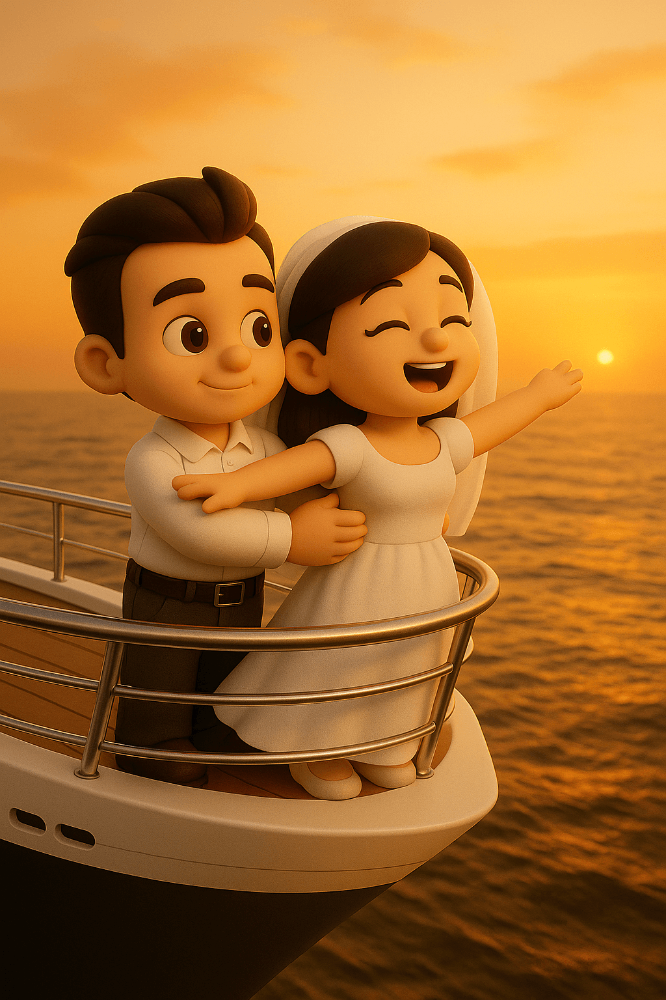<br>
<sub>Image © 2025 <a href="https://github.com/jamez-bondos">@jamez-bondos</a>, <a href="https://creativecommons.org/licenses/by/4.0/">CC BY 4.0</a> • Prompt by <a href="https://x.com/balconychy">@balconychy</a></sub>

**Prompt**

```
Transform the person in the attached image into a cute chibi-style 3D character.
Scene: On the pointed bow of a luxurious cruise ship.
The man stands behind the woman at the bow, holding her waist with both hands. The woman is wearing a dress, arms spread wide, facing the wind, with a joyful and liberated expression on her face—just like the iconic scene from Titanic.
The sky is painted in warm sunset tones, and the vast ocean stretches beneath the ship.
Only the characters should be in chibi 3D style; the rest of the environment should be realistic.
```


**Reference Image Required:** A couple's photo.


---

[⬆️ Back to Cases Directory](#cases-toc)

<a id="cases-22"></a>
### Case 22: Xiaohongshu Cover Image (by [@balconychy](https://x.com/balconychy))

[Source Link](https://x.com/balconychy/status/1905507936526627078)

<br>
<sub>Image © 2025 <a href="https://github.com/jamez-bondos">@jamez-bondos</a>, <a href="https://creativecommons.org/licenses/by/4.0/">CC BY 4.0</a> • Prompt by <a href="https://x.com/balconychy">@balconychy</a></sub>

**Prompt**

```
Draw an image: Create a cover for a Xiaohongshu (RED) post.

Requirements:
– It must be visually compelling enough to attract user clicks.
– Use bold, characterful fonts.
– Vary font sizes to reflect the hierarchy of information; emphasize the structure of the copy.
– The main title should be at least twice the size of regular text.
– Leave white space between text sections.
– Only use bright accent colors to highlight key words and draw attention.
– The background should feature an eye-catching pattern (such as paper texture, notebook, or a WeChat chat window—choose one).
– Add appropriate icons or illustrations to enhance visual layers, but avoid visual clutter.

Copy text:
BREAKING: ChatGPT just got even better!
– Superior multitasking ✨
– Stronger coding ability 💪
– Creativity off the charts 🎨
Try it now!

Image aspect ratio: 9:16
```


---

[⬆️ Back to Cases Directory](#cases-toc)

<a id="cases-21"></a>
### Case 21: Chibi Character Sticker Pack (by [@leon_yuan2001](https://x.com/leon_yuan2001))

[Source Link](https://x.com/leon_yuan2001/status/1923712069209293014)

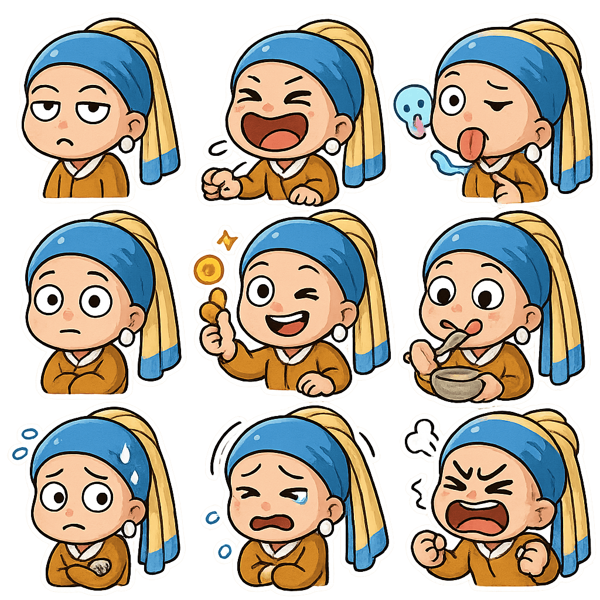<br>
<sub>Image © 2025 <a href="https://github.com/jamez-bondos">@jamez-bondos</a>, <a href="https://creativecommons.org/licenses/by/4.0/">CC BY 4.0</a> • Prompt by <a href="https://x.com/leon_yuan2001">@leon_yuan2001</a></sub>

**Prompt**

```
Please create a set of 9 Chibi stickers featuring [the character in the reference image], arranged in a 3x3 grid.
Design requirements:
- Transparent background.
- 1:1 square aspect ratio.
- Consistent Chibi Ghibli cartoon style with vibrant colors.
- Each sticker must have a unique action, expression, and theme, reflecting diverse emotions like "sassy, mischievous, cute, frantic" (e.g., rolling eyes, laughing hysterically on the floor, soul leaving body, petrified, throwing money, foodie mode, social anxiety attack). Incorporate elements related to office workers and internet memes.
- Each character depiction must be complete, with no missing parts.
- Each sticker must have a uniform white outline, giving it a sticker-like appearance.
- No extraneous or detached elements in the image.
- Strictly no text, or ensure any text is 100% accurate (no text preferred).
```

*Note: Please replace "[the character in the reference image]" in the prompt with a specific description of the character's features, or directly upload a reference image.*

**Reference Image Required:** A character image needs to be uploaded as the main reference for creating the sticker pack.


---

[⬆️ Back to Cases Directory](#cases-toc)

<a id="cases-20"></a>
### Case 20: Action Figure and Real Person in the Same Frame (by [@dotey](https://x.com/dotey))

[Source Link](https://x.com/dotey/status/1920994118580183316)

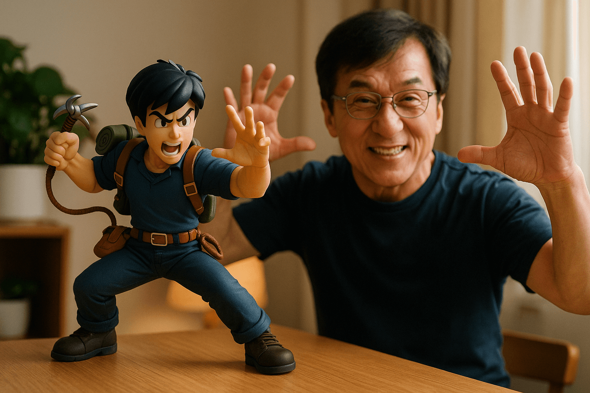<br>
<sub>Image © 2025 <a href="https://github.com/jamez-bondos">@jamez-bondos</a>, <a href="https://creativecommons.org/licenses/by/4.0/">CC BY 4.0</a> • Prompt by <a href="https://x.com/dotey">@dotey</a></sub>

**Prompt**

```
In a casual, everyday style as if shot on a mobile phone, an anime figure of [Jackie Chan] is placed on a desk, striking an exaggerated and cool pose, fully equipped. Simultaneously, the corresponding real-life person also appears in the frame, striking a similar pose to the figure, creating an interesting visual contrast with the figure and the real person in the same frame. The overall composition is harmonious and natural, delivering a warm and vibrant, true-to-life visual experience.
```

*Note: The [Jackie Chan] in the prompt can be replaced with the name of any figurine character you want, or other types of characters.*


---

[⬆️ Back to Cases Directory](#cases-toc)

<a id="cases-19"></a>
### Case 19: Country Diorama in a Toy Box (by [@TheRelianceAI](https://x.com/TheRelianceAI))

[Source Link](https://x.com/TheRelianceAI/status/1925223613055017251)

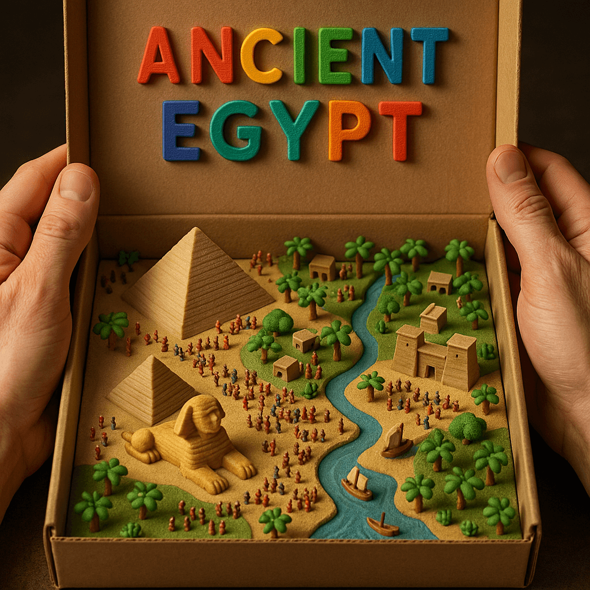<br>
<sub>Image © 2025 <a href="https://github.com/jamez-bondos">@jamez-bondos</a>, <a href="https://creativecommons.org/licenses/by/4.0/">CC BY 4.0</a> • Prompt by <a href="https://x.com/TheRelianceAI">@TheRelianceAI</a></sub>

**Prompt**

```
An ultra-realistic top-down photograph of a 3D-printed diorama inside a beige cardboard box, with the lid being held open by two human hands. The interior of the box reveals a miniature landscape of [COUNTRY NAME], featuring iconic landmarks, terrain, buildings, rivers, vegetation, and crowds of tiny, detailed human figures. The diorama is filled with vibrant, geographically appropriate elements, all crafted in a tactile, toy-like style using matte 3D-printed textures with visible layer lines. At the top, the inside of the box lid displays the phrase “[COUNTRY NAME]” in large, colorful, raised plastic letters—each letter in a different bright color. The lighting is warm and cinematic, highlighting the textures and shadows to evoke a sense of realism and charm, as if the viewer is opening a magical miniature version of the nation
```

*Note: Please replace `[COUNTRY NAME]` in the prompt with a specific country name.*


---

[⬆️ Back to Cases Directory](#cases-toc)

<a id="cases-18"></a>
### Case 18: Pixar 3D Style (by [AnimeAI](https://animeai.online))

[Source Link](https://animeai.online/#demo-gallery)

<br>
<sub>Image © 2025 <a href="https://github.com/jamez-bondos">@jamez-bondos</a>, <a href="https://creativecommons.org/licenses/by/4.0/">CC BY 4.0</a> • Prompt by <a href="https://animeai.online">AnimeAI</a></sub>

**Prompt**

```
Redraw this photo in Pixar 3D style
```


**Reference Image Required:** A photo of a person or other subject.


---

[⬆️ Back to Cases Directory](#cases-toc)

<a id="cases-17"></a>
### Case 17: Retro CRT Computer Boot Screen (by [@Gdgtify](https://x.com/Gdgtify))

[Source Link](https://x.com/Gdgtify/status/1925176250626159053)

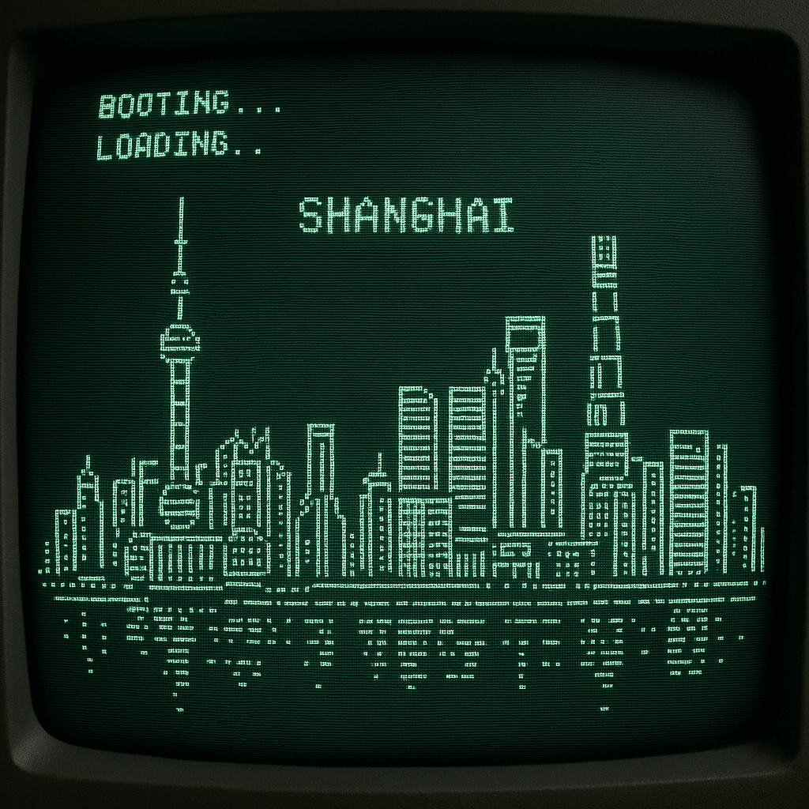<br>
<sub>Image © 2025 <a href="https://github.com/jamez-bondos">@jamez-bondos</a>, <a href="https://creativecommons.org/licenses/by/4.0/">CC BY 4.0</a> • Prompt by <a href="https://x.com/Gdgtify">@Gdgtify</a></sub>

**Prompt**

```
Retro CRT computer boot screen that resolves into ASCII-art of [shape or logo]
```

*Note: Replace [shape or logo] in the prompt with a specific shape or logo description, such as Shanghai skyline.*


---

[⬆️ Back to Cases Directory](#cases-toc)

<a id="cases-16"></a>
### Case 16: Anime-style Badge (by [@Alittlefatwhale](https://x.com/Alittlefatwhale))

[Source Link](https://x.com/Alittlefatwhale/status/1922512847030124905)

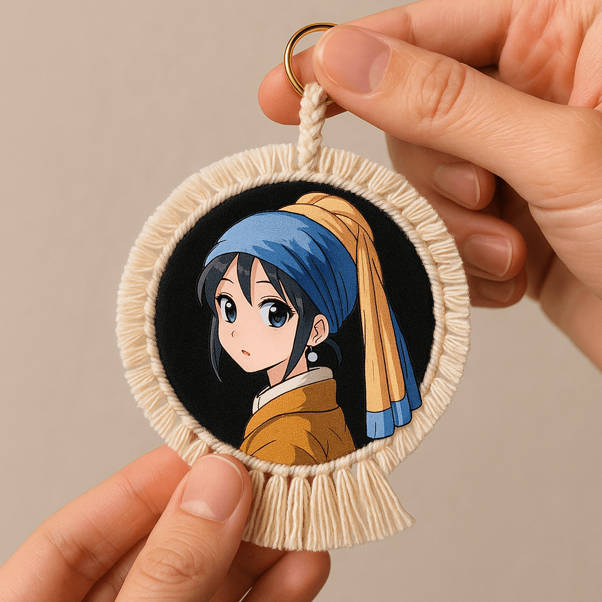<br>
<sub>Image © 2025 <a href="https://github.com/jamez-bondos">@jamez-bondos</a>, <a href="https://creativecommons.org/licenses/by/4.0/">CC BY 4.0</a> • Prompt by <a href="https://x.com/Alittlefatwhale">@Alittlefatwhale</a></sub>

**Prompt**

```
Based on the person in the attachment, generate a photo of an anime-style badge. Requirements:
Material: Tassel
Shape: Circular
Main subject: A hand holding the badge
```


**Reference Image Required:** A photo of a person needs to be uploaded as a reference for the badge design.


---

[⬆️ Back to Cases Directory](#cases-toc)

<a id="cases-15"></a>
### Case 15: Satirical Poster Generation (by [@ZHO_ZHO_ZHO](https://x.com/ZHO_ZHO_ZHO))

[Source Link](https://x.com/ZHO_ZHO_ZHO/status/1905287637084274742)

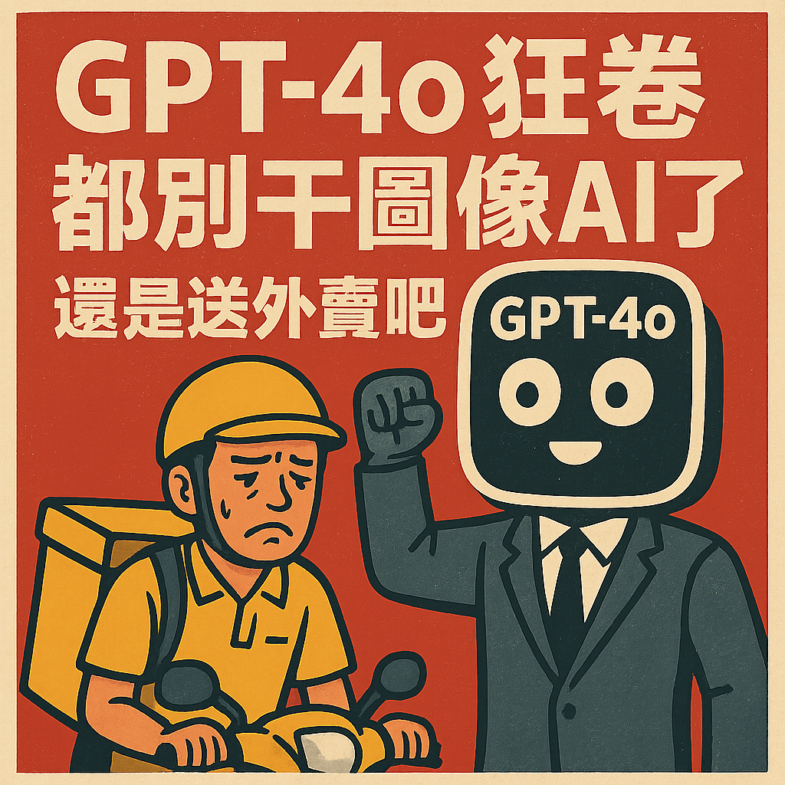<br>
<sub>Image © 2025 <a href="https://github.com/jamez-bondos">@jamez-bondos</a>, <a href="https://creativecommons.org/licenses/by/4.0/">CC BY 4.0</a> • Prompt by <a href="https://x.com/ZHO_ZHO_ZHO">@ZHO_ZHO_ZHO</a></sub>

**Prompt**

```
Satirical Poster Text (English):
GPT-4o is taking over.
Forget working in image AI
maybe it’s time to deliver takeout instead.
```


---

[⬆️ Back to Cases Directory](#cases-toc)

<a id="cases-14"></a>
### Case 14: One Piece Themed Figure Creation (by [@dotey](https://x.com/dotey))

[Source Link](https://x.com/dotey/status/1909047547563213145)

<br>
<sub>Image © 2025 <a href="https://github.com/jamez-bondos">@jamez-bondos</a>, <a href="https://creativecommons.org/licenses/by/4.0/">CC BY 4.0</a> • Prompt by <a href="https://x.com/dotey">@dotey</a></sub>

**Prompt**

```
Transform the person in the photo into a One Piece-themed anime-style action figure, presented inside a collectible figure box designed in the visual style of the One Piece universe. The box is shown in an isometric view.
Inside the box, display the character reimagined in the One Piece anime art style, posed dynamically and accompanied by essential everyday items such as a pistol, a wristwatch, a suit, and leather shoes — all miniaturized and arranged like collectible accessories.
Next to the box, include a realistic, fully rendered version of the actual figure itself, outside of the packaging. This figure should be rendered with high detail and realism, showcasing the material textures and craftsmanship, as if it were a professionally photographed product.
```

*Note: The list of essential items was slightly modified here. Please refer to the original source.*

**Reference Image Required:** A half-body or full-body photo.


---

[⬆️ Back to Cases Directory](#cases-toc)

<a id="cases-13"></a>
### Case 13: Photo to 3D Q-version Style (by [@dotey](https://x.com/dotey))

[Source Link](https://x.com/dotey/status/1908194518345678865)

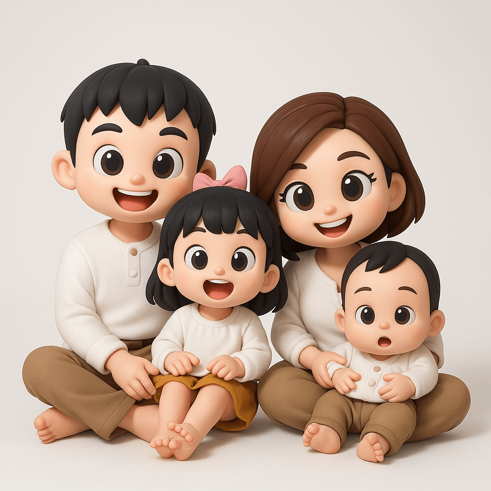<br>
<sub>Image © 2025 <a href="https://github.com/jamez-bondos">@jamez-bondos</a>, <a href="https://creativecommons.org/licenses/by/4.0/">CC BY 4.0</a> • Prompt by <a href="https://x.com/dotey">@dotey</a></sub>

**Prompt**

```
Transform the characters in the scene into 3D chibi-style figures, while keeping the original scene layout and their clothing exactly the same.
```


**Reference Image Required:** A photo.


---

[⬆️ Back to Cases Directory](#cases-toc)

<a id="cases-12"></a>
### Case 12: 3D Couple Jewelry Box Figurine (by [@dotey](https://x.com/dotey))

[Source Link](https://x.com/dotey/status/1909332895115714835)

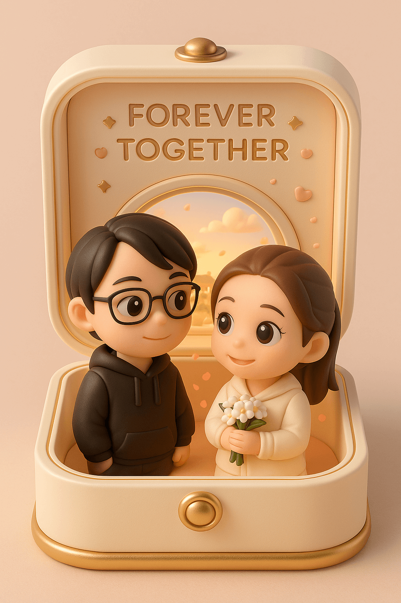<br>
<sub>Image © 2025 <a href="https://github.com/jamez-bondos">@jamez-bondos</a>, <a href="https://creativecommons.org/licenses/by/4.0/">CC BY 4.0</a> • Prompt by <a href="https://x.com/dotey">@dotey</a></sub>

**Prompt**

```
Create a finely crafted, adorably charming 3D-rendered collectible figure based on the subjects in the photo, displayed inside a pastel-toned, warm and romantic presentation box. The box is designed in a soft cream color with gentle gold accents, resembling an elegant portable jewelry case.

When opened, the box reveals a heartwarming romantic scene: two chibi-style characters gazing sweetly at each other. The lid is engraved with the words “FOREVER TOGETHER,” surrounded by delicate star and heart motifs.

Inside the box stands the female from the photo, holding a small bouquet of white flowers. Beside her is her partner, the male from the photo. Both characters have large, expressive, sparkling eyes and soft, warm smiles that radiate affection and charm.

Behind them is a round window, through which a sunny skyline of a traditional Chinese town can be seen, along with gently drifting clouds. The interior is softly lit with warm ambient lighting, and petals float in the background to enhance the atmosphere.

The overall color scheme of both the display box and the characters is elegant and harmonious, creating a luxurious and dreamlike miniature keepsake.

Aspect ratio: 9:16
```


**Reference Image Required:** A couple's photo.


---

[⬆️ Back to Cases Directory](#cases-toc)

<a id="cases-11"></a>
### Case 11: PS2 Game Cover (GTA x Shrek) (by [@dotey](https://x.com/dotey))

[Source Link](https://x.com/dotey/status/1904978767090524372)

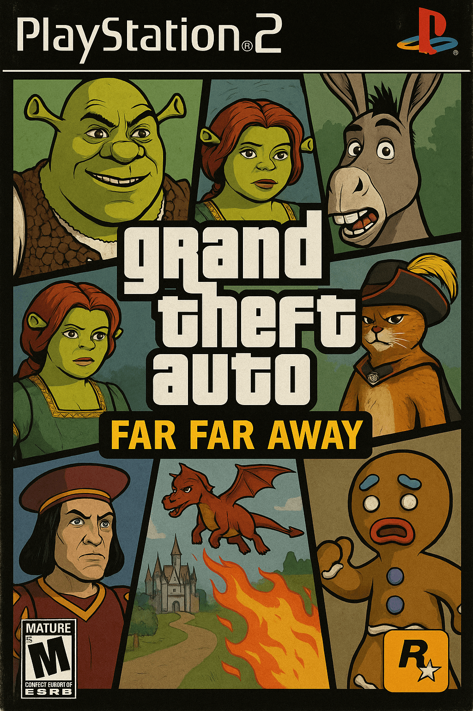<br>
<sub>Image © 2025 <a href="https://github.com/jamez-bondos">@jamez-bondos</a>, <a href="https://creativecommons.org/licenses/by/4.0/">CC BY 4.0</a> • Prompt by <a href="https://x.com/dotey">@dotey</a></sub>

**Prompt**

```
Can you create a PS2 video game case of "Grand Theft Auto: Far Far Away" a GTA based in the Shrek Universe.
```


---

[⬆️ Back to Cases Directory](#cases-toc)

<a id="cases-10"></a>
### Case 10: Satirical Cartoon Generation (by [@dotey](https://x.com/dotey))

[Source Link](https://x.com/dotey/status/1910514811756065159)

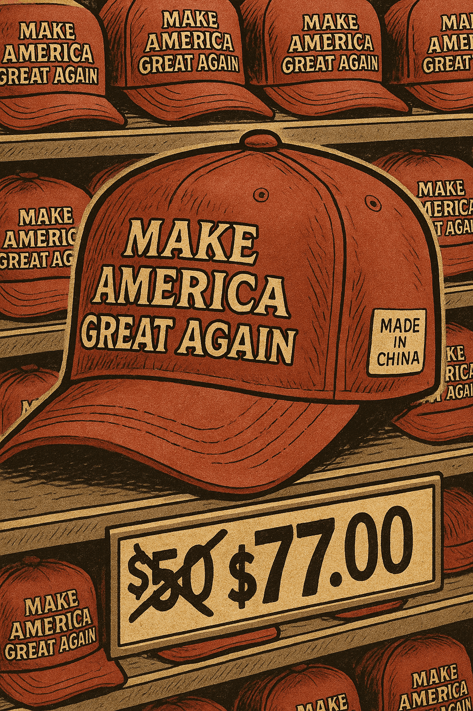<br>
<sub>Image © 2025 <a href="https://github.com/jamez-bondos">@jamez-bondos</a>, <a href="https://creativecommons.org/licenses/by/4.0/">CC BY 4.0</a> • Prompt by <a href="https://x.com/dotey">@dotey</a></sub>

**Prompt**

```
An illustration in satirical comic style, rendered in a vintage American comic aesthetic. The background features a multi-tiered shelf stocked entirely with identical red baseball caps. The caps have a bold slogan on the front: “MAKE AMERICA GREAT AGAIN,” while a white side tag on each reads “MADE IN CHINA.” The composition uses a close-up perspective focusing on one specific red cap.
At the bottom of the image, a price label is shown: the original price “$50.00” is crossed out with a thick black X and replaced with “$77.00.” The overall color palette uses nostalgic ochre and deep red tones, with shading that mimics the textured print style of 1990s retro comics.
The composition is exaggerated and satirical, carrying a strong critique of political consumerism.
```


---

[⬆️ Back to Cases Directory](#cases-toc)

<a id="cases-9"></a>
### Case 9: Minimalist Futurist Poster (by [@ZHO_ZHO_ZHO](https://x.com/ZHO_ZHO_ZHO))

[Source Link](https://x.com/ZHO_ZHO_ZHO/status/1921906728763105394)

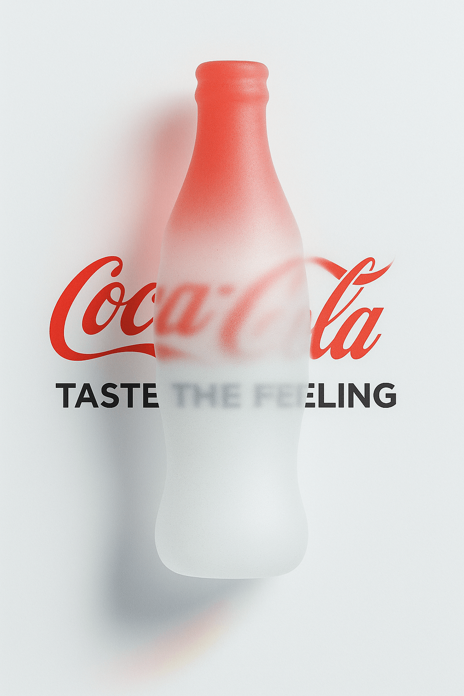<br>
<sub>Image © 2025 <a href="https://github.com/jamez-bondos">@jamez-bondos</a>, <a href="https://creativecommons.org/licenses/by/4.0/">CC BY 4.0</a> • Prompt by <a href="https://x.com/ZHO_ZHO_ZHO">@ZHO_ZHO_ZHO</a></sub>

**Prompt**

```
A vertical (3:4) 4K-resolution minimalist futurist exhibition poster with an ultra-light cool gray background (#f4f4f4).

At the center of the poster is a fluid 3D metaball shaped like a classic Coca-Cola bottle in full form, rendered in frosted glass with delicate grainy noise.
The fluid gradient transitions from Coca-Cola Red (#E41C23) to Pearl White (#FFFFFF), giving it a silky glass-like appearance.

High-position softbox lighting casts long, soft colored shadows and a subtle halo.

The fluid overlaps with the text: letters obscured by the frosted glass appear with a gentle Gaussian blur.
•The main title, the classic red “Coca-Cola” logo, is centered and partially obscured by the fluid. The covered letters are slightly blurred through the frosted glass.
•The subtitle, in bold all-caps modern sans-serif pure black font, reads: “TASTE THE FEELING”, placed below the main title. It is also partially overlapped by the fluid and blurred in those areas, while the rest remains sharp.

The overall layout is clean with generous whitespace, balanced composition, sharp focus, and HDR high dynamic range.
```

*Note: The [Classic 3D Coca-Cola Bottle] in the prompt can be replaced with descriptions of other items to generate posters with different themes.*


---

[⬆️ Back to Cases Directory](#cases-toc)

<a id="cases-8"></a>
### Case 8: Lego Collectible Figure (by [@ZHO_ZHO_ZHO](https://x.com/ZHO_ZHO_ZHO))

[Source Link](https://x.com/ZHO_ZHO_ZHO/status/1910644499354968091)

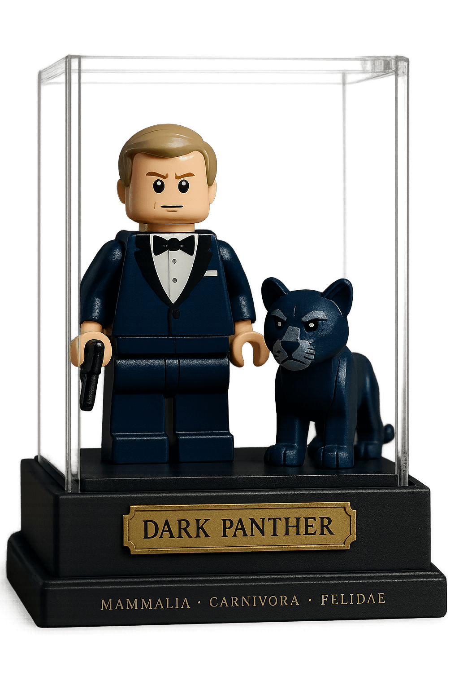<br>
<sub>Image © 2025 <a href="https://github.com/jamez-bondos">@jamez-bondos</a>, <a href="https://creativecommons.org/licenses/by/4.0/">CC BY 4.0</a> • Prompt by <a href="https://x.com/ZHO_ZHO_ZHO">@ZHO_ZHO_ZHO</a></sub>

**Prompt**

```
Generate a vertically-oriented image based on my uploaded photo, using the following prompt:
Classic LEGO minifigure style in a miniature scene — an animal stands beside me. The color palette of the animal should match mine.
Please design the animal based on your understanding of me. You may choose any creature — real, surreal, or fantastical — that you feel best reflects my personality.
The entire scene is set within a transparent glass cube, with a minimalist interior design.
The base of the miniature is matte black with silver accents, following a clean and modern aesthetic.
On the base, there is an elegantly engraved nameplate in a refined serif font, displaying the name of the animal.
The lower part of the base subtly incorporates finely etched biological classification details, similar to a natural history museum display.
The overall composition should resemble a high-end collectible artwork: meticulously crafted, curated in style, and lit with refined lighting.
Balance is key to the layout. The background should feature a smooth gradient transition from dark to light tones, selected to match the dominant color theme.
```


**Reference Image Required:** A half-body or full-body single person photo.


---

[⬆️ Back to Cases Directory](#cases-toc)

<a id="cases-7"></a>
### Case 7: Personalized Room Design (by [@ZHO_ZHO_ZHO](https://x.com/ZHO_ZHO_ZHO))

[Source Link](https://x.com/ZHO_ZHO_ZHO/status/1910698005193515370)

<br>
<sub>Image © 2025 <a href="https://github.com/jamez-bondos">@jamez-bondos</a>, <a href="https://creativecommons.org/licenses/by/4.0/">CC BY 4.0</a> • Prompt by <a href="https://x.com/ZHO_ZHO_ZHO">@ZHO_ZHO_ZHO</a></sub>

**Prompt**

```
Design a cozy bedroom in a cute 3D style with C4D-quality rendering, presented in an isometric view. The room includes a bed, bookshelf, sofa, green plants, a computer desk, and a computer setup. A framed painting hangs on the wall. Outside the window, a nighttime cityscape is visible with glowing buildings and a dark sky. All furniture and objects should have a soft, rounded, stylized design to match the cute 3D aesthetic. Lighting should be warm and inviting, creating a comfortable nighttime indoor atmosphere.
```

*Note: The original prompt generated the room based on ChatGPT's memory of the user. This version is slightly modified. Please refer to the original source.*


---

[⬆️ Back to Cases Directory](#cases-toc)

<a id="cases-6"></a>
### Case 6: Character Stepping Through Portal (by [@dotey](https://x.com/dotey))

[Source Link](https://x.com/dotey/status/1908910838636765204)

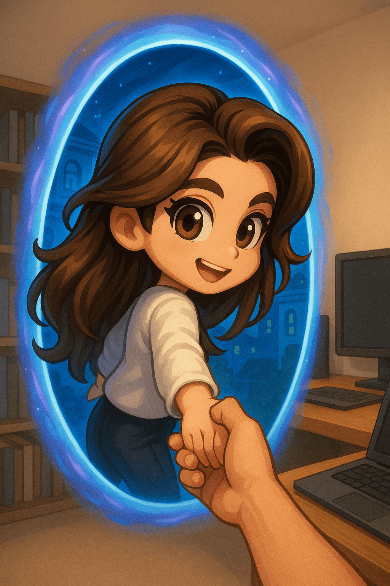<br>
<sub>Image © 2025 <a href="https://github.com/jamez-bondos">@jamez-bondos</a>, <a href="https://creativecommons.org/licenses/by/4.0/">CC BY 4.0</a> • Prompt by <a href="https://x.com/dotey">@dotey</a></sub>

**Prompt**

```
A 3D chibi-style version of the person in the photo is stepping through a glowing portal, reaching out and holding the viewer’s hand. As the character pulls the viewer forward, they turn back with a dynamic glance, inviting the viewer into their world.
Behind the portal is the viewer’s real-life environment: a typical programmer’s study with a desk, monitor, and laptop, rendered in realistic detail. Inside the portal lies the character’s 3D chibi world, inspired by the photo, with a cool blue color scheme that sharply contrasts with the real-world surroundings.
The portal itself is a perfectly elliptical frame glowing with mysterious blue and purple light, positioned at the center of the image as a gateway between the two worlds.
The scene is captured from a third-person perspective, clearly showing the viewer’s hand being pulled into the character’s world. Use a 2:3 aspect ratio.
```


**Reference Image Required:** A clear half-body or full-body single person photo.


---

[⬆️ Back to Cases Directory](#cases-toc)

<a id="cases-5"></a>
### Case 5: Ghibli Style (by [AnimeAI](https://animeai.online))

[Source Link](https://animeai.online/#demo-gallery)

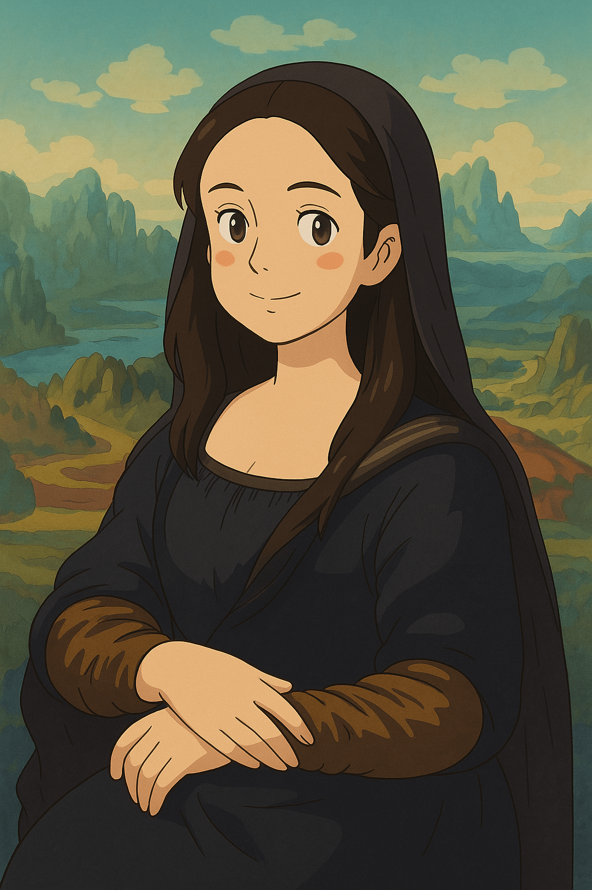<br>
<sub>Image © 2025 <a href="https://github.com/jamez-bondos">@jamez-bondos</a>, <a href="https://creativecommons.org/licenses/by/4.0/">CC BY 4.0</a> • Prompt by <a href="https://animeai.online">AnimeAI</a></sub>

**Prompt**

```
Redraw this photo in Ghibli style
```

*Note: If encountering content policy violations, add this sentence to the prompt: If there is inappropriate (sensitive) content in the background, it can be modified or deleted.*

**Reference Image Required:** A photo of a person or other subject.


---

[⬆️ Back to Cases Directory](#cases-toc)

<a id="cases-4"></a>
### Case 4: 3D Chibi Chinese Wedding Scene (by [@balconychy](https://x.com/balconychy))

[Source Link](https://x.com/balconychy/status/1909418699150237917)

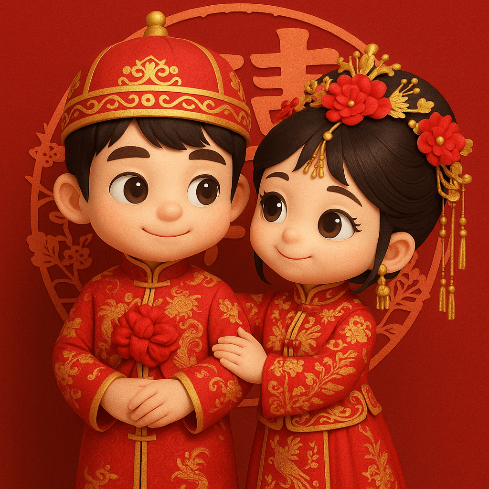<br>
<sub>Image © 2025 <a href="https://github.com/jamez-bondos">@jamez-bondos</a>, <a href="https://creativecommons.org/licenses/by/4.0/">CC BY 4.0</a> • Prompt by <a href="https://x.com/balconychy">@balconychy</a></sub>

**Prompt**

```
Transform the two people in the photo into chibi-style 3D cartoon characters, dressed in traditional Chinese wedding attire. The overall theme is a festive red Chinese-style wedding. The background features a decorative “囍” (double happiness) paper-cut pattern in a classic folk style. 
Clothing (realistic texture, traditional details):
Male: Wearing a red changpao and magua (traditional robe and jacket) embroidered with golden dragon motifs, symbolizing nobility and grandeur. A large red flower is tied on his chest, representing celebration and good fortune.
Female: Dressed in a red xiuhe wedding gown adorned with exquisite golden floral and phoenix embroidery, showcasing elegance and luxury. She wears delicate floral hair ornaments to enhance her gentle and graceful appearance.
Headwear:
Male: A traditional red zhuangyuan (scholar) hat with golden patterns and a refined golden ornament at the top, exuding classic scholarly dignity.
Female: A phoenix crown adorned with a central red flower, gold 3D decorative elements, and hanging tassels—luxurious and full of classical charm.
This image should reflect the joy and blessing of a traditional Chinese wedding, with realistic textures for costumes and accessories, combined with stylized 3D chibi characters.
```


**Reference Image Required:** A couple's photo.


---

[⬆️ Back to Cases Directory](#cases-toc)

<a id="cases-3"></a>
### Case 3: Retro Style Promotional Poster (by [@dotey](https://x.com/dotey))

[Source Link](https://x.com/dotey/status/1905251524248248650)

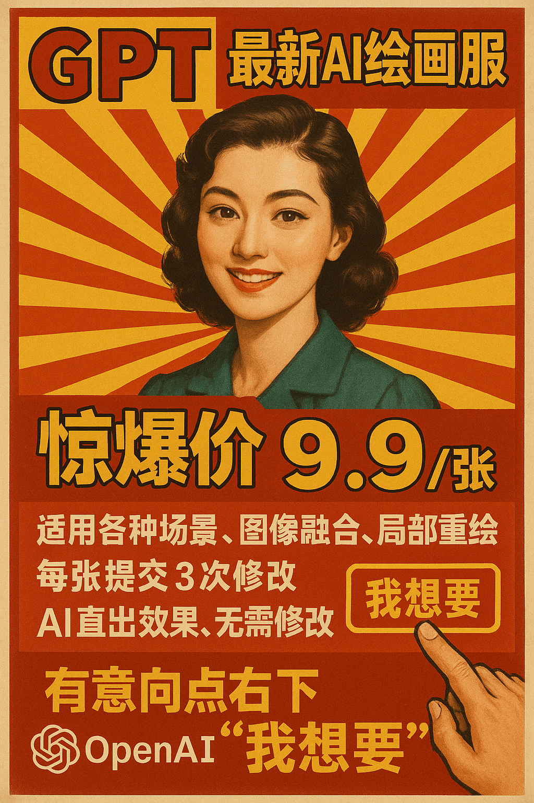<br>
<sub>Image © 2025 <a href="https://github.com/jamez-bondos">@jamez-bondos</a>, <a href="https://creativecommons.org/licenses/by/4.0/">CC BY 4.0</a> • Prompt by <a href="https://x.com/dotey">@dotey</a></sub>

**Prompt**

```
A retro-style promotional poster emphasizing bold Chinese text. The background features a red-and-yellow radial burst pattern. In the center of the composition is a beautiful young woman illustrated in a refined vintage art style—she smiles warmly with a graceful, approachable presence. The poster advertises GPT’s latest AI image generation service with key slogans in Chinese, such as: “Shocking price: 9.9 per image”, “Supports all scenes, image blending, partial redrawing”, “3 revisions per image”, and “Direct AI output with no need for manual edits”. At the bottom, prominently display the call-to-action: “If you’re interested, click ‘I want this’ in the bottom-right corner”. Illustrate a hand pressing a button in the bottom-right, and place the OpenAI logo in the bottom-left.
```


---

[⬆️ Back to Cases Directory](#cases-toc)

<a id="cases-2"></a>
### Case 2: 3D Polaroid Breakout Effect (by [@dotey](https://x.com/dotey))

[Source Link](https://x.com/dotey/status/1908238003169903060)

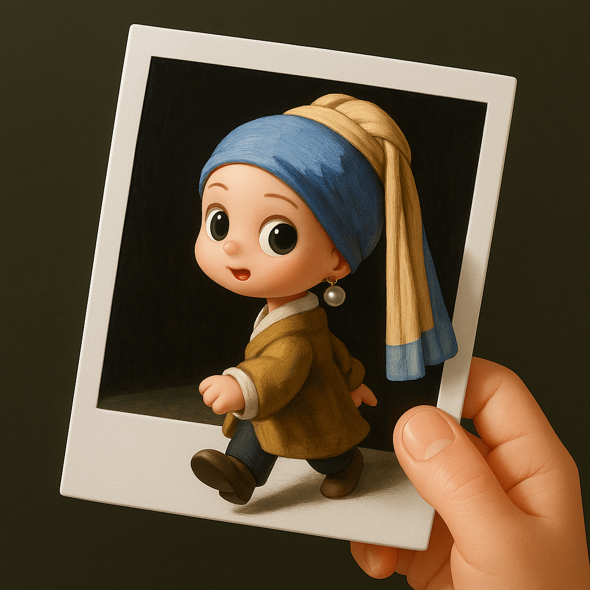<br>
<sub>Image © 2025 <a href="https://github.com/jamez-bondos">@jamez-bondos</a>, <a href="https://creativecommons.org/licenses/by/4.0/">CC BY 4.0</a> • Prompt by <a href="https://x.com/dotey">@dotey</a></sub>

**Prompt**

```
Convert the character in the scene into a 3D chibi-style figure, placed inside a Polaroid photo. The photo paper is being held by a human hand. The character is stepping out of the Polaroid frame, creating a visual effect of breaking through the two-dimensional photo border and entering the real-world 3D space.
```


**Reference Image Required:** A half-body or full-body single person photo.


---

[⬆️ Back to Cases Directory](#cases-toc)

<a id="cases-1"></a>
### Case 1: 3D Chibi Proposal Scene (by [@balconychy](https://x.com/balconychy))

[Source Link](https://x.com/balconychy/status/1909417750587486469)

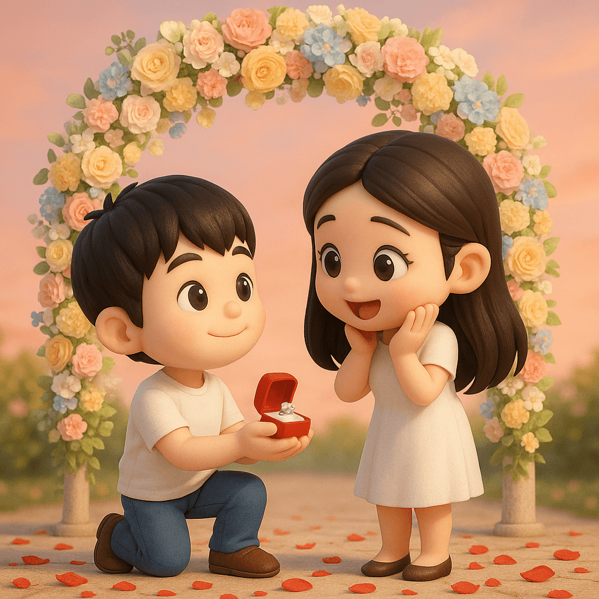<br>
<sub>Image © 2025 <a href="https://github.com/jamez-bondos">@jamez-bondos</a>, <a href="https://creativecommons.org/licenses/by/4.0/">CC BY 4.0</a> • Prompt by <a href="https://x.com/balconychy">@balconychy</a></sub>

**Prompt**

```
Transform the two people in the photo into chibi-style 3D cartoon characters. Change the scene to a proposal setting, with a soft pastel-colored floral arch in the background. Use romantic tones for the overall background. Rose petals are scattered on the ground. While the characters are rendered in cute chibi 3D style, the environment—including the arch, lighting, and textures—should be realistic and photorealistic.
```


**Reference Image Required:** A couple's photo.


---

[⬆️ Back to Cases Directory](#cases-toc)


---

<a id="tools-intro"></a>
## 🛠️ Tools Introduction

Here are applications where you can use the GPT-4o model to generate images:

- **💬 [ChatGPT](https://chatgpt.com):** Official OpenAI product. Use GPT-4o to generate high-quality images with support for multiple styles and detailed control, suitable for creative expression and content creation.

- **🎬 [Sora](https://sora.com):** Official OpenAI product. Generate realistic images via GPT-4o, supporting text-image combination and scene reconstruction, suitable for visual creative scenarios like film and animation. *(Note: Sora access is currently limited)*
- **🤖 [gpt-image-1 API](https://platform.openai.com/docs/guides/image-generation)：** Officially developed by OpenAI, the latest image generation model can be accessed via API and provides:
  - ✅ More accurate, high fidelity images
  - 🎨 Diverse visual styles
  - ✏️ Precise image editing
  - 🌎 Rich world knowledge
  - 🔤 Consistent text rendering


<a id="prompting-tips"></a>
## 💡 Prompting Tips

1. [Prompt Engineering (PDF)](https://s.baoyu.io/files/2025-01-18-pdf-1-TechAI-Goolge-whitepaper_Prompt%20Engineering_v4-af36dcc7a49bb7269a58b1c9b89a8ae1.pdf) by Google
2. [Introducing 4o Image Generation](https://openai.com/index/introducing-4o-image-generation) by OpenAI


<a id="how-to-contribute"></a>
## 🤝 How to Contribute

There are two ways to contribute, please read [CONTRIBUTING.md](./CONTRIBUTING.md).


<a id="acknowledgements"></a>
## 🙏 Acknowledgements

The content of this collection heavily relies on the creative prompts and wonderful visuals shared by the AI community on Twitter/X. We express our sincere gratitude to all contributors of these cases. 😊

Special thanks to the following users for sharing their inspiring work ✨:

*   [-Zho- (@ZHO_ZHO_ZHO)](https://x.com/ZHO_ZHO_ZHO)
*   [Gizem Akdag (@gizakdag)](https://x.com/gizakdag)
*   [宝玉 (@dotey)](https://x.com/dotey)
*   [balconychy(贝壳里奇) (@balconychy)](https://x.com/balconychy)
*   [Daniel (@0xdlk)](https://x.com/0xdlk)
*   [RichChat (@richardchang)](https://x.com/richardchang)
*   [歸藏(guizang.ai) (@op7418)](https://x.com/op7418)
*   [katon (@hellokaton)](https://x.com/hellokaton)
*   [Berryxia.AI (@berryxia_ai)](https://x.com/berryxia_ai)
*   [Ege (@egeberkina)](https://x.com/egeberkina)
*   [Brett (@BrettFromDJ)](https://x.com/BrettFromDJ)
*   [89'S (@M_w14_)](https://x.com/M_w14_)
*   [jiamimao 猫叔 (@jiamimaodashu)](https://x.com/jiamimaodashu)
*   [Amira Zairi (@azed_ai)](https://x.com/azed_ai)
*   [Umesh (@umesh_ai)](https://x.com/umesh_ai)
*   [Michael Rabone (@michaelrabone)](https://x.com/michaelrabone)
*   [gnrly.xyz (@gnrlyxyz)](https://x.com/gnrlyxyz)
*   [f-is-h (@f-is-h)](https://github.com/f-is-h)
*   [Madpencil (@madpencil_)](https://x.com/madpencil_)
*   [Hewar (@hewarsaber)](https://x.com/hewarsaber)
*   [Anima (@Anima_Labs)](https://x.com/Anima_Labs)
*   [terry623 (@terry623)](https://github.com/terry623)
*   [photis (Sora Profile)](https://sora.com/explore?user=user-sydD5ZkXZsDaL0BriQa010dQ)
*   [Ryan Hart (@thisdudelikesAI)](https://x.com/thisdudelikesAI)
*   [Gadgetify (@Gdgtify)](https://x.com/Gdgtify)
*   [Ilyas Salaoui (@TheRelianceAI)](https://x.com/TheRelianceAI)
*   [Leon (@leon_yuan2001)](https://x.com/leon_yuan2001)
*   [AZIZ | AI (@aziz4ai)](https://x.com/aziz4ai)
*   [小肥鲸 (@Alittlefatwhale)](https://x.com/Alittlefatwhale)
*   And other creators whose prompts may have been included through retweets or indirect shares.

If your work is included here and you wish to change the attribution or have it removed, please feel free to contact us. ✉️

[⬆️ Back to Top](#readme-top)


<a id="star-history"></a>
## 🌟 Star History

[](https://www.star-history.com/#jamez-bondos/awesome-gpt4o-images&Date)

[⬆️ Back to Top](#readme-top)

