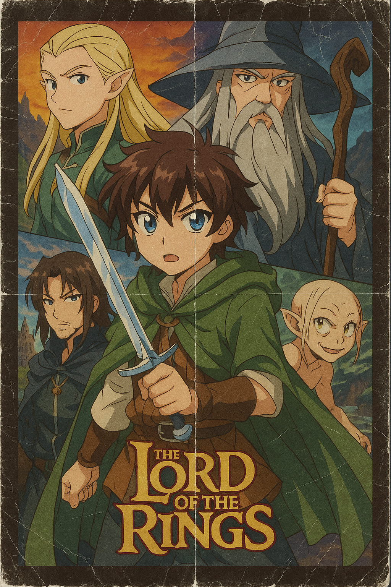
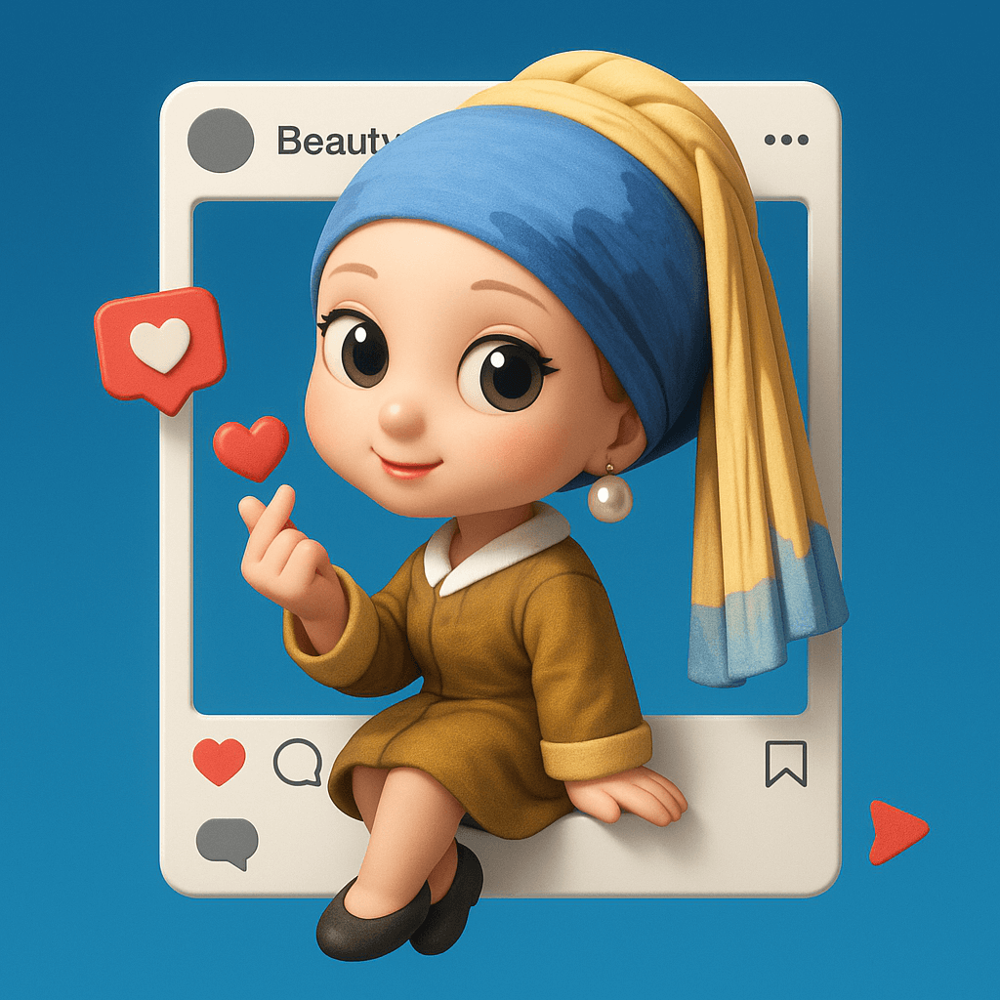
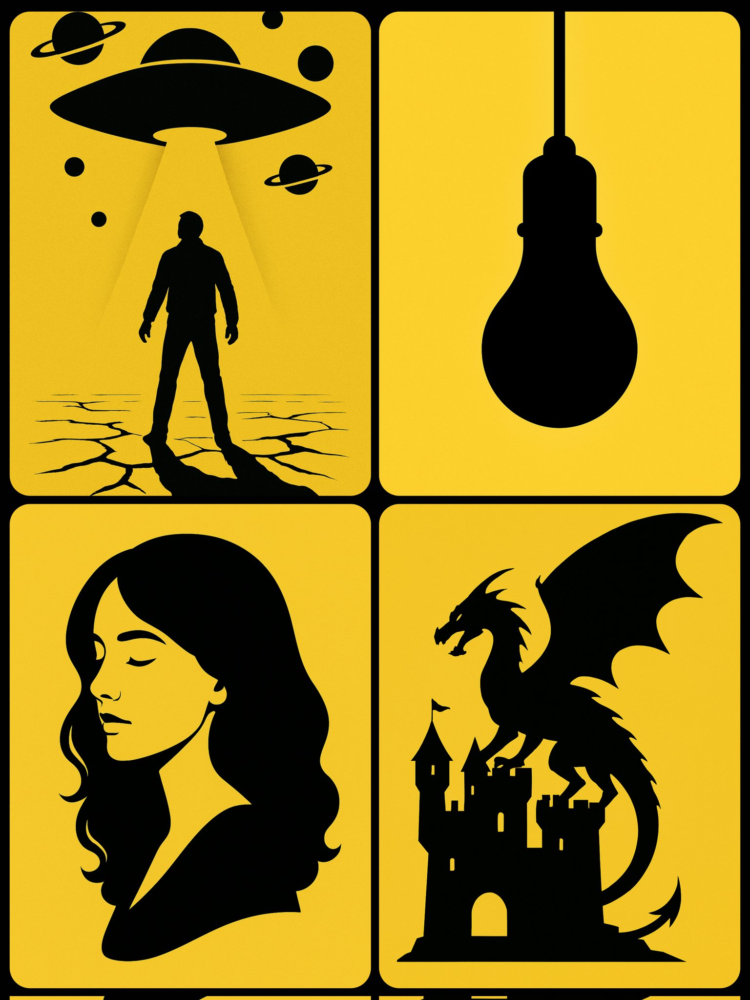
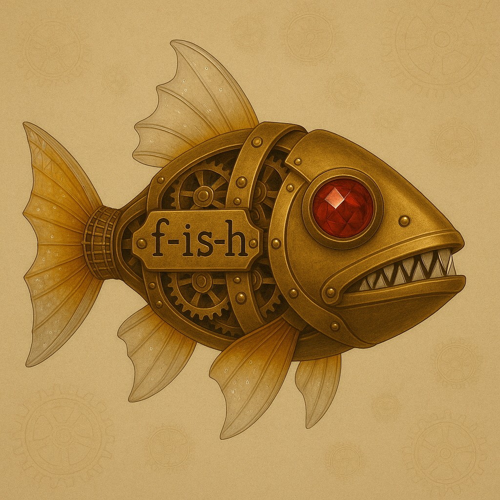
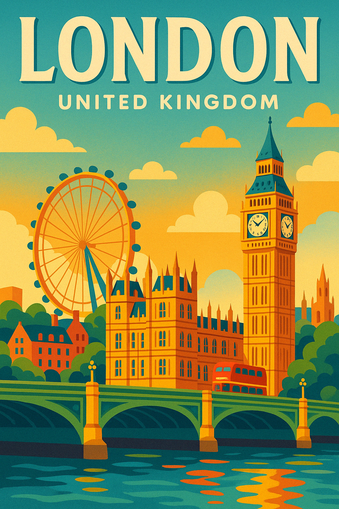
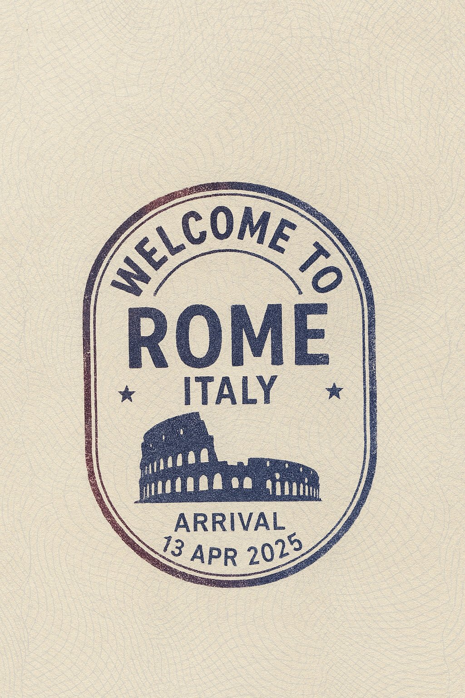

<a id="readme-top"></a>
# Awesome GPT-4o Images ✨

[](README_en.md)
[](README.md)
<a href="https://github.com/jamez-bondos/awesome-gpt4o-images/stargazers">
  
</a>

🎉 Welcome to the curated collection of images generated by GPT-4o!

This repo gathers striking examples produced by OpenAI's newest multimodal model, GPT‑4o.

Most examples come from Twitter/X 🐦. May they spark ideas 💡 and turbo‑charge your creativity 🚀.

OpenAI’s latest cutting-edge image model, **gpt-image-1**, has been released, offering even more powerful image generation capabilities and is available via API.

<strong>Check out the 40+ brilliant examples below, carefully curated and translated by this project, sourced from OpenAI official materials, showcasing the power of `gpt-image-1`! 👇</strong>

-   Chinese Version: [OpenAI gpt-image-1: 40 Curated Prompt & Image Examples (Chinese)](./gpt-image-1/gpt-image-1.md)
-   English Version: [OpenAI gpt-image-1: 40 Curated Prompt & Image Examples](./gpt-image-1/gpt-image-1-en.md)

*Note: Both `gpt-image-1` and GPT-4o are OpenAI's latest image generation products, supported by largely the same underlying models. The main difference is that the former is currently accessed via API, while the latter powers official products like ChatGPT and Sora. `gpt-image-1` represents the newer iteration available through the API.*

<strong>→ 喜欢就点 Star 支持！ / Smash that ⭐ if you like it!</strong>

<a id="contents-toc"></a>
## Contents

- [🎨 What is GPT‑4o](#gpt4o-toc)
- [📖 Example Directory](#example-toc)
- [🛠️ Tools Introduction](#tools-toc)
- [💡 Prompting Tips](#prompting-toc)
- [🤝 How to Contribute](#contribute-toc)
- [🙏 Acknowledgements](#acknowledgements-toc)
- [🌟 Star History](#starhistory-toc)

<a id="gpt4o-toc"></a>
## 🎨 What is GPT‑4o

GPT‑4o is a multimodal model that not only turns text prompts into high‑quality images but also offers image‑to‑image editing—enabling targeted retouching, style transfer, and multi‑image blending.

- 🧠 Multimodal comprehension: Simultaneously parses text and images to capture creative intent with precision
- ✍️ Accurate rendering: Handles complex prompts and rapidly produces high‑quality images
- 🎨 Diverse styles: Ghibli, painterly, pixel art, 3D plush, and more—pick your favorite
- 🖼️ Realistic composition: Spatial depth, perspective, and lighting that feel authentic
- ✏️ Easy post‑editing: Swap backgrounds, tweak details—seamless for second‑round creation
- ⚡️ Lightning‑fast interaction: Shorter response times for real‑time ideation and iteration


---

<a id="example-toc"></a>
## 📖 Example Directory

**Note on Prompts:** For accuracy and reproducibility, prompts are provided in their original language (Chinese or English) as used for generation.

*   [Example 80: Code Style Business Card (by @umesh_ai)](#examples-80)
*   [Example 79: Lego Cityscape (by @dotey)](#examples-79)
*   [Example 78: Glass Retexturing (by @egeberkina)](#examples-78)
*   [Example 77: Story Scene in Crystal Ball (by @dotey)](#examples-77)
*   [Example 76: Nostalgic Anime Film Poster (by photis (Sora))](#examples-76)
*   [Example 75: Social Media Frame Integration (by @dotey)](#examples-75)
*   [Example 74: Logo Shaped Bookshelf (by @umesh_ai)](#examples-74)
*   [Example 73: Cute Chibi Keychain (by @azed_ai)](#examples-73)
*   [Example 72: Gold Pendant Necklace (by @azed_ai)](#examples-72)
*   [Example 71: Miniature Cyberpunk Tilt-Shift Landscape (by @terry623)](#examples-71)
*   [Example 70: Original Pokemon Creation (by @Anima_Labs)](#examples-70)
*   [Example 69: Silhouette Art (by @umesh_ai)](#examples-69)
*   [Example 68: Futuristic Logo Trading Card (by @hewarsaber)](#examples-68)
*   [Example 67: Ultra-realistic 3D Game (by @ZHO_ZHO_ZHO)](#examples-67)
*   [Example 66: Creative Silk Universe (by @ZHO_ZHO_ZHO)](#examples-66)
*   [Example 65: Trompe-l'œil Three-Dimensional Spatial Art (by @madpencil_)](#examples-65)
*   [Example 64: Steampunk Mechanical Fish (by @f-is-h)](#examples-64)
*   [Example 63: Emoji Cream Popsicle (by @ZHO_ZHO_ZHO)](#examples-63)
*   [Example 62: Kawaii Enamel Pin (by @gnrlyxyz)](#examples-62)
*   [Example 61: Fake Tweet Screenshot (Einstein) (by @egeberkina)](#examples-61)
*   [Example 60: Emoji Tufted Rug (by @gizakdag)](#examples-60)
*   [Example 59: Colorful Vector Art Poster (by @michaelrabone)](#examples-59)
*   [Example 58: Cloud Art (by @umesh_ai)](#examples-58)
*   [Example 57: 8-Bit Pixel Icon (by @egeberkina)](#examples-57)
*   [Example 56: Miniature 3D Building (by @dotey)](#examples-56)
*   [Example 55: Low-Poly 3D Render (by @azed_ai)](#examples-55)
*   [Example 54: "Extremely Ordinary" iPhone Selfie (Eason & Nicholas) (by @jiamimaodashu)](#examples-54)
*   [Example 53: Emoji Inflatable Cushion (by @gizakdag)](#examples-53)
*   [Example 52: Paper Craft Style Emoji Icon (by @egeberkina)](#examples-52)
*   [Example 51: Passport Entry Stamp (Rome) (by @M_w14_)](#examples-51)
*   [Example 50: Physical Destruction Effect Card (Lara Croft) (by @op7418)](#examples-50)
*   [Example 49: Fashion Magazine Cover Style (by @dotey)](#examples-49)
*   [Example 48: Voxel Style 3D Icon Conversion (by @BrettFromDJ)](#examples-48)
*   [Example 47: ESC Keycap Miniature Diorama (by @egeberkina)](#examples-47)
*   [Example 46: Happy Capsule Creation (by @ZHO_ZHO_ZHO)](#examples-46)
*   [Example 45: 3D Q-version University Anthropomorphic Mascot (by @dotey)](#examples-45)
*   [Example 44: RPG-Style Character Card Creation (by @berryxia_ai)](#examples-44)
*   [Example 43: Q-version Cute Matryoshka Dolls (Girl with a Pearl Earring) (by @ZHO_ZHO_ZHO)](#examples-43)
*   [Example 42: 3D Q-version Couple Snow Globe (by @balconychy)](#examples-42)
*   [Example 41: Miniature Diorama (Monkey King Fights White Bone Demon) (by @dotey)](#examples-41)
*   [Example 40: Japanese-style Two-Panel Manga (Angry Girl President) (by @hellokaton)](#examples-40)
*   [Example 39: Cartoon Illustration (Computer Head) (by @dotey)](#examples-39)
*   [Example 38: Hand-drawn Infographic Card (IP) (by @dotey)](#examples-38)
*   [Example 37: Social Media Post Doodle Overlay (by @op7418)](#examples-37)
*   [Example 36: Minimalist 3D Illustration (Text Prompt) (by @dotey)](#examples-36)
*   [Example 35: Fluffy Jack-o'-lantern (by gizakdag)](#examples-35)
*   [Example 34: Hand-drawn Infographic Card (Cognition) (by @dotey)](#examples-34)
*   [Example 33: Family Wedding Photo (Q-version) (by @balconychy)](#examples-33)
*   [Example 32: Paper Cutout Style Job Ad (by @dotey)](#examples-32)
*   [Example 31: Anime Sticker Collection (by @richardchang)](#examples-31)
*   [Example 30: 35mm Film Style Flying Island (by @dotey)](#examples-30)
*   [Example 29: Famous Painting Character OOTD (by @ZHO_ZHO_ZHO)](#examples-29)
*   [Example 28: Flat Sticker Design (by @ZHO_ZHO_ZHO)](#examples-28)
*   [Example 27: Q-version Emoji Sticker Pack Creation (by @dotey)](#examples-27)
*   [Example 26: Famous Painting Character Cereal Ad (by @ZHO_ZHO_ZHO)](#examples-26)
*   [Example 25: Minimalist 3D Illustration (by @0xdlk)](#examples-25)
*   [Example 24: Funko Pop Figure Creation (by @dotey)](#examples-24)
*   [Example 23: "Titanic" Pose Parody (by @balconychy)](#examples-23)
*   [Example 22: Xiaohongshu Cover Image (by @balconychy)](#examples-22)
*   [Example 21: Stick Figure Emoji Pack (by @ZHO_ZHO_ZHO)](#examples-21)
*   [Example 20: Four-Panel Manga (Theory of Relativity) (by @dotey)](#examples-20)
*   [Example 19: Textbook Illustration Redraw (by @balconychy)](#examples-19)
*   [Example 18: Pixar 3D Style (by AnimeAI)](#examples-18)
*   [Example 17: Digimon Style Image (by @ZHO_ZHO_ZHO)](#examples-17)
*   [Example 16: Pudding Slot Machine (by @ZHO_ZHO_ZHO)](#examples-16)
*   [Example 15: Satirical Poster Generation (by @ZHO_ZHO_ZHO)](#examples-15)
*   [Example 14: "One Piece" Themed Figure Creation (by @dotey)](#examples-14)
*   [Example 13: Photo to 3D Q-version Style (by @dotey)](#examples-13)
*   [Example 12: 3D Couple Jewelry Box Figurine (by @dotey)](#examples-12)
*   [Example 11: PS2 Game Cover (GTA x Shrek) (by @dotey)](#examples-11)
*   [Example 10: Satirical Cartoon Generation (by @dotey)](#examples-10)
*   [Example 9: Famous Painting as Helium Balloon (by @ZHO_ZHO_ZHO)](#examples-9)
*   [Example 8: Lego Collectible Figure (by @ZHO_ZHO_ZHO)](#examples-8)
*   [Example 7: Personalized Room Design (by @ZHO_ZHO_ZHO)](#examples-7)
*   [Example 6: Character Stepping Through Portal (by @dotey)](#examples-6)
*   [Example 5: Ghibli Style (by AnimeAI)](#examples-5)
*   [Example 4: Q-version Chinese Wedding Scene (by @balconychy)](#examples-4)
*   [Example 3: Vintage Promotional Poster (by @dotey)](#examples-3)
*   [Example 2: 3D Polaroid Breakout Effect (by @dotey)](#examples-2)
*   [Example 1: Q-version Proposal Scene (by @balconychy)](#examples-1)

---

<a id="examples-80"></a>
## Example 80: Code Style Business Card (by [@umesh_ai](https://x.com/umesh_ai))

[Source Link 1](https://x.com/umesh_ai/status/1915696926596415492)
[Source Link 2](https://x.com/fr0gger_/status/1916743281339498760)
[Source Link 3](https://x.com/dotey/status/1917412535130563006)


**Prompt Template:**
```
A close-up shot of a hand holding a business card designed to look like a JSON file opened in VS Code. The card shows code formatted in realistic syntax-highlighted JSON code. The window includes typical toolbar icons and a title bar labeled Business Card.json, styled exactly like the interface of VS Code. Background is slightly blurred, keeping the focus on the card.
The card displays the following code formatted in JSON:
{
  "name": "Jamez Bondos",
  "title": "Your Title",
  "email": "your@email.com",
  "link": "yourwebsite"
}

```

*Note: Replace the values of name, title, email, and link in the final JSON code. The prompt is a simplified version derived from the original source link.*

[⬆️ Back to Directory](#example-toc)


<a id="examples-79"></a>
## Example 79: Lego Cityscape (Shanghai Bund) (by [@dotey](https://x.com/dotey))

[Source Link](https://x.com/dotey/status/1917713810346872902)


**Prompt:**
```
Create a highly detailed and vividly colored LEGO rendition of Shanghai’s iconic Bund.
In the foreground, accurately recreate the classic historical architecture of the Bund using LEGO bricks, capturing the Western and neoclassical facades with intricate details like clock towers, domes, and colonnades. LEGO minifigures stroll along the waterfront, taking photos and sightseeing, while classic-style LEGO cars are parked along the streets.
In the background, depict the majestic Huangpu River using translucent blue LEGO bricks, with LEGO ferries and sightseeing boats on the water. Across the river, showcase the futuristic skyline of Lujiazui in Pudong, including colorful and realistic LEGO versions of the Oriental Pearl Tower, Shanghai Tower, Jin Mao Tower, and Shanghai World Financial Center.
The sky should be a bright LEGO blue, accented with a few white LEGO brick clouds. The overall scene should convey a vibrant and modern visual atmosphere.
```

*Note: You can ask AI to generate similar prompts for other cityscapes based on this example. Original image generated by Sora.*

[⬆️ Back to Directory](#example-toc)


<a id="examples-78"></a>
## Example 78: Glass Retexturing (by [@egeberkina](https://x.com/egeberkina))

[Source Link](https://x.com/egeberkina/status/1917631056980721743)


**Prompt:**
```
retexture the image attached based on the json below:

{
  "style": "photorealistic",
  "material": "glass",
  "background": "plain white",
  "object_position": "centered",
  "lighting": "soft, diffused studio lighting",
  "camera_angle": "eye-level, straight-on",
  "resolution": "high",
  "aspect_ratio": "2:3",
  "details": {
    "reflections": true,
    "shadows": false,
    "transparency": true
  }
}
```

*Note: This prompt uses a JSON structure to precisely control the output style.*

**Reference Image Required:** Yes, needs an image of the object to be retextured.

[⬆️ Back to Directory](#example-toc)

<a id="examples-77"></a>
## Example 77: Story Scene in Crystal Ball (by [@dotey](https://x.com/dotey))

[Source Link](https://x.com/dotey/status/1916530529324699858)


**Prompt:**
```
A delicate crystal ball rests quietly on a warm, softly lit table by the window. The background is blurred and dreamy, while warm-toned sunlight gently filters through the crystal, refracting into shimmering golden sparkles that softly illuminate the dim surroundings. Inside the crystal ball, a miniature 3D world themed around {Chang’e Flying to the Moon} unfolds naturally—an exquisitely detailed and dreamlike diorama. The characters and objects are rendered in a charming chibi (Q-style) design, full of lively emotional interactions. The overall atmosphere is infused with East Asian fantasy elements, rich in intricate details and imbued with a magical realism texture. The entire scene feels poetic and dreamlike, radiant yet elegant, glowing gently as if brought to life by the warmth of the surrounding light and shadow.
```

*Note: Replace the text within the square brackets {} in the prompt with a description of a story scene (idioms, stories, short tales all work).*


[⬆️ Back to Directory](#example-toc)

<a id="examples-76"></a>
## Example 76: Nostalgic Anime Film Poster (by photis (Sora))

[Source Link](https://sora.com/g/gen_01jsfxrdpjfpebnyed8yaz42nf)



**Prompt:**
```
{The Lord of the Rings} anime film poster, the anime is in the style of High School DXD. Visible even folds are seen across the poster as it’s been folded over time, and due to some creases over damaging the poster has caused some physical damage scuffing along the creases and the color has partially faded. Indiscriminate flaps and folds and scratches all around simply from moving back and forth causing subtle yet incremental damage with the ever expanding of entropy we cannot escape, but the loving memories in our hearts will forever be whole. Making the objects we collect along the way priceless is the essence you feel when looking at this nostalgic poster.
```

*Note: You can replace the movie title "{The Lord of the Rings}" in the prompt with others. Be aware that some movie titles may trigger content moderation. The referenced anime style can also be modified.*


[⬆️ Back to Directory](#example-toc)


<a id="examples-75"></a>
## Example 75: Social Media Frame Integration (by [@dotey](https://x.com/dotey))

[Source Link](https://x.com/dotey/status/1917042797506662560)



**Prompt:**
```
Based on the attached photo, create a stylized 3D Q-version character, accurately preserving facial features and clothing details. The character's left hand makes a heart sign (with a red heart element above the fingers), playfully sitting on the edge of a giant Instagram frame, legs dangling outside the frame. The top of the frame displays the username "Beauty", surrounded by floating social media icons (like, comment, share).
```
*Note: The username "Beauty" and icons in the prompt can be replaced. Original image generated by Sora.*

**Reference Image Required:** Yes, needs an image to be uploaded as reference.

[⬆️ Back to Directory](#example-toc)

<a id="examples-74"></a>
## Example 74: Logo Shaped Bookshelf (by [@umesh_ai](https://x.com/umesh_ai))

[Source Link](https://x.com/umesh_ai/status/1916517976414495161)


**Prompt:**
```
Create a photograph of a modern bookshelf inspired by the shape of [LOGO]. The bookshelf features flowing, interconnected curves forming multiple sections of varying sizes. It is made of sleek matte black metal with wooden shelves inside the loops. Soft, warm LED lighting outlines the inner curves. The bookshelf is mounted on a neutral-toned wall and holds a mix of colorful books, small plants, and minimalistic art pieces. The overall vibe is creative, elegant, and slightly futuristic
```

*Note: Replace the `[LOGO]` placeholder in the prompt with a specific brand logo description (e.g., "Apple logo", "McDonald's logo").*


[⬆️ Back to Directory](#example-toc)


<a id="examples-73"></a>
## Example 73: Cute Chibi Keychain (by [@azed_ai](https://x.com/azed_ai))

[Source Link](https://x.com/azed_ai/status/1916521742052503804)


**Prompt:**
```
A close-up photo of a cute, colorful keychain held by person's hand. The keychain features a chibi-style of the [attached image ]. The keychain is made of soft rubber with bold black outlines and attached to a small silver keyring, neutral background
```

*Note: The `[attached image]` part of the prompt needs to be used in conjunction with an uploaded image.*

**Reference Image Required:** A photo of a person or object as the subject for the keychain design.

**Example Submitted by:** [Kong-F](https://github.com/Kong-F)

[⬆️ Back to Directory](#example-toc)


<a id="examples-72"></a>
## Example 72: Gold Pendant Necklace (by [@azed_ai](https://x.com/azed_ai))

[Source Link](https://x.com/azed_ai/status/1915770501705925106)


**Prompt:**
\\\
A photorealistic close-up of a gold pendant necklace held by female hand. The pendant features a bas-relief engraving of [image /emoji]. The pendant hangs from a polished gold chain. The background is softly blurred with neutral beige tones, and natural lighting, realistic skin tones, Product photography, 16:9 aspect ratio.
\\\

*Note: Replace `[image /emoji]` in the prompt with a specific image description or an emoji.*

**Reference Image Required:** (Optional) An image can be uploaded to be used as the bas-relief pattern.

[⬆️ Back to Directory](#example-toc)


<a id="examples-71"></a>
## Example 71: Miniature Cyberpunk Tilt-Shift Landscape (by [terry623](https://github.com/terry623))


**Prompt:**
```
A highly detailed miniature [Cyberpunk] landscape viewed from above, using a tilt-shift lens effect. The scene is filled with toy-like elements, all rendered in high-resolution CG. Dramatic lighting creates a cinematic atmosphere, with vivid colors and strong contrast, emphasizing depth of field and a realistic micro-perspective, making the viewer feel as if overlooking a toy world. The image contains many visual jokes and details worth repeated viewing.
```

*Note: You can replace [Cyberpunk] in the prompt with other styles or scenes, such as "Futuristic City", "Steampunk", "Medieval Village", etc.*

[⬆️ Back to Directory](#example-toc)

<a id="examples-70"></a>
## Example 70: Original Pokemon Creation (by [@Anima_Labs](https://x.com/Anima_Labs))

[Source Link](https://x.com/Anima_Labs/status/1915044265895379166)


**Prompt:**
```
Create an original creature inspired by this object (photo provided). The creature should look like it belongs in a fantasy monster-catching universe, with a cute or cool design influenced by retro Japanese RPG monster art. The image must include:
– A full-body view of the creature, inspired by the shape, materials or purpose of the object.
– A small orb or capsule (similar an a pokeball) at its feet, designed with patterns and colors matching the object’s look — not a standard Pokéball, but a custom design.
– An invented name for the creature, displayed next to or below it. – Its elemental type (e.g., Fire, Water, Metal, Nature, Electric…), based on the object’s core properties. The illustration should look like it comes from a fantasy creature encyclopedia, with clean lines, soft shadows, and an expressive, character-driven design.
```

*Note: If the prompt doesn't work the first time, try a new conversation or ask him to work around the problem.*

**Reference Image Required:** Needs a photo of an object, food, etc., as inspiration.

[⬆️ Back to Directory](#example-toc)


<a id="examples-69"></a>
## Example 69: Silhouette Art (by [@umesh_ai](https://x.com/umesh_ai))

[Source Link](https://x.com/umesh_ai/status/1915417277953962048)



**Prompt:**
```
The silhouette of a basic outline of a [PROMPT]. The background is bright yellow, and the silhouette is solid black.
```

*Note: Replace `[PROMPT]` with the specific subject, e.g., "dragon on a castle", "woman's profile", etc.*

[⬆️ Back to Directory](#example-toc)


<a id="examples-68"></a>
## Example 68: Futuristic Logo Trading Card (by [@hewarsaber](https://x.com/hewarsaber))

[Source Link](https://x.com/hewarsaber/status/1912933875166171515)


**Prompt:**
```
{
    "prompt": "A futuristic trading card with a dark, moody neon aesthetic and soft sci-fi lighting. The card features a semi-transparent, rounded rectangle with slightly muted glowing edges, appearing as if made of holographic glass. At the center is a large glowing logo of {{logo}}, with no additional text or label, illuminated with a smooth gradient of {{colors}}, but not overly bright. The reflections on the card surface should be subtle, with a slight glossy finish catching ambient light. The background is a dark carbon fiber texture or deep gradient with soft ambient glows bleeding into the edges. Add subtle light rays streaming down diagonally from the top, giving the scene a soft cinematic glow. Apply light motion blur to the edges and reflections to give the scene a sense of depth and energy, as if it's part of a high-end tech animation still. Below the card, include realistic floor reflections that mirror the neon edges and logo—slightly diffused for a grounded, futuristic look. Text elements are minimal and softly lit: top-left shows '{{ticker}}', top-right has a stylized signature, and the bottom displays '{{company_name}}' with a serial number '{{card_number}}', a revenue badge reading '{{revenue}}', and the year '{{year}}'. Typography should have a faint glow with slight blurring, and all elements should feel premium, elegant, and softly illuminated—like a high-end cyberpunk collectible card.",
    "style": {
        "lighting": "Neon glow, soft reflections",
        "font": "Modern sans-serif, clean and minimal",
        "layout": "Centered, structured like a digital collectible card",
        "materials": "Glass, holographic plastic, glowing metal edges"
    },
    "parameters": {
        "logo": "Tesla logo",
        "ticker": "TSLA",
        "company_name": "Tesla Inc.",
        "card_number": "#0006",
        "revenue": "$96.8B",
        "year": "2025",
        "colors": [
            "red",
            "white",
            "dark gray"
        ]
    },
    "medium": "3D render, high-resolution digital art",
    "size": "1080px by 1080px"
}
```
*Note: The prompt uses a JSON-like structure to describe card elements. Modify values in the `parameters` object (like logo, ticker, company_name, colors, etc.) to customize the card. For custom logos, specify in `parameters.logo` (e.g., "Framer logo (attached image)") and upload the image.*

**Reference Image Required:** (Optional) Upload a custom logo image.

[⬆️ Back to Directory](#example-toc)


<a id="examples-67"></a>
## Example 67: Ultra-realistic 3D Game (by [@ZHO_ZHO_ZHO](https://x.com/ZHO_ZHO_ZHO) )

[Source Link](https://x.com/ZHO_ZHO_ZHO/status/1913648013144137840)


**Prompt：**
```
Ultra-realistic 3D rendered image that replicates the character design of Natasha from Command & Conquer: Red Alert 3 in 2008, following the original model exactly. The scene is set in a dim and cluttered bedroom from the year 2008. The character is sitting on the carpet, facing an old-fashioned television that is playing Command & Conquer: Red Alert 3 and a game console controller.
The entire room is filled with a nostalgic atmosphere of the year 2008: snack packaging bags, soda cans, posters, and tangled wires are everywhere. Natasha Volkova is captured in the moment of turning her head, looking back at the camera over her shoulder. There is an innocent smile on her iconic ethereally beautiful face. Her upper body is slightly twisted, with a natural dynamic, as if she is reacting to being startled by the flash.
The flash slightly overexposes her face and clothes, making her silhouette stand out more prominently in the dimly lit room. The whole photo appears raw and natural. The strong contrast between light and dark casts deep shadows behind her. The image is full of tactile feel, with a simulated texture that resembles an authentic film snapshot from 2008.
```

**Example Submitted by:** [wowmarcomei](https://github.com/wowmarcomei)

[⬆️ Back to Directory](#example-toc)


<a id="examples-66"></a>
## Example 66: Creative Silk Universe (by [@ZHO_ZHO_ZHO](https://x.com/ZHO_ZHO_ZHO) )

[Source Link](https://x.com/ZHO_ZHO_ZHO/status/1914864217867608175)


**Prompt：**
```
Transform the ❄️ into a soft 3D object with a silk texture. The entire surface of the object is wrapped in smooth and flowing silk fabric, featuring surreal wrinkle details, soft highlights, and shadows. The object gently floats in the center of a clean light gray background, creating a light and elegant atmosphere. The overall style is surreal, tactile, and modern, conveying a sense of comfort and refined playfulness. Studio lighting, high-resolution rendering.
```
*You can replace the [❄️] in the prompt words with your target value*

**Example Submitted by:** [wowmarcomei](https://github.com/wowmarcomei)

[⬆️ Back to Directory](#example-toc)


<a id="examples-65"></a>
## Example 65: Trompe-l'œil Three-Dimensional Spatial Art (by [@madpencil_](https://x.com/madpencil_) )

[Source Link](https://x.com/madpencil_/status/1915099250079469907)


**Prompt:**
```
Trompe l'oeil illusion of A (subject) (attire) steps out of a large screen displaying xyz social media interface. The screen shows the username "@" 1K likes, and 12- 20 comments, with floating emojis (heart-eyes, smiley) around it. your preferred background..
```

*Note: You can replace the [Theme/Dress Code] and [Heart Eyes Emoji, Smiling Face Emoji] in the prompt words.*

**Example Submitted by:** [wowmarcomei](https://github.com/wowmarcomei)

[⬆️ Back to Directory](#example-toc)


<a id="examples-64"></a>
## Example 64: Steampunk Mechanical Fish (by [@f-is-h](https://github.com/f-is-h))

[Source Link](https://github.com/f-is-h/f-is-h/blob/main/images/streampank-fish-4.png)



**Prompt:**
```
A steampunk-style mechanical fish with a brass body and clearly visible gear mechanisms when in motion.
Its mechanical teeth can be slightly seen, neatly arranged and closed, with both upper and lower teeth visible. Each tooth is triangular in shape and made of diamond material.
The tail fin has a metal wire mesh structure, while other fins are made of semi-transparent amber-colored glass with some subtle bubbles inside.
The eyes are multi-faceted rubies, with clearly visible reflective shine.
The fish has "f-is-h" text clearly visible on its body, with all lowercase letters and careful attention to the hyphen placement.
The image is square, showing the entire fish in the center of the frame, with its head pointing to the right. There is adequate white space around the fish, with more space on the left and right sides. The background has subtle steampunk-style gear patterns.
The entire fish looks very cool. This is a high-definition image with extremely rich details and unique texture and aesthetics. The image should not be too dark.
```

*Note: This image showcases an excellent combination of steampunk style and metallic textures, presenting intricate mechanical details and a retro-futuristic aesthetic.*

[⬆️ Back to Directory](#example-toc)


<a id="examples-63"></a>
## Example 63: Emoji Cream Popsicle (by [@ZHO_ZHO_ZHO](https://x.com/ZHO_ZHO_ZHO))

[Source Link](https://x.com/ZHO_ZHO_ZHO/status/1914574278911000967)


**Prompt:**
```
Turn 【🍓】 into a cream popsicle, with cream swirling deliciously on top, suspended at a 45-degree angle in the air, cute Q-version 3D style, solid background with matching color scheme.
```

*Note: The 【🍓】 emoji in the prompt can be replaced with other emojis.*

[⬆️ Back to Directory](#example-toc)


<a id="examples-62"></a>
## Example 62: Kawaii Enamel Pin (by [@gnrlyxyz](https://x.com/gnrlyxyz))

[Source Link](https://x.com/gnrlyxyz/status/1914303110853583302)


**Prompt:**
```
Turn the subject in the attached image into a kawaii enamel pin. Use glossy metal outlines and vibrant enamel fill. No extra added features. Square mockup format. White background.
```

**Reference Image Required:** Needs a photo of a person or object as the subject for transformation.

**Example Submitted by:** [StevenSong-sTs](https://github.com/StevenSong-sTs)

[⬆️ Back to Directory](#example-toc)


<a id="examples-61"></a>
## Example 61: Fake Tweet Screenshot (Einstein) (by [@egeberkina](https://x.com/egeberkina))

[Source Link](https://x.com/egeberkina/status/1914299716394778713)


**Prompt:**
```
a hyper realistic twitter post by Albert Einstein right after finishing the theory of relativity. include a selfie where you can clearly see scribbled equations and a chalkboard in the background. have it visible that the post was liked by Nikola Tesla
```

[⬆️ Back to Directory](#example-toc)


<a id="examples-60"></a>
## Example 60: Emoji Tufted Rug (by [@gizakdag](https://x.com/gizakdag))

[Source Link](https://x.com/gizakdag/status/1913925062568144924)


**Prompt:**
```
Create an image of a colorful, hand-tufted rug in the shape of 🦖 emoji, placed on a simple floor background. The rug has a bold, playful design with soft, fluffy texture and thick yarn details. Shot from above, in natural daylight, with a slightly quirky, DIY aesthetic. Vibrant colors, cartoonish outlines, and tactile, cozy material—similar to handmade tufted art rugs.
```

*Note: The 🦖 emoji in the prompt can be replaced with other emojis.*

[⬆️ Back to Directory](#example-toc)


<a id="examples-59"></a>
## Example 59: Colorful Vector Art Poster (by [@michaelrabone](https://x.com/michaelrabone))

[Source Link](https://x.com/michaelrabone/status/1913865394139316291)



**Prompt:**
```
Barcelona Spain colourful summer vector art poster with big "BARCELONA" title at the top and smaller "SPAIN" title under
```

*Note: Replace the city and country names in the prompt (e.g., replace "Barcelona Spain" and the titles with "London United Kingdom" to generate the example image). This style prompt also works for food, movies, music, etc.*

[⬆️ Back to Directory](#example-toc)


<a id="examples-58"></a>
## Example 58: Cloud Art (by [@umesh_ai](https://x.com/umesh_ai))

[Source Link](https://x.com/umesh_ai/status/1913628737872027805)


**Prompt:**
```
Generate image: A photograph captures a daytime scene with a [SUBJECT/OBJECT] formed by scattered clouds in the sky, positioned above a [LOCATION]
```

*Note: The `[SUBJECT/OBJECT]` (shape formed by clouds) and `[LOCATION]` placeholders in the prompt can be replaced. The example image uses 'chinese dragon' as the subject and 'The Great Wall' as the location.*


[⬆️ Back to Directory](#example-toc)


<a id="examples-57"></a>
## Example 57: 8-Bit Pixel Icon (by [@egeberkina](https://x.com/egeberkina))

[Source Link](https://x.com/egeberkina/status/1913654508330058064)


**Prompt:**
```
Create a minimalist 8-bit pixel logo of [🍔], centered on a pure white background. Use a limited retro color palette with pixelated detailing, sharp edges, and clean blocky forms. The logo should be simple, iconic, and clearly recognizable in pixel art style — inspired by classic arcade game aesthetics.
```

*Note: The `[🍔]` emoji in the prompt can be replaced with other emojis or subjects.*

[⬆️ Back to Directory](#example-toc)


<a id="examples-56"></a>
## Example 56: Miniature 3D Building (by [@dotey](https://x.com/dotey))

[Source Link](https://x.com/dotey/status/1913759515700285569)


**Prompt:**
```
3D Q-version mini style, a fun-filled miniature Starbucks cafe that looks like a giant takeaway coffee cup, complete with a lid and straw. The building has two floors, with large glass windows clearly displaying the warm and exquisite interior design: wooden furniture, warm lighting, and busy baristas. Cute small figures walk or sit on the street, surrounded by benches, streetlights, and potted plants, creating a charming city corner. The overall style is urban miniature landscape, rich in detail, realistic, with soft lighting presenting a cozy afternoon feel.
```
*Note: You can ask the AI to generate similar prompts for other buildings by referencing the prompt above. For example: "Referencing the prompt above, write a similar prompt for [Dunkin' Donuts], shaped like a [donut]".*

[⬆️ Back to Directory](#example-toc)


<a id="examples-55"></a>
## Example 55: Low-Poly 3D Render (by [@azed_ai](https://x.com/azed_ai))

[Source Link](https://x.com/azed_ai/status/1912084257918595342)


**Prompt:**
```
A low-poly 3D render of a [subject], built from clean triangular facets with flat [color1] and [color2] surfaces. The environment is a stylized digital desert with minimal geometry and ambient occlusion.
```

*Note: The [subject] (the object to draw), [color1], and [color2] (colors) placeholders in the prompt can be replaced to generate different objects. For the example image shown, the subject is 'lizard', and colors 1/2 are 'olive green' and 'dusty brown' respectively.*

[⬆️ Back to Directory](#example-toc)


<a id="examples-54"></a>
## Example 54: "Extremely Ordinary" iPhone Selfie (Eason & Nicholas) (by [@jiamimaodashu](https://x.com/jiamimaodashu))

[Source Link](https://x.com/jiamimaodashu/status/1912653073190879410)


**Prompt:**
```
Please draw an extremely ordinary iPhone selfie, lacking a clear subject or sense of composition, like a snapshot taken casually. The photo has slight motion blur, and uneven sunlight or indoor lighting causes slight overexposure. The angle is awkward, the composition is chaotic, presenting an overall sense of deliberate mediocrity - like a selfie accidentally taken while pulling the phone out of a pocket. The subjects are Eason Chan and Nicholas Tse, at night, next to the Hong Kong Convention and Exhibition Centre, beside Victoria Harbour in Hong Kong.
```

*Note: This prompt aims to generate a photo that looks very casual, even slightly like an accidental snapshot.*

[⬆️ Back to Directory](#example-toc)


<a id="examples-53"></a>
## Example 53: Emoji Inflatable Cushion (by [@gizakdag](https://x.com/gizakdag))

[Source Link](https://x.com/gizakdag/status/1912858535643197927)


**Prompt:**
```
Create a high-resolution 3D render of [🥹] designed as an inflatable, puffy object. The shape should appear soft, rounded, and air-filled — like a plush balloon or blow-up toy. Use a smooth, matte texture with subtle fabric creases and stitching to emphasize the inflatable look. The form should be slightly irregular and squishy, with gentle shadows and soft lighting that highlight volume and realism. Place it on a clean, minimal background (light gray or pale blue), and maintain a playful, sculptural aesthetic.
```

*Note: The [🥹] emoji in the prompt can be replaced with other emojis.*

[⬆️ Back to Directory](#example-toc)


<a id="examples-52"></a>
## Example 52: Paper Craft Style Emoji Icon (by [@egeberkina](https://x.com/egeberkina))

[Source Link](https://x.com/egeberkina/status/1912521263085482464)


**Prompt:**
```
A paper craft-style "🔥" floating on a pure white background. The emoji is handcrafted from colorful cut paper with visible textures, creases, and layered shapes. It casts a soft drop shadow beneath, giving a sense of lightness and depth. The design is minimal, playful, and clean — centered in the frame with lots of negative space. Use soft studio lighting to highlight the paper texture and edges.
```

*Note: The "🔥" emoji in the prompt can be replaced with other emojis.*

[⬆️ Back to Directory](#example-toc)


<a id="examples-51"></a>
## Example 51: Passport Entry Stamp (by [@M_w14_](https://x.com/M_w14_))

[Source Link](https://x.com/M_w14_/status/1912146666410459618)



**Prompt (Structure by @M_w14_):**
```
Create a realistic passport page with an entry stamp for [{City}, {Country}]. The stamp should say "Welcome to {City}" in bold English, designed in a round or oval shape with decorative borders. Include the word "ARRIVAL" and a fictional date like "15 APR 2025" Incorporate a subtle silhouette of {Main Landmark} as a background detail within the stamp. Use deep blue or red ink with light smudges for added realism. The stamp should appear slightly angled, as if hand-pressed. The passport page should show visible paper texture and security patterns.
```

*Note: You can replace the city, country, landmark, and date placeholders. The example image uses "Rome", "Italy", "Colosseum", and "13 APR 2025" (date differs slightly from the base prompt structure).*

[⬆️ Back to Directory](#example-toc)


<a id="examples-50"></a>
## Example 50: Physical Destruction Effect Card (Lara Croft) (by [@op7418](https://x.com/op7418))

[Source Link 1](https://x.com/op7418/status/1912782048160542886)
[Source Link 2](https://x.com/hc_dsn/status/1912367201476309396)


**Prompt:**
```
A hyper-realistic, cinematic illustration depicting Lara Croft dynamically crashing through the border of an "Archaeological Expeditions" trading card. She is mid-leap or swinging on a rope, clad in iconic adventure gear, possibly firing dual pistols with muzzle flares helping to shatter the card's ancient stone-carved border, creating visible dimensional break effects around the breach like energy cracks and spatial distortion, sending dust and debris flying. Her body bursts forward energetically with significant motion depth, breaking the card's plane, while the card interior (background) depicts a lush jungle ruin or trap-filled tomb interior. Card debris mixes with crumbling stone, flying vines, ancient coin fragments, and spent bullet casings. The title "ARCHAEOLOGICAL EXPEDITIONS" and the name "LARA CROFT" (with a stylized artifact icon) are visible on the remaining cracked and weathered parts of the card. Adventurous, dynamic lighting highlights her athleticism and the perilous environment.
```
*Note: The original tweet mentioned key terms are "dimensional break effects" and "motion depth". The prompt above is a reconstruction based on the description.*

[⬆️ Back to Directory](#example-toc)


<a id="examples-49"></a>
## Example 49: Fashion Magazine Cover Style (by [@dotey](https://x.com/dotey))

[Source Link](https://x.com/dotey/status/1912536019905233194)


**Prompt:**
```
A beautiful woman wearing a pink cheongsam, floral headwear with colorful flowers in her hair, and an elegant white lace collar around her neck. She is holding large butterflies in one hand. The photography style features high-definition details, resembling a fashion magazine cover design. The text "FASHION DESIGN" is displayed at the top center of the photo. The background is a minimalist, light gray solid color, designed to highlight the model.
```

[⬆️ Back to Directory](#example-toc)


<a id="examples-48"></a>
## Example 48: Voxel Style 3D Icon Conversion (by [@BrettFromDJ](https://x.com/BrettFromDJ))

[Source Link](https://x.com/BrettFromDJ/status/1910387413404234076)


**Prompt:**
```
Take the icon on the right and transform it into a voxel 3d icon like the icons in the left image. Octane render. 8k.
```

*Note: The tweet author provides a reference image for best results, recommend downloading and using it. When uploading, upload the reference image first, then the icon to be converted.*

**Reference Image Required:** Requires uploading two images: a reference image showing the desired voxel style icons (like the one provided by the tweet author), and the original icon to be transformed.

[⬆️ Back to Directory](#example-toc)


<a id="examples-47"></a>
## Example 47: ESC Keycap Miniature Diorama (by [@egeberkina](https://x.com/egeberkina))

[Source Link](https://x.com/egeberkina/status/1911368319212408926)


**Prompt:**
```
A hyper-realistic isometric 3D render of a miniature computer setup inside a translucent mechanical keyboard keycap, specifically placed on the ESC key of a real matte-finished mechanical keyboard. Inside the keycap, a tiny figure sits in a modern ergonomic chair, wearing a cozy textured hoodie, working at a glowing ultra-realistic computer screen. The environment is packed with lifelike miniature tech accessories: real-material desk lamps, monitors with reflections, tiny speaker grills, tangled cables, and ceramic mugs. The base of the scene is made of soil, rocks, and moss, with photorealistic textures and imperfections. The lighting inside the cap mimics natural morning sun, casting soft shadows and warm tones, while the outside has cold ambient reflections from the surrounding keyboard. The word “ESC” is subtly etched onto the top of the translucent keycap with a faint frosted glass effect — just barely visible depending on the angle. The surrounding keyboard keys like F1, Q, Shift, and CTRL are crisp, textured, and photorealistically lit. Shot as if taken with a high-end mobile phone camera, with shallow depth of field, perfect white balance, and cinematic detail.
```

[⬆️ Back to Directory](#example-toc)


<a id="examples-46"></a>
## Example 46: Happy Capsule Creation (by [@ZHO_ZHO_ZHO](https://x.com/ZHO_ZHO_ZHO))

[Source Link](https://x.com/ZHO_ZHO_ZHO/status/1911724629460455896)


**Prompt:**
```
Title (large font): Quick-acting Happy Capsules

A small pill with Starbucks green on top and transparent on the bottom, with the Starbucks logo printed on it and a lot of coffee beans inside

Instructions (small font): Please take it when you are sad, three times a day, two pills at a time

The purchase button is the same color as the pill, and the price below is $9. Please follow the doctor's advice and purchase as appropriate
```

[⬆️ Back to Directory](#example-toc)


<a id="examples-45"></a>
## Example 45: 3D Q-version University Anthropomorphic Mascot (by [@dotey](https://x.com/dotey))

[Source Link](https://x.com/dotey/status/1911988003729203648)


**Prompt:**
```
給【西北工业大学】画一个拟人化的3D Q版美少女形象，体现学校【航空航天航海三航】特色
```
*Note: The university name 【西北工业大学】 (Northwestern Polytechnical University) and characteristic description 【航空航天航海三航】 (Aeronautics, Astronautics, and Marine Technology - "Three Ais") within the square brackets can be replaced to generate anthropomorphic mascots for different universities.*

[⬆️ Back to Directory](#example-toc)


<a id="examples-44"></a>
## Example 44: RPG-Style Character Card Creation (by [@berryxia_ai](https://x.com/berryxia_ai))

[Source Link](https://x.com/berryxia_ai/status/1911334046724165905)


**Prompt:**
```
Create a digital character card in RPG collectible style.
The subject is a 【Programmer】, standing confidently with tools or symbols relevant to their job.
Render it in 3D cartoon style, soft lighting, vivid personality.
Include skill bars or stats like [Skill1 +x], [Skill2 +x, e.g., Creativity +10, UI/UX +8].
Add a title banner on top and a nameplate on the bottom.
Frame the card with clean edges like a real figure box.
Make the background fit the profession's theme.
Colors: warm highlights, profession-matching hues.
```

Note: Replace the 【】 placeholder in the prompt with specifics like "Designer", "Doctor", etc.

**Reference Image Required:** Optional. Can be generated based on profession/role description or use an uploaded photo as reference.

[⬆️ Back to Directory](#example-toc)


<a id="examples-43"></a>
## Example 43: Q-version Cute Matryoshka Dolls (Girl with a Pearl Earring) (by [@ZHO_ZHO_ZHO](https://x.com/ZHO_ZHO_ZHO))

[Source Link](https://x.com/ZHO_ZHO_ZHO/status/1911669883315818497)


**Prompt:**
```
把图片人物生成变成 Q 版可爱俄罗斯套娃🪆，大到小一共五个，放在精致的木桌上，横幅4:3比例
```

*Note: The aspect ratio description in the prompt has been slightly modified. See the source link for the original prompt.*

**Reference Image Required:** Requires uploading a person's image as the subject for transformation (The original post used ['Girl with a Pearl Earring'](./references/Meisje_met_de_parel.jpg)).

[⬆️ Back to Directory](#example-toc)


<a id="examples-42"></a>
## Example 42: 3D Q-version Couple Snow Globe (by [@balconychy](https://x.com/balconychy))

[Source Link](https://x.com/balconychy/status/1909908568129655248)


**Prompt:**
```
将附图中的人物转换成水晶球场景。 整体环境：水晶球放在窗户旁桌面上，背景模糊，暖色调。阳光透过球体，洒下点点金光，照亮了周围的黑暗。 水晶球内部：人物是可爱Q版3D造型，相互之间满眼的爱意。
```

**Reference Image Required:** A photo of a couple or another person.

[⬆️ Back to Directory](#example-toc)


<a id="examples-41"></a>
## Example 41: Miniature Diorama (Monkey King Fights White Bone Demon) (by [@dotey](https://x.com/dotey))

[Source Link](https://x.com/dotey/status/1911609122547449886)


**Prompt:**
```
微型立体场景呈现，运用移轴摄影的技法，呈现出Q版【孙悟空三打白骨精】场景
```
*Note: The Chinese text within the brackets 【孙悟空三打白骨精】 (Sun Wukong San Da Baigu Jing - Monkey King Thrice Defeats the White Bone Demon) in the prompt can be replaced with other Chinese scenes, such as "孙悟空大闹天宫" (Sun Wukong Da Nao Tiangong - Monkey King Wreaks Havoc in Heaven), "哪吒闹海" (Nezha Nao Hai - Nezha Fights the Sea Dragon), "武松打虎" (Wu Song Da Hu - Wu Song Fights the Tiger), "黛玉葬花" (Daiyu Zang Hua - Daiyu Buries Flowers), or "关云长过五关斩六将" (Guan Yunchang Guo Wu Guan Zhan Liu Jiang - Guan Yu Passes Five Gates and Slays Six Generals), according to the original tweet.*

[⬆️ Back to Directory](#example-toc)


<a id="examples-40"></a>
## Example 40: Japanese-style Two-Panel Manga (Angry Girl President) (by [@hellokaton](https://x.com/hellokaton))

[Source Link](https://x.com/hellokaton/status/1910900979194646959)


**Prompt:**
```
创建一张日系萌系双格漫画，上下排列，主题：少女总统的工作日常。

角色形象: 将上传的附件转换为日系萌系卡通女生形象的风格，保留原图所有细节，如服饰（西装）、发型（明亮的金黄色）、五官等。 

第一格: 
- 表情: 委屈巴巴，沮丧的表情，单手托腮 
- 文字框: “肿么办嘛！他不跟我通话！(；´д｀)” 
- 场景: 暖色调办公室，背后美国国旗，桌上放着一堆汉堡，一个复古红色转盘电话，人物在画面左边，电话在右边。  

第二格:  
- 表情: 咬牙切齿，暴怒，脸涨红 
- 动作: 猛拍桌子，汉堡震得跳起来 
- 文字泡: “哼！关税加倍！不理我是他们的损失！( `д´ )” - 场景: 和第一格相同，但一片狼藉。  

其他说明:  
- 文字采用简洁可爱的手写体，整体风格可爱而有趣。 
- 构图饱满生动，请保留足够空间用于文字显示，适当留白。 
- 图片比例 2:3。 
- 画面整体色彩鲜艳，突出卡通风格。

```
**Reference Image Required:** A photo of a person is needed for reference.

[⬆️ Back to Directory](#example-toc)


<a id="examples-39"></a>
## Example 39: Cartoon Illustration (Computer Head) (by [@dotey](https://x.com/dotey))

[Source Link](https://x.com/dotey/status/1905103477879267823)


**Prompt:**
```
A cartoon-style character with a smiling computer monitor as its head, wearing gloves and boots, happily jumping through a glowing, blue, circular portal in a lush, fantasy forest landscape. The forest is detailed with large trees, mushrooms, flowers, a serene river, floating islands, and an atmospheric starry night sky with multiple moons. Bright, vibrant colors with soft lighting, fantasy illustration style.
```

[⬆️ Back to Directory](#example-toc)


<a id="examples-38"></a>
## Example 38: Hand-drawn Infographic Card (IP) (by [@dotey](https://x.com/dotey))

[Source Link](https://x.com/dotey/status/1907870919852179850)


**Prompt:**
```
创作一张手绘风格的信息图卡片，比例为9:16竖版。卡片主题鲜明，背景为带有纸质肌理的米色或米白色，整体设计体现质朴、亲切的手绘美感。

卡片上方以红黑相间、对比鲜明的大号毛笔草书字体突出标题，吸引视觉焦点。文字内容均采用中文草书，整体布局分为2至4个清晰的小节，每节以简短、精炼的中文短语表达核心要点。字体保持草书流畅的韵律感，既清晰可读又富有艺术气息。周边适当留白。

卡片中点缀简单、有趣的手绘插画或图标，例如人物或象征符号，以增强视觉吸引力，引发读者思考与共鸣。整体布局注意视觉平衡，预留足够的空白空间，确保画面简洁明了，易于阅读和理解。
“做 IP 是长期复利
坚持每日更新，肯定会有结果，因为 99% 都坚持不了的！”
```

[⬆️ Back to Directory](#example-toc)


<a id="examples-37"></a>
## Example 37: Social Media Post Doodle Overlay (by [@op7418](https://x.com/op7418))

[Source Link](https://x.com/op7418/status/1906208691877253536)


**Prompt:**
```
生成图片，把它打印出来，然后用红墨水疯狂地加上手写中文批注、涂鸦、乱画，如果你想的话，还可以加点小剪贴画
```
**Reference Image Required:** A photo or screenshot.

[⬆️ Back to Directory](#example-toc)


<a id="examples-36"></a>
## Example 36: Minimalist 3D Illustration (Text Prompt) (by [@dotey](https://x.com/dotey))

[Source Link](https://x.com/dotey/status/1907131027253772399)


**Prompt:**
```
画一个马桶：

## 艺术风格简介：极简主义3D插画（Minimalist 3D Illustration）

### 🎨 视觉元素（Visual Elements）

#### 🟢 造型语言（Shape Language）
- 圆润的边缘、平滑柔和的外形，采用简化几何造型。

#### 🎨 色彩（Colors）
- **主色调：** 柔和米色、浅灰色、暖橙色。
- **强调色：** 暖橙色用于焦点元素。
- **明暗处理：** 柔和渐变，平滑过渡，避免强烈的阴影和高光。

#### 💡 光照（Lighting）
- **类型：** 柔和、漫反射光照。
- **光源方向：** 上方稍偏右。
- **阴影风格：** 微妙且漫射，无锐利或高对比度的阴影。

#### 🧱 材质（Materials）
- **表面纹理：** 哑光、平滑的表面，带有微妙的明暗变化。
- **反射性：** 低或无，避免明显的光泽。

#### 🖼️ 构图（Composition）
- **对象呈现：** 单一、居中的物体，周围留出大量负空间。
- **视角：** 轻微倾斜视角，呈现适度的三维感，但无明显的景深效果。
- **背景：** 纯色、低饱和度，与主体协调且不干扰视线。

#### ✒️ 字体排版（Typography）
- **字体风格：** 极简、无衬线字体。
- **文字位置：** 左下角，尺寸小巧且不突出。
- **字体颜色：** 灰色，与背景形成低对比度。

#### 🖥️ 渲染风格（Rendering Style）
- **技术手法：** 3D渲染，采用简化的低多边形风格。
- **细节程度：** 中等细节，以形状和色彩为主，避免复杂纹理和细节。

### 🎯 风格目标（Purpose）
> 创建干净、美观的视觉效果，强调简洁、亲和和现代感。

```

[⬆️ Back to Directory](#example-toc)


<a id="examples-35"></a>
## Example 35: Fluffy Jack-o'-lantern (by [gizakdag](https://x.com/gizakdag))

[Source Link 1](https://x.com/gizakdag/status/1911075302941622512)
[Source Link 2](https://x.com/dotey/status/1912276883196039520)


**Prompt:**
```
Transform a simple flat vector icon of [🎃] into a soft, 3D fluffy object. The shape is fully covered in fur, with hyperrealistic hair texture and soft shadows. The object is centered on a clean, light gray background and floats gently in space. The style is surreal, tactile, and modern, evoking a sense of comfort and playfulness. Studio lighting, high-resolution render.
```

[⬆️ Back to Directory](#example-toc)


<a id="examples-34"></a>
## Example 34: Hand-drawn Infographic Card (Cognition) (by [@dotey](https://x.com/dotey))

[Source Link](https://x.com/dotey/status/1907903480678985784)


**Prompt:**
```
创作一张手绘风格的信息图卡片，比例为9:16竖版。卡片主题鲜明，背景为带有纸质肌理的米色或米白色，整体设计体现质朴、亲切的手绘美感。

卡片上方以红黑相间、对比鲜明的大号毛笔草书字体突出标题，吸引视觉焦点。文字内容均采用中文草书，整体布局分为2至4个清晰的小节，每节以简短、精炼的中文短语表达核心要点。字体保持草书流畅的韵律感，既清晰可读又富有艺术气息。

卡片中点缀简单、有趣的手绘插画或图标，例如人物或象征符号，以增强视觉吸引力，引发读者思考与共鸣。
整体布局注意视觉平衡，预留足够的空白空间，确保画面简洁明了，易于阅读和理解。

<h1><span style="color:red">「认知」</span>决定上限
<span style="color:red">「圈子」</span>决定机会</h1>
- 你赚不到「认知」以外的钱，
- 也遇不到「圈子」以外的机会。
```

[⬆️ Back to Directory](#example-toc)


<a id="examples-33"></a>
## Example 33: Family Wedding Photo (Q-version) (by [@balconychy](https://x.com/balconychy))

[Source Link](https://x.com/balconychy/status/1909426314643222595)


**Prompt:**
```
将照片里的转换成Q版 3D人物，父母婚礼服饰，孩子是美丽的花童。 父母，西式婚礼服饰，父亲礼服，母亲婚纱。孩子手捧鲜花。 背景是五彩鲜花做的拱门。 除了人物是3D Q版，环境其他都是写实。 整体放在一个相框里。
```
**Reference Image Required:** A family photo.

[⬆️ Back to Directory](#example-toc)


<a id="examples-32"></a>
## Example 32: Paper Cutout Style Job Ad (by [@dotey](https://x.com/dotey))

[Source Link](https://x.com/dotey/status/1905021792642564406)


**Prompt:**
```
The image shows professional drivers of cars and trucks at work, impressive urban and rural speeds, a positive team environment and modern visuals of the fleet - all this advertises a vacancy for drivers with competitive pay, flexible working hours and a clear call to institutions: "Apply today - we will start tomorrow!"
```

[⬆️ Back to Directory](#example-toc)


<a id="examples-31"></a>
## Example 31: Anime Sticker Collection (by [@richardchang](https://x.com/richardchang))

[Source Link](https://x.com/richardchang/status/1909086122959139312)


**Prompt:**
```
Naruto stickers
```

[⬆️ Back to Directory](#example-toc)


<a id="examples-30"></a>
## Example 30: 35mm Film Style Flying Island (by [@dotey](https://x.com/dotey))

[Source Link](https://x.com/dotey/status/1905020833451348283)


**Prompt:**
```
35 mm photo of Moscow floating in the sky on a flying islands
```

[⬆️ Back to Directory](#example-toc)


<a id="examples-29"></a>
## Example 29: Famous Painting Character OOTD (by [@ZHO_ZHO_ZHO](https://x.com/ZHO_ZHO_ZHO))

[Source Link](https://x.com/ZHO_ZHO_ZHO/status/1909892294217781714)


**Prompt:**
```
为图片人物生成不同职业风的OOTD，时尚穿搭和配饰，和人物色系一致的纯色背景，Q版 3d，c4d渲染，保持人脸特征，姿势都要保持一致，人物的比例腿很修长

构图：9:16
顶部文字：OOTD，左侧为人物ootd q版形象，右侧为穿搭的单件展示

先来第一个职业：时尚设计师
```
**Reference Image Required:** [Image of 'Girl with a Pearl Earring'](./references/Meisje_met_de_parel.jpg).

[⬆️ Back to Directory](#example-toc)


<a id="examples-28"></a>
## Example 28: Flat Sticker Design (by [@ZHO_ZHO_ZHO](https://x.com/ZHO_ZHO_ZHO))

[Source Link](https://x.com/ZHO_ZHO_ZHO/status/1908044836953108490)


**Prompt:**
```
把这张照片设计成一个极简扁平插画风格的Q版贴纸，厚白边，保留人物特征，风格要可爱一些，人物要超出圆形区域边框，圆形区域要为纯色不要3d感，透明背景
```
**Reference Image Required:** A clear profile photo.

[⬆️ Back to Directory](#example-toc)


<a id="examples-27"></a>
## Example 27: Q-version Emoji Sticker Pack Creation (by [@dotey](https://x.com/dotey))

[Source Link](https://x.com/dotey/status/1909800530739679488)


**Prompt:**
```
创作一套全新的 chibi sticker，共六个独特姿势，以用户形象为主角：
1. 双手比出剪刀手，俏皮地眨眼；
2. 泪眼汪汪、嘴唇微微颤动，呈现可爱哭泣的表情；
3. 张开双臂，做出热情的大大拥抱姿势；
4. 侧卧入睡，靠着迷你枕头，带着甜甜的微笑；
5. 自信满满地向前方伸手指，周围点缀闪亮特效；
6. 手势飞吻，周围飘散出爱心表情。
保留 chibi 美学风格：夸张有神的大眼睛、柔和的面部线条、活泼俏皮的短款黑色发型、配以大胆领口设计的白色服饰，背景使用充满活力的红色，并搭配星星或彩色纸屑元素进行装饰。周边适当留白。
Aspect ratio: 9:16
```
**Reference Image Required:** A clear profile photo.

[⬆️ Back to Directory](#example-toc)


<a id="examples-26"></a>
## Example 26: Famous Painting Character Cereal Ad (by [@ZHO_ZHO_ZHO](https://x.com/ZHO_ZHO_ZHO))

[Source Link](https://x.com/ZHO_ZHO_ZHO/status/1909542765857587310)


**Prompt:**
```
《大师麦片》：根据我上传的照片的人物特征判断，为他生成一个符合他特质的燕麦片搭配（比如蔬菜、水果、酸奶、粗粮等等）和包装设计，然后生成他作为麦片包装盒封面人物 加 相应麦片搭配的广告封面，人物要保持特征、可爱Q版3d、c4d渲染风格，麦片所放置的地方的风格也要符合设定，比如放在厨房、超市 极简主义的设计台上等等，先做好设定，再生成图像
```
**Reference Image Required:** [Image of 'Girl with a Pearl Earring'](./references/Meisje_met_de_parel.jpg).

[⬆️ Back to Directory](#example-toc)


<a id="examples-25"></a>
## Example 25: Minimalist 3D Illustration (by [@0xdlk](https://x.com/0xdlk))

[Source Link](https://x.com/0xdlk/status/1906843247432929642)


**Prompt:**
```
Generate a toilet with the following JSON profile:
{
  "art_style_profile": {
    "style_name": "Minimalist 3D Illustration",
    "visual_elements": {
      "shape_language": "Rounded edges, smooth and soft forms with simplified geometry",
      "colors": {
        "primary_palette": ["Soft beige, light gray, warm orange"],
        "accent_colors": ["Warm orange for focal elements"],
        "shading": "Soft gradients with smooth transitions, avoiding harsh shadows or highlights"
      },
      "lighting": {
        "type": "Soft, diffused lighting",
        "source_direction": "Above and slightly to the right",
        "shadow_style": "Subtle and diffused, no sharp or high-contrast shadows"
      },
      "materials": {
        "surface_texture": "Matte, smooth surfaces with subtle shading",
        "reflectivity": "Low to none, avoiding glossiness"
      },
      "composition": {
        "object_presentation": "Single, central object displayed in isolation with ample negative space",
        "perspective": "Slightly angled, giving a three-dimensional feel without extreme depth",
        "background": "Solid, muted color that complements the object without distraction"
      },
      "typography": {
        "font_style": "Minimalistic, sans-serif",
        "text_placement": "Bottom-left corner with small, subtle text",
        "color": "Gray, low-contrast against the background"
      },
      "rendering_style": {
        "technique": "3D render with simplified, low-poly aesthetics",
        "detail_level": "Medium detail, focusing on form and color over texture or intricacy"
      }
    },
    "purpose": "To create clean, aesthetically pleasing visuals that emphasize simplicity, approachability, and modernity."
  }
}
```

[⬆️ Back to Directory](#example-toc)


<a id="examples-24"></a>
## Example 24: Funko Pop Figure Creation (by [@dotey](https://x.com/dotey))

[Source Link](https://x.com/dotey/status/1909047283485671924)


**Prompt:**
```
把照片中的人物变成 Funko Pop 公仔包装盒的风格，以等距视角（isometric）呈现，并在包装盒上标注标题为“JAMES BOND”。包装盒内展示的是照片中人物形象，旁边搭配有人物的必备物品（手枪、手表、西装、其他）同时，在包装盒旁边还应呈现该公仔本体的实物效果，采用逼真的、具有真实感的渲染风格。
```
**Reference Image Required:** A clear half-body or full-body photo.

[⬆️ Back to Directory](#example-toc)


<a id="examples-23"></a>
## Example 23: "Titanic" Pose Parody (by [@balconychy](https://x.com/balconychy))

[Source Link](https://x.com/balconychy/status/1909916265067557299)


**Prompt:**
```
将附图中的人物转换成可爱Q版3D造型
场景：在豪华游轮最顶尖的船头，船头是尖的。
男士带着女士站在泰坦尼克号船头，男士双手搂着女士的腰，女士双臂伸展穿着连衣裙，迎着风，脸上洋溢着自由与畅快。
此时天色呈现出黄昏的暖色调，大海在船下延展 。
除了人物用Q版3D造型以外，其他环境都是实物。
```
**Reference Image Required:** A couple's photo.

[⬆️ Back to Directory](#example-toc)


<a id="examples-22"></a>
## Example 22: Xiaohongshu Cover Image (by [@balconychy](https://x.com/balconychy))

[Source Link](https://x.com/balconychy/status/1905507936526627078)


**Prompt:**
```
画图：画一个小红书封面。
要求：
有足够的吸引力吸引用户点击；
字体醒目，选择有个性的字体；
文字大小按重要度分级，体现文案的逻辑结构；
标题是普通文字的至少2倍；
文字段落之间留白。
只对要强调的文字用醒目色吸引用户注意；
背景使用吸引眼球的图案（包括不限于纸张，记事本，微信聊天窗口，选择一种）
使用合适的图标或图片增加视觉层次，但要减少干扰。

文案：重磅！ChatGPT又变强了！
多任务处理更牛✨
编程能力更强💪
创造力爆表🎨
快来试试！

图像9:16比例
```

[⬆️ Back to Directory](#example-toc)


<a id="examples-21"></a>
## Example 21: Stick Figure Emoji Pack (by [@ZHO_ZHO_ZHO](https://x.com/ZHO_ZHO_ZHO))

[Source Link](https://x.com/ZHO_ZHO_ZHO/status/1909907741948399873)


**Prompt:**
```
(分为两步)
先把图片人物变成手绘简笔画风格
然后把简笔画按照吐舌头、微笑、皱眉、惊讶、思考、眨眼生成一系列表情包
```
**Reference Image Required:** A photo of a person.

[⬆️ Back to Directory](#example-toc)


<a id="examples-20"></a>
## Example 20: Four-Panel Manga (Theory of Relativity) (by [@dotey](https://x.com/dotey))

[Source Link](https://x.com/dotey/status/1904980568107819060)


**Prompt:**
```
make a colorful page of manga describing the theory of relativity. add some humor
```

[⬆️ Back to Directory](#example-toc)


<a id="examples-19"></a>
## Example 19: Textbook Illustration Redraw (by [@balconychy](https://x.com/balconychy))

[Source Link](https://x.com/balconychy/status/1906982626365178361)


**Prompt:**
```
重绘语文课本插画
```
**Reference Image Required:** An original textbook illustration.

[⬆️ Back to Directory](#example-toc)


<a id="examples-18"></a>
## Example 18: Pixar 3D Style (by [AnimeAI](https://animeai.online))

[Source Link](https://animeai.online/#demo-gallery)


**Prompt:**
```
以皮克斯 3D 风格重绘这张照片
```
**Reference Image Required:** A photo of a person or other subject.

[⬆️ Back to Directory](#example-toc)


<a id="examples-17"></a>
## Example 17: Digimon Style Image (by [@ZHO_ZHO_ZHO](https://x.com/ZHO_ZHO_ZHO))

[Source Link](https://x.com/ZHO_ZHO_ZHO/status/1911001291280859559)


**Prompt:**
```
为我生成一张数码宝贝风格的图片，并为我匹配一只数码宝贝
```
**Reference Image Required:** A single person photo.

[⬆️ Back to Directory](#example-toc)


<a id="examples-16"></a>
## Example 16: Pudding Slot Machine (by [@ZHO_ZHO_ZHO](https://x.com/ZHO_ZHO_ZHO))

[Source Link](https://x.com/ZHO_ZHO_ZHO/status/1911107569898471818)


**Prompt:**
```
将图标[🎰]变成美味可口布丁造型，Q弹质感，背景粉白渐变，整体甜美、轻盈、可爱
```

[⬆️ Back to Directory](#example-toc)


<a id="examples-15"></a>
## Example 15: Satirical Poster Generation (by [@ZHO_ZHO_ZHO](https://x.com/ZHO_ZHO_ZHO))

[Source Link](https://x.com/ZHO_ZHO_ZHO/status/1905287637084274742)


**Prompt:**
```
为我生成讽刺海报：GPT 4o 狂卷，都别干图像AI了 还是送外卖吧
```

[⬆️ Back to Directory](#example-toc)


<a id="examples-14"></a>
## Example 14: "One Piece" Themed Figure Creation (by [@dotey](https://x.com/dotey))

[Source Link](https://x.com/dotey/status/1909047547563213145)


**Prompt:**
```
把照片中的人物变成《海贼王》（One Piece）动漫主题手办包装盒的风格，以等距视角（isometric）呈现。包装盒内展示的是基于照片人物的《海贼王》动漫画风设计的形象，旁边搭配有日常必备物品（手枪、手表、西装和皮鞋）同时，在包装盒旁边还应呈现该手办本体的实物效果，采用逼真的、具有真实感的渲染风格。
```
*Note: The list of essential items was slightly modified here. Please refer to the original source.*

**Reference Image Required:** A half-body or full-body photo.

[⬆️ Back to Directory](#example-toc)


<a id="examples-13"></a>
## Example 13: Photo to 3D Q-version Style (by [@dotey](https://x.com/dotey))

[Source Link](https://x.com/dotey/status/1908194518345678865)


**Prompt:**
```
将场景中的角色转化为3D Q版风格，同时保持原本的场景布置和服装造型不变。
```
**Reference Image Required:** A photo.

[⬆️ Back to Directory](#example-toc)


<a id="examples-12"></a>
## Example 12: 3D Couple Jewelry Box Figurine (by [@dotey](https://x.com/dotey))

[Source Link](https://x.com/dotey/status/1909332895115714835)


**Prompt:**
```
根据照片上的内容打造一款细致精美、萌趣可爱的3D渲染收藏摆件，装置在柔和粉彩色调、温馨浪漫的展示盒中。展示盒为浅奶油色搭配柔和的金色装饰，形似精致的便携珠宝盒。打开盒盖，呈现出一幕温暖浪漫的场景：两位Q版角色正甜蜜相望。盒顶雕刻着“FOREVER TOGETHER”（永远在一起）的字样，周围点缀着小巧精致的星星与爱心图案。
盒内站着照片上的女性，手中捧着一束小巧的白色花束。她的身旁是她的伴侣，照片上的男性。两人都拥有大而闪亮、充满表现力的眼睛，以及柔和、温暖的微笑，传递出浓浓的爱意和迷人的气质。
他们身后有一扇圆形窗户，透过窗户能看到阳光明媚的中国古典小镇天际线和轻柔飘浮的云朵。盒内以温暖的柔和光线进行照明，背景中漂浮着花瓣点缀气氛。整个展示盒和角色的色调优雅和谐，营造出一个奢华而梦幻的迷你纪念品场景。
尺寸：9:16
```
**Reference Image Required:** A couple's photo.

[⬆️ Back to Directory](#example-toc)


<a id="examples-11"></a>
## Example 11: PS2 Game Cover (GTA x Shrek) (by [@dotey](https://x.com/dotey))

[Source Link](https://x.com/dotey/status/1904978767090524372)


**Prompt:**
```
Can you create a PS2 video game case of "Grand Theft Auto: Far Far Away" a GTA based in the Shrek Universe.
```

[⬆️ Back to Directory](#example-toc)


<a id="examples-10"></a>
## Example 10: Satirical Cartoon Generation (by [@dotey](https://x.com/dotey))

[Source Link](https://x.com/dotey/status/1910514811756065159)


**Prompt:**
```
一幅讽刺漫画风格的插画，采用复古美式漫画风格，背景是一个多层货架，货架上都是一样的红色棒球帽，帽子正面印有大字标语“MAKE AMERICA GREAT AGAIN”，帽侧贴着白色标签写着“MADE IN CHINA”，特写视角聚焦其中一顶红色棒球帽。画面下方有价格牌，原价“$50.00”被粗黑线X划掉，改为“$77.00”，色调为怀旧的土黄与暗红色调，阴影处理带有90年代复古印刷质感。整体构图风格夸张讽刺，具讽刺政治消费主义的意味。
```

[⬆️ Back to Directory](#example-toc)


<a id="examples-9"></a>
## Example 9: Famous Painting as Helium Balloon (by [@ZHO_ZHO_ZHO](https://x.com/ZHO_ZHO_ZHO))

[Source Link](https://x.com/ZHO_ZHO_ZHO/status/1910976632141267237)


**Prompt:**
```
将图片中的人物变成玩偶形状的氦气球
```
**Reference Image Required:** A half-body or full-body single person photo.

[⬆️ Back to Directory](#example-toc)


<a id="examples-8"></a>
## Example 8: Lego Collectible Figure (by [@ZHO_ZHO_ZHO](https://x.com/ZHO_ZHO_ZHO))

[Source Link](https://x.com/ZHO_ZHO_ZHO/status/1910644499354968091)


**Prompt:**
```
根据我上传的照片，生成一张纵向比例的照片，使用以下提示词：

经典乐高人偶风格，一个微缩场景 —— 一只动物站在我身旁。这只动物的配色与我相匹配。

请根据你对我的理解来创造这只动物（你可以选择任何你认为适合我的动物，不论是真实存在的，还是超现实的、幻想的，只要你觉得符合我的气质即可）。

整个场景设定在一个透明玻璃立方体内，布景极简。

微缩场景的底座是哑光黑色，配以银色装饰，风格简约且时尚。

底座上有一块优雅雕刻的标签牌，字体为精致的衬线体，上面写着该动物的名称。

底部设计中还巧妙融入了类似自然历史博物馆展示的生物学分类信息，以精细蚀刻的方式呈现。

整体构图像是一件高端收藏艺术品：精心打造、策展般呈现、灯光细致。

构图重在平衡。背景为渐变色，从深色到浅色过渡（颜色基于主色调进行选择）。
```
**Reference Image Required:** A half-body or full-body single person photo.

[⬆️ Back to Directory](#example-toc)


<a id="examples-7"></a>
## Example 7: Personalized Room Design (by [@ZHO_ZHO_ZHO](https://x.com/ZHO_ZHO_ZHO))

[Source Link](https://x.com/ZHO_ZHO_ZHO/status/1910698005193515370)


**Prompt:**
```
为我生成我的房间设计（床、书架、沙发、电脑桌和电脑、墙上挂着绘画、绿植，窗外是城市夜景。可爱 3d 风格，c4d 渲染，轴测图。
```
*Note: The original prompt generated the room based on ChatGPT's memory of the user. This version is slightly modified. Please refer to the original source.*

[⬆️ Back to Directory](#example-toc)


<a id="examples-6"></a>
## Example 6: Character Stepping Through Portal (by [@dotey](https://x.com/dotey))

[Source Link](https://x.com/dotey/status/1908910838636765204)


**Prompt:**
```
照片中的角色的 3D Q 版形象穿过传送门，牵着观众的手，在将观众拉向前时动态地回头一看。传送门外的背景是观众的现实世界，一个典型的程序员的书房，有书桌，显示器和笔记本电脑，传送门内是角色所处的3D Q 版世界，细节可以参考照片，整体呈蓝色调，和现实世界形成鲜明对比。传送门散发着神秘的蓝色和紫色色调，是两个世界之间的完美椭圆形框架处在画面中间。从第三人称视角拍摄的摄像机角度，显示观看者的手被拉入角色世界。3：2 的宽高比。
(需要上传一张半身或者全身清晰照片作为输入)
```
**Reference Image Required:** A clear half-body or full-body single person photo.

[⬆️ Back to Directory](#example-toc)


<a id="examples-5"></a>
## Example 5: Ghibli Style (by [AnimeAI](https://animeai.online))

[Source Link](https://animeai.online/#demo-gallery)


**Prompt:**
```
以吉卜力风格重绘这张照片
```
**Reference Image Required:** A photo of a person or other subject.

*If encountering content policy violations, add this sentence to the prompt: If there is inappropriate (sensitive) content in the background, it can be modified or deleted.*

[⬆️ Back to Directory](#example-toc)


<a id="examples-4"></a>
## Example 4: Q-version Chinese Wedding Scene (by [@balconychy](https://x.com/balconychy))

[Source Link](https://x.com/balconychy/status/1909418699150237917)


**Prompt:**
```
将照片里的两个人转换成Q版 3D人物，中式古装婚礼，大红颜色，背景“囍”字剪纸风格图案。 服饰要求：写实，男士身着长袍马褂，主体为红色，上面以金色绣龙纹图案，彰显尊贵大气 ，胸前系着大红花，寓意喜庆吉祥。女士所穿是秀禾服，同样以红色为基调，饰有精美的金色花纹与凤凰刺绣，展现出典雅华丽之感 ，头上搭配花朵发饰，增添柔美温婉气质。二者皆为中式婚礼中经典着装，蕴含着对新人婚姻美满的祝福。 头饰要求： 男士：中式状元帽，主体红色，饰有金色纹样，帽顶有精致金饰，尽显传统儒雅庄重。 女士：凤冠造型，以红色花朵为中心，搭配金色立体装饰与垂坠流苏，华丽富贵，古典韵味十足。
```
**Reference Image Required:** A couple's photo.

[⬆️ Back to Directory](#example-toc)


<a id="examples-3"></a>
## Example 3: Vintage Promotional Poster (by [@dotey](https://x.com/dotey))

[Source Link](https://x.com/dotey/status/1905251524248248650)


**Prompt:**
```
复古宣传海报风格，突出中文文字，背景为红黄放射状图案。画面中心位置有一位美丽的年轻女性，以精致复古风格绘制，面带微笑，气质优雅，具有亲和力。主题是GPT最新AI绘画服务的广告促销，强调‘惊爆价9.9/张’、‘适用各种场景、图像融合、局部重绘’、‘每张提交3次修改’、‘AI直出效果，无需修改’，底部醒目标注‘有意向点右下“我想要”’，右下角绘制一个手指点击按钮动作，左下角展示OpenAI标志。
```

[⬆️ Back to Directory](#example-toc)


<a id="examples-2"></a>
## Example 2: 3D Polaroid Breakout Effect (by [@dotey](https://x.com/dotey))

[Source Link](https://x.com/dotey/status/1908238003169903060)


**Prompt:**
```
将场景中的角色转化为3D Q版风格，放在一张拍立得照片上，相纸被一只手拿着，照片中的角色正从拍立得照片中走出，呈现出突破二维相片边框、进入二维现实空间的视觉效果。
```
**Reference Image Required:** A half-body or full-body single person photo.

[⬆️ Back to Directory](#example-toc)


<a id="examples-1"></a>
## Example 1: Q-version Proposal Scene (by [@balconychy](https://x.com/balconychy))

[Source Link](https://x.com/balconychy/status/1909417750587486469)


**Prompt:**
```
将照片里的两个人转换成Q版 3D人物，场景换成求婚，背景换成淡雅五彩花瓣做的拱门，背景换成浪漫颜色，地上散落着玫瑰花瓣。除了人物采用Q版 3D人物风格，其他环境采用真实写实风格。
```
**Reference Image Required:** A couple's photo.

[⬆️ Back to Directory](#example-toc)

---

<a id="tools-toc"></a>
## 🛠️ Tools Introduction

Here are applications where you can use the GPT-4o model to generate images:

- **💬 [ChatGPT](https://chatgpt.com):** Official OpenAI product. Use GPT-4o to generate high-quality images with support for multiple styles and detailed control, suitable for creative expression and content creation.

- **🎬 [Sora](https://sora.com):** Official OpenAI product. Generate realistic images via GPT-4o, supporting text-image combination and scene reconstruction, suitable for visual creative scenarios like film and animation. *(Note: Sora access is currently limited)*
- **🤖 [gpt-image-1 API](https://platform.openai.com/docs/guides/image-generation)：** Officially developed by OpenAI, the latest image generation model can be accessed via API and provides:
  - ✅ More accurate, high fidelity images
  - 🎨 Diverse visual styles
  - ✏️ Precise image editing
  - 🌎 Rich world knowledge
  - 🔤 Consistent text rendering


<a id="prompting-toc"></a>
## 💡 Prompting Tips

1. [Prompt Engineering (PDF)](https://s.baoyu.io/files/2025-01-18-pdf-1-TechAI-Goolge-whitepaper_Prompt%20Engineering_v4-af36dcc7a49bb7269a58b1c9b89a8ae1.pdf) by Google
2. [Introducing 4o Image Generation](https://openai.com/index/introducing-4o-image-generation) by OpenAI


<a id="contribute-toc"></a>
## 🤝 How to Contribute

There are two ways to contribute, please read [CONTRIBUTING.md](./CONTRIBUTING.md).


<a id="acknowledgements-toc"></a>
## 🙏 Acknowledgements

The content of this collection heavily relies on the creative prompts and wonderful visuals shared by the AI community on Twitter/X. We express our sincere gratitude to all contributors of these examples. 😊

Special thanks to the following users for sharing their inspiring work ✨:

*   [-Zho- (@ZHO_ZHO_ZHO)](https://x.com/ZHO_ZHO_ZHO)
*   [Gizem Akdag (@gizakdag)](https://x.com/gizakdag)
*   [宝玉 (@dotey)](https://x.com/dotey)
*   [balconychy(贝壳里奇) (@balconychy)](https://x.com/balconychy)
*   [Daniel (@0xdlk)](https://x.com/0xdlk)
*   [RichChat (@richardchang)](https://x.com/richardchang)
*   [歸藏(guizang.ai) (@op7418)](https://x.com/op7418)
*   [katon (@hellokaton)](https://x.com/hellokaton)
*   [Berryxia.AI (@berryxia_ai)](https://x.com/berryxia_ai)
*   [Ege (@egeberkina)](https://x.com/egeberkina)
*   [Brett (@BrettFromDJ)](https://x.com/BrettFromDJ)
*   [89'S (@M_w14_)](https://x.com/M_w14_)
*   [jiamimao 猫叔 (@jiamimaodashu)](https://x.com/jiamimaodashu)
*   [Amira Zairi (@azed_ai)](https://x.com/azed_ai)
*   [Umesh (@umesh_ai)](https://x.com/umesh_ai)
*   [Michael Rabone (@michaelrabone)](https://x.com/michaelrabone)
*   [gnrly.xyz (@gnrlyxyz)](https://x.com/gnrlyxyz)
*   [f-is-h (@f-is-h)](https://github.com/f-is-h)
*   [Madpencil (@madpencil_)](https://x.com/madpencil_)
*   [Hewar (@hewarsaber)](https://x.com/hewarsaber)
*   [Anima (@Anima_Labs)](https://x.com/Anima_Labs)
*   [terry623 (@terry623)](https://github.com/terry623)
*   [photis (Sora Profile)](https://sora.com/explore?user=user-sydD5ZkXZsDaL0BriQa010dQ)
*   And other creators whose prompts may have been included through retweets or indirect shares.

If your work is included here and you wish to change the attribution or have it removed, please feel free to contact us. ✉️

[⬆️ Back to Top](#readme-top)

<a id="starhistory-toc"></a>
## 🌟 Star History

[](https://www.star-history.com/#jamez-bondos/awesome-gpt4o-images&Date)

[⬆️ Back to Top](#readme-top)
