<a id="readme-top"></a>
# OpenAI gpt-image-1: 40 Curated Prompt & Image Examples

[](gpt-image-1-en.md)
[](gpt-image-1.md)
[](https://github.com/jamez-bondos/awesome-gpt4o-images)

`gpt-image-1` is OpenAI’s brand-new, state-of-the-art image model now available via the API.

The 40 examples below are curated directly from [OpenAI’s Official Image Generation Guide](https://platform.openai.com/docs/guides/image-generation) and showcase the five core features of the gpt-image-1 model:
- ✅ More accurate, high fidelity images
- 🎨 Diverse visual styles
- ✏️ Precise image editing
- 🌎 Rich world knowledge
- 🔤 Consistent text rendering

OpenAI official examples are not covered by this repository’s CC BY 4.0 license (see the corresponding NOTICE file for details).

*Note: Both `gpt-image-1` and GPT-4o are OpenAI's latest image generation products, supported by largely the same underlying models. The main difference is that the former is currently accessed via API, while the latter powers official products like ChatGPT and Sora. `gpt-image-1` represents the newer iteration available through the API.*

<strong>→ 喜欢就点 Star 支持！ / Smash that ⭐ if you like it!</strong>

---

<a id="contents-toc"></a>
## Contents
- [Example 1: Color Wheel Logo](#example-1)
- [Example 2: Embossed Business Card Monogram](#example-2)
- [Example 3: Minimalist Furniture Photo](#example-3)
- [Example 4: Handbag Matching Outfit](#example-4)
- [Example 5: Home Speaker Ad](#example-5)
- [Example 6: Sneaker Material Reimagined](#example-6)
- [Example 7: 3D Isometric City Simulation View](#example-7)
- [Example 8: Blown Glass Speaker](#example-8)
- [Example 9: Chocolate Packaging Variation](#example-9)
- [Example 10: Kyoto Travel Guide Cover](#example-10)
- [Example 11: Birthday Card with Gift Illustrations](#example-11)
- [Example 12: Lifestyle Magazine Cover ('Urban Pulse')](#example-12)
- [Example 13: Food Truck Rebranding (Jamaican Jerk)](#example-13)
- [Example 14: Italian Cafe Menu Design](#example-14)
- [Example 15: Parking Lot Column Pattern Application](#example-15)
- [Example 16: Guacamole Ingredients Layout](#example-16)
- [Example 17: Warrior Sprite Sheet (Gear Progression)](#example-17)
- [Example 18: Interior Space Reimagined](#example-18)
- [Example 19: Virtual Outfit Try-On](#example-19)
- [Example 20: Floorplan to 3D Rendering](#example-20)
- [Example 21: Educational Whale Poster](#example-21)
- [Example 22: Protein Bar Packaging ('GPU Crunch')](#example-22)
- [Example 23: Indie Album Cover ('Neon Dusk')](#example-23)
- [Example 24: Blobby Alien Character Render](#example-24)
- [Example 25: Water Bottle Shape Exploration](#example-25)
- [Example 26: Fantasy Dreamscape Environment](#example-26)
- [Example 27: T-Shirt Design Mockup ('Font Choice')](#example-27)
- [Example 28: Pickleball Paddle Graphic Design](#example-28)
- [Example 29: Concert Ticket Design (Punk Aesthetic)](#example-29)
- [Example 30: Horse Jump Animation Keyframes](#example-30)
- [Example 31: Repeatable Textile Pattern](#example-31)
- [Example 32: Glass Vase Design (Amber Spheres)](#example-32)
- [Example 33: Medieval Voxel Building Sprites](#example-33)
- [Example 34: Heavy Metal Record Sleeve Design](#example-34)
- [Example 35: Ketchup Ad Packshot](#example-35)
- [Example 36: Backstitch Tutorial (WWII Poster Style)](#example-36)
- [Example 37: Cozy Living Room Addition](#example-37)
- [Example 38: Realistic Transparent 3D Icon](#example-38)
- [Example 39: Olive Oil Bottle Integration](#example-39)
- [Example 40: Gift Basket Composite Image](#example-40)

---

<a id="examples-toc"></a>
## Examples

<a id="example-1"></a>
### Example 1: Color Wheel Logo

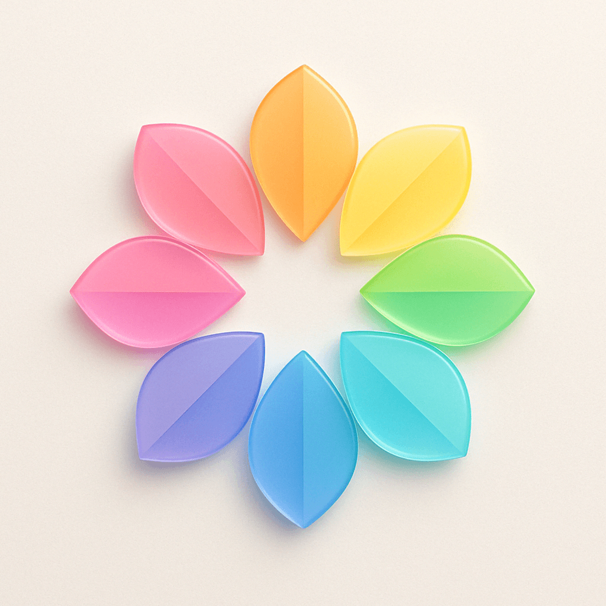

**Prompt:**
```
A high-quality 3D-rendered illustration of a color wheel logo. The design features eight symmetrical, petal-shaped leaves arranged in a perfect circular flower pattern. Each leaf is semi-transparent like colored glass, rendered in soft pastel tones including pink, orange, yellow, green, blue, and purple. The petals overlap slightly, creating gentle blended hues where they intersect. The background is a flat, light-toned surface with even, diffused lighting, giving the image a modern, polished, and professional appearance. No text.
```

**Parameters:** Model: gpt-image-1, Quality: high, Size: 1024x1024

[⬆️ Back to Contents](#contents-toc)

---

<a id="example-2"></a>
### Example 2: Embossed Business Card Monogram

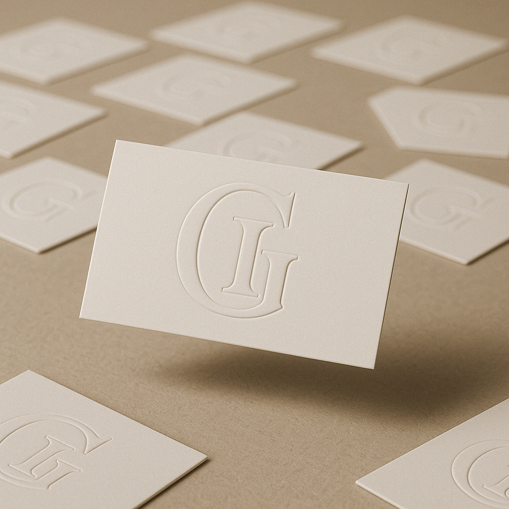

**Prompt:**
```
Add the G / I monogram on this business card. The monogram should be embossed.
```
* **Notes / Usage:** This example requires uploading reference image(s).

**Reference Image(s):**


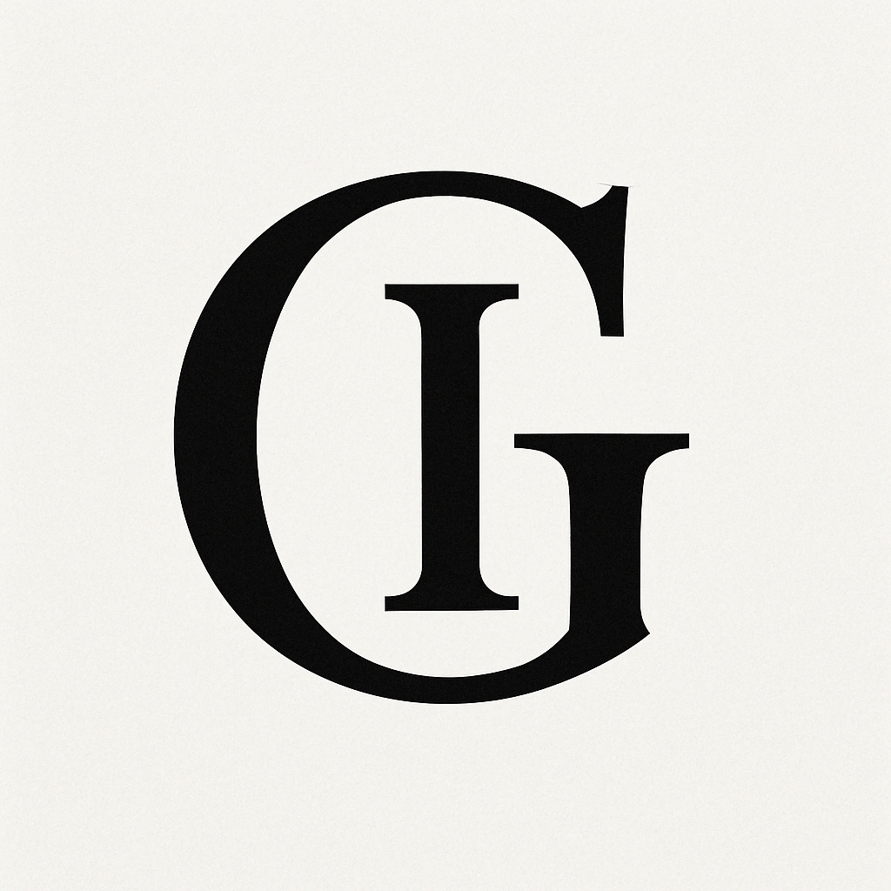

**Parameters:** Model: gpt-image-1, Quality: high, Size: 1024x1024

[⬆️ Back to Contents](#contents-toc)

---

<a id="example-3"></a>
### Example 3: Minimalist Furniture Photo


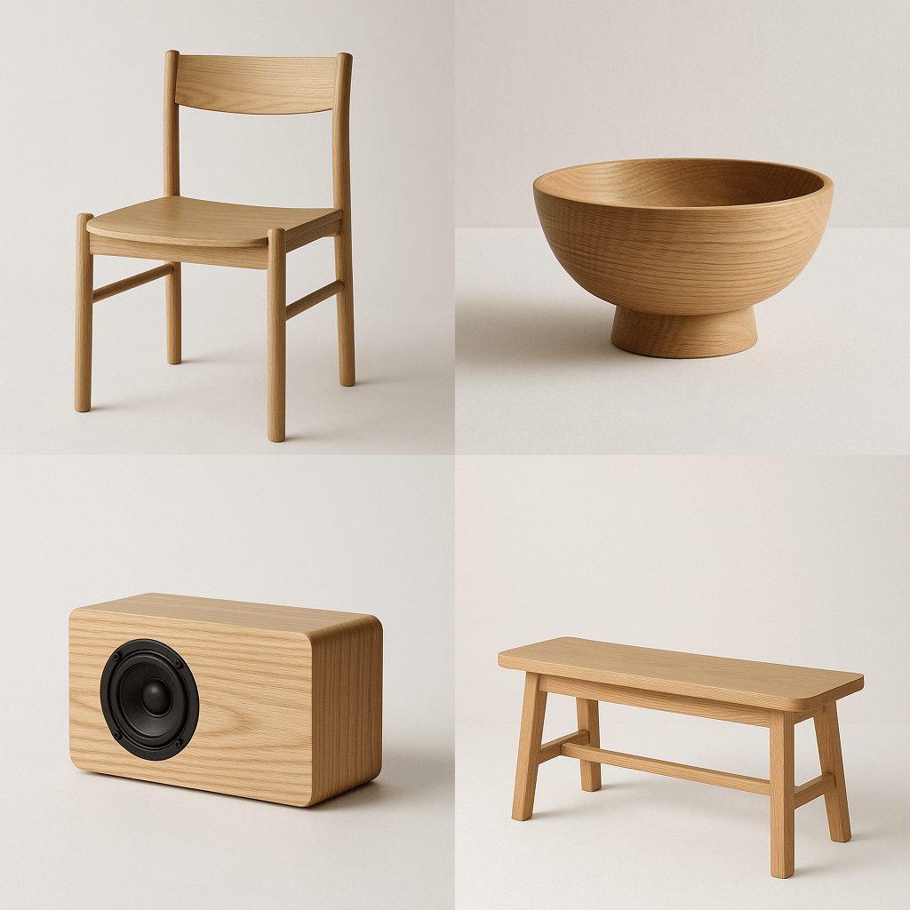

**Prompt:**
```
Generate a picture based on the prompt: Photo of a {item} on a white backdrop, influenced by japanese minimalist design principles. The {item} showcases a minimalist approach, emphasizing both simplicity and functionality. The natural wood finish, accentuating the grain, speaks to the beauty of raw materials. Its design, while straightforward, resonates with the essence of seating comfort.
```
* **Notes / Usage:** This prompt uses placeholders (e.g., `{item}`). Replace them with specific values for your desired output. Example values for `{item}` include: dining chair, fruit bowl, speaker, bench.
* **Caution:** The final sentence, *"Its design, while straightforward, resonates with the essence of seating comfort,"* is specific to seating items. If your `{item}` is not related to seating, consider **modifying or removing this sentence** for better results.

**Parameters:** Model: gpt-image-1, Quality: high, Size: 1024x1024

[⬆️ Back to Contents](#contents-toc)

---

<a id="example-4"></a>
### Example 4: Handbag Matching Outfit


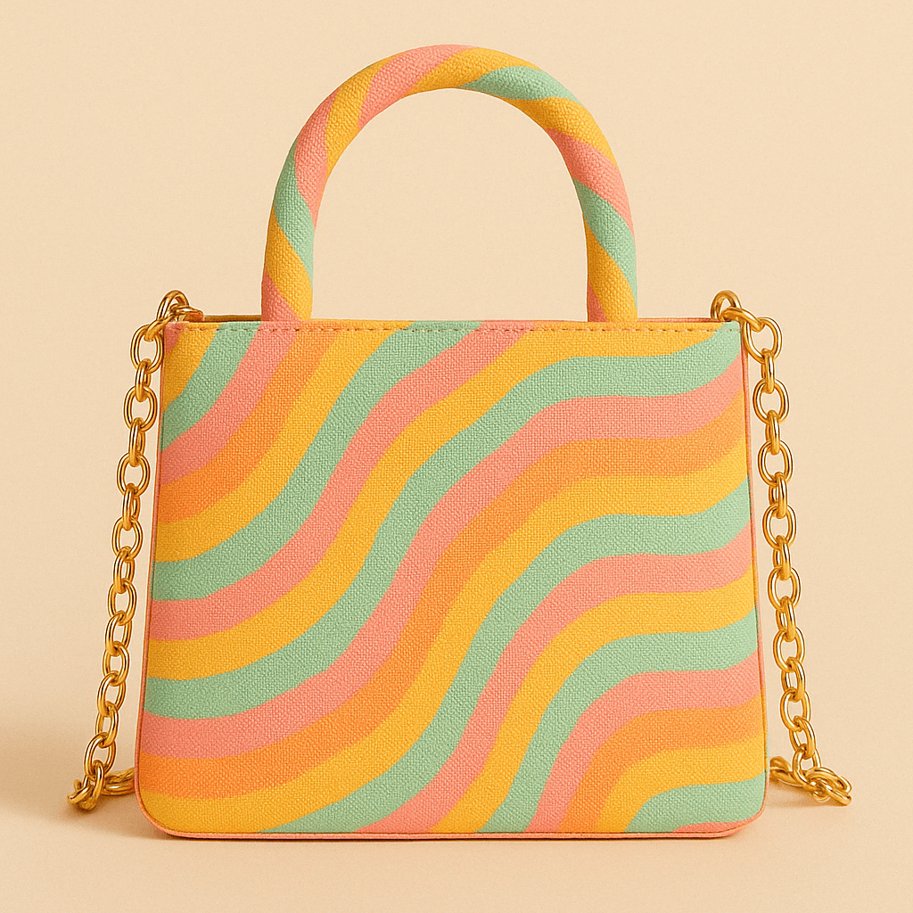

**Prompt:**
```
Generate a picture of a handbag that would go well with this outfit
```
* **Notes / Usage:** This example requires uploading reference image(s).

**Reference Image(s):**

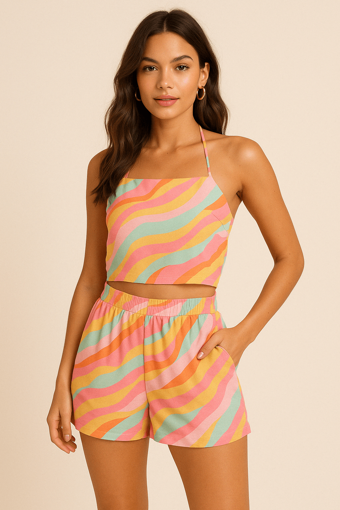

**Parameters:** Model: gpt-image-1, Quality: high, Size: 1024x1024

[⬆️ Back to Contents](#contents-toc)

---

<a id="example-5"></a>
### Example 5: Home Speaker Ad

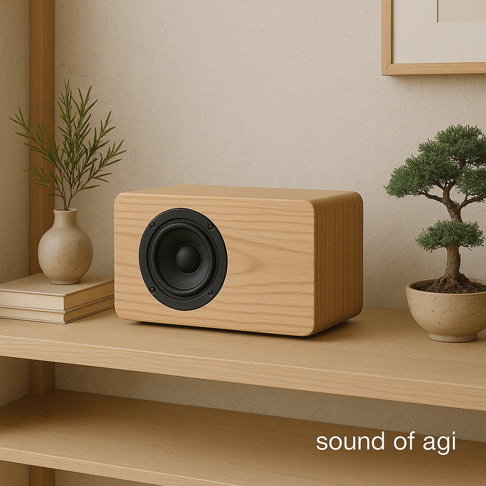

**Prompt:**
```
Generate an ad for a home bluetooth speaker. Add this product into a minimalist interior inspired by japanese aesthetic. The picture should have the product front and center, placed on a minimalist shelf with a concrete wall behind it. Add plants and other stylish accessories to make it feel like a photo of a home. add text: "agi.fm" in a minimalist sans-serif font (helvetica light). The text should be small and subtly placed in the bottom right corner. No other text or graphic elements should be present.
```
* **Notes / Usage:** This example requires uploading reference image(s).

**Reference Image(s):**

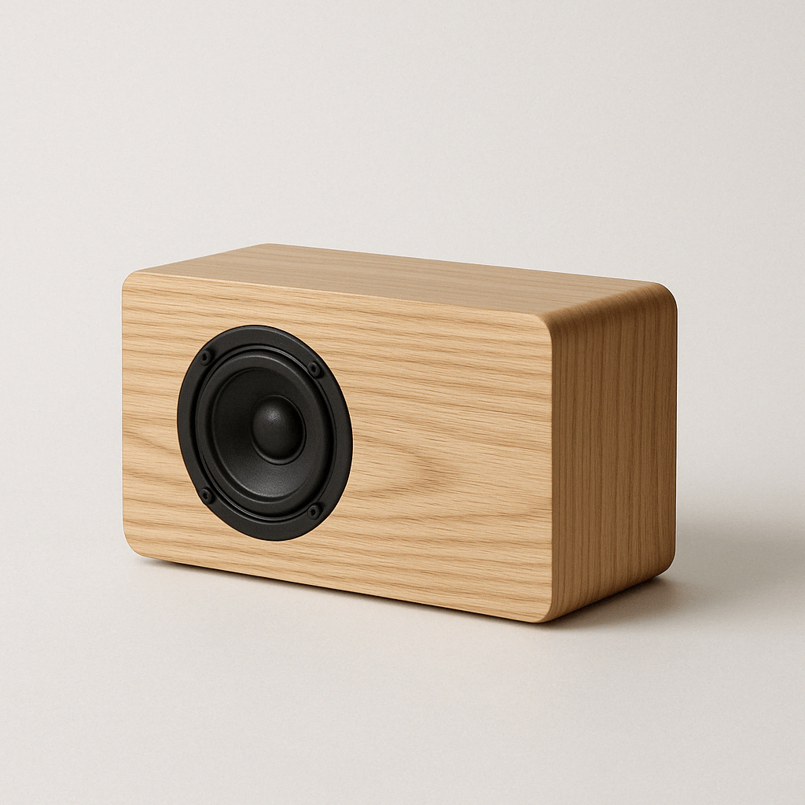

**Parameters:** Model: gpt-image-1, Quality: high, Size: 1024x1024

[⬆️ Back to Contents](#contents-toc)

---

<a id="example-6"></a>
### Example 6: Sneaker Material Reimagined


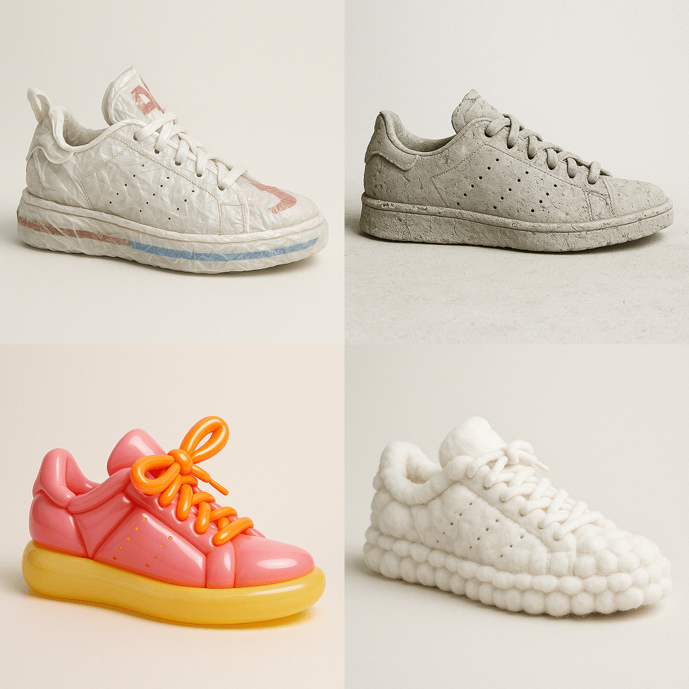

**Prompt:**
```
I am designing a sneaker, and you are my design partner. Create a picture that reimagines this sneaker as if it was made out {material}. Don't try to be practical, be creative, give me an inspiration for new shapes and materials.
```
* **Notes / Usage:** This prompt uses placeholders (e.g., `{material}`). Replace them with specific values for your desired output. Example values for `{material}` include: recycled plastic bag, concrete, inflatable air balloons, cotton balls. This example requires uploading reference image(s).

**Reference Image(s):**

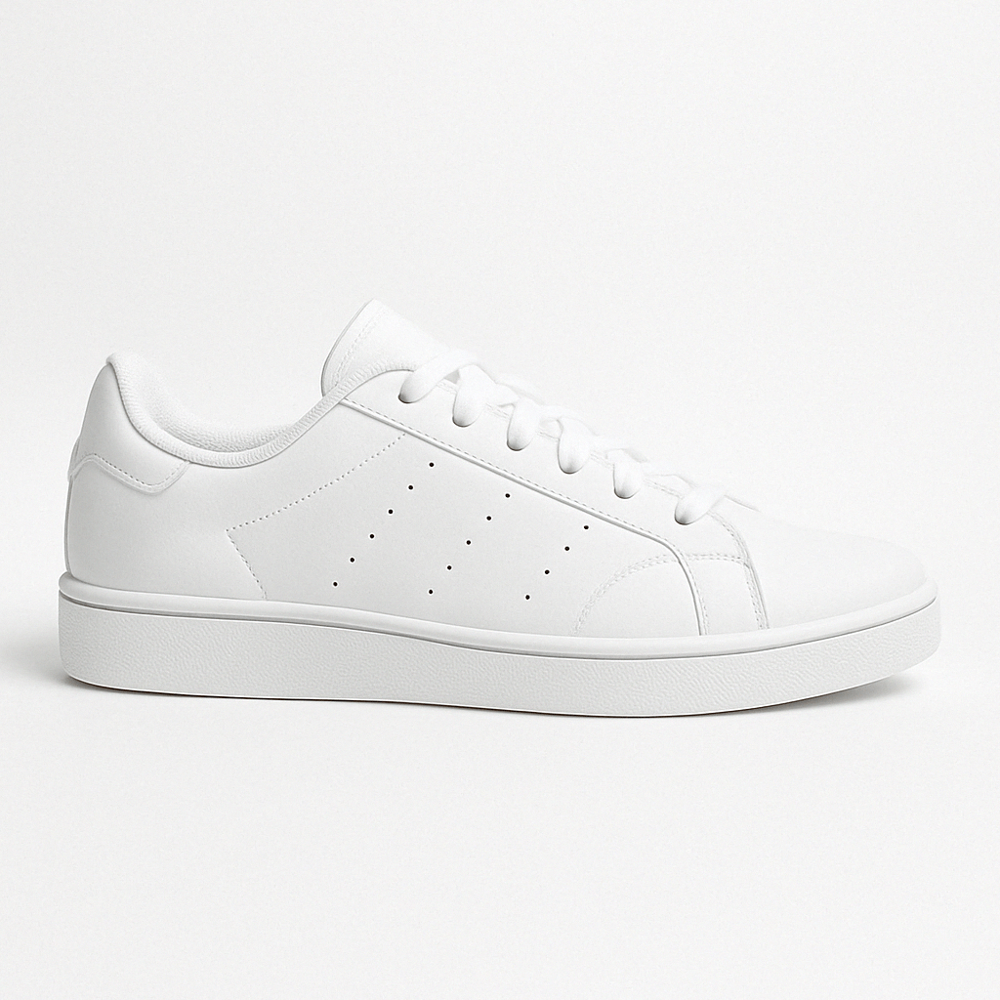

**Parameters:** Model: gpt-image-1, Quality: high, Size: 1024x1024

[⬆️ Back to Contents](#contents-toc)

---

<a id="example-7"></a>
### Example 7: 3D Isometric City Simulation View


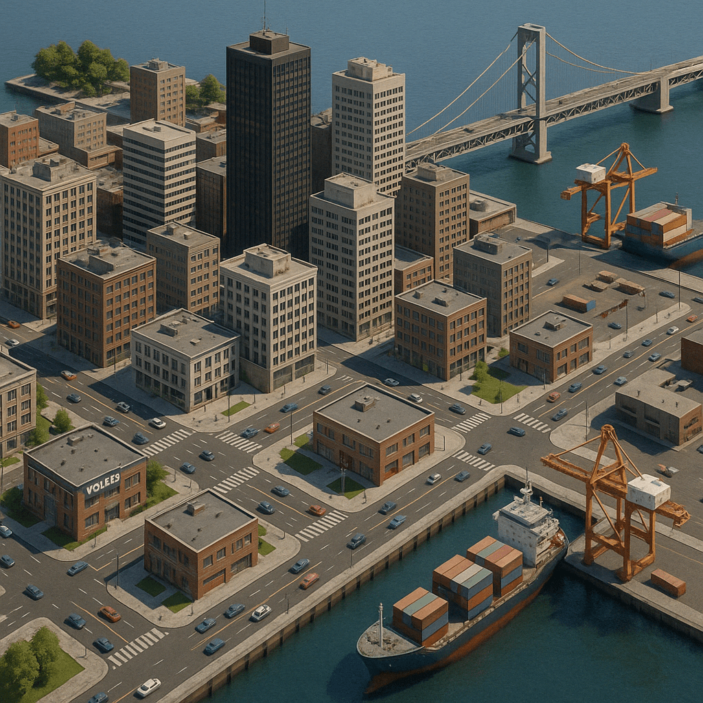

**Prompt:**
```
Generate a super realistic 3D view of a city on an island for my city simulation game. It should show a downtown view of a city criss-crossed with a regular street grid, with cars and people going about their day. create realistic office buildings, police station, fire station, port. Make it look like a middle of a sunny day. Make sure the geometry of street and buildings is correct and rendered in isometric projection. Make sure the textures and lighting of the buildings is realistic. Add palm trees and some parks.
```

**Parameters:** Model: gpt-image-1, Quality: high, Size: 1024x1024

[⬆️ Back to Contents](#contents-toc)

---

<a id="example-8"></a>
### Example 8: Blown Glass Speaker


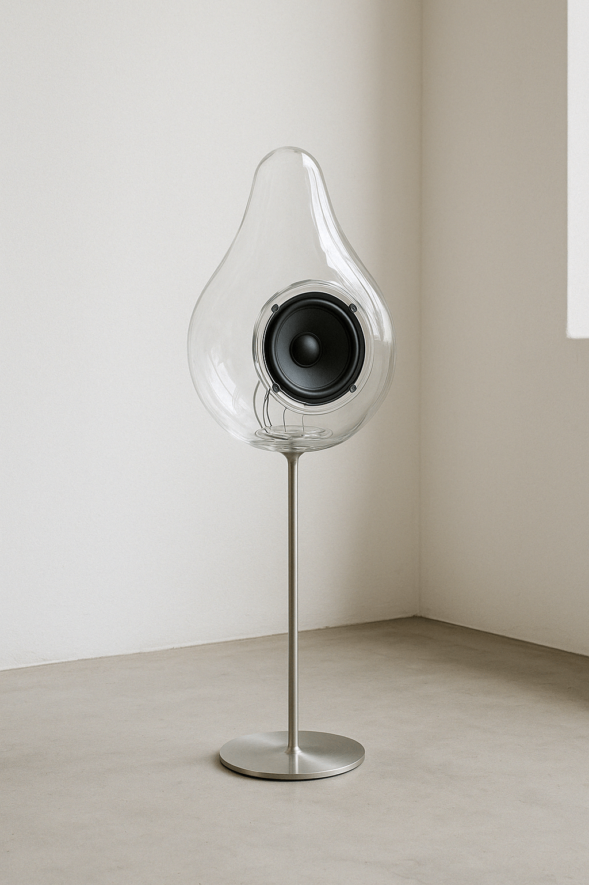

**Prompt:**
```
Create a minimalist home speaker out of glass. It should have an organic shape as if it was formed by blowing glass. It should be completely translucent, showing some of the wiring and other parts inside. It should be mounted on a floor stand at approximately 3 feet high. Place it in a room with white walls and concrete floor.
```

**Parameters:** Model: gpt-image-1, Quality: high, Size: 1024x1536

[⬆️ Back to Contents](#contents-toc)

---

<a id="example-9"></a>
### Example 9: Chocolate Packaging Variation


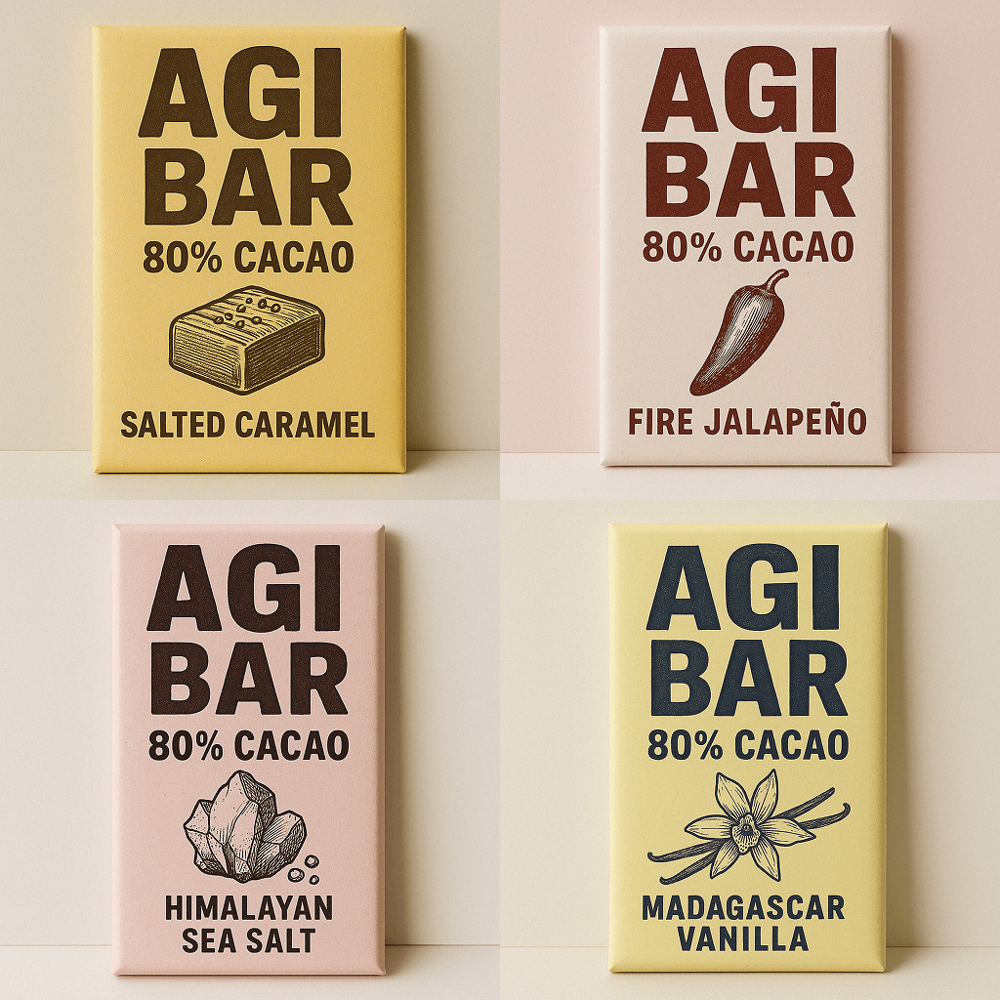

**Prompt:**
```
Create a variation of this chocolate packaging for a new flavor - {flavor}. Update the packaging accordingly: - Instead of "single origin" say the name of the flavor: {flavor}. - Pick a new color that matches the new flavor. Adjust the background color to a pastel off-white shade of the new color and typography to a dark shade of the new color. - Adjust cacao fruit illustration to reflect the new flavor. - Keep the letterpress aesthetic
```
* **Notes / Usage:** This prompt uses placeholders (e.g., `{flavor}`). Replace them with specific values for your desired output. Example values for `{flavor}` include: Salted Caramel, Fire Jalapeño, Himalayan Sea Salt, Madagascar Vanilla. This example requires uploading reference image(s).

**Reference Image(s):**

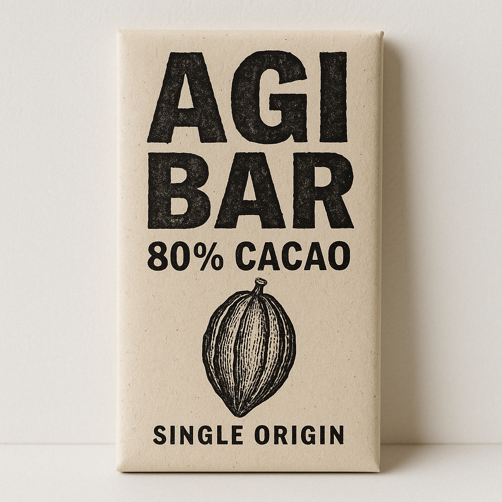

**Parameters:** Model: gpt-image-1, Quality: high, Size: 1024x1024

[⬆️ Back to Contents](#contents-toc)

---

<a id="example-10"></a>
### Example 10: Kyoto Travel Guide Cover


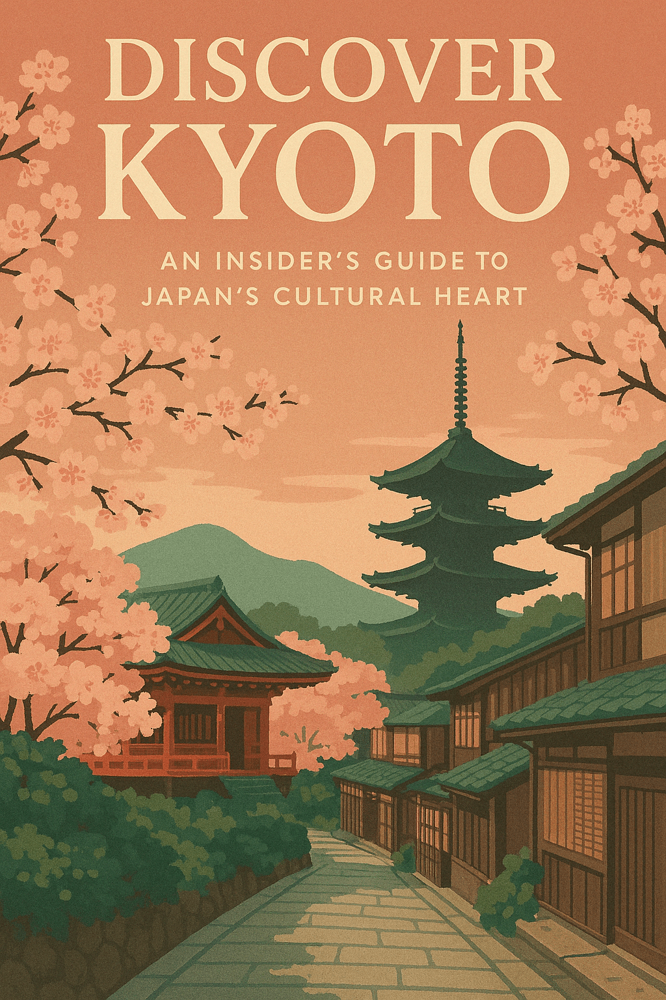

**Prompt:**
```
Create an aesthetically compelling, inviting cover for a travel guide titled "Discover Kyoto." Visually highlight iconic and culturally distinctive elements of Kyoto, such as serene temples, traditional wooden buildings, cherry blossoms, or a pagoda silhouette. Incorporate a sophisticated yet inviting color palette. Clearly display the title "Discover Kyoto" prominently, with subtle typography featuring the tagline: "An Insider’s Guide to Japan's Cultural Heart."
```

**Parameters:** Model: gpt-image-1, Quality: high, Size: 1024x1536

[⬆️ Back to Contents](#contents-toc)

---

<a id="example-11"></a>
### Example 11: Birthday Card with Gift Illustrations


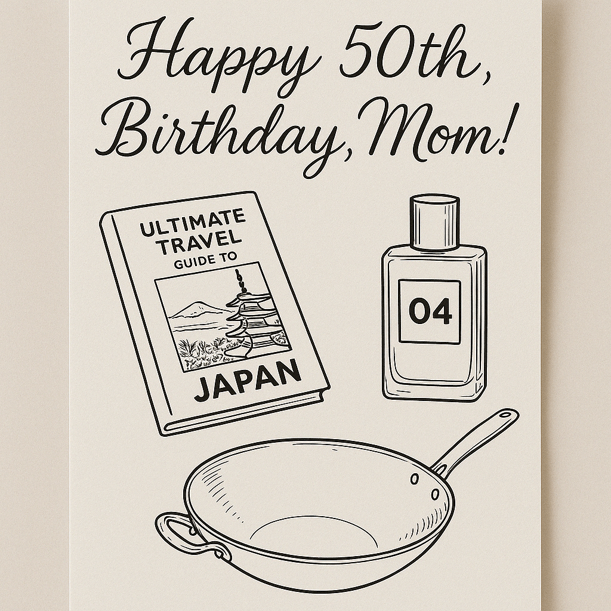

**Prompt:**
```
Make an image of a birthday card for my mom's 50th birthday, include all the gifts that I got her illustrated as a single black ink drawing. add a headline drawn in an elegant black script: Happy 50th Birthday, Mom!
```
* **Notes / Usage:** This example requires uploading reference image(s).

**Reference Image(s):**

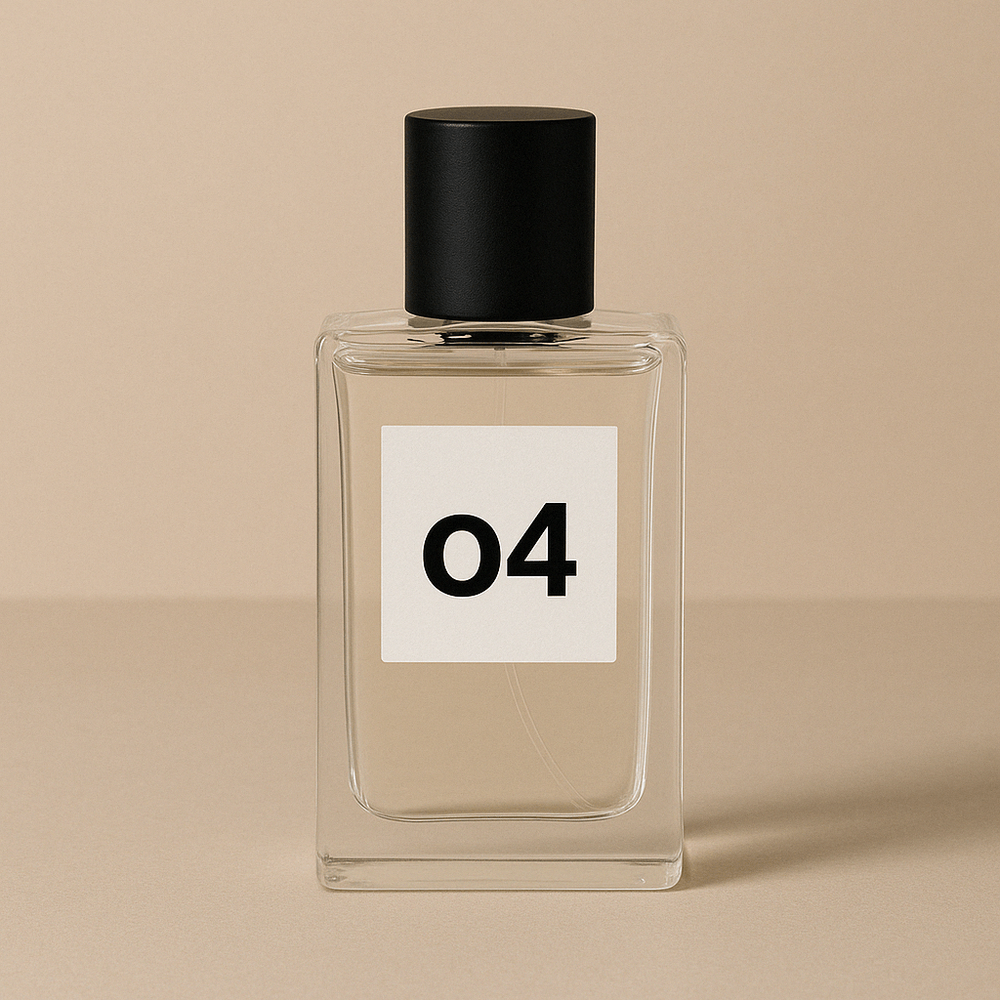
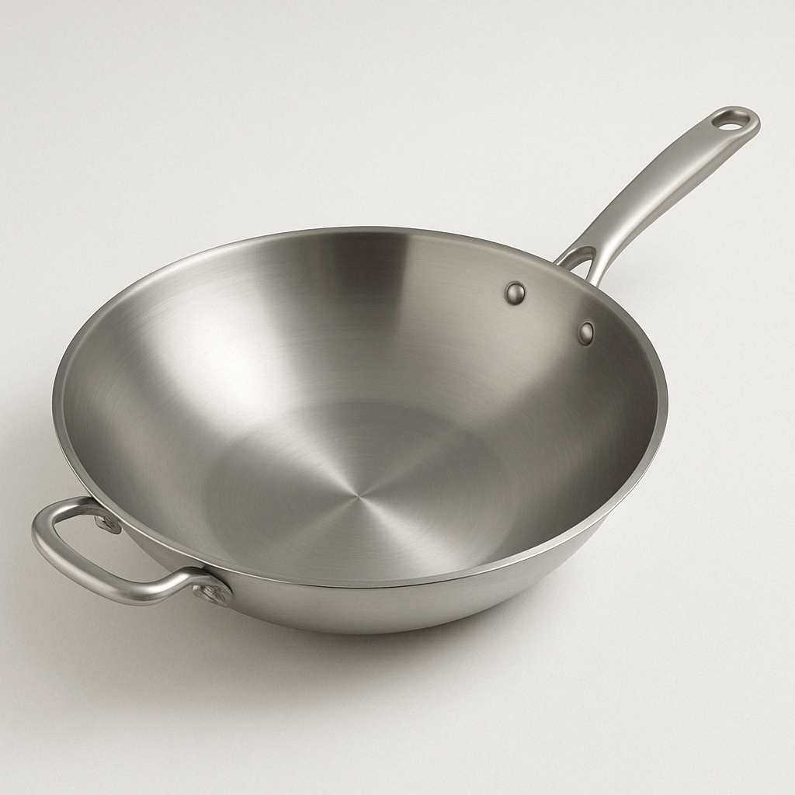
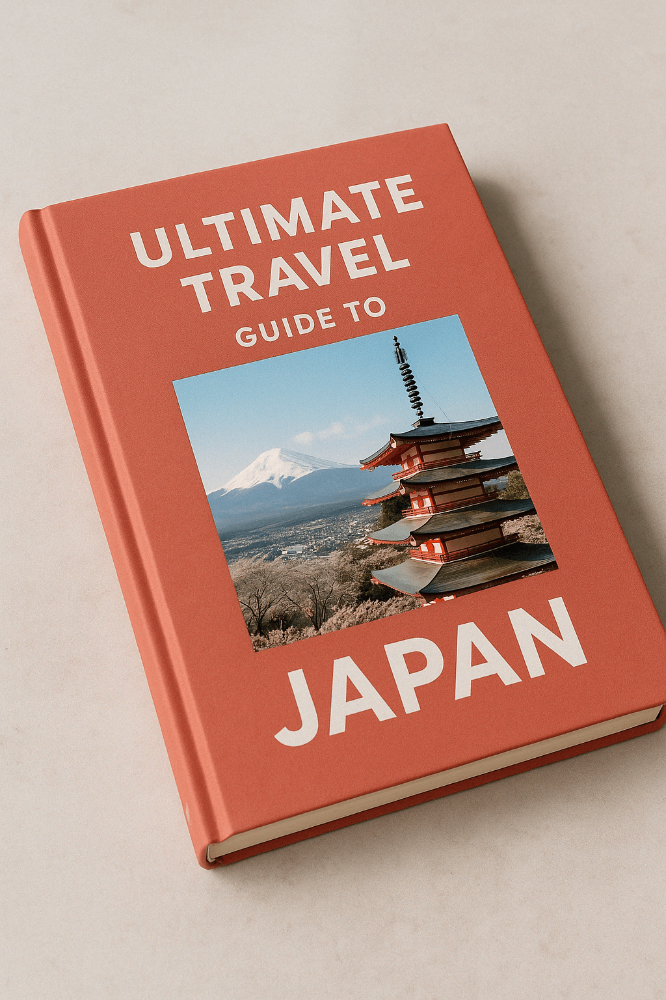

**Parameters:** Model: gpt-image-1, Quality: high, Size: 1024x1024

[⬆️ Back to Contents](#contents-toc)

---

<a id="example-12"></a>
### Example 12: Lifestyle Magazine Cover ('Urban Pulse')


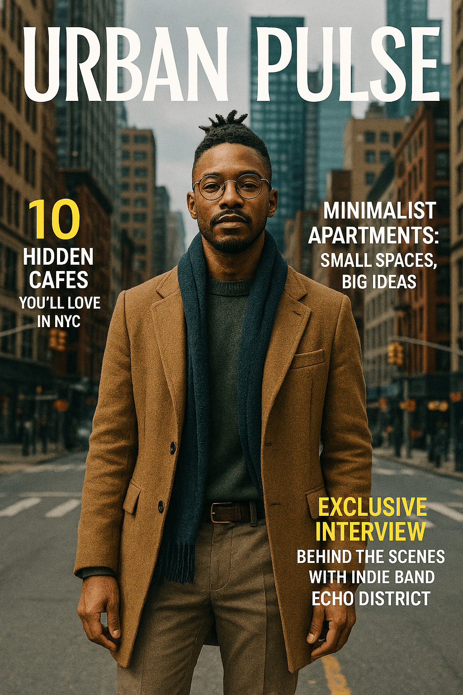

**Prompt:**
```
Create a professional and visually engaging magazine cover for a lifestyle magazine called "Urban Pulse." Include these featured article headlines clearly: "10 Hidden Cafés You'll Love in NYC" "Minimalist Apartments: Small Spaces, Big Ideas" "Exclusive Interview: Behind the Scenes with Indie Band Echo District" Use contemporary typography, vibrant colors, and include an eye-catching main photograph with a person standing in front of a city scene
```

**Parameters:** Model: gpt-image-1, Quality: high, Size: 1024x1536

[⬆️ Back to Contents](#contents-toc)

---

<a id="example-13"></a>
### Example 13: Food Truck Rebranding (Jamaican Jerk)


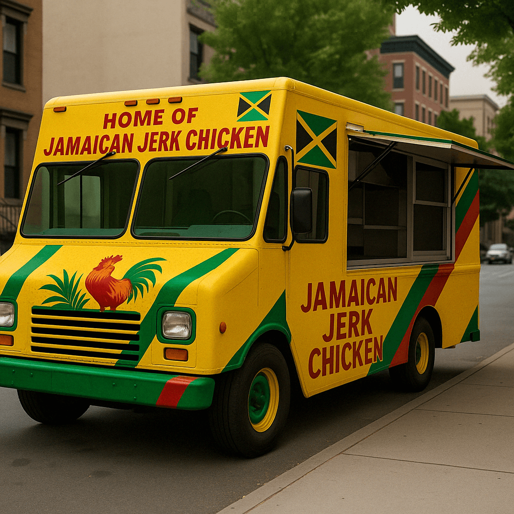

**Prompt:**
```
Adjust this foodtruck to be branded as home of jamaican jerk chicken. Create appropriate graphics and add colors that match the cuisine.
```
* **Notes / Usage:** This example requires uploading reference image(s).

**Reference Image(s):**

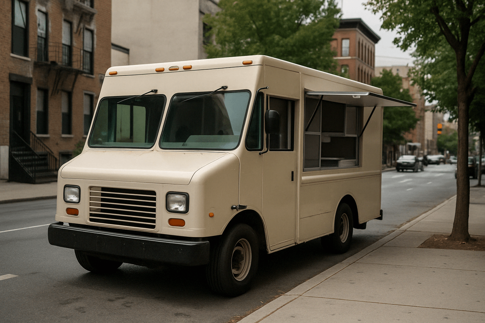

**Parameters:** Model: gpt-image-1, Quality: high, Size: 1024x1024

[⬆️ Back to Contents](#contents-toc)

---

<a id="example-14"></a>
### Example 14: Italian Cafe Menu Design


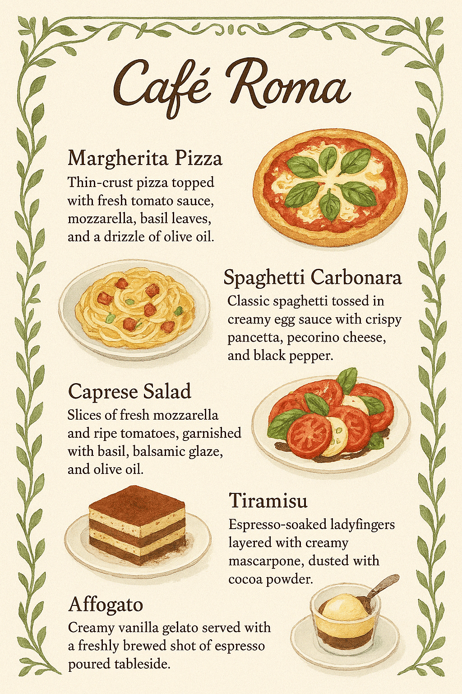

**Prompt:**
```
Create a clean and charming one-page restaurant menu for a cozy Italian café named "Café Roma." The menu should prominently feature the café’s name at the top in an elegant, inviting font. Include exactly five menu items, each with a clear, appealing illustration placed beside its name. Menu Items and Descriptions (each illustrated): Margherita Pizza Thin-crust pizza topped with fresh tomato sauce, mozzarella, basil leaves, and a drizzle of olive oil. Spaghetti Carbonara Classic spaghetti tossed in creamy egg sauce with crispy pancetta, pecorino cheese, and black pepper. Caprese Salad Slices of fresh mozzarella and ripe tomatoes, garnished with basil, balsamic glaze, and olive oil. Tiramisu Espresso-soaked ladyfingers layered with creamy mascarpone, dusted with cocoa powder. Affogato Creamy vanilla gelato served with a freshly brewed shot of espresso poured tableside. Design Elements: Surround the entire menu content with a decorative, elegant border inspired by traditional Italian motifs, such as vines, leaves, or floral patterns. Utilize a soft, warm color palette with cream, olive greens, and subtle accents of red and brown. Illustrations should be consistent, simple, and appealing, with a hand-drawn or watercolor style. Maintain clear and readable typography, differentiating dish names, descriptions, and subtle price listings.
```

**Parameters:** Model: gpt-image-1, Quality: high, Size: 1024x1536

[⬆️ Back to Contents](#contents-toc)

---

<a id="example-15"></a>
### Example 15: Parking Lot Column Pattern Application

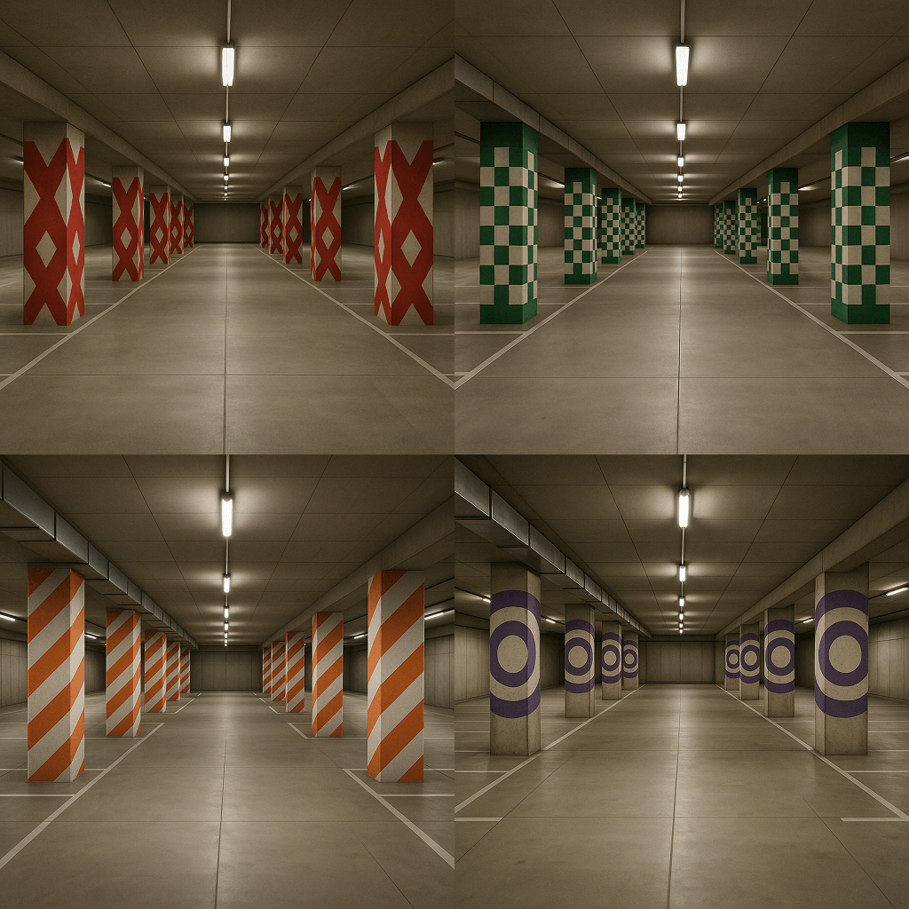

**Prompt:**
```
Apply the {pattern-number} pattern to the columns of the parking lot as if they were painted on top of concrete. In the pattern image provided, assume number 1 is the top left pattern, and number 9 is the bottom right pattern.
```
* **Notes / Usage:** This prompt uses placeholders (e.g., `{pattern-number}`). Replace them with specific values for your desired output. Specific values for `{pattern-number}` used to generate the example image include 2, 3, 1, and 8. This example requires uploading reference image(s).

**Reference Image(s):**

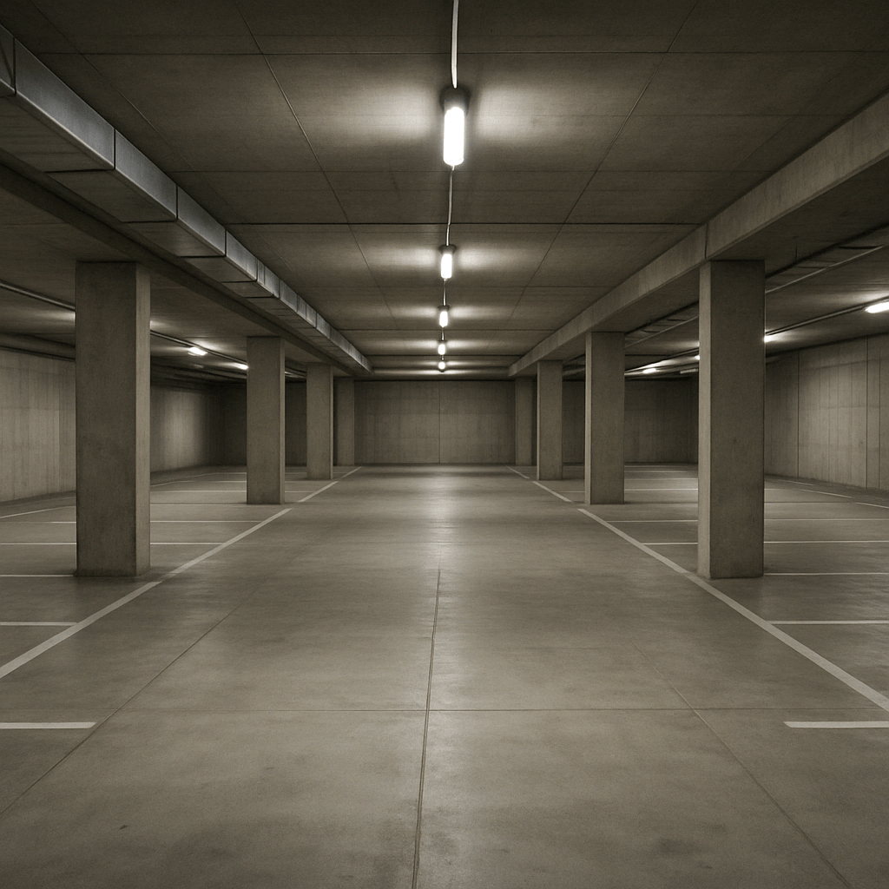
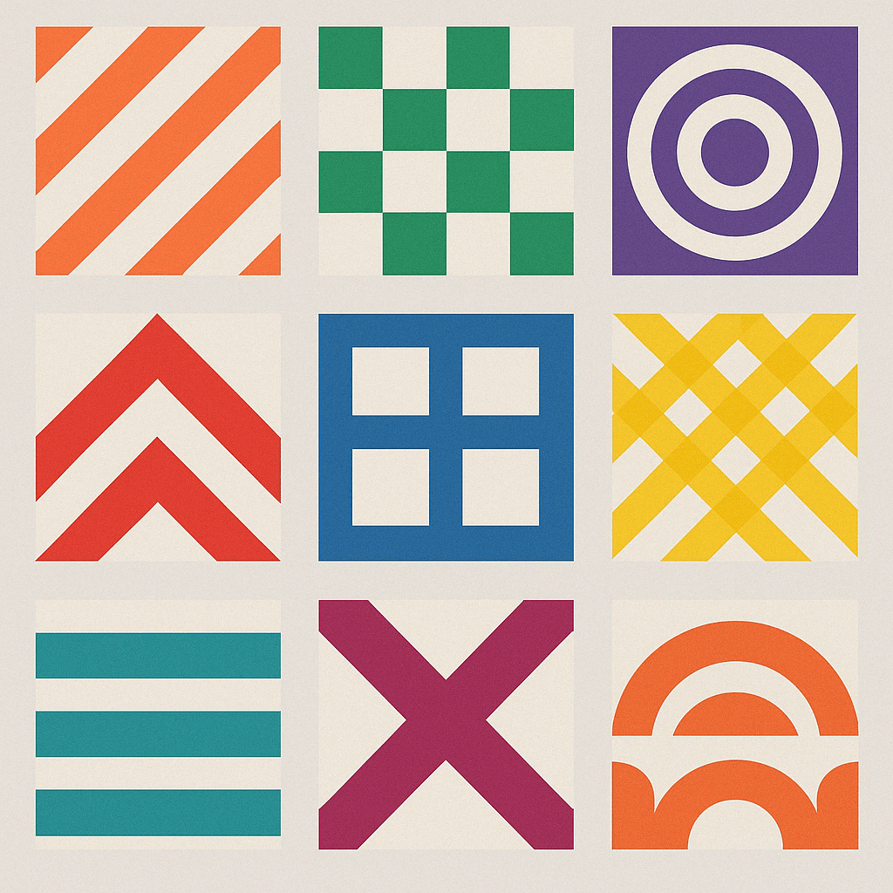

**Parameters:** Model: gpt-image-1, Quality: high, Size: 1024x1024

[⬆️ Back to Contents](#contents-toc)

---

<a id="example-16"></a>
### Example 16: Guacamole Ingredients Layout

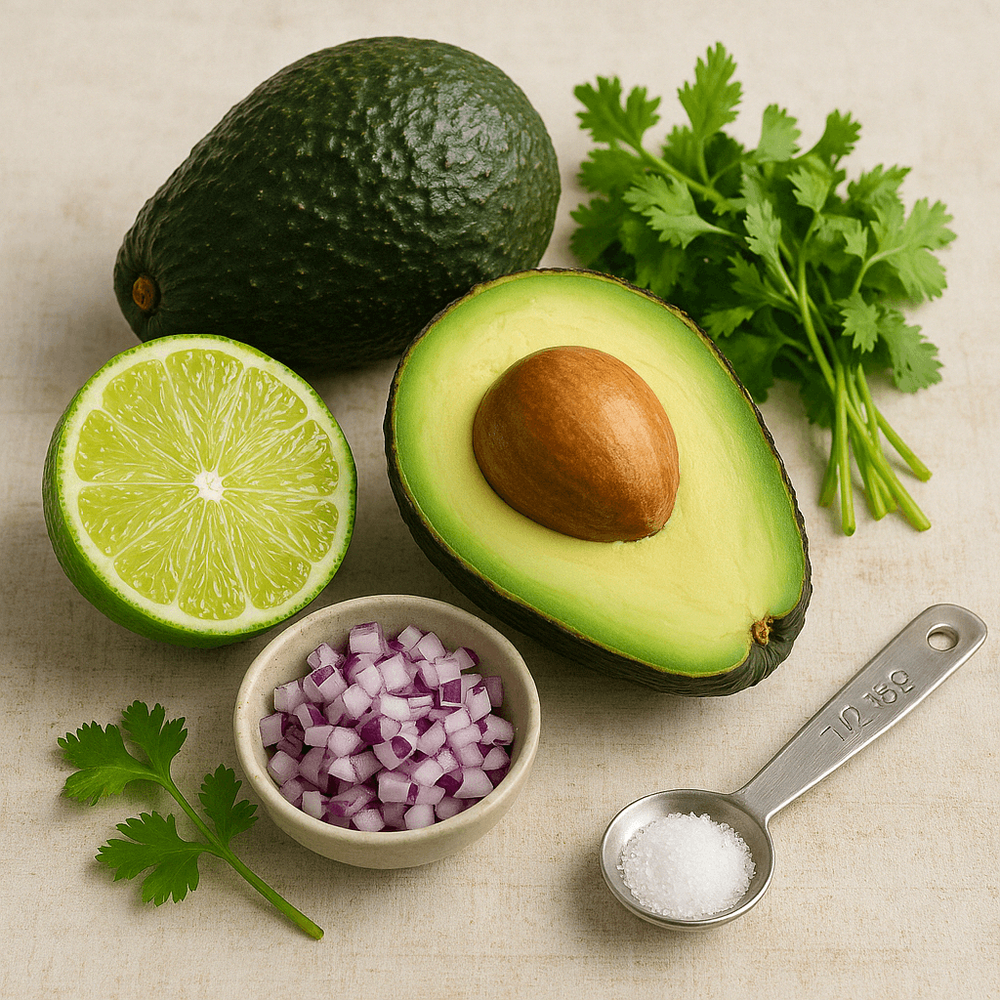

**Prompt:**
```
Create a photo realistic image clearly illustrating all the ingredients needed for fresh homemade guacamole, neatly arranged and proportionally accurate.
```

**Parameters:** Model: gpt-image-1, Quality: high, Size: 1024x1024

[⬆️ Back to Contents](#contents-toc)

---

<a id="example-17"></a>
### Example 17: Warrior Sprite Sheet


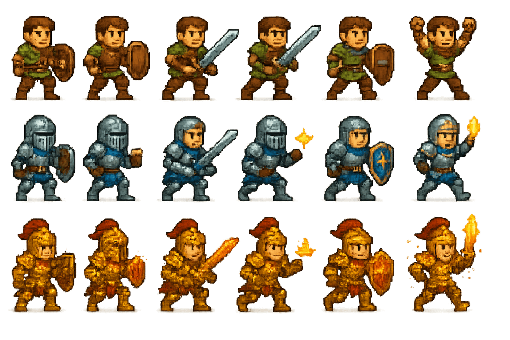

**Prompt:**
```
Create a detailed, square pixel-art image showcasing a fantasy warrior character in three distinct gear sets, each placed in its own horizontal row. Each row includes exactly six poses: Idle stance, Sword Attack, Magic Spellcasting, Defensive Block with Shield, Running, and Victory Celebration. Top Row (Starter Gear - Earth Tones): Simple leather and cloth armor in muted browns and greens, iron sword, basic wooden shield. Middle Row (Knight's Gear - Silver and Blue): Polished steel armor featuring silver plating with deep blue accents, helmet with closed visor, decorative longsword, ornate kite shield, flowing blue cape. Bottom Row (Mythic Gear - Gold and Crimson): Magnificent golden armor richly adorned with glowing crimson gemstones and fiery embellishments, flaming enchanted sword, translucent crimson magic shield, surrounded by a subtle, mystical aura. Ensure the warrior's proportions and facial features remain consistent across all poses and gear sets. Each set should clearly illustrate a progression in design complexity and visual appeal. Render each pose individually with a transparent background, neatly arranged in three horizontal rows within a square composition.
```

**Parameters:** Model: gpt-image-1, Quality: high, Size: 1536x1024

[⬆️ Back to Contents](#contents-toc)

---

<a id="example-18"></a>
### Example 18: Interior Space Reimagined


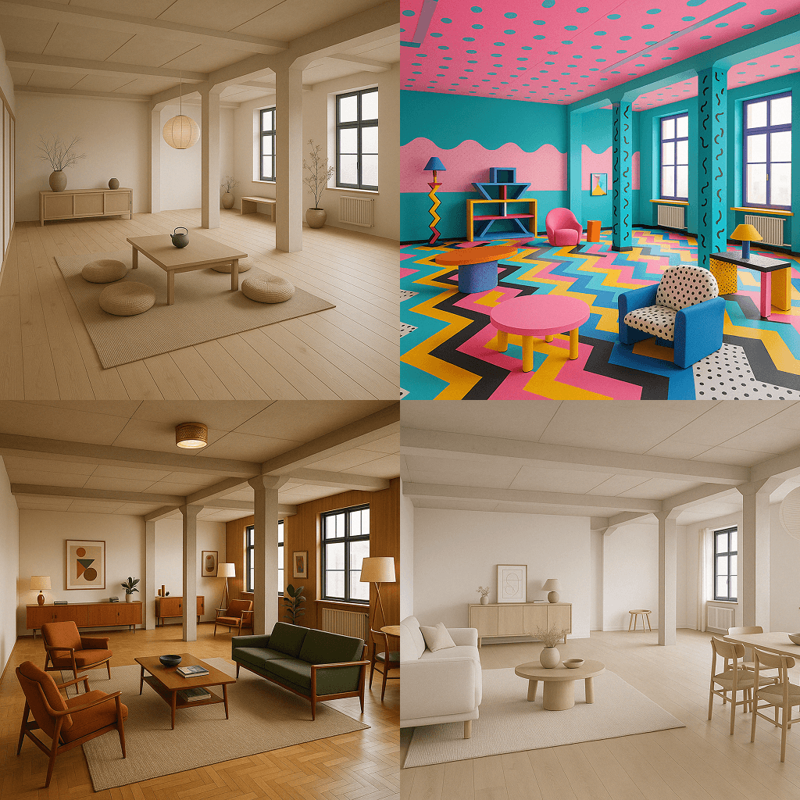

**Prompt:**
```
Reimagine this space in {style} aesthetic. Add appropriate furnishings and accessories. Keep the same angle as the photo.
```
* **Notes / Usage:** This prompt uses placeholders (e.g., `{style}`). Replace them with specific values for your desired output. Example values for `{style}` include: minimalist japanese, maximalist, mid century modernism, scandinavian minimalism. This example requires uploading reference image(s).

**Reference Image(s):**

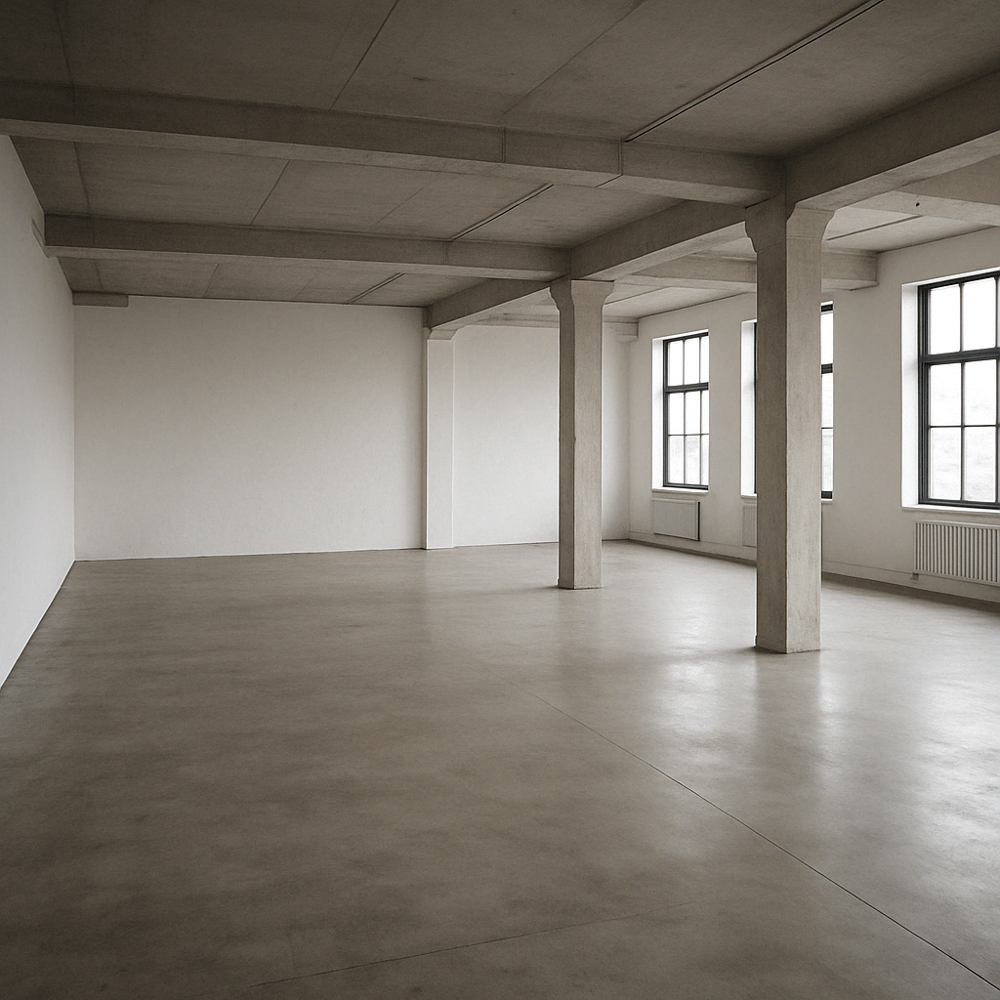

**Parameters:** Model: gpt-image-1, Quality: high, Size: 1024x1024

[⬆️ Back to Contents](#contents-toc)

---

<a id="example-19"></a>
### Example 19: Virtual Outfit Try-On

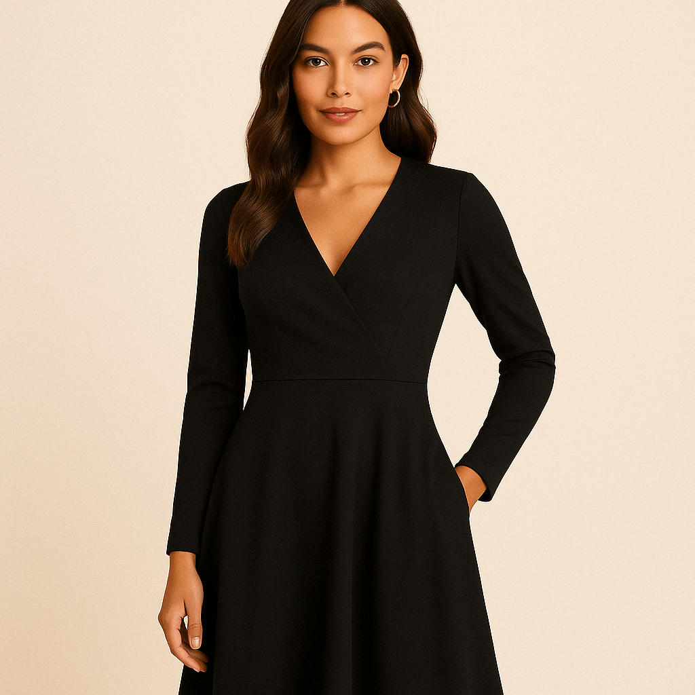

**Prompt:**
```
Replace the outfit of the model in the photo with a new outfit. Return a square image.
```
* **Notes / Usage:** This example requires uploading reference image(s).

**Reference Image(s):**

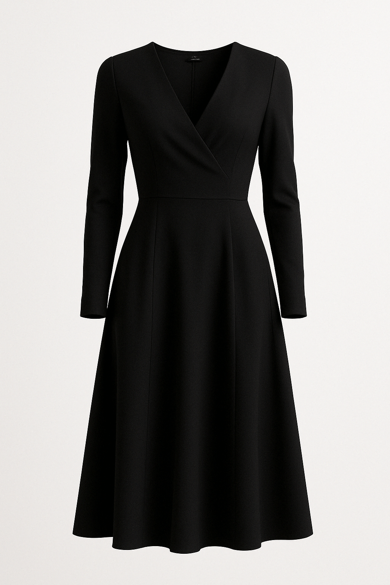


**Parameters:** Model: gpt-image-1, Quality: high, Size: 1024x1024

[⬆️ Back to Contents](#contents-toc)

---

<a id="example-20"></a>
### Example 20: Floorplan to 3D Rendering

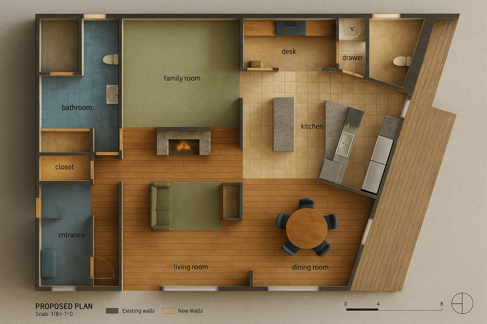

**Prompt:**
```
Create a super realistic 3d rendering of this architectural rendering.. Do not change the positions of the walls, and maintain lines in the same exact position as they are in the plan, but add furniture and finishes and textures and depth.
```
* **Notes / Usage:** This example requires uploading reference image(s).

**Reference Image(s):**

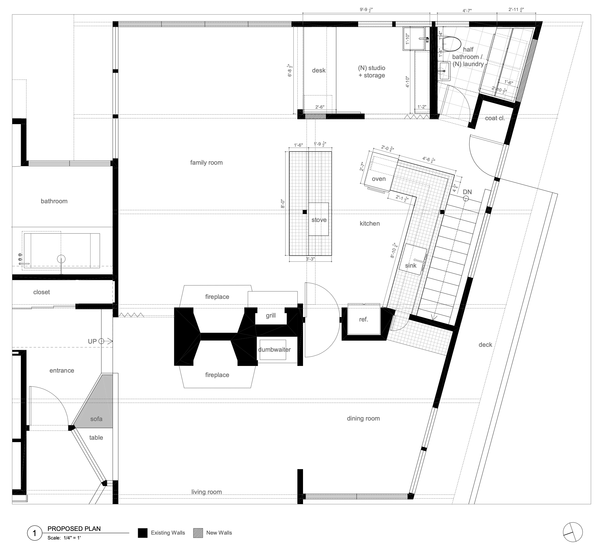

**Parameters:** Model: gpt-image-1, Quality: high, Size: 1536x1024

[⬆️ Back to Contents](#contents-toc)

---

<a id="example-21"></a>
### Example 21: Educational Whale Poster


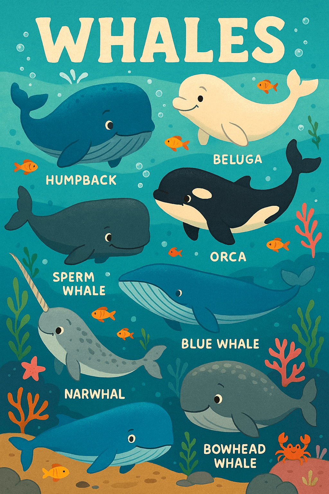

**Prompt:**
```
Create a cute, visually engaging educational poster featuring illustrations of a bunch of different whale species under the ocean. Clearly label each whale type with its name, and include playful underwater details like bubbles, coral, fish and other sea creatures. Use a friendly cute animation style evoking a classic animated movie.
```

**Parameters:** Model: gpt-image-1, Quality: high, Size: 1024x1536

[⬆️ Back to Contents](#contents-toc)

---

<a id="example-22"></a>
### Example 22: Protein Bar Packaging ('GPU Crunch')


**Prompt:**
```
Create vibrant and appealing packaging for our tech-inspired protein snack bar, "GPU Crunch." Clearly highlight delicious, wholesome ingredients—rich dark chocolate chunks, roasted almonds, and whole-grain oats—featured on the packaging using minimalist thin line icons. Showcase nutritional details ("12g Protein," "4g Sugar," "20g Carbs") in smaller type. Present the packaged bar realistically placed on a white background, surrounded by fitness gear (water bottle, gym towel, earbuds) to suggest healthy living combined with high-tech performance. Use minimal modernist aesthetic, inspired by modernist swiss design. Use a single color for the background overlayed with black graphics and typography on top.
```

**Parameters:** Model: gpt-image-1, Quality: high, Size: 1024x1024

[⬆️ Back to Contents](#contents-toc)

---

<a id="example-23"></a>
### Example 23: Indie Album Cover ('Neon Dusk')


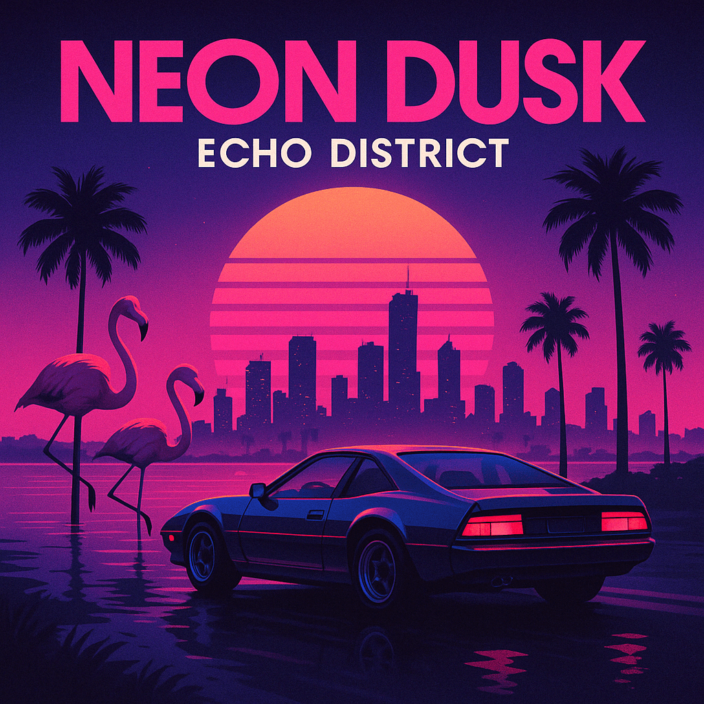

**Prompt:**
```
Create stylish and visually striking album art for an indie-electronic album titled "Neon Dusk." The music blends ambient synth textures, dreamy vocals, and upbeat electronic rhythms, evoking a nostalgic yet futuristic late-night cityscape vibe. Include the album title "Neon Dusk" prominently front and center, and the artist name "Echo District" below. The cityscape should feature an 80s sports car, silhouette Miami in the neon light and flamingos in the forefront. The typography should be set in an Avant Garde Gothic font and use ligatures where appropriate.
```

**Parameters:** Model: gpt-image-1, Quality: high, Size: 1024x1024

[⬆️ Back to Contents](#contents-toc)

---

<a id="example-24"></a>
### Example 24: Blobby Alien Character Render


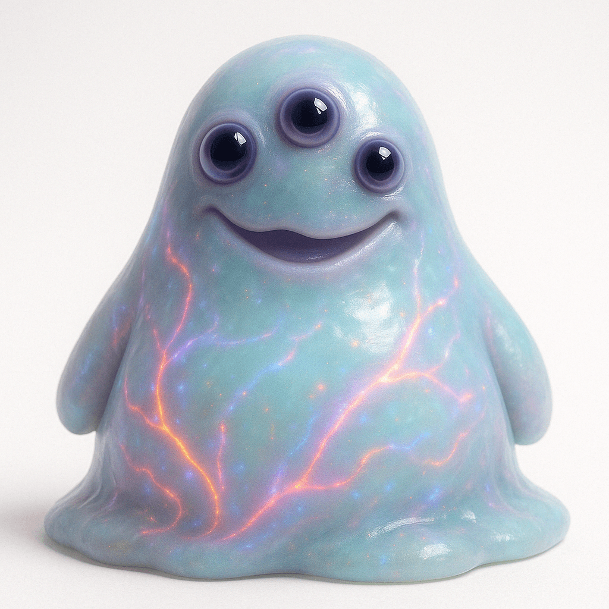

**Prompt:**
```
Render a realistic image of this character: Blobby Alien Character Spec Name: Glorptak (or nickname: "Glorp") Visual Appearance Body Shape: Amorphous and gelatinous. Overall silhouette resembles a teardrop or melting marshmallow, shifting slightly over time. Can squish and elongate when emotional or startled. Material Texture: Semi-translucent, bio-luminescent goo with a jelly-like wobble. Surface occasionally ripples when communicating or moving quickly. Color Palette: - Base: Iridescent lavender or seafoam green - Accents: Subsurface glowing veins of neon pink, electric blue, or golden yellow - Mood-based color shifts (anger = dark red, joy = bright aqua, fear = pale gray) Facial Features: - Eyes: 3–5 asymmetrical floating orbs inside the blob that rotate or blink independently - Mouth: Optional—appears as a rippling crescent on the surface when speaking or emoting - No visible nose or ears; uses vibration-sensitive receptors embedded in goo - Limbs: None by default, but can extrude pseudopods (tentacle-like limbs) when needed for interaction or locomotion. Can manifest temporary feet or hands. Movement & Behavior Locomotion: - Slides, bounces, and rolls. - Can stick to walls and ceilings via suction. When scared, may flatten and ooze away quickly. Mannerisms: - Constant wiggling or wobbling even at rest - Leaves harmless glowing slime trails - Tends to absorb nearby small objects temporarily out of curiosity
```

**Parameters:** Model: gpt-image-1, Quality: high, Size: 1024x1024

[⬆️ Back to Contents](#contents-toc)

---

<a id="example-25"></a>
### Example 25: Water Bottle Shape Exploration

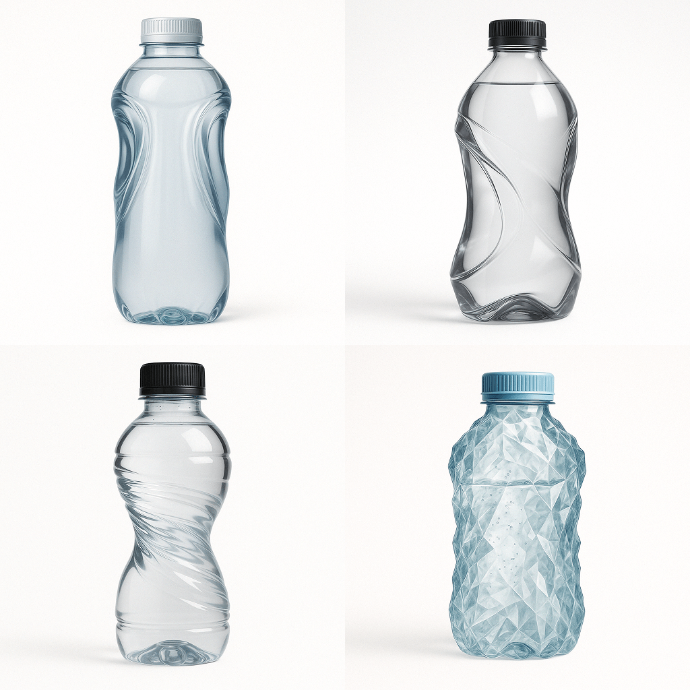

**Prompt:**
```
I am designing a shape of a water bottle and need your help exploring some new shapes. create an image of a transparent water bottle inspired by {concept}. Place a super realistic 3d render of the bottle design on a white background. The water bottle should be full.
```
* **Notes / Usage:** This prompt uses placeholders (e.g., `{concept}`). Replace them with specific values for your desired output. Example values for `{concept}` include: waterfall, aerodynamic sports car, whirlpool, glacier.

**Parameters:** Model: gpt-image-1, Quality: high, Size: 1024x1024

[⬆️ Back to Contents](#contents-toc)

---

<a id="example-26"></a>
### Example 26: Fantasy Dreamscape Environment

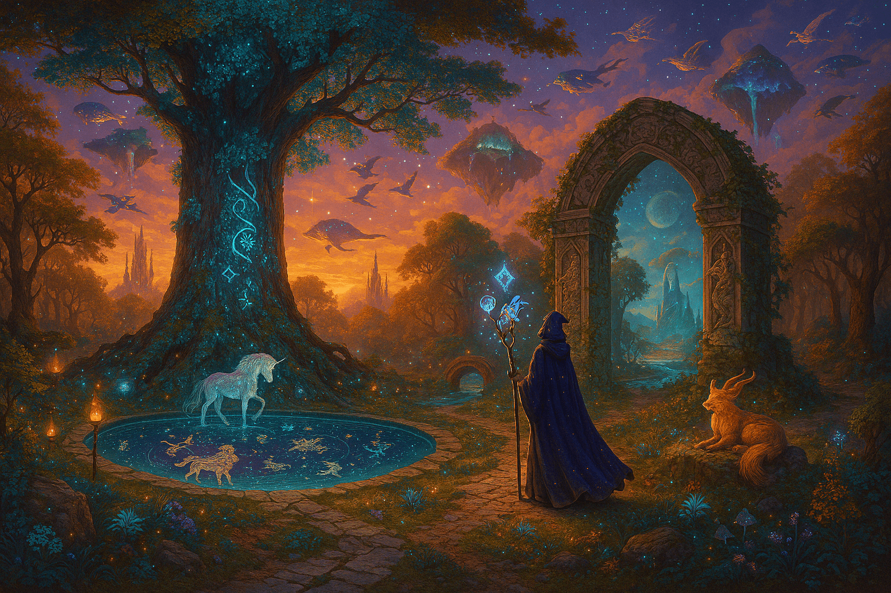

**Prompt:**
```
In a sprawling ancient forest illuminated by the golden hues of a low-hanging twilight sun, a wide clearing opens into a surreal dreamscape that seems to blend fantasy and forgotten mythology. At the heart of this clearing stands an enormous, weathered tree with a trunk as wide as a small house and bark etched with glowing, ancient runes pulsating faintly in shades of aquamarine and violet. The tree’s branches stretch skyward like arms, covered in bioluminescent leaves that shimmer in a gradient of emerald green to sapphire blue, flickering gently as if breathing with the rhythm of the earth itself. Around the base of the tree lies a circular pool of crystalline water, unnaturally still, reflecting not just the tree above it, but also constellations that don’t exist in our sky—stars shaped like animals, celestial figures, and mysterious glyphs. A narrow stone path, cracked and overgrown with moss and delicate glowing fungi, leads from the edge of the forest to the pool, lined with floating lanterns suspended in midair without any visible support, each encasing a softly glowing flame of a different color. Along the edges of the forest clearing, the trees seem to lean inward, their trunks twisted like ancient dancers, and their leaves whispering secrets in a wind that can be heard but not felt. Tall stalks of silvery grass sway under the influence of a phantom breeze, and clusters of flowers with translucent petals release faint motes of light into the air, like floating pollen that sparkles and twirls as it rises upward. To the right of the tree, a grand stone arch partially buried in vines stands like a portal, its frame adorned with sculpted reliefs of mythical creatures: winged wolves, twin-tailed phoenixes, and enormous turtles with cities on their backs. Beyond the arch shimmers a misty threshold, behind which lies the suggestion of an entirely different realm—its colors slightly more saturated, its sky a strange teal hue with three moons visible in the clouds. A lone traveler stands before this arch, cloaked in flowing robes of deep indigo lined with stardust thread, their hood down to reveal glowing eyes that mirror the reflection in the pool. They carry a long, ornate staff, topped with a cluster of floating crystals that orbit one another slowly, humming with magic. Ahead of the traveler is a small floating companion creature, resembling a cross between a jellyfish and a hummingbird, with translucent wings and tendrils that pulse in rhythm with the traveler’s heartbeat. In the sky above, the clouds swirl in painterly strokes of lavender and peach, pierced occasionally by rays of sunlight that look more like golden waterfalls descending from the heavens. Several large, floating islands drift lazily through the air, each one covered in its own miniature ecosystem: one holds a temple ruin with hanging gardens spilling over its cliffs, another is blanketed in snow and ice with a glowing aurora snaking above it, and yet another contains a small lake with inverted waterfalls that flow upward into the sky. Flocks of gigantic birds with opalescent feathers circle around these islands, their wings leaving shimmering trails behind them as if tearing through the fabric of reality. Occasionally, one can spot a flying whale in the distance, its skin like polished stone, adorned with runes that light up when it sings its deep, resonant song that echoes through the clouds. Closer to the ground, mythical animals roam freely. A unicorn made of mist sips from the crystal pool, its reflection showing a completely different creature—a shadowy stag with fiery antlers. Nearby, a fox with an ethereal tail lounges atop a moss-covered rock, each tail flickering with a different element—flame, water, ice, lightning, smoke, shadow, wind, light, and crystal. Mushrooms with tiny eyes peek from under leaves, while trees occasionally blink as if watching the scene unfold. A choir of unseen voices hums an otherworldly melody that resonates with the air, causing particles of light to float upward in gentle spirals, like visualized sound. In the background, barely visible beyond the treeline, towers rise in the distance, seemingly grown from the land rather than built—crystalline spires twisted like seashells, glowing from within and surrounded by spiraling rings of floating stone. Between them, serpentine dragons fly in lazy arcs, their scales reflecting the shifting colors of the sky, and their breath leaving trails of fog in the air. Every few moments, a ripple of magic pulses through the land, subtly shifting the hues and lighting of the entire environment, as if the world is being constantly re-rendered in real time by an unseen painter. This entire scene exists in a liminal space—neither day nor night, neither real nor imagined, a fusion of the magical and the natural, the fantastical and the familiar. The palette of the image should include deeply saturated jewel tones for the magical elements—sapphire, emerald, amethyst, and ruby—while the natural elements lean toward warm dusk tones—burnished orange, soft pink, and rich earth brown. The overall composition should feel painterly yet hyper-detailed, with textures that could be touched and lighting that changes dynamically across the image, creating depth, contrast, and a sense of wonder. Everything should feel alive: light sources flicker and shift, plants gently sway, and magical energy crackles faintly in the air.
```

**Parameters:** Model: gpt-image-1, Quality: high, Size: 1536x1024

[⬆️ Back to Contents](#contents-toc)

---

<a id="example-27"></a>
### Example 27: T-Shirt Design Mockup ('Font Choice')

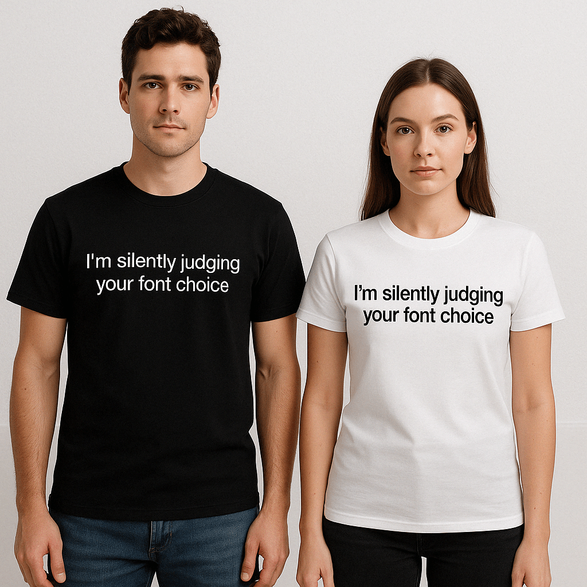

**Prompt:**
```
Create a t-shirt with "I'm silently judging your font choice" Include subtle, playful design elements. Clearly present the shirt on both male and female models wearing the same shirt in two different colors.
```

**Parameters:** Model: gpt-image-1, Quality: high, Size: 1024x1024

[⬆️ Back to Contents](#contents-toc)

---

<a id="example-28"></a>
### Example 28: Pickleball Paddle Graphic Design


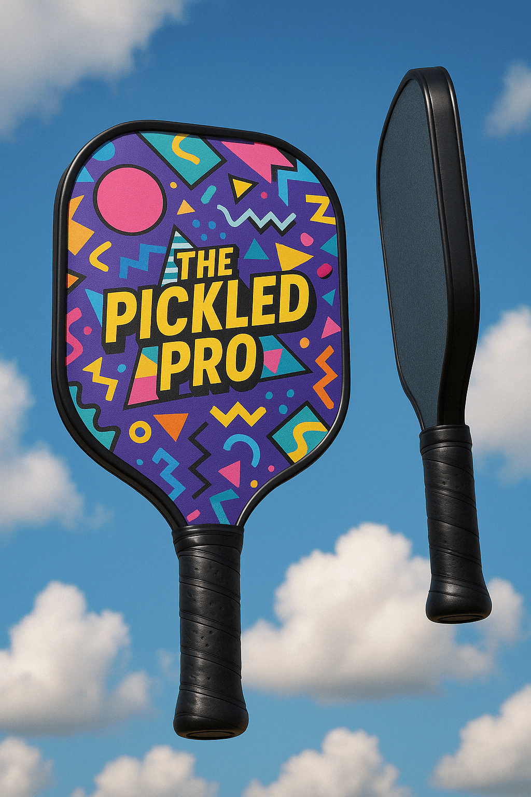

**Prompt:**
```
Create a vibrant, funky graphic design for a pickleball paddle called "The Pickled Pro." Show both a clear front-facing view illustrating the paddle's bold colors, playful geometric patterns, and integrated paddle name, as well as a detailed side-profile view clearly highlighting its ergonomic comfort-grip handle, lightweight slim construction, textured surface for spin control, and durable edge guard protection.
```

**Parameters:** Model: gpt-image-1, Quality: high, Size: 1024x1536

[⬆️ Back to Contents](#contents-toc)

---

<a id="example-29"></a>
### Example 29: Concert Ticket Design (Punk Aesthetic)


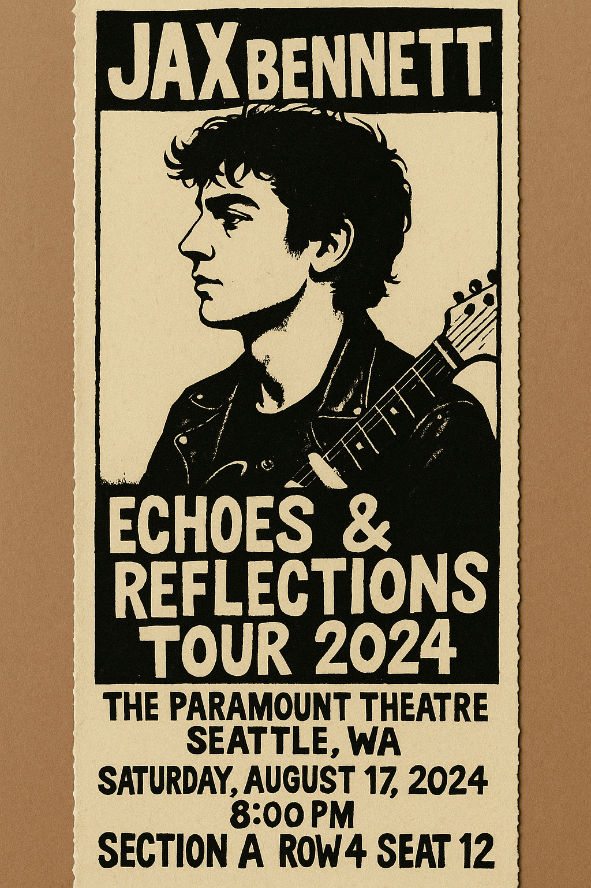

**Prompt:**
```
Create a stylish, realistic concert ticket for indie-pop artist "Jax Bennett," prominently featuring an artistic rendering of Jax (photo attached) as a side profile of him executed in a single color silk-screen print inspired by punk rock zine aesthetic. Clearly present concert details in irregular punk rock inspired typography. Artist: Jax Bennett Tour: "Echoes & Reflections Tour 2024" Venue: The Paramount Theatre, Seattle, WA Date & Time: Saturday, August 17, 2024, 8:00 PM Seat: Section A, Row 4, Seat 12 Use appropriate dimensions for a concert ticket (tall, but not wide)
```
* **Notes / Usage:** This example requires uploading reference image(s).

**Reference Image(s):**

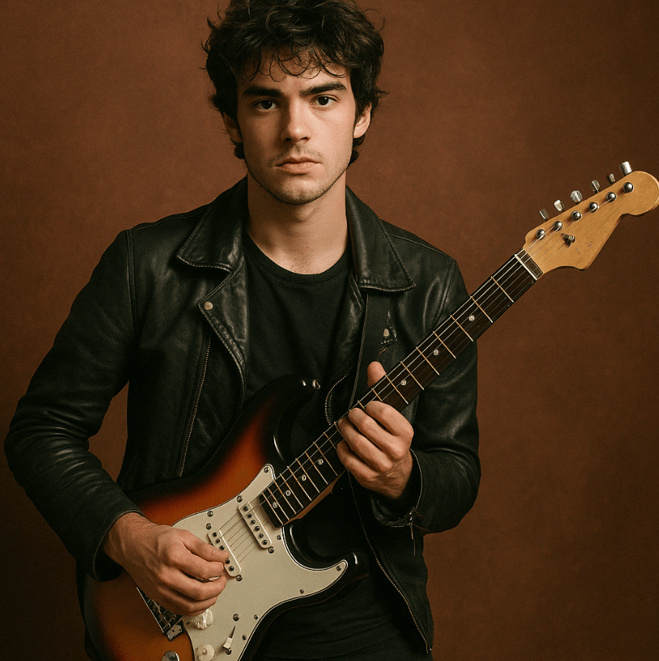

**Parameters:** Model: gpt-image-1, Quality: high, Size: 1024x1536

[⬆️ Back to Contents](#contents-toc)

---

<a id="example-30"></a>
### Example 30: Horse Jump Animation Keyframes


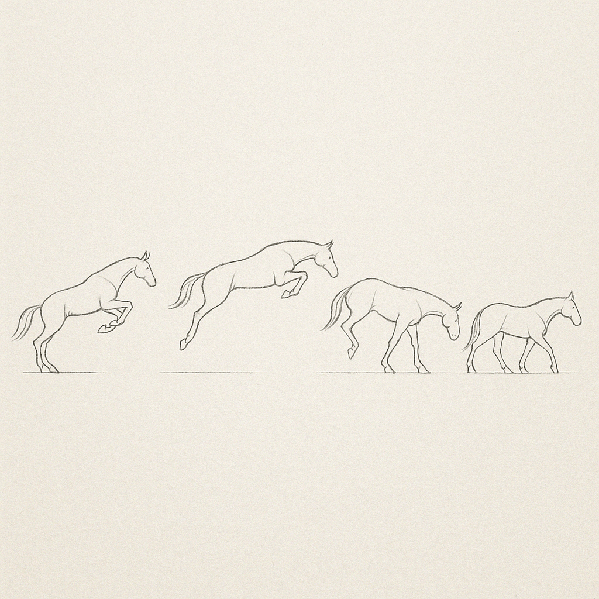

**Prompt:**
```
You are an animation assistant. Create image with 4 keyframes for the animation sequence of a jumping horse. - output a square image - make sure that all frames fit into the image - horse should be drawn with a single pencil line, minimal details - make sure that the anatomy of the horse is accurate - follow this sequence: frame 1: horse takes off frame 2: horse reaches the peak of its jump frame 3: horse is landing frame 4: horse has landed
```

**Parameters:** Model: gpt-image-1, Quality: high, Size: 1024x1024

[⬆️ Back to Contents](#contents-toc)

---

<a id="example-31"></a>
### Example 31: Repeatable Textile Pattern


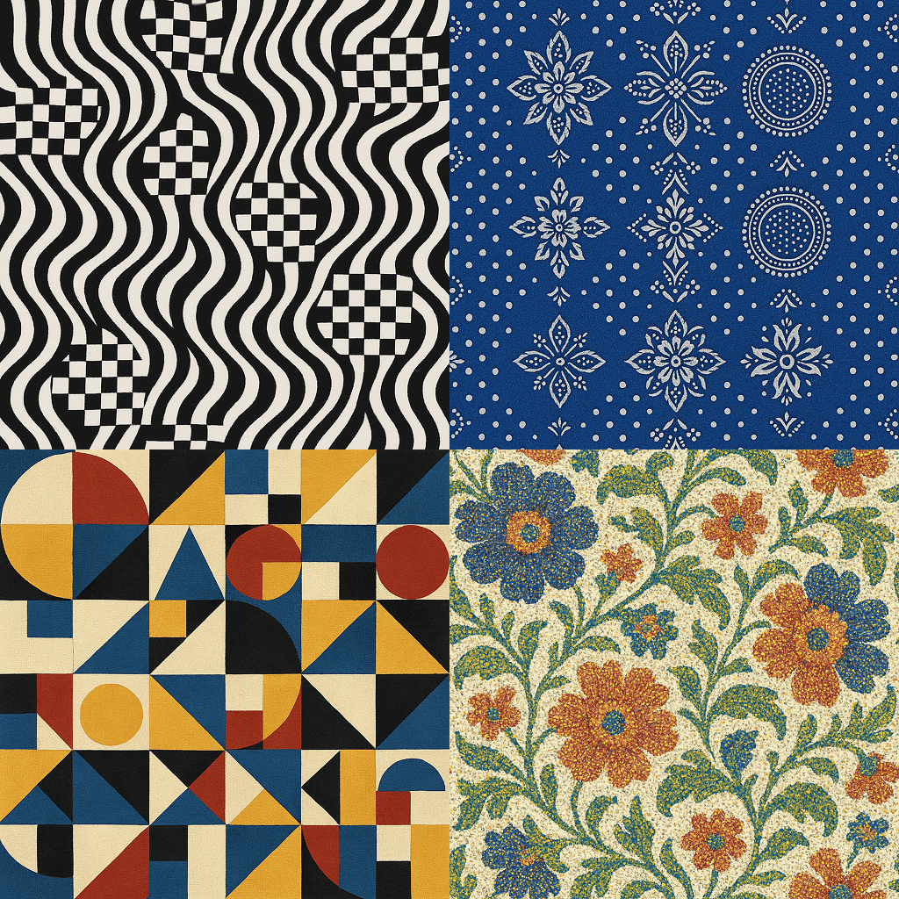

**Prompt:**
```
Create a high-quality repeatable textile pattern in {style} tradition. The pattern should be reusable when used side by side.
```
* **Notes / Usage:** This prompt uses placeholders (e.g., `{style}`). Replace them with specific values for your desired output. Example values for `{style}` include: optical art (op-art), Shweshwe (south africa, lesotho), geometric bauhaus, pointillist art.

**Parameters:** Model: gpt-image-1, Quality: high, Size: 1024x1024

[⬆️ Back to Contents](#contents-toc)

---

<a id="example-32"></a>
### Example 32: Glass Vase Design (Amber Spheres)


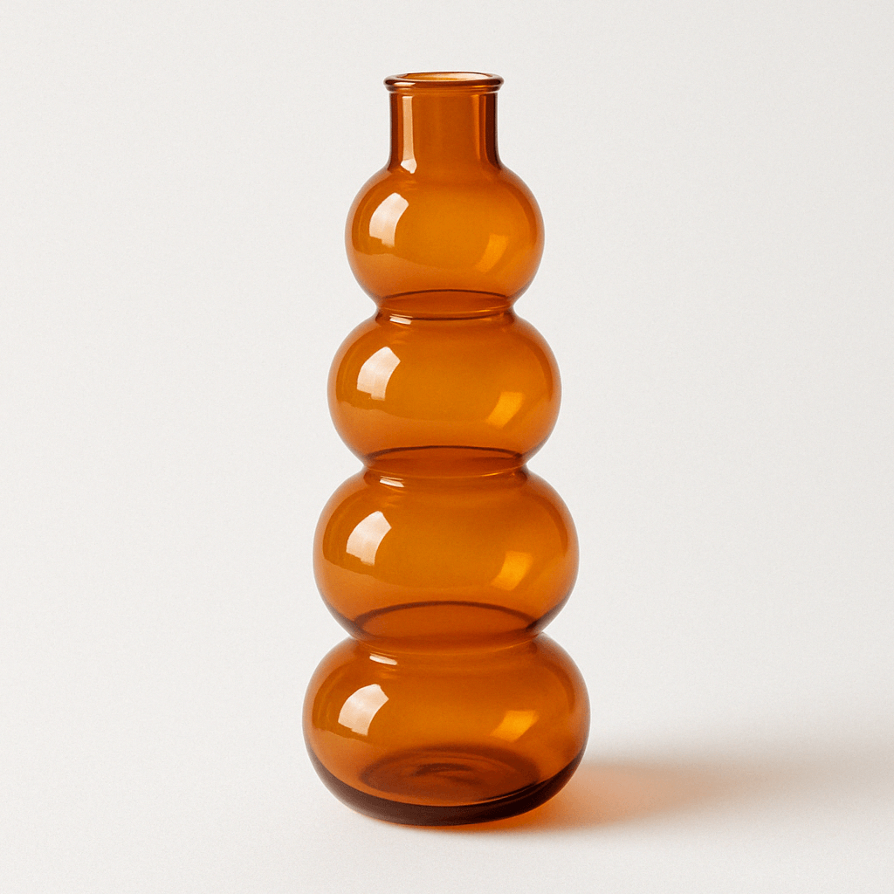

**Prompt:**
```
Create a photo of a glass vase: material: amber / orange glass. Proportions: vertically oriented, similar proportions to a glass water bottle. Shape: multiple spherical shapes combined to a single shape with an extremely narrow opening at the top, the spherical shapes get incrementally smaller towards the opening. Presentation: white background, realistic rendering, square image.
```

**Parameters:** Model: gpt-image-1, Quality: high, Size: 1024x1024

[⬆️ Back to Contents](#contents-toc)

---

<a id="example-33"></a>
### Example 33: Medieval Voxel Building Sprites


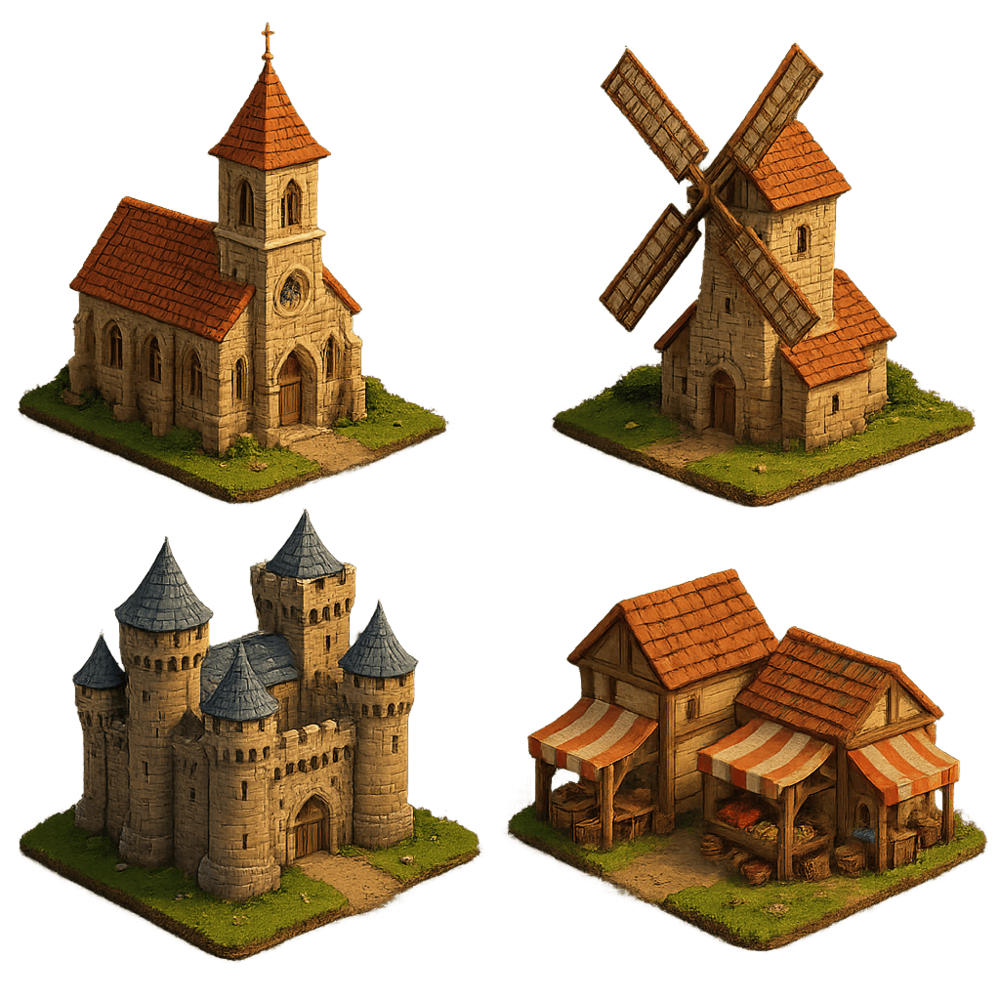

**Prompt:**
```
Create an image with renderings of different buildings for my real time medieval strategy game. It should include these buildings: church, windmill, castle and a market. The buildings should be in 4 different squares on a transparent background. Building should be rendered in a super realistic voxel style with depth and realistic lighting, a lot of detail and colors that match the theme of my game.
```

**Parameters:** Model: gpt-image-1, Quality: high, Size: 1024x1024

[⬆️ Back to Contents](#contents-toc)

---

<a id="example-34"></a>
### Example 34: Heavy Metal Record Sleeve Design


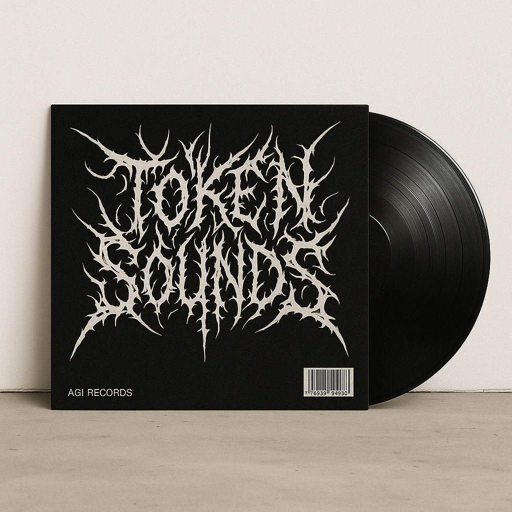

**Prompt:**
```
Create a picture with a record sleeve design for a heavy metal band. The main text should be in extremely complex (almost illegible) lettering typical for hard metal band logos, covering the whole cover. Include this content: front and center: token sounds bottom left corner: abc records (small font size) bottom right corner: barcode the background should be black, text should be white. Add it to the reference picture.
```
* **Notes / Usage:** This example requires uploading reference image(s).

**Reference Image(s):**

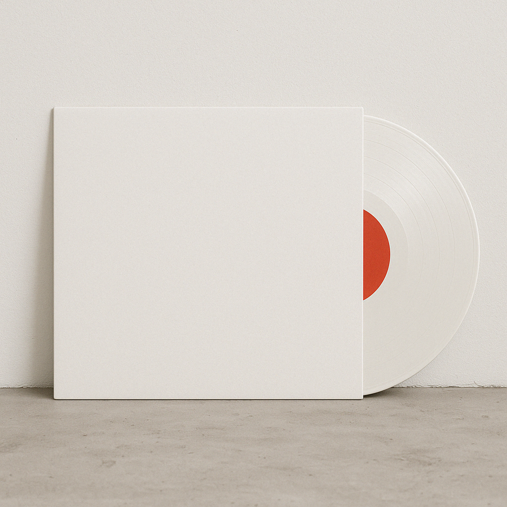

**Parameters:** Model: gpt-image-1, Quality: high, Size: 1024x1024

[⬆️ Back to Contents](#contents-toc)

---

<a id="example-35"></a>
### Example 35: Ketchup Ad Packshot


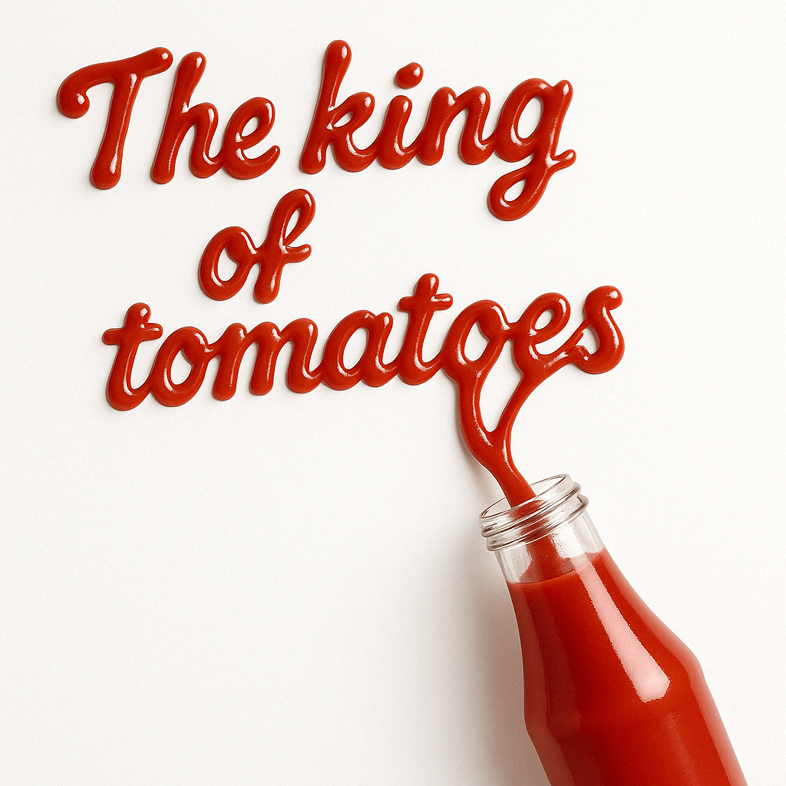

**Prompt:**
```
Create a packshot for a ketchup ad. Place the ketchup bottle in a white space, in the bottom right corner. The bottle should be on a slight angle, tilting towards the center. In the middle there should be text that says: "The king of tomatoes" The text should be written in a script like font, made out of ketchup. It should be glossy, red and float in space. The ketchup bottle should be open, creating an illusion of ketchup text flowing out of it.
```
* **Notes / Usage:** This example requires uploading reference image(s).

**Reference Image(s):**


**Parameters:** Model: gpt-image-1, Quality: high, Size: 1024x1024

[⬆️ Back to Contents](#contents-toc)

---

<a id="example-36"></a>
### Example 36: Backstitch Tutorial (WWII Poster Style)


**Prompt:**
```
Visualize the step-by-step process of making a backstitch with a simple explanation under each image. create this in the style of war posters from world war ii in britain
```

**Parameters:** Model: gpt-image-1, Quality: high, Size: 1024x1536

[⬆️ Back to Contents](#contents-toc)

---

<a id="example-37"></a>
### Example 37: Cozy Living Room Addition


**Prompt:**
```
Add these items to the photo of the living room. Make it cozy.
```
* **Notes / Usage:** This example requires uploading reference image(s).

**Reference Image(s):**


**Parameters:** Model: gpt-image-1, Quality: high, Size: 1536x1024

[⬆️ Back to Contents](#contents-toc)

---

<a id="example-38"></a>
### Example 38: Realistic Transparent 3D Icon


**Prompt:**
```
Create a super realistic 3d icon of a {iconName}. It should be floating on a white background. It should clearly communicate the subject. It should be completely transparent, and light, yet very realistic.
```
* **Notes / Usage:** This prompt uses placeholders (e.g., `{iconName}`). Replace them with specific values for your desired output. Example values for `{iconName}` include: calendar, file, lock, mail.

**Parameters:** Model: gpt-image-1, Quality: high, Size: 1024x1024

[⬆️ Back to Contents](#contents-toc)

---

<a id="example-39"></a>
### Example 39: Olive Oil Bottle Integration


**Prompt:**
```
Seamlessly integrate this olive oil bottle into the still life painting. Make sure to output a square image. Add a small headline: "timeless taste" in classic serif letters in the bottom left corner.
```
* **Notes / Usage:** This example requires uploading reference image(s).

**Reference Image(s):**


**Parameters:** Model: gpt-image-1, Quality: high, Size: 1024x1024

[⬆️ Back to Contents](#contents-toc)

---

<a id="example-40"></a>
### Example 40: Gift Basket Composite Image


**Prompt:**
```
Generate a photorealistic image of a gift basket on a white background labeled 'Relax & Unwind' with a ribbon and handwriting-like font, containing all the items in the reference pictures
```
* **Notes / Usage:** This example requires uploading reference image(s).

**Reference Image(s):**


**Parameters:** Model: gpt-image-1, Quality: high, Size: 1024x1024

[⬆️ Back to Contents](#contents-toc)

---


[⬆️ Back to Top](#readme-top)